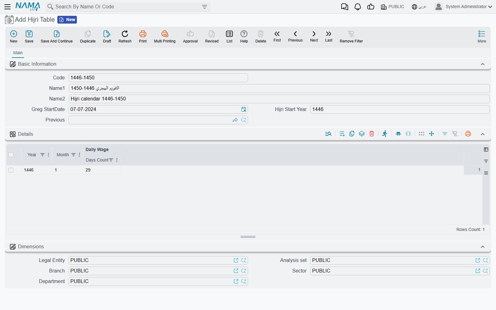

# Hijri Table (the Hijri Calendar Nama Uses)

The Hijri calendar cannot be calculated with a formula the way the Gregorian one can. Whether a month
has 29 or 30 days depends on the official calendar each country publishes (in Saudi Arabia, Umm
al-Qura). So Nama does not guess. It converts dates using a table you enter: one Gregorian date where
the calendar starts, then the length of every Hijri month from there on. That table is the **Hijri
Table**.

Until at least one Hijri Table exists, nothing in Nama can produce a Hijri date. Anything that needs
one fails with *You can not use hijri dates because hijri files are not configured*.

## What depends on it

- **Hijri dates in printed text and messages.** The Tempo expression `$asHijriString` converts a
  date through this table (see [Tempo](/admin/tempo#Hijri-and-String-Formats)). How the result is
  written (the order of day, month and year, and the separator) is set on Global Config's
  [General tab](/platform/global-config/global-config-general#Hijri-date-format).
- **Real estate contracts and installment plans kept in Hijri.** When **Dates in hijri** is ticked on a
  rent contract, or **Work With Hijri Dates** on an installment plan, every due date is stepped
  through this table. See [Leases kept in the Hijri calendar](/modules/realestate/rent/realestate-rent-schedule#Leases-kept-in-the-Hijri-calendar).
- **Eltezam.** Every date sent to the ministry is converted to Hijri, including old birth and hiring
  dates. See [Eltezam setup](/modules/integrations/eltezam/eltezam-setup).

The table has to cover **every date you will convert**: the oldest birth date you send to Eltezam and
the last installment of your longest Hijri contract.

## The screen

| Field | What to put in it |
|---|---|
| **Greg StartDate** | The Gregorian date of the **first day of Muharram** of the start year. |
| **Hijri Start Year** | The Hijri year that begins on that date. |
| **Previous** | Empty on the first table. Fill it only on a table that continues another one (see below). |
| **Details** grid: **Year**, **Month**, **Days Count** | One line per Hijri month, in order, with the number of days that month has in the official calendar. |

Only the **Days Count** column and the start date take part in the conversion. Nama counts forward
from **Greg StartDate**, month by month, adding each line's days. The **Year** and **Month** columns
are checked to make sure no month is skipped or repeated, but the conversion does not read them. So
the first line must be month 1 of the **Hijri Start Year**, and every month after it must be listed.

When you add a line, the grid fills in the next year and month for you, so you only type the days.

## Example

Suppose you need dates from the start of 1446 AH onward. 1 Muharram 1446 fell on 7 July 2024.

1. Open **Hijri Table**, give it a code such as `1446-1450`.
2. **Greg StartDate** = 07/07/2024, **Hijri Start Year** = 1446, **Previous** empty.
3. In **Details**, enter line 1: Year 1446, Month 1, and the days of Muharram 1446 from the official
   calendar. Add a line; it fills Year 1446, Month 2, and you type the days of Safar. Continue to
   month 12, then on to 1447 month 1, and so on, as far ahead as you need.
4. Save. From now on, 7 July 2024 converts to 1 Muharram 1446, and every date after it is counted
   through your month lengths.

Changes take effect immediately; no restart is needed.

## Extending the calendar later

You do not have to rewrite the table when it runs out. Create a second Hijri Table and set its
**Previous** to the first one. Its first line must continue straight on from the first table's last
line. For example, if `1446-1450` ends at 1450 month 12, the new table starts at 1451 month 1. A
continuing table needs no start date or start year of its own; it takes over where its previous one
ended. You can chain as many tables as you like, but:

- only **one** table may have **Previous** empty (the start of the chain), and
- no two tables may name the same table as their **Previous**.

To reach further **back** in time (Eltezam's old birth dates are the usual reason), you cannot put a
table in front of the first one. Instead, edit the first table: move **Greg StartDate** and **Hijri
Start Year** back to the new starting Muharram, and add the earlier months at the top of its grid.

## Messages you may see

| Message | Why | What to do |
|---|---|---|
| *You can not use hijri dates because hijri files are not configured* | No Hijri Table exists. | Create one that covers the dates you need. |
| *This date exceeds the provided hijri range:* followed by the date, for example *This date exceeds the provided hijri range: 15/3/2031* | The date falls after the last month in the chain. | Add a continuing table, or more lines to the last one. |
| *The provided date is before configured hijri calendar* | A Hijri date outside the table (before its start or after its last month) was converted to Gregorian. | Extend the table back or forward, as described above. |
| *There is already a table without previous year: {0}* | You saved a second table with **Previous** empty. | Set **Previous** to the table this one continues. |
| *The relationship between {0} and {1} is not correct* | A continuing table's first line does not follow on from its previous table's last line. | Start the new table at the month right after the last month of its previous table. |
| *Theis table apeared as previous moe than one: {0}* | Two tables name the same table as their **Previous**. | Point one of them at the correct table. |
| *The year must be {0}* / *The month must be {0}* | A line skips or repeats a month. | Correct the line to the year or month the message names. |
| *Invalid month number {0}* — «رقم شهر غير صحيح {0}» | A month outside 1 to 12. | Fix the month. |
| *Invalid days count {0}* — «عدد أيام غير صحيح {0}» | A days count that is not a plausible month length. | Enter 29 or 30, as the official calendar gives. |

Apart from the last two, these messages have no Arabic text and appear in English on Arabic screens too.
