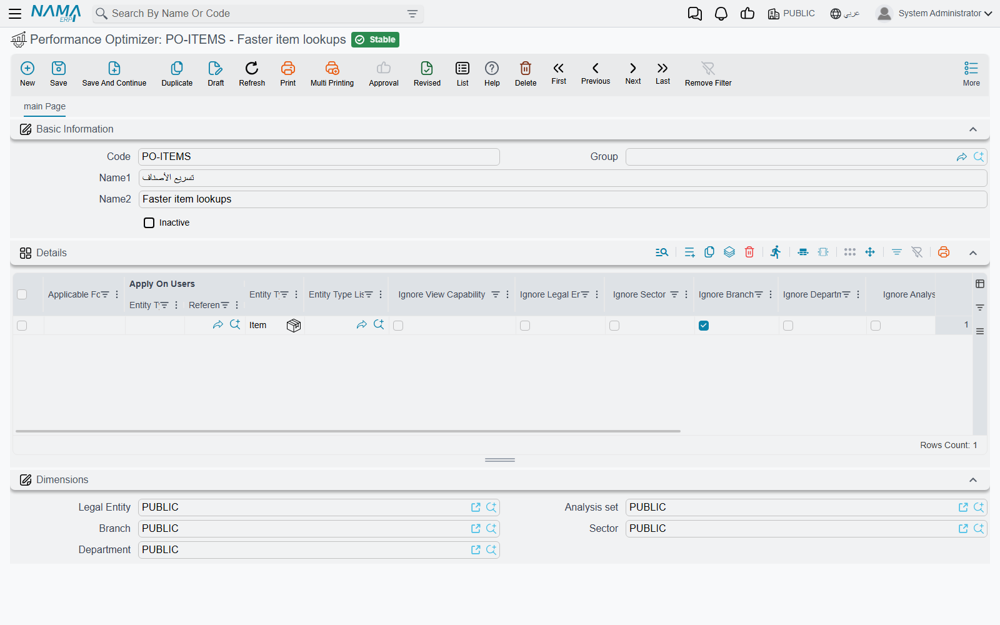

# Performance Optimizer

Every time a user opens a list, types into a search box or picks a record in a reference field, Nama quietly adds the user's security to the query: "only the legal entities this user may see", "only the branches", "only records whose view capability the user holds". On a large database, and for screens that are opened hundreds of times a day, those extra conditions are a real share of the waiting time. For some record types they also protect nothing — every branch uses the same items, so filtering items by branch only costs time.

The **Performance Optimizer** screen is where you tell the system to drop chosen security conditions for chosen record types, for everybody or only for chosen users. It is a deliberate trade: the screens get faster because they check less. Anything you switch off here really stops being checked, so use it only for record types where the check protects nothing.

## A worked example

A distributor has 40 branches, and every salesperson is restricted to their own branch. The item master file is shared by all branches, but each time a salesperson types in an invoice's item field, the lookup still filters items by branch, and the item search is the slowest thing on the invoice screen.

The administrator creates one Performance Optimizer record:

1. On the header, leave **Inactive** unticked.
2. In the **Details** grid, add a line with **Entity Type** = the item master file, and tick **Ignore Branch**.
3. Leave **Apply On Users** empty, so the line applies to everyone.
4. Save.

From the next search on, item lists and item lookups no longer carry the branch condition. The change takes effect as soon as the record is saved; nobody has to log in again and the server does not need a restart. Customers, invoices and every other type are not affected.

## The screen

The header carries the usual code and names plus **Inactive**. An inactive record is ignored completely, which is the easy way to switch an optimisation off while you test whether it is the cause of something.

All the work is in the **Details** grid. Each line says *which records*, *for whom*, and *what to skip*.

### Which records

Fill **one** of these two ways:

| Column | What it does |
|---|---|
| **Applicable For** | A broad scope: **All Screens**, **Master Files** or **Documents**. |
| **Entity Type** and/or **Entity Type List** | One record type, and/or a saved [Entity Type List](/platform/automation-and-rules/entity-type-lists) of several types. Both may be filled on the same line. |

A line that has **Applicable For** cannot also have an entity type or list, and a line with none of the three is refused because **Entity Type** is then required.

### For whom

**Apply On Users** takes a user, a security profile, or a group. Leave it empty and the line applies to every user. When it is filled, the line applies to:

- that user, if you picked a user;
- every user whose security profile is the one you picked;
- every user whose **Group** is the group you picked.

Use this when only some users suffer from slow screens, such as head-office staff who see all branches anyway, or when only some users can safely skip a check.

### What to skip

| Column | Effect |
|---|---|
| **Ignore Legal Entity**, **Ignore Sector**, **Ignore Branch**, **Ignore Department**, **Ignore Analysis Set** | Lists, searches and reference-field lookups for the chosen records stop filtering by that dimension, so the user sees the records of every legal entity, branch and so on. |
| **Ignore View Capability** | Lists, searches and lookups stop hiding records tagged with a view capability the user does not hold. See [Record-Level Security](/platform/security/record-level-security#Record-Capabilities-Changing-Capability-at-the-Record-Level). |
| **Apply Ignore To Record View** | Also skip the ignored dimensions when the user **opens** a single record. Without this tick, the list shows the record but opening it is still checked against the user's dimensions. |
| **Apply Ignore To Record Usage** | Also skip the ignored dimensions when one of the chosen records is **used** in another record, for example an item from another branch picked on an invoice. Without this tick, the dimensions consistency check on saving still applies. |

Each line must tick at least one of the six "Ignore …" boxes. The two "Apply Ignore To …" boxes only extend the dimension ignores. They do nothing for **Ignore View Capability**, which only ever affects lists, searches and lookups.

A dimension is only filtered at all when it takes part in access control: the legal entity always does, and the other four do only when **Prevent Access on Inconsistency** is on for them in [Global Configuration → Dimensions](/platform/global-config/global-config-dimensions). Ticking **Ignore Sector** while sectors are not used for access changes nothing.

## How the lines combine

- The lines of every active Performance Optimizer record count, so you can keep separate records per purpose (for example "Shared master files" and "Head office users").
- For a given record type, an ignore applies if it is ticked on a line for that exact type, **or** on a line for its broad scope (Master Files or Documents), **or** on a line for All Screens. Lines without **Apply On Users** are checked first; then the lines that apply to the current user.
- No line can switch a check back on that another line switched off. A line is only ever a list of things to skip.

::: warning This is a security switch, not just a speed switch
Ticking **Ignore Branch** for customers means a user restricted to one branch now sees and picks every branch's customers. Before you add a line, ask whether that type's records are really meant to be shared. If they are not, limit the line with **Apply On Users** or do not add it. When a customer reports that a user "suddenly sees other branches' records", check this screen alongside the user's security profile.
:::

## Messages you may see

| Message | Why | What to do |
|---|---|---|
| *You must at least ignore one thing, at line {0}* (this message has no Arabic text, so it appears in English on Arabic screens too) | The line has none of the six "Ignore …" boxes ticked. | Tick what the line should skip, or delete the line. |
| *You can not fill the field {0}, {1} and {2}, either fill {0} alone or {1} and {2}* — «لا يمكنك ملء الحقل {0}، {1} و{2} معاً، إما أن تملء {0} فقط أو {1} و{2}» | The line has **Applicable For** and also an entity type or entity type list. | Keep **Applicable For** alone, or clear it and keep the type and/or list. |
