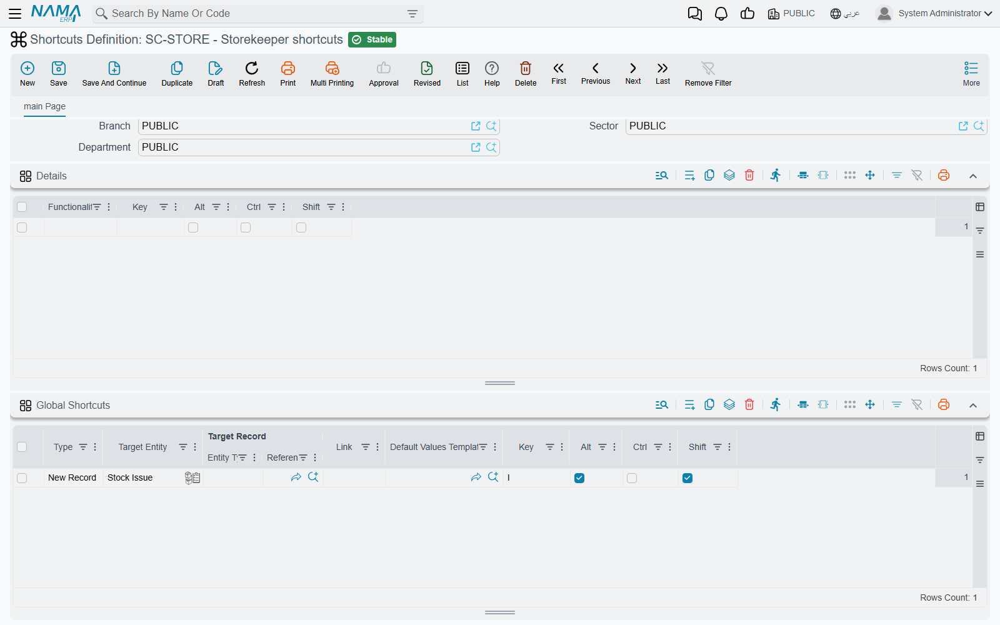
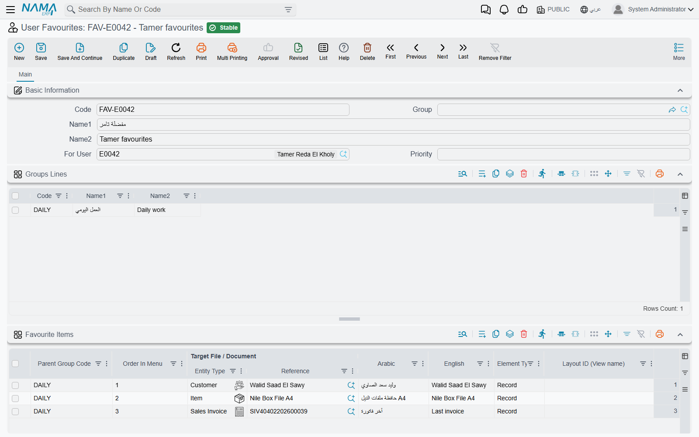

# Shortcuts Definition and User Favourites

Two screens under **Administration → Display Customization** shape what a user's fingers and eyes
reach first, and neither of them changes a single record. **Shortcuts Definition** decides which key
does what. **User Favourites** decides what sits in the user's own corner of the menu. Both are read
once, when the user signs in, so every change on either screen takes effect at the user's **next
sign-in**. Until then they keep working with what they had.

The keys themselves, the out-of-the-box list of what each one does, are on
[Keyboard Shortcuts](/platform/everyday-tools/shortcuts). This page is about the records behind them.

## Shortcuts Definition

A Shortcuts Definition record is a complete keyboard map, held in two grids.

**Details** binds a key to a *business function*: one of the standard actions on edit and list
screens, such as Save, New Record, Print, Duplicate, Next or Append Row. Each line has a
**Functionality** column, three ticks (**Ctrl**, **Alt**, **Shift**) and a **Key**.

**Global Shortcuts** binds a key to a destination that can be reached from anywhere in the
application. The **Type** column says what kind of destination it is, and decides which of the other
columns you fill:

| Type | What you fill in | What the key does |
|---|---|---|
| **Entity List** | Target Entity | Opens that screen's list |
| **New Record** | Target Entity, and optionally a Default Values Template | Opens a blank record. With a template, the record opens already filled from it |
| **Record** | Target Record | Opens that one record |
| **Link** | Link | Opens the web address in a new browser tab |
| **Internal Link** | Link | Opens a screen inside Nama that is not a record list |
| **Global Search** | nothing | Puts the cursor in the search box in the top bar |
| **Menu Search** | nothing | Opens the side menu and puts the cursor in its search box |

This is how an implementation gives a storekeeper one key for "new stock issue, already filled for
my warehouse": a **New Record** line for the stock issue, with the warehouse's default values
template, on **Alt + Shift + I**.

### Two rules on save

- **No key combination may appear twice.** The check covers both grids together, so a global
  shortcut cannot reuse a key that the Details grid already gives to a business function. The second
  line is refused with *The shortcut conflicts with line {0}*.
- **A letter needs Ctrl or Alt.** A bare letter, or Shift plus a letter, would fire while the user
  is typing in a field, so it is refused. Function keys, arrows, Insert, Delete, Home, End and the
  page keys are allowed without a modifier.

### Which definition a user gets

At sign-in, Nama picks **one** Shortcuts Definition for the user, in this order:

1. The record in the **Default Short Cuts** field of the user's own record.
2. Otherwise, a record with **System Default Menu** ticked. The tick has a menu-sounding label, but
   on this screen it means "the shortcuts everyone gets".
3. Otherwise, the first Shortcuts Definition the system finds.

The security profile plays no part here. Steps 2 and 3 only consider records that the user's
dimensions allow them to see, so a definition saved under one company is not offered to a user who
works in another.

::: warning Do not edit the shipped `default` record
Nama ships a record with the code `default`, and it holds the keys listed on
[Keyboard Shortcuts](/platform/everyday-tools/shortcuts). **Regenerate UI** and **Regenerate Screens** empty that
record and build it again, the same way they rebuild the shipped menu (see
[Licensing](/getting-started/licensing)). Any key you changed on it is lost. Instead, duplicate it,
change the copy, and either tick **System Default Menu** on the copy or put it in the users'
**Default Short Cuts** field.
:::

The `default` record does not have **System Default Menu** ticked. As long as it is the only
definition, step 3 finds it. Once a second definition exists, tick **System Default Menu** on the
one you want, so that the choice is never left to step 3.

A default values template can carry a key of its own, set on the template itself. See
[Default Values Templates](/platform/everyday-tools/default-values-templates).

## User Favourites

Every menu Nama ships has a **Favourites ⭐** entry. It holds nothing until it is drawn for a
particular user. At that point it fills with the groups and items of that user's User Favourites
record, so each user sees their own.

### How a record gets built

Most users never open this screen. Their record is created for them the first time they use one of
these actions:

- **Add To Current User Favourites**, in the More menu of a record. It pins that record. On a list
  view the same action pins the screen itself.
- **Remove From Current User Favourites**, in the More menu of a record. It takes the record out
  again.
- **Add Selected Records To Lines of Current User Favourite**, on a list view. It pins every row you
  ticked in one step. See [Acting on Several Records at Once](/platform/list-views/mass-operations).

The first time one of these actions runs for a user who has no record yet, Nama creates one with the
code `<user code>_favourites`, for example `ahmed_favourites`, and fills the user into **For User**.
Later additions are appended to the same record.

### What the screen holds

An administrator can open that record, or create one, to arrange a user's favourites by hand:

- **For User** — whose favourites these are. A user can own only one record. A second record for
  the same user is refused with *The user {0} is already associated with the favourite {1}*.
- **Groups Lines** — the folders inside Favourites. Each line has a **Code** and the Arabic and
  English names shown in the menu.
- **Favourite Items** — the entries themselves:
  - **Parent Group Code** puts the item in a folder. When it is left empty, the item goes into a
    folder with the code `Favourites`. If an item names a group code that is not in Groups Lines,
    the group line is added on save.
  - **Order In Menu** sets its position in the folder. When it is left empty, the item goes after
    the last one in that folder.
  - **Target File / Document** is the record, or the screen, the item opens.
  - **Element Type** decides how the item opens. **Record** opens that record. **List View** opens
    the list of that type, using the list layout named in **Layout ID (View name)** when there is
    one. **Create New** opens a blank record of that type. An empty Element Type is saved as
    Record.

  The same target cannot appear twice in the same folder with the same element type and layout.
  The repeat is refused with *Target file {0} is repeated in group {1}*.

**An example.** A sales supervisor wants three things one click away: the list of open sales
orders, a blank customer receipt, and the big customer she follows every morning. Her record has one
group line, `SALES` / «المبيعات» / *Sales*, and three items in it:

1. Sales Order, with **Element Type** set to **List View** and the layout name of the open-orders
   list in **Layout ID (View name)**.
2. Receipt Voucher, with **Create New**.
3. The customer record, with **Record**.

The next time she signs in, **Favourites ⭐** shows a *Sales* folder with those three entries, in
that order.

## Messages you may see

| Message | Why | What to do |
|---|---|---|
| *The shortcut conflicts with line {0}* | Two lines use the same key combination. The other line may be in either grid. This message has no Arabic translation, so it shows in English on Arabic screens too. | Change the keys on one of the two lines. |
| *You must use Ctrl/Alt with alphabetic letters* — «يجب استخدام Ctrl/Alt مع الحروف الأبجدية» | A letter key has neither Ctrl nor Alt ticked. | Tick Ctrl or Alt, or use a non-letter key. |
| *The user {0} is already associated with the favourite {1}* — «المستخدم {0} موجود بالفعل في المفضلة {1}» | Another saved User Favourites record already belongs to this user. | Open the existing record (named in the message) and edit it. |
| *Code {0} is repeated* — «الكود {0} مكرر» | Two lines in Groups Lines have the same code. | Give each group its own code. |
| *Target file {0} is repeated in group {1}* — «الملف/المستند {0} مكرر في المجموعة {1}» | The same target is in the same folder twice, with the same element type and layout. | Delete the duplicate, or change its element type or layout. |
