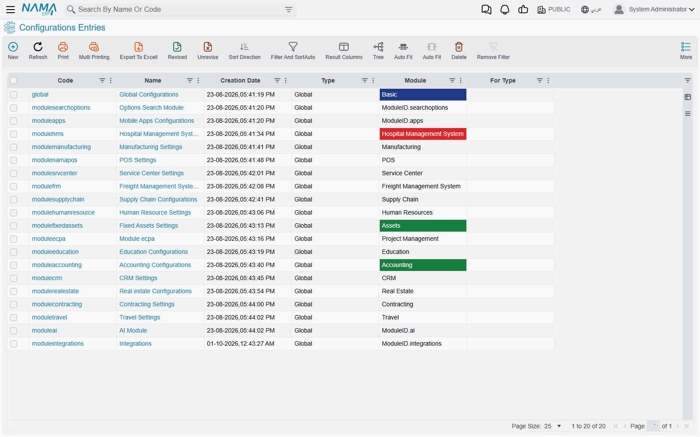
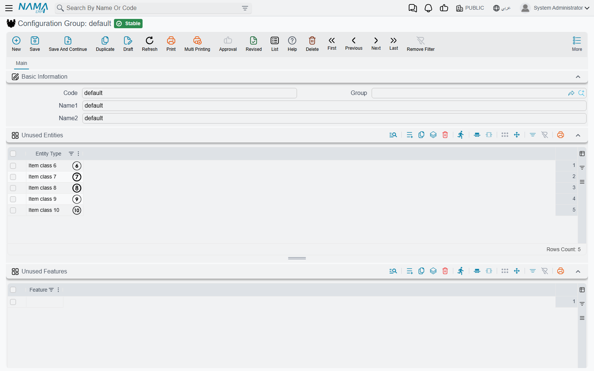
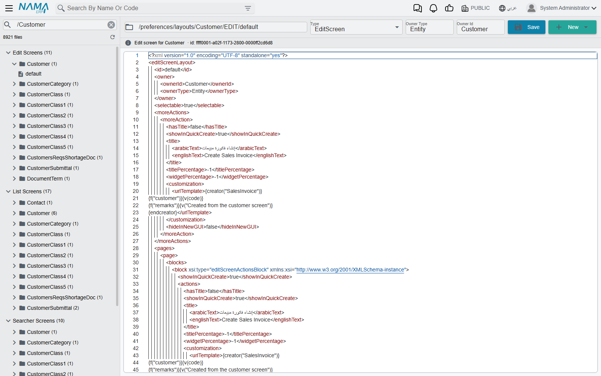

# System Settings, Configuration Group and Edit File

Every settings screen in Nama — the Global Configuration, the supply chain settings, the HR
settings, the POS settings — is stored as a record. The **Settings** group of the
**Administration** menu is where those records live side by side, together with the one record
that ties them to your companies and a raw editor for the files behind the screens. You rarely need
any of this day to day; you reach for it when a customer asks "where are *all* the settings?",
when a screen or feature has gone missing for a whole company, or when a screen layout has to be
inspected by hand.

Three entries in *Administration → Settings* are covered here:

| Menu entry | What it is |
|---|---|
| **System Settings** | The list of every settings record in the database, one per installed module plus the Global Configuration. |
| **Configuration Group** | The single record that every settings record and every company belongs to. It also carries the company-wide lists of unused screens and features. |
| **Edit File** | A plain editor for the stored screen layout files and per-user preference files. |

## System Settings — one record per module

Open **Administration → Settings → System Settings** and you get a list, not a form. Each row is
one settings record:

- **Global Configurations** (code `global`) — the installation-wide settings described in
  [Global Configuration](/platform/global-config/).
- One record per installed module — **Accounting Configurations**, **Supply Chain
  Configurations**, and so on. The code is `module` followed by the module's name, for example
  `moduleaccounting`.

The list shows each record's **Type**, **Module** and **For Type**, and you can filter on all three.
On a normal installation every row has the type **Global**, because each module's settings apply to
the whole database. A database with twenty modules installed has twenty-odd rows; that is the
whole list. Opening a row opens that module's settings screen — the same screen you reach from
the module's own *Settings* menu — so this list is the quickest way to find a module's settings
when you do not know which menu hides them.

The records are created by the system, not by you. When a module is installed, its settings record
is created at the next server start, and it stays for as long as the database does. That is why
the list refuses both of the usual actions:

- **New** is refused with *Can not create system objects*.
- **Delete** is refused with *Can not delete system objects*.

Neither message has an Arabic translation, so both appear in English on Arabic screens too.

::: info One record per module, for every company
Each module has exactly one settings record, and it applies to every company in the database.
You cannot add a second copy of the supply chain settings for one legal entity or one branch. When
two companies need to behave differently, the difference has to come from something that *is*
per company — the document book, the document term, or the legal entity record itself.
:::

The **More** menu of a settings record has **Regenerate Screens**. It rebuilds every screen in the
system, exactly like the button of the same name on a
[Screen Modifier](/platform/screen-modifier/screen-modifier-overview#Making-your-changes-take-effect),
and it also rebuilds the shipped menu. Use it after a change that should add or remove fields
across the system, then ask users to reload the browser page.

## Configuration Group — the record that ties settings to companies

**Administration → Settings → Configuration Group** opens a single record whose code is
`default`. The system creates it the first time the server starts on a new database, and every
settings record in the System Settings list belongs to it.

Every **Legal Entity** names a configuration group in its **Configuration Group** field. The field
is required, and when you pick a **Parent Legal Entity** the parent's group is copied in for you.
Since `default` is the only group there is, every company points at it. In practice there is
nothing to choose, but the link is the reason the field exists.

There is only ever one group:

- Saving a group whose code is anything other than `default` is refused with
  *Code must be Default* — «الكود يجب أن يكون default».
- Deleting the group is refused with *Can not delete system objects*.

### The two lists on the group: Unused Entities and Unused Features

The useful part of the Configuration Group screen is its two grids:

- **Unused Entities** — one **Entity Type** per line. Each screen listed here is hidden.
- **Unused Features** — one **Feature** per line. Every field, grid column, button and screen that
  belongs to the feature is hidden.

The **Legal Entity** screen has the same two grids. When a user signs in, the system takes the
user's company, adds that company's own lists to the lists on its configuration group, and hides
everything on the combined list. Because every company points at the same `default` group,
**a line on the Configuration Group hides that screen or feature for every company at once**. Use
the legal entity's own grids when only one company should lose it.

What exactly disappears, which company counts for a user, and the full list of features you can
switch off are on
[Switching screens and features off for a company](/getting-started/licensing#Switching-screens-and-features-off-for-a-company).
Two points matter most when you are working on the Configuration Group itself:

- **The lists are read at sign-in.** A line you add or remove reaches each user the next time they
  sign in, not before.
- **Some upgrades put lines here for you.** A database upgrade may add a feature to the group's
  Unused Features so that existing customers do not suddenly see new fields. The **Sub Items**
  feature that the service-centre car screens depend on is the best-known case: on an upgraded
  database it starts on this list, so the car fields are hidden until you remove the line (see
  [the service-centre cars setup](/modules/servicecenter/cars-setup/servicecenter-cars-overview)).
  When a whole feature seems to be missing after an upgrade, look here first.

Three screens can never be hidden: **Configuration Group**, **Legal Entity** and **System
Settings**. If you add one of them to Unused Entities, the line is silently dropped when you save.
Hiding them would lock everyone out of the very screens needed to undo the change.

Each entity type and each feature may appear only once per grid. A repeated line is refused on
save with *The entity type {0} at line {1} is repeated* or *The feature {0} at line {1} is
repeated*, both in English only.

## Edit File — the files behind the screens

**Administration → Settings → Edit File** opens a two-pane editor. It is not a record screen. It
works directly on the files in which Nama stores screen layouts and user preferences, and it is
meant for support staff who need to see, or fix by hand, what the layout tools have saved. The
editor's own labels are in English only.

The left pane lists every stored file, grouped into folders:

| Folder | What is in it |
|---|---|
| **Edit Screens** | The saved edit-screen layouts, one sub-folder per screen. |
| **List Screens** | The saved list-view layouts. |
| **Searcher Screens** | The saved search-dialog layouts. |
| **Processed Layouts** | Layouts the system has prepared from the saved list and searcher layouts. |
| **User Preferences** | Each user's personal preference files, one sub-folder per user. |
| **Other** | Any file whose path does not fit the folders above. |

Type in **Filter files…** to narrow the tree by path, and use the refresh button to reload it.
Clicking a file opens it on the right. Above the content you see the file's path, its **Type**
(`XML`, `EditScreen`, `ListScreen`, `SearcherScreen`, `SQL`, `CSS`, `HTML`, `PlainText` and a few others), its **Owner Type**
and **Owner Id**, and a line that tells you what the file is — "Edit screen for Customer", for
example.

To change a file, edit the content and press **Save**. If you change the path to one that another
file already uses, the editor asks *A file with this path already exists. Do you want to replace
it?* — answer **Replace** only if overwriting that other file is what you want. **New** offers an
empty edit, list or searcher screen (it asks for the owner screen's type, such as `Customer`) or a
plain XML file. If you open another file or start a new one while the current file has unsaved
changes, the editor asks before discarding them.

::: warning This edits the live layout, with no undo
A file saved here is what every user's screen is built from. A mistake in an edit-screen file can
break that screen for everyone, and the editor keeps no history to roll back to. Copy the
content somewhere safe before you change it. For ordinary changes — adding a field, hiding a
tab, moving a column — use a [Screen Modifier](/platform/screen-modifier/screen-modifier-overview)
instead: it survives screen regeneration and can be switched off.
:::

## Messages you may see

| Message | Why | What to do |
|---|---|---|
| *Can not create system objects* | You pressed **New** on System Settings. Settings records are created by the system when a module is installed. | Nothing to create. If a module's settings record is missing from the list, that module is not installed on this server. |
| *Can not delete system objects* | You tried to delete a settings record or the Configuration Group. | They cannot be deleted. Change the values instead. |
| *Code must be Default* — «الكود يجب أن يكون default» | A Configuration Group was saved with a code other than `default`, usually when someone tries to create a second group. | There is only one group. Edit the existing `default` record. |
| *The entity type {0} at line {1} is repeated* | The same screen appears twice in Unused Entities. | Delete the duplicate line. |
| *The feature {0} at line {1} is repeated* | The same feature appears twice in Unused Features. | Delete the duplicate line. |
