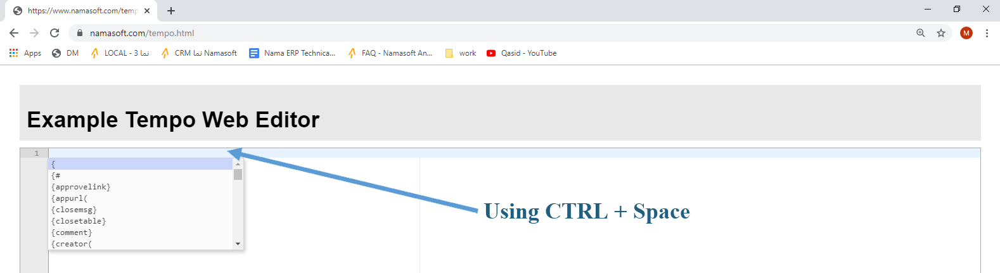

# دليل لغة Tempo

يُقدّم هذا الدليل **لغة Tempo**، التي طوّرها **فريق Nama**، لمساعدة المنفّذين في إنشاء رسائل ديناميكية للـ**عملاء** والـ**موظفين** والـ**موردين**. تُستخدم Tempo في مخرجات متنوعة مثل **الإشعارات** والـ**بريد الإلكتروني** ورسائل **SMS** و**رسائل خطأ التحقق**.

## ما هي Tempo؟

تتيح لك Tempo تضمين قيم ديناميكية في قوالب نصية. مثلًا، لعرض رسالة خطأ تفيد بأن موظفًا لا يمكنه أخذ أكثر من خمسة أيام إجازة، يمكنك تضمين اسم الموظف ديناميكيًا:

```
Employee {employee.name1} cannot take more than five days of vacation.
```

إذا أردت تضمين رابط تشعبي لسجل الموظف:

```
{link(employee)}
```

---

## كيفية اكتشاف أسماء الحقول

للعثور على أسماء الحقول في أي شاشة:

1. اضغط `CTRL + ALT + I`
2. انقر بزر الفأرة الأيمن على أي حقل لرؤية **المعرّف الداخلي** و**اسم الجدول** و**اسم العمود**

---

## استخدام محرّر Tempo على الويب

توفّر Nama محرّرًا عبر الويب لكتابة صياغة Tempo واختبارها:

* يدعم **الإكمال التلقائي** بالضغط على `Ctrl + Space`
* يفحص **الصياغة** أثناء الكتابة

👉 جرّبه هنا: [Tempo Editor](https://www.namasoft.com/tempo.html)


---

## متى تستخدم Tempo

يمكن استخدام Tempo في سياقين رئيسيين:

::: tip نمطا الاستخدام

1. **نتائج الاستعلام (Query Results)**
   تُستخدم في لوحات المعلومات والإشعارات المستندة إلى استعلام أو رسائل التحقق التي تتضمن استعلامًا.

2. **عرض السجل (Record Rendering)**
   تُستخدم في الرسائل المستندة إلى الكيان (مثل الموافقات والمسارات) للوصول المباشر إلى حقول السجل.

**الفرق الرئيسي**:
لا يمكن الوصول إلى الحقول المتداخلة (مثل `customer.group.code`) إلا في وضع السجل. في وضع نتائج الاستعلام، لن يعمل هذا النوع من التنقل كما هو متوقع.
:::

---

## نظرة عامة على صياغة Tempo

### 1. الوصول إلى حقول السجل

* استخدم `{fieldName}` لعرض حقل من السجل الحالي:

```
This Employee's Arabic name is {name1}
```

* للسجلات المرتبطة (مثل موظف في طلب إجازة):

```
This Employee's Arabic name is {employee.name1}
```

* للمراجع غير المباشرة (مثل موظف في حقل `subsidiary`):

```
This Employee's Arabic name is {subsidiary.$toReal.name1}
```

---

### 2. كتابة التعليقات

لإضافة تعليقات في كود Tempo:

```
{comment} This was written by Khaled {endcomment}
```

---

### 3. تعطيل تحليل Tempo

إذا أردت منع تحليل القالب بأكمله أو جزء منه:

```html
<notempo/>
```

---

### 4. تحليل حقل كقالب Tempo

لتحليل محتوى حقل (مثل الملاحظات) كقالب Tempo:

```
{tempo}{customer.remarks}{endtempo}
```

---

### 5. إفلات الأقواس المعقوفة

إذا أردت عرض `{code}` حرفيًا دون تفسيره:

```
\{code\}
```

---

### 6. أقواس متوافقة مع CSS

لتجنب مشكلات العمل مع HTML/CSS، فعّل الأقواس المتوافقة مع CSS:

```html
<useCSSFriendlyBrackets/>
```

يمكنك حينئذٍ الكتابة بهذا الشكل:

```
%{code}%
```

بدلًا من:

```
{code}
```

---

### 7. التعامل مع أخطاء المحرّر

أحيانًا يُبلّغ محرّر Tempo بشكل خاطئ عن صياغة صحيحة. يمكنك إضافة البادئة `#` لتجاهل الخطأ:

غير صحيح (يعرض المحرّر خطأ):

```
{time.$hours}
```

المصحَّح:

```
{#time.$hours}
```

---

### 8. إنشاء فواصل أسطر

استخدم `{enter}` لإدراج فاصل سطر في رسائل HTML:

```
Line 1{enter}
Line 2
```

## إنشاء الروابط التشعبية في Tempo

### 1. رابط لحقل أو سجل

يمكنك إنشاء روابط قابلة للنقر للحقول أو السجلات باستخدام أسلوبين:

#### **الأسلوب الأول: رابط أساسي (يعرض الحقل كرابط)**

استخدم دالة `link()` لتحويل الحقل نفسه إلى رابط تشعبي:

```
{link(targetField)}
```

**مثال:**
لإنشاء رابط لسجل العميل:

```
{link(customer)}
```

---

#### **الأسلوب الثاني: رابط بعنوان مخصص**

استخدم `titledlink()` مع محتوى رابط مخصص:

```
{titledlink(targetField)} Your custom link text {endlink}
```

**مثال:**
لعرض رابط عميل بالعنوان "Current Customer code is ABC":

```
{titledlink(customer)} Current Customer code is {code} {endlink}
```

---

### 2. الروابط النسبية للإشعارات على الويب

عند إنشاء روابط للإشعارات (وليس البريد الإلكتروني)، استخدم المسارات النسبية للحصول على أفضل سلوك:

#### **استخدم `{shortlinks}` أو `{directlinks}`**

* `{shortlinks}`: ينشئ روابط نسبية استنادًا إلى صفحة الويب الحالية
* `{directlinks}`: ينشئ أيضًا روابط نسبية لكنه يتيح وصولًا أكثر مباشرة

> ⚠️ هذه **غير** مناسبة لرسائل البريد الإلكتروني.

**مثال 1 – استخدام `{shortlinks}`**:

```
{shortlinks}
The user {#firstAuthor.name2} created the document {#code}
```

**مثال 2 – استخدام `{directlinks}`**:

```
{directlinks}
The user {#firstAuthor.name2} created the document {link($this)}
```

---

### 3. الربط من نتائج الاستعلام

إذا كنت ترسل إشعارًا استنادًا إلى استعلام:

```
{titledlink(entityType, id)} {code} {endlink}
```

يربط هذا بالسجل المحدَّد بـ`entityType` و`id`، مستخدمًا كود السجل كعنوان مرئي.

---

### 4. فتح السجل في قائمة أو عرض محدد

يمكنك تخصيص طريقة فتح الرابط بتحديد معاملات إضافية:

```
{link(record, menu="MenuCode", newindow="true or false", view="ViewName")}
```

أو بعنوان مخصص:

```
{titledlink(record, menu="MenuCode", newindow="true or false", view="ViewName")}
Link Content Here
{endlink}
```

**مثال:**
فتح سجل موظف في نافذة جديدة عبر قائمة وعرض محددين:

```
{link(employee, menu="NewEmp", newindow="true", view="NewEmpsView")}
```

مع عنوان:

```
{titledlink(employee, menu="NewEmp", newindow="true", view="NewEmpsView")}
Employee code {code}, Name {name1}
{endlink}
```

---

### 5. استخدام عنوان URL أساسي محدد لجميع الروابط

لإجبار جميع الروابط على استخدام عنوان خادم معين، استخدم الوسم `{appurl()}` في **بداية** القالب:

```
{appurl("http://crm7.namasoft.com:8080/erp/")}
```

يضمن هذا أن جميع الروابط اللاحقة تستند إلى العنوان المقدَّم.

## استخدام الحلقات (Loops) في Tempo

### التكرار على بيانات متكررة (مثل تفاصيل المستند)

لعرض قائمة من الصفوف المتكررة (مثل الأصناف في مستند)، استخدم كتلة `loop`:

```
{loop(details)}
  Loop content here
{endloop}
```

**مثال:**
عرض كود كل صنف واسمه بالعربية والكمية والقيمة الصافية في فاتورة مبيعات:

```
{loop(details)}
{@rownumber} - {#details.item.item.code} - {#details.item.item.name2} - {#details.quantity.quantity.primeQty.value} - {#details.price.netValue}
{endloop}
```

---

### الوصول إلى حقول SQL في مجموعات التفاصيل

للوصول إلى حقول SQL (`sqlField1`، `sqlField2`، إلخ) ضمن مجموعات التفاصيل، فعّلها أولًا:

```
{enableDetailSqlFields(details)}
{loop(details)}
  {ifequal(details.sqlField1,'APPROVED')}
  {endif}
{endloop}
```

---

### رصيد الإجازات المتبقي

لحساب رصيد الإجازات المتبقي للموظف:

```
{vacationRemainder(employeeIdOrCode, vacationTypeCodeOrId)}
{vacationConsumed(employeeIdOrCode, vacationTypeCodeOrId)}
{vacationAssigned(employeeIdOrCode, vacationTypeCodeOrId)}
```
```
{vacationRemainder(employeeIdOrCode, vacationTypeCodeOrId, atDate)}
{vacationConsumed(employeeIdOrCode, vacationTypeCodeOrId, atDate)}
{vacationAssigned(employeeIdOrCode, vacationTypeCodeOrId, atDate)}
```

**أمثلة:**
```
Employee {name1} has {vacationremainder(id, "001")} days remaining
Employee {name1} has {vacationremainder(id, "001", "2024-12-28")} days remaining
Employee {name1} has {vacationremainder("E00147", "ffff0001-8d64-70c9-e300-0000ff2854df")} days remaining
```

### أشكال الحلقات

#### 1. **السطر الأخير فقط**

التكرار على السطر الأخير فقط:

```
{loop(details, last)}
  Last line content
{endloop}
```

---

#### 2. **نطاق من الأسطر**

التكرار على نطاق محدد من أرقام الأسطر:

```
{loop(details, 2, 3)}
  From line 2 to 3
{endloop}
```

---

#### 3. **من سطر محدد حتى النهاية**

التكرار من سطر بداية حتى السطر الأخير:

```
{loop(details, 5)}
```

> هذا مكافئ لـ:

```
{loop(details, 5, last)}
```

---

### العدّادات اليدوية

يمكنك تعريف عدّاداتك الخاصة والتحكم فيها لترقيم الصفوف المخصص والمرجعية:

#### صياغة العدّاد

```
{incrementcounter(counterName)}
{decrementcounter(counterName)}
{countervalue(counterName)}
```

#### الاستخدام في Quick Creators

لاستخدام العدّاد في تعبير الصف:

```
{r(@@counterName)}
```

---

### مثال كامل: إنشاء تحويل مخزني من MnOrder

يوضّح هذا المثال:

* حلقة على `spareParts`
* تخطي الصفوف التي تكون فيها `spareParts.n1` مساوية لـ true
* استخدام عدّاد يدوي `c1`
* ملء نموذج إنشاء تحويل مخزني

```
{creator(entity="StockTransfer", menu="StockTransDocumentsStockTransferReq", title="Create StockTransferReq", newwindow="true")}

{f("book")}{v("STR01")}
{f("term")}{v("STR02")}
{f("branch")}{v("MS")}
{f("warehouse")}{v("W001")}
{f("toWarehouse")}{v(spareParts.warehouse.code)}
{f("toLocator")}{v(spareParts.location.code)}

{loop(spareParts)}
  {ifnot(spareParts.n1)}
    {incrementcounter(c1)}
    {f("details.item.item")}{v(spareParts.sparePart.code)}{r(@@c1)}
    {f("details.quantity.quantity.primeQty.value")}{v(spareParts.quantity)}{r(@@c1)}
    {f("details.quantity.quantity.primeQty.uom")}{v(spareParts.uom.code)}{r(@@c1)}
    {f("details.specificDimensions.warehouse")}{v("W001")}{r(@@c1)}
    {f("details.toWarehouse")}{v(spareParts.warehouse.code)}{r(@@c1)}
    {f("details.toLocator")}{v(spareParts.location.code)}{r(@@c1)}
  {endif}
{endloop}

{endcreator}
```

### مثال 2: إنشاء طلب تحويل مخزني من SalesOrder إذا لم يكن الحقل totalUnsatisfiedQty صفرًا

يوضّح هذا المثال استخدام جمل if.

```
{if(totalUnsatisfiedQty)}
   {creator(entity="StockTransferReq")}
      {f("book")}{v("STR01")}
      {f("term")}{v("STR02")}
      {f("fromDoc#type")}{v(entityType)}
      {f("fromDoc#code")}{v(code)}
   {endcreator}
{endif}
```

## استخدام Tempo في قوالب إشعارات الموافقة

### 1. عرض الأسطر المتعلقة بالموافقة

لإعلام المستخدمين بالأسطر المحددة المتأثرة بقاعدة موافقة (مثل الأسعار الأقل من الحد)، استخدم حلقة `loop` على أسطر قاعدة الموافقة:

```
The lines that are below the default sales price:
{loop($map.approvalRuleLines)}
  {link($map.approvalRuleLines.item.item)} - {$map.approvalRuleLines.price.unitPrice}
{endloop}
```

سيُدرج هذا كل سطر مع رابط للصنف ويعرض سعر الوحدة.

---

### 2. إضافة روابط إجراءات الموافقة

لتضمين أزرار الإجراءات في قوالب البريد الإلكتروني أو SMS لمسارات الموافقة، استخدم العناصر النائبة التالية:

```
{approvelink}
{rejectlink}
{returnlink}
{escalatelink}
```

::: tip

* تُستخدم روابط الإجراءات هذه بشكل رئيسي في **قوالب البريد الإلكتروني أو SMS** المحدَّدة ضمن **قاعدة موافقة**.
* من الشائع تضمين عدة روابط إجراءات معًا في رسالة (مثل: موافقة، رفض، إرجاع).
:::

#### الخصائص الاختيارية

يقبل كل من الروابط الأربعة الخصائص الاختيارية التالية داخل الأقواس:

| الخاصية | الوصف |
|---------|-------|
| `reason` | معرّف السبب أو كوده المرفق بالقرار (مثل سبب الرفض أو الإرجاع). مرّر إما معرّف السبب أو كوده: `reason=reasonIdOrCode`. |
| `plain` | عندما يكون `true`، يُخرج **عنوان URL للإجراء فقط** بدلًا من وسم الرابط الافتراضي `<a href='...'>...</a>`. يتيح لك هذا تغليف الرابط في ترميزك الخاص — مثل زر ملون. القيمة الافتراضية `false`. |

**مثال — إرفاق سبب وعرض رابط عادي (غير مغلّف):**

```
{approvelink(reason=reasoncode, plain=true)}
```

**مثال — بناء زر ملون مخصص حول رابط رفض عادي:**

```
<a href='{rejectlink(reason=LATE_SUBMISSION, plain=true)}'
   style='background:#e53935;color:#fff;padding:8px 16px;border-radius:4px;text-decoration:none'>
  Reject
</a>
```

::: tip
مع `plain=true` لا يُصدَر نص القرار (إذ لا يوجد رابط لوضع العنوان فيه)، لذا أنت المسؤول عن توفير نص الزر/الشريحة المرئي.
:::

## إنشاء جداول في Tempo

تتيح Tempo تنسيق البيانات الجدولية باستخدام كتل صياغة خاصة. هذا مفيد لتقديم بيانات منظمة كأسطر المستند والإجماليات المجمَّعة أو الملخصات بتنسيق أنيق.

---

### 1. هيكل الجدول الأساسي

لإنشاء جدول، غلّف محتواك بين وسمَي `{opentable}` و`{closetable}`.

#### **مثال – جدول تفاصيل فاتورة المبيعات**

```
{opentable}
  {row}{cell}#{cell}Item Code{cell}Item Name{cell}Quantity{cell}Net Value{endrow}
  {loop(details)}
    {row}
      {cell}{@rownumber}
      {cell}{#details.item.item.code}
      {cell}{#details.item.item.name2}
      {cell}{#details.quantity.quantity.primeQty.value}
      {cell}{#details.price.netValue}
    {endrow}
  {endloop}
{closetable}
```

::: tip
`{@rownumber}` يمثّل رقم السطر ويقابل رمز `#` في الرأس.
:::

---

### 2. الصفوف والخلايا

#### رسم الصفوف

استخدم `{row}` و`{endrow}` لتعريف صف جدول.

**مثال – صف رأس الجدول:**

```
{row}{cell}#{cell}Item Code{cell}Item Name{cell}Quantity{cell}Net Value{endrow}
```

#### رسم الخلايا

استخدم `{cell}` لإنشاء خلايا الجدول. يمكنك اختياريًا إغلاق كل خلية بـ`{endcell}`.

**مثال:**

```
{cell}Item Name{endcell}
```

::: tip
وسم `{endcell}` اختياري ويمكن حذفه للتبسيط.
:::

---

### 3. تجميع البيانات في الجداول

تدعم Tempo تجميع الصفوف مع رؤوس وتذييلات باستخدام الصياغة التالية:

#### رأس المجموعة

```
{header(groupingField)}
  Header content here
{endheader}
```

#### تذييل المجموعة

```
{footer(groupingField)}
  Footer content here
{endfooter}
```

#### **مثال – جدول مجمَّع حسب كود الصنف**

```
{loop(details)}
  {header(details.item.item.code)}
    Item: {#details.item.item.code}
    {opentable}
      {row}{cell}Quantity{cell}Price{endrow}
  {endheader}

  {row}
    {cell}{#details.quantity.quantity.primeQty.value}
    {cell}{#details.price.unitPrice}
  {endrow}

  {footer(details.item.item.code)}
    {closetable}
  {endfooter}
{endloop}
```

في هذا المثال:

* يُنشأ جدول جديد لكل `item.code` فريد
* يُفتح الجدول في الرأس ويُغلق في التذييل
* تُدرج صفوف الأصناف الفردية ضمن الحلقة

## الدوال المتاحة في Tempo

### الوصول إلى بيانات المستخدم الحالي

استخدم الصياغة التالية للحصول على خصائص المستخدم الحالي المسجّل دخوله:

```
{$user.PROPERTY_NAME}
```

**مثال:**

```
{$user.code}
```

---

## دوال التاريخ والوقت

### التنسيق العام للتاريخ

```
{formatDate(dateExpression, formatExpression)}
```

**مثال:**

```
{formatDate(valueDate, "yyyy-MM-dd")}
```

---

### بيانات وصف السجل

* تاريخ ووقت الإنشاء: `{$creationDate}`
* تاريخ الإنشاء فقط: `{$creationDate.$toDate}`
* التاريخ الحالي: `{$today}`
* التاريخ والوقت الحالي: `{$now}`

---

### التنقل بين التواريخ

* الشهر التالي: `{date.$nextMonth}`
* الشهر السابق: `{date.$previousMonth}`
* اليوم التالي: `{valueDate.$nextDay}`
* اليوم السابق: `{valueDate.$previousDay}`
* السنة التالية: `{valueDate.$nextYear}`
* السنة السابقة: `{valueDate.$previousYear}`
* بداية الشهر: `{valueDate.$monthStart}`
* نهاية الشهر: `{valueDate.$monthEnd}`

---

### استخراج أجزاء التاريخ

* اليوم: `{valueDate.day}`
* الشهر: `{valueDate.month}`
* السنة: `{valueDate.year}`

---

### اسم اليوم

* بالعربية: `{valueDate.$arDayName}`
* بالإنجليزية: `{valueDate.$enDayName}`
* حسب اللغة الحالية: `{valueDate.$dayName}`

---

### صيغ التاريخ الهجري والنصي

* التاريخ الهجري: `{valueDate.$asHijriString}`
* `DD-MM-YYYY`: `{valueDate.$toStringDD_MM_YYYY}`
* `DD/MM/YYYY`: `{valueDate.$toStringSlashDD_MM_YYYY}`
* `YYYY/MM/DD`: `{valueDate.$toStringSlashYYYY_MM_DD}`
* `YYYYMMDD`: `{valueDate.$toStringYYYYMMDD}`

---

### وقت إنشاء السجل

* الوقت فقط: `{$creationDate.$toTime.$toStringNormal}`

::: tip
`$toStringNormal` يحوّل الوقت إلى صيغة قابلة للقراءة مثل `12:50:10`
:::

---

### دوال حقل الوقت (وضع السجل)

::: tip
افترض أن الحقل يسمى `time`
:::

* الساعة: `{time.$hours}`
* الدقيقة: `{time.$minutesOfHour}`
* الثانية: `{time.$secondsOfMinute}`
* الميلي ثانية: `{time.$millisOfSecond}`

---

### دوال حقل الوقت (وضع الاستعلام)

لتنسيق حقل وقت من استعلام:

```
{time(timeField)}
```

**مثال:**

```
{time(fromTime)}
```

أو استخدم:

```
{fromTime.$toStringNormal}
```

لإجمالي الساعات المخزَّنة كعدد عشري:

```
{decimalToTime(decimalField)}
```

---

## أدوات المصفوفات والنصوص

### الوصول إلى عناصر المصفوفة

```
{details.$get(index)}
```

::: tip
الفهرس يبدأ من صفر. للحصول على الصف الأول في `details`، استخدم `{details.$get(0)}`
:::

---

### أدوات النصوص

* إزالة جميع المسافات البيضاء — بما فيها بين الكلمات (يدعم Unicode):

```
{description1.$removeAllSpaces}
```

* تسوية المسافات — قص الحواف وطي المسافات الداخلية المتعددة إلى مسافة واحدة:

```
{name1.$normalizeSpace}
```

* تسوية النص العربي (توحيد الحروف المتشابهة):

```
{description1.$normalizeAr}
```

::: tip
المجموعة الكاملة من مساعدات المسافات البيضاء (`$strip`، `$stripLeading`، `$stripTrailing`، `$normalizeSpace`، `$removeAllSpaces`) موثَّقة تحت [Trimming and Replacements](#lqS-wlstbdl).
:::

**مثال:**

```
منى ذهبت إلى المدرسة مع فؤاد
```

يصبح:

```
مني ذهبت الي المدرسه مع فواد
```
### الترجمات في Tempo

#### ترجمة حقول التعداد (Enumeration Fields)

* الترجمة العربية:

```
{#orderStatus.$arabic}
```

* الترجمة الإنجليزية:

```
{#orderStatus.$english}
```

* الترجمة التلقائية استنادًا إلى إعدادات اللغة:

```
{translate(orderStatus)}
```

* إجبار الترجمة العربية:

```
{translateAr(orderStatus)}
```

* إجبار الترجمة الإنجليزية:

```
{translateEn(orderStatus)}
```

**مثال:**

```
{translate(orderStatus)}
```

يُترجم هذا قيمة `orderStatus` إلى اللغة الأخرى (عربي ↔ إنجليزي).

::: tip
يمكنك أيضًا استخدام `{orderStatus.$english}` أو `{orderStatus.$arabic}` مباشرةً.
:::

---

#### مفاتيح العلامة التجارية: اسم التطبيق وعنوانه

يتيح لك مفتاحان خاصان الإشارة إلى **العلامة التجارية** للتثبيت الحالي بدلًا من ترجمة حقل. تعتمد القيم الفعلية على الترخيص — يُصيَّر نفس القالب بشكل مختلف على تثبيت Nama ERP أو Capital Solutions ERP أو Exceed ERP وما إلى ذلك.

* **اسم التطبيق** — اسم المنتج ذو العلامة التجارية:

```
{translate("applicationName")}
```

يُصيَّر كـ `Nama ERP` أو `Capital Solutions ERP` أو `Exceed ERP` وما إلى ذلك، وفقًا لعلامة الترخيص الحالية.

* **عنوان URL للتطبيق** — عنوان الموقع الإلكتروني ذو العلامة التجارية:

```
{translate("appUrl")}
```

يُصيَّر كـ `namasoft.com` أو `exceed-erp.com` وما إلى ذلك، وفقًا لعلامة الترخيص الحالية.

**مثال:**

```
Thank you for using {translate("applicationName")}.
For more information, visit {translate("appUrl")}.
```

::: tip
استخدم هذين المفتاحين في رسائل البريد الإلكتروني والإشعارات والقوالب التي قد تعمل على تثبيتات ذات علامات تجارية مختلفة، حتى تحمل الرسائل دائمًا اسم المنتج الصحيح والموقع الإلكتروني دون ترميزهما بشكل ثابت.
:::

---

### الدوال المتعلقة بالأرقام في Tempo

#### تحويل النص إلى رقم (إن أمكن)

* التحويل إلى عدد صحيح:

```
{#description1.$tryToInt}
```

* التحويل إلى عدد عشري:

```
{#description1.$tryToDecimal}
```

---

### تنسيق التواريخ والأرقام

استخدم دالة `$format` على التواريخ أو الأرقام مع النمط المطلوب:

```
{creationDate.$format."yyyy-MM-dd HH:mm:ss"}
{money.total.$format."###,###.00"}
```
## جمل الشرط (Conditionals) في Tempo

توفّر Tempo منطقًا شرطيًا مرنًا باستخدام `{if}` و`{ifnot}` والصياغات ذات الصلة للتحكم في وقت عرض المحتوى.

---

### الشروط الأساسية

* **إذا لم يكن الحقل فارغًا**:

```
{if(code)}Content shown if `code` is not empty{endif}
```

* **إذا لم يكن الرقم صفرًا**:

```
{if(money.remaining)}Remaining is {#money.remaining}{endif}
```

* **إذا كانت القيمة المنطقية true**:

```
{if(commitedBefore)}Record is committed before{endif}
```

* **شرط منفي** (إذا كان الحقل فارغًا أو false):

```
{ifnot(code)}Code is missing{endif}
{if!(code)}Code is missing{endif}
```

* **إذا كان النص يمثّل رقمًا غير صفري**:

```
{ifnumber(description1)}
```

---

### مرجع الصياغة الكامل

| الصياغة | الوصف |
| ------- | ----- |
| `{if(value)}` | يُصيَّر إذا كانت `value` غير فارغة |
| `{if!(value)}`، `{ifnot(value)}` | يُصيَّر إذا كانت `value` فارغة |
| `{if=(a,b)}`، `{ifequal(a,b)}` | يُصيَّر إذا كان `a == b` |
| `{if!=(a,b)}`، `{ifnotequal(a,b)}` | يُصيَّر إذا كان `a != b` |
| `{if<(a,b)}`، `{ifless(a,b)}` | يُصيَّر إذا كان `a < b` |
| `{if<=(a,b)}`، `{iflessoreq(a,b)}` | يُصيَّر إذا كان `a <= b` |
| `{if>(a,b)}`، `{ifgreater(a,b)}` | يُصيَّر إذا كان `a > b` |
| `{if>=(a,b)}`، `{ifgreateroreq(a,b)}` | يُصيَّر إذا كان `a >= b` |

---

### الشروط الخاصة بالأرقام

| الصياغة | الوصف |
| ------- | ----- |
| `{ifnumber(n)}` | يُصيَّر إذا لم يكن `n` صفرًا |
| `{ifnumber!(n)}`، `{ifnumbernot(n)}` | يُصيَّر إذا كان `n` صفرًا |
| `{ifnumber=(a,b)}`، `{ifnumberequal(a,b)}` | يُصيَّر إذا تساوت الأرقام |
| `{ifnumber!=(a,b)}`، `{ifnumbernotequal(a,b)}` | يُصيَّر إذا اختلفت الأرقام |
| `{ifnumber<(a,b)}`، `{ifnumberless(a,b)}` | يُصيَّر إذا كان `a < b` |
| `{ifnumber<=(a,b)}`، `{ifnumberlessoreq(a,b)}` | يُصيَّر إذا كان `a <= b` |
| `{ifnumber>(a,b)}`، `{ifnumbergreater(a,b)}` | يُصيَّر إذا كان `a > b` |
| `{ifnumber>=(a,b)}`، `{ifnumbergreateroreq(a,b)}` | يُصيَّر إذا كان `a >= b` |

---

### استخدام else و else if

يمكنك ربط شروط متعددة باستخدام `else if=` أو `elseif=` أو `else`.

```
{if=(code,"a")}Case A
{else if=(code,"b")}Case B
{else if<(n1,5)}Case C
{else}No match found
{endif}
```

::: tip

* يجب أن يأتي `else` أخيرًا.
* `endelse` اختياري وغير موصى به.
* يمكنك إضافة `else` قبل أي شرط `if`.
:::

يتيح هذا الهيكل تحكمًا كاملًا في عرض المحتوى الشرطي ضمن قوالب Tempo.

## التفقيط (Tafqeet) في Tempo

تُحوّل دالة `tafqeet` القيم الرقمية إلى كلمات، باستخدام تنسيق العملة المحدَّد في الإعداد العام.

### الصياغة

```
{tafqeet("Number", "CurrencyCode")}
```

---

### الأمثلة

#### مثال 1: قيم ثابتة

```
{tafqeet("500", "EGP")}
```

* على الواجهة الإنجليزية → `five hundred Egyptian Pounds`
* على الواجهة العربية → `خمسمائة جنيه مصري`

#### مثال 2: استخدام قيم الحقول

```
{tafqeet(money.netValue, money.currency.code)}
```

يُحوّل هذا قيمة `money.netValue` باستخدام كود العملة المحدَّد في الكائن `money`.

---

### ملاحظات

::: tip
إذا كان الإعداد العام يُعرّف:

* `code = جم`
* `altCode = EGP`

وتريد التحويل بالإنجليزية بصرف النظر عن لغة الواجهة، استخدم:

```
{tafqeet(money.netValue, money.currency.altCode)}
```

:::

---

### إجبار اللغة باستخدام tafqeetAr أو tafqeetEn

* التصيير دائمًا **بالعربية**:

```
{tafqeetAr(money.netValue, money.currency.code)}
```

* التصيير دائمًا **بالإنجليزية**:

```
{tafqeetEn(money.netValue, money.currency.code)}
```
## تنفيذ مسارات الكيان عبر روابط Tempo

لتشغيل مسار كيان من قالب Tempo (مثلًا في بريد إلكتروني)، استخدم الصياغة التالية:

```
{flow(record, flowCode="EntityFlowCode")}
```

**مثال:**

```
{flow(employee, flowCode="CreateJobOffer")}
```

يُنفّذ هذا مسار الكيان `CreateJobOffer` لسجل `employee` الحالي.

---

## الدوال المتعلقة بالبريد الإلكتروني

### 1. تعيين موضوع البريد الإلكتروني

#### الأسلوب الأول: استخدام `subject:` في بداية السطر الأول

```
subject:The employee {name2} was updated by {$user.name2}
```

> يجب وضعه في بداية نص البريد الإلكتروني تمامًا.

#### الأسلوب الثاني: استخدام كتلة `{subject}`

```
{subject}The employee {name2} was updated by {$user.name2}{endsubject}
```

---

### 2. إضافة المرفقات

استخدم وسمًا أو أكثر من `emailattachment` للحقول أو مسارات الخادم:

```
{emailattachment(attachmentField)}
{emailattachment("C:\Path\To\File.pdf")}
```

**مثال:**

```
subject:Attachments of employee {code} - {name1}
Dear Sir,  
Please note that the employee {name1} was changed. The email contains all files attached to the employee.  
{emailattachment(attachment)}{emailattachment(attachment1)}{emailattachment(attachment2)}{emailattachment(attachment3)}{emailattachment(attachment4)}{emailattachment(attachment5)}{emailattachment(mainFile)}
```

**مثال آخر:**

```
Attached our catalog {emailattachment("E:\Media\Prochures\catalog.pdf")}
```

::: tip 

* يُفضّل وضع جمل المرفقات في نهاية الرسالة.
* تجنب ترك سطور فارغة أو مسافات بينها لتفادي ظهورها غير المرغوب فيه في البريد.
* المرفقات الفارغة يتم تجاهلها تلقائيًا.

:::

---

### 3. منع الإرفاق التلقائي للصور

لرسائل HTML التي لا ينبغي أن ترفق الصور تلقائيًا، أضف:

```html
<donothandleimages/>
```

---

### 4. إنشاء الرسائل وإرسالها

#### كتلة نص الرسالة

```
{openmsg}
Message content here
{closemsg}
```

#### تعريف عنوان المستلم

```
{sendto}email-or-phone{endsendto}
```

**أمثلة:**

* الإرسال إلى بريد العميل الإلكتروني:

```
{sendto}{#email}{endsendto}
```

* إرسال SMS إلى رقم هاتف:

```
{sendto}{#phoneNumber}{endsendto}
```

::: tip
يُستخدم عادةً داخل كتل `{loop}` لإرسال رسائل فردية.
:::

---

### مثال: إرسال إشعارات بريد إلكتروني للعملاء ذوي الفواتير المتأخرة

**الخطوة 1: استعلام قالب البريد الإلكتروني**

```sql
select s.code invoiceCode, s.valueDate, c.code customerCode, c.name2 customerName, s.remaining, c.email
from SalesInvoice s
left join customer c on c.id = s.customer_Id
where remaining > 0 and valueDate between dateadd(month,-1,getdate()) and getdate()
order by customerCode
```

**الخطوة 2: محتوى قالب البريد الإلكتروني**

```
{loop()}
  {header(customerCode)}

  {openmsg}
  {sendto}{#email}{endsendto}
  {subject}Late Invoices of customer {#customerName}{endsubject}

  Dear {#customerName}{enter}
  Please note that the following invoices are due:

  {opentable}
  {row}{cell}Invoice Code{cell}Invoice Date{cell}Remaining{endrow}
  {endheader}

  {row}{cell}{#invoiceCode}{cell}{#valueDate}{cell}{#remaining}{endrow}

  {footer(customerCode)}
  {closetable}
  {closemsg}
  {endfooter}
{endloop}
```
## دوال معالجة النصوص في Tempo

### القص والاستبدال

* **قص المسافات من البداية والنهاية** (مسافات ASCII فقط، أسلوب قديم):

```
{description1.$trim}
```

* **تجريد المسافات البيضاء الأمامية والخلفية** (يدعم Unicode — يتعامل مع التبويبات، NBSP، إلخ):

```
{description1.$strip}
```

* **تجريد المسافات البيضاء الأمامية فقط:**

```
{description1.$stripLeading}
```

* **تجريد المسافات البيضاء الخلفية فقط:**

```
{description1.$stripTrailing}
```

* **تسوية المسافات** — يقص الحواف **ويطوي** أي سلسلة من المسافات الداخلية إلى مسافة واحدة (يدعم Unicode):

```
{name1.$normalizeSpace}
```

**مثال:**

```
"  محمد   علي  "  →  "محمد علي"
"أحمد\t\tحسن"   →  "أحمد حسن"
```

::: tip اختيار أداة المسافات البيضاء المناسبة
- استخدم `$strip` عندما تريد فقط قص الحواف مع الإبقاء على التباعد الداخلي كما هو.
- استخدم `$normalizeSpace` عندما تريد أيضًا طي المسافات الداخلية المتعددة (شائع لتنظيف الأسماء المُدخَلة من المستخدم).
- استخدم `$removeAllSpaces` فقط عندما تريد إزالة **كل** مسافة بيضاء، بما فيها بين الكلمات — مناسب للأكواد لا للأسماء.
:::

* **تحويل الأرقام العربية إلى إنجليزية:**

```
{mobile.$replaceArNumerals}
```

### حالة الأحرف

* **تحويل جميع الأحرف إلى أحرف كبيرة:**

```
{chassisNumber.$toUpperCase}
```

**مثال:** `"abc123def"` تصبح `"ABC123DEF"`

* **تحويل جميع الأحرف إلى أحرف صغيرة:**

```
{email.$toLowerCase}
```

::: tip
الأحرف العربية لا تمتلك حالة كبيرة/صغيرة، لذا تؤثر هذه الدوال على النصوص اللاتينية (وغيرها من الخطوط ذات الحالتين) فقط. تبقى الأرقام والرموز دون تغيير.
:::

---

### التحليل والتحويلات

* **تحليل نص JSON إلى map:**

```
{text1.$parseJSONToMap}
```

* **تحويل نص مفصول بفواصل إلى قائمة:**

```
{remarks.$parseCSVToList}
```

---

### دوال السلاسل الفرعية

* **استخراج أحرف من اليسار:**

```
{left(string, length)}
```

**مثال:**

```
{left(code, 3)} → "Nam" if code is "NamaSoft"
```

* **استخراج أحرف من اليمين:**

```
{right(string, length)}
```

**مثال:**

```
{right(code, 3)} → "oft" if code is "NamaSoft"
```

* **استخراج سلسلة فرعية من نطاق محدد:**

```
{substring(string, startIndex, endIndex)}
```

**مثال:**

```
{substring("NamaSoft", 3, 5)} → "maS"
```

---

### الحشو (Padding) (قص أو إضافة مسافات)

* **حشو أو قص من اليسار:**

```
{leftpad(length)}YourTextHere{endpad}
```

* **حشو أو قص من اليمين:**

```
{rightpad(length)}YourTextHere{endpad}
```

**أمثلة:**

```
{leftpad(10)}123{endpad}     → "       123"
{rightpad(10)}123{endpad}    → "123       "
{leftpad(5)}123456789{endpad}→ "12345"
{rightpad(5)}123456789{endpad}→ "56789"
```

---

## دوال الحقول الرقمية

### التقريب إلى عدد ثابت من الخانات العشرية

* **التقريب إلى 0–5 خانات عشرية:**

```
{n1.$round0}
{n1.$round1}
{n1.$round2}
{n1.$round3}
{n1.$round4}
{n1.$round5}
```

**أمثلة:**

```
{n1.$round0} → 20 if n1 = 19.9  
{n1.$round2} → 10.33 remains 10.33
```

---

### التقريب الديناميكي

```
{round(numberExpression, decimalPlacesExpression)}
```

**أمثلة:**

```
{round(n1, "2")}
{round(money.value, money.currency.fractionalDecimalPlaces)}
```

---

### تنسيق الأرقام

```
{formatNumber(numberExpression, formatExpression)}
```

**مثال:**

```
{formatNumber(n1, "###,###.00")} → 1,234.50
```
## اختصار URL في Tempo

اختصار URL مفيد بشكل خاص لرسائل SMS حيث لا تكون الروابط الطويلة عملية.

* لاستخدام هذه الميزة، تحتاج إلى خادم [YOURLS](https://yourls.org) أو الاشتراك في خدمة الاختصار من Namasoft.
* تحتاج أيضًا إلى **توقيع** API من خادم YOURLS.

### الصياغة

```
{shortenurl(server="https://your-shortener.com/", signature="SIGNATURE_HERE")}
  {link($this, plainLink=true)}
{endshortenurl}
```

**مثال باستخدام خدمة اختصار Namasoft:**

```
{shortenurl(server="https://namasoft.com/s/", signature="SIGNATURE_HERE")}
  {link($this, plainLink=true)}
{endshortenurl}
```

---

## روابط التقارير الديناميكية في الإشعارات ولوحات المعلومات

يمكنك إضافة روابط ديناميكية للتقارير من الإشعارات أو لوحات المعلومات. هذا مفيد لإنشاء تقارير سياقية استنادًا إلى معاملات محددة.

### مثال الإشعار

```
{reportlink(reportCode="1000", runType="launch", newwindow="true")}
  {paramname("entityType")}{paramvalue(ref1.entityType)}
  {paramname("document")}{paramvalue(ref1)}
{endreportlink}
```

### مثال لوحة المعلومات

```
{reportlink(reportCode="1000", runType="launch", plainLink=true)}
  {paramname("entityType")}{paramvalue(entityType)}
  {paramname("document")}{paramvalue(id, entityType)}
{endreportlink}
```

---

### العقد المدعومة

* **المعامل بالاسم:**

```
{paramname("paramName")}{paramvalue("paramValue")}
```

* **معاملات المرجع (مع حقول العرض الاختيارية):**

```
{paramrefvalue(entityType=..., id=..., code=..., name1=..., name2=...)}
```

* **معاملات متعددة القيم:**

```
{parammultivalue}{code} {name1}{endmutlivalue}
```

---

## روابط عرض القائمة المفلترة

يمكنك إنشاء روابط تشعبية تفتح عرض قائمة مفلترة لأي نوع كيان. هذا مفيد في الإشعارات والبريد الإلكتروني ولوحات المعلومات للسماح للمستخدمين بالنقر ورؤية قائمة مسجلات مرشَّحة مسبقًا.

### الصياغة الأساسية

```
{listviewlink(title="View Invoices", newwindow="true")}
  {listentitytype("SalesInvoice")}
  {listcriteria}
    customer.code,Equal,{customer.code},AND;
    valueDate,GreaterThanOrEqual,{valueDate},AND;
  {endlistcriteria}
{endlistviewlink}
```

### عقد الخصائص المتاحة

| العقدة | الوصف |
|--------|-------|
| `{listentitytype("EntityType")}` | نوع الكيان المراد عرضه (مثل "SalesInvoice"، "Customer") |
| `{listviewname("ViewName")}` | اسم عرض القائمة المحدد للاستخدام |
| `{listmenucode("MenuCode")}` | كود القائمة لفتح عرض القائمة فيه |
| `{listorderby("fieldName")}` | الحقل المراد الترتيب به |
| `{listascending("true")}` | اتجاه الترتيب (true = تصاعدي، false = تنازلي) |
| `{listcurrentpage("1")}` | رقم الصفحة المراد عرضها |
| `{listpagesize("50")}` | عدد السجلات في الصفحة (-1 للكل) |
| `{listshowtree("true")}` | عرض كشجرة |
| `{listextracriteriaid("criteriaId")}` | معرّف تعريف معايير إضافية |

### كتلة المعايير

تحتوي كتلة `{listcriteria}...{endlistcriteria}` على شروط التصفية بتنسيق نصي. يمكنك داخل هذه الكتلة استخدام قيم الحقول الديناميكية بالأقواس المعقوفة:

```
{listcriteria}
  fieldID,operator,{dynamicValue},AND;
  anotherField,Equal,"constantValue",AND;
{endlistcriteria}
```

**العوامل المتاحة:**
- `Equal`، `NotEqual`
- `GreaterThan`، `GreaterThanOrEqual`
- `LessThan`، `LessThanOrEqual`
- `StartsWith`، `NotStartsWith`
- `EndsWith`، `NotEndWith`
- `Contains`، `NotContain`
- `In`، `NotIn`

**موصلات المنطق:** `AND`، `OR`

### خيارات العقدة الرئيسية

تقبل عقدة `{listviewlink}` معاملات اختيارية:

| المعامل | الوصف |
|---------|-------|
| `title="..."` | نص الرابط المراد عرضه |
| `newwindow="true"` | الفتح في تبويب متصفح جديد |
| `plainlink="true"` | إخراج URL فقط دون وسم HTML للرابط |

### مثال كامل

ينشئ هذا المثال رابطًا في إشعار عميل يعرض جميع فواتير المبيعات غير المدفوعة لذلك العميل:

```
Dear {name1},

You have unpaid invoices. Click below to view them:

{listviewlink(title="View Unpaid Invoices", newwindow="true")}
  {listentitytype("SalesInvoice")}
  {listviewname("UnpaidInvoices")}
  {listorderby("valueDate")}
  {listascending("false")}
  {listcriteria}
    customer.id,Equal,{id},AND;
    money.remaining,GreaterThan,0,AND;
  {endlistcriteria}
{endlistviewlink}
```

### مثال لوحة المعلومات برابط عادي

للوحات المعلومات التي تحتاج فقط إلى URL:

```
{listviewlink(plainlink="true")}
  {listentitytype(entityType)}
  {listcriteria}
    branch.code,Equal,{branchCode},AND;
    status,Equal,Pending,AND;
  {endlistcriteria}
{endlistviewlink}
```

::: tip
يمكنك استخدام شاشة **Criteria Definition** لبناء شروط التصفية بشكل مرئي، ثم النقر على **Convert to Text** للحصول على التنسيق النصي للاستخدام في قوالب Tempo.
:::

---

## إرسال استبيانات CRM

### 1. تضمين الاستبيان في البريد الإلكتروني

```
Dear Sir,{enter}
We would love you to answer the following survey.{enter}
{$renderQuestionsForMailEmbedded}{enter}
Thanks and Best Regards
```

### 2. إرسال الاستبيان كرابط

```
Dear Sir,{enter}
We would love you to answer a quick survey on the following <a href='{$questionsURL}'>URL</a>.{enter}
Thanks and Best Regards
```
## إرسال طلبات HTTP من Tempo

يمكنك إرسال طلبات HTTP من داخل Tempo باستخدام مسار الكيان `EASendHttpRequestByTempo`. هذا مفيد لدمج APIs خارجية (مثل WhatsApp وSMS وأنظمة ERP) مباشرةً من السجلات أو البيانات المتكررة كأسطر المستند.

---

### مثال 1: هيكل body بمعاملات مسمّاة

يرسل هذا المثال طلب POST لكل سطر في `details`، مع تعريف أجزاء الـ body بشكل فردي:

```
{loop(details)}
  {httprequest}
    {requesturl}https://namasoft.com/api/v3.0/item{endurl}
    {requestmethod}POST{endmethod}
    {contenttype}application/json{endcontenttype}
    {charset}utf8{endcharset}

    {headername}api-key{endheadername}
    {headervalue}xxHjjk889523{endheadervalue}

    {paramname}company_name{endparamname}
    {paramvalue}{legalEntity.name2}{endparamvalue}

    {bodypartname}user_whatsapp_number{endbodypartname}
    {bodypartvalue}{details.ref1.$toReal.contactInfo.mobile}{endbodypartvalue}

    {bodypartname}ordernumber{endbodypartname}
    {bodypartvalue}{details.ref2.$toReal.code}{endbodypartvalue}

    {bodypart("complexObject")}
      {bodypartname}property1{endbodypartname}
      {bodypartvalue}abc{endbodypartvalue}
      {bodypartname}property2{endbodypartname}
      {bodypartvalue}abcd{endbodypartvalue}
    {endbodypart}

    {requestdescription1}optional description that can be viewed in the list view{enddescription1}
    {requestdescription2}Add row number {@rownumber} to use as extra info{enddescription2}

    {requestrelatedtoid1}{id}{endrelatedto1}
    {requestrelatedtoid2}{customer.id}{endrelatedto2}
  {endrequest}
{endloop}
```

---

### مثال 2: نص JSON مخصص للـ body

يستخدم هذا الإصدار نص JSON مكتوبًا يدويًا في جسم الطلب:

```
{loop(details)}
  {httprequest}
    {requesturl}https://namasoft.com/api/v3.0/item{endurl}
    {requestmethod}POST{endmethod}
    {contenttype}application/json{endcontenttype}
    {charset}utf8{endcharset}

    {headername}api-key{endheadername}
    {headervalue}xxHjjk889523{endheadervalue}

    {paramname}company_name{endparamname}
    {paramvalue}{legalEntity.name2}{endparamvalue}

    {requestbody}
      \{
        "user_whatsapp_number":"{details.ref1.$toReal.contactInfo.mobile}",
        "ordernumber":"{details.ref2.$toReal.code}"
      \}
    {endbody}
  {endrequest}
{endloop}
```

---

يوضّح كلا المثالين إرسال طلب لكل صف في `details`، مع المرونة في تضمين الرؤوس والمعاملات وحقول الـ body الفردية أو JSON مخصص كامل.


## المنشئون (Creators) في Tempo

في Tempo، يُستخدم **المنشئ (creator)** لإنشاء سجل كيان جديد وملئه (مثل فاتورة مبيعات أو عميل وما إلى ذلك) مباشرةً من القوالب.

---

### صياغة المنشئ الأساسية

```
{creator(entity="EntityName", menu="MenuName", title="Link Title", view="ViewName", newwindow="true/false")}
  ...field assignments...
{endcreator}
```

* `entity`: اسم الكيان المراد إنشاؤه.
* `menu` *(اختياري)*: اسم القائمة المستهدفة (إذا كانت مخصَّصة).
* `title` *(اختياري)*: العنوان المعروض في رابط المنشئ.
* `view` *(اختياري)*: اسم عرض الشاشة المخصص.
* `newwindow` *(اختياري)*: ما إذا كان يُفتح في تبويب جديد.

**مثال:**

```
{creator(entity="SalesInvoice")}
{endcreator}
```

---

### تعيين قيم الحقول

استخدم `{f("FieldName")}` و`{v("Value")}` لتعيين قيمة.

**مثال:**

```
{f("n1")}{v("10")}
```

---

### محتوى الحقل الديناميكي

استخدم `{creatorvalue}...{endvalue}` لتضمين نص ديناميكي أو محسوب.

**مثال:**

```
{creator(entity="SalesInvoice")}
  {f("code")}{v("SA000001")}
  {f("remarks")}
    {creatorvalue}
      This document was created from {#entityType} - {#code} on date {#valueDate}
    {endvalue}
  {endcreator}
```

---

### تعيين قيم أسطر التفاصيل

يمكنك إدراج بيانات في صفوف محددة في جداول التفاصيل:

#### الأسلوب 1: برقم الصف

```
{f("details.item.itemCode")}{v("ITEM005")}{r("2")}
```

#### الأسلوب 2: الإضافة إلى صف جديد عند الحاجة (`@@end`)

```
{f("details.item.itemCode")}{v("ITEM005")}{r("@@end")}
```

#### الأسلوب 3: استخدام الصف الأخير دائمًا (`@@last`)

```
{f("details.item.itemCode")}{v("ITEM005")}{r("@@last")}
```

#### الأسلوب 4: استخدام رقم الصف الحالي في الحلقة

```
{f("details.item.itemCode")}{v(details.item.itemCode)}{r(@rownumber)}
```

**مثال مع حلقة:**

```
{creator(entity="SalesInvoice")}
  {f("code")}{v("SA000001")}
  {loop(details)}
    {f("details.item.itemCode")}{v(details.item.itemCode)}{r(@rownumber)}
  {endloop}
{endcreator}
```

---

### مثال حالة استخدام: نسخ الأصناف غير الخدمية فقط

```
{creator(entity="SalesInvoice")}
  {f("book")}{v("SIV1")}
  {f("term")}{v("CASH")}

  {loop(details)}
    {if!=(details.item.item.itemType, "Service")}
      {f("details.item.itemCode")}{v(details.item.itemCode)}{r("@@end")}
      {f("details.n1")}{v(details.n1)}{r("@@last")}
      {f("details.n2")}{v(details.n2)}{r("@@last")}
    {endif}
  {endloop}

{endcreator}
```

* `@@end` يضمن إضافة سطر جديد لكل صنف.
* `@@last` يضمن ملء الحقول المرتبطة في الصف الأخير الصحيح.

---

### استدعاء إجراءات GUI النظام من المنشئ

يمكنك استدعاء إجراءات الواجهة (مثل حفظ وطباعة وحذف):

```
{callGUIAction("actionId")}
```

**قيم `actionId` المتاحة:**

```
save, saveAndContinue, duplicate, accept, approval, revise, unrevise,
print, listView, showHelpMsgs, treeView, newRecord, delete,
more, refresh, homePage, goToRecord
```

## أسعار المبيعات والمشتريات في Tempo

### الحصول على سعر بيع صنف

استخدم دالة `itemprice`:

```
{itemprice(itemIdOrCode=expression)}
```

تُرجع هذه الدالة سعر بيع الصنف. المعامل `itemIdOrCode` فقط مطلوب. جميع المعاملات الأخرى اختيارية ويمكن ذكرها بأي ترتيب.

#### الصياغة الكاملة

```
{itemprice(
  itemIdOrCode=...,
  customerIdOrCode=...,
  uomCodeOrId=...,
  qty=...,
  classificationIdOrCode=...,
  date=...,
  legalEntityIdOrCode=...,
  sectorIdOrCode=...,
  branchIdOrCode=...,
  analysisSetIdOrCode=...,
  departmentIdOrCode=...,
  revisionIdCode=...,
  colorCode=...,
  sizeCode=...,
  priceClassifier1IdOrCode=...,
  priceClassifier2IdOrCode=...,
  priceClassifier3IdOrCode=...,
  priceClassifier4IdOrCode=...,
  priceClassifier5IdOrCode=...,
  decimalPlaces=...,
  fieldToDisplay=...
)}
```

::: tip
يمكنك تمرير المعرّف أو الكود لأي معامل.
:::

#### الحقول المتاحة لـ fieldToDisplay
 
- unitPrice
- price
- netValue
- discount1.afterValue
- discount1.percentage
- discount1.value
- discount2.afterValue
- discount2.percentage
- discount2.value
- discount3.afterValue
- discount3.percentage
- discount3.value
- discount4.afterValue
- discount4.percentage
- discount4.value
- discount5.afterValue
- discount5.percentage
- discount5.value
- discount6.afterValue
- discount6.percentage
- discount6.value
- discount7.afterValue
- discount7.percentage
- discount7.value
- discount8.afterValue
- discount8.percentage
- discount8.value
- headerDicount.afterValue
- headerDicount.percentage
- headerDicount.value
- tax1.afterValue
- tax1.maxNormalPercent
- tax1.value
- tax2.afterValue
- tax2.maxNormalPercent
- tax2.value
- tax3.afterValue
- tax3.maxNormalPercent
- tax3.value
- tax4.afterValue
- tax4.maxNormalPercent
- tax4.value
 
#### أمثلة

```
{loop(details)}
  Price of item {details.item.item.name} is {itemprice(itemIdOrCode=details.item.item.code)}
  Price for customer CST05: {itemprice(itemIdOrCode=details.item.item.code, customerIdOrCode="CST05")}
  Price for customer CST05 on 2020-01-01: {itemprice(itemIdOrCode=details.item.item.code, customerIdOrCode="CST05", date="20200101")}
{endloop}
```

---

### الحصول على سعر شراء صنف

استخدم دالة `itempurchaseprice`:

```
{itempurchaseprice(itemIdOrCode=..., supplierIdOrCode=...)}
```

#### الصياغة الكاملة

```
{itempurchaseprice(
  itemIdOrCode=...,
  supplierIdOrCode=...,
  uomCodeOrId=...,
  qty=...,
  classificationIdOrCode=...,
  date=...,
  legalEntityIdOrCode=...,
  sectorIdOrCode=...,
  branchIdOrCode=...,
  analysisSetIdOrCode=...,
  departmentIdOrCode=...,
  revisionIdCode=...,
  colorCode=...,
  sizeCode=...,
  priceClassifier1IdOrCode=...,
  priceClassifier2IdOrCode=...,
  priceClassifier3IdOrCode=...,
  priceClassifier4IdOrCode=...,
  priceClassifier5IdOrCode=...,
  decimalPlaces=...,
  fieldToDisplay=...
)}
```

---

## الحقول المساعدة للقوالب والإشعارات ومسارات الكيان

### سجل التدقيق (تاريخ التغييرات)

كل كيان في Nama ERP يمتلك حقول سجل تدقيق مدمجة تُظهر ما تغيّر في السجل. تفيد هذه الحقول بشكل خاص في الإشعارات والبريد الإلكتروني ومسارات الموافقة.

#### حقول سجل التدقيق المتاحة

* `{$changesAsHtmlAr}` - التغييرات بتنسيق HTML (عربي)
* `{$changesAsHtmlEn}` - التغييرات بتنسيق HTML (إنجليزي)
* `{$changesAsTextAr}` - التغييرات بتنسيق نصي عادي (عربي)
* `{$changesAsTextEn}` - التغييرات بتنسيق نصي عادي (إنجليزي)

::: tip فهم التغييرات
تُظهر هذه الحقول الفروق بين الإصدار الحالي والإصدار السابق من السجل. وتعرض:
- الحقول الرئيسية المعدَّلة (القيمة القديمة ← القيمة الجديدة)
- أسطر التفاصيل المضافة
- أسطر التفاصيل المحذوفة
- حقول أسطر التفاصيل المعدَّلة
:::
---

### المناقشات

* `discussions`: جميع المناقشات المرتبطة
* `firstDiscussion`: المناقشة الأولى
* `lastDiscussion`: أحدث مناقشة
* `preLastDiscussion`: ما قبل الأخيرة

**مثال:**

```
The last added discussion was {lastDiscussion.discussion} at {lastDiscussion.onTime} by {link(lastDiscussion.user)}.
Ref1 code: {lastDiscussion.ref1.code}
```

---

### متغيرات الإشعارات والنظام

* `$notificationTarget`: الموظف/المستخدم المستقبِل للإشعار
* `$notifier`: تعريف الإشعار الذي شغَّل الرسالة
* `$currentUsers`: جميع المستخدمين المسجَّلين حاليًا
* `$user`، `$currentUser`: المستخدم الحالي
* `$loginLegalEntity`، `$loginLegalEntityId`
* `$loginBranch`، `$loginBranchId`
* `$loginSector`، `$loginSectorId`
* `$loginDepartment`، `$loginDepartmentId`
* `$loginAnalysisSet`، `$loginAnalysisSetId`

---

### حقول خاصة بالموافقة

* `currentApprovalCase`: سياق الموافقة الحالي
* `currentApprovalCase.lastStep.comment`
* `currentApprovalCase.lastStep.actualResponsible`
* `currentApprovalCase.lastStep.decision`
* `currentApprovalCase.lastStep.approvalDate`
* `currentApprovalCase.lastStep.escalatedFrom`
* `currentApprovalCase.lastStep.approvalReason`
* `currentApprovalCase.lastStepDefinition.notificationRemark`

راجع [Approval Case Entity](https://www.namasoft.com/dm/#entity:entity/ApprovalCase&) لمزيد من المعلومات.

---

### أدوات مساعدة أخرى

* `retrieverFileId`: استخدمه لإنشاء روابط تنزيل ملفات يمكن للعملاء الوصول إليها

**مثال URL صورة للموظف:**

```
http://localhost:8080/erp/file.download?entityType=Employee&recordId={empId}
```
