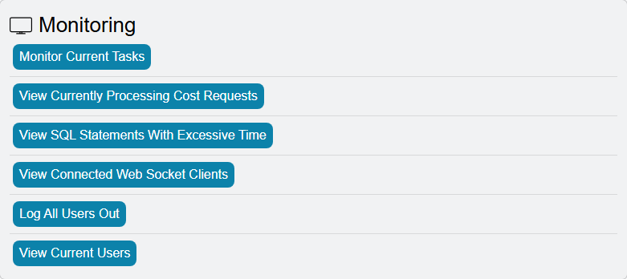
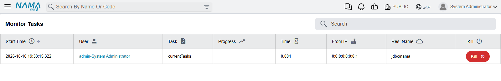
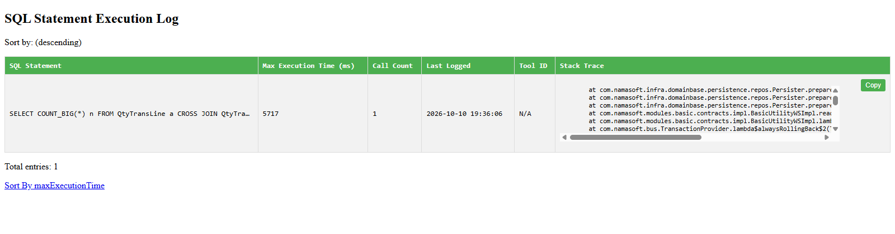

# When the System Is Slow

"The system is slow" is the most common ticket support receives, and it is rarely one problem. It
is usually one person's report holding the database busy, a scheduled job running in office hours,
a search that has to read a table with millions of rows, or a database that has quietly grown out
of shape. Each of those has a screen that shows it and a setting that limits it. This page walks
through them in the order worth checking, and links to the page that covers each one in full.

::: tip Frozen is a different problem
If the system has stopped responding altogether rather than merely crawling, capture thread dumps
first, while the problem is happening — see
[Troubleshooting System Hanging or Unresponsiveness](/admin/troubleshooting/troubleshooting-system-hanging).
A restart destroys the evidence.
:::

## First, narrow it down

A few questions to the customer save a lot of guessing:

| What they tell you | Where to start |
|---|---|
| "Everything is slow for everyone, since about ten o'clock." | Something started at ten. [What the server is doing right now](#What-the-server-is-doing-right-now), then [Background work competing with users](#Background-work-competing-with-users). |
| "One report takes forever, and the others slow down while it runs." | [Reports that hold everyone up](#Reports-that-hold-everyone-up). |
| "Only one user is slow." | That user's reports and bulk actions — [What the server is doing right now](#What-the-server-is-doing-right-now). |
| "Searching for a customer or item takes ages." | [Searching is slow](#Searching-is-slow). |
| "It has been getting slower for months." | [The database itself](#The-database-itself). |
| "I saved the invoice, but the entry appeared minutes later." | Not slowness in the screen — the background queue. See [After a restart, effects arrive late](#After-a-restart-effects-arrive-late). |

## What the server is doing right now

Three screens show live activity. None of them keeps history, so look while the slowness is
happening.

**Running Reports** — **Basic → Reports → Reports Monitoring → Running Reports**. Every report
running at this moment, who started it and how long it has been going. A report that has been
running for twenty minutes during the working day is the first suspect. See
[Report Monitoring](/platform/background-processing/report-monitoring).

**Utilities → Monitoring.** The **Utilities** page is open only to the `admin` user and to users
with **Allow Access to Admin Restricted Functionality** ticked; type *Utilities* in the search bar
at the top of the screen to open it. Its **Monitoring** group has the entries that matter here (the
Utilities page shows them in English only):

- **Monitor Current Tasks** — the long-running operations the server is busy with — bulk actions
  started from a list, imports, reports, reprocessing — with the user who started each one, where
  from, its progress and how long it has run. The list refreshes every second, and each row has a
  **kill** button to end it.
- **View SQL Statements With Excessive Time** — every database statement that took longer than the
  threshold, listed once each with its longest run time and how many times it was called. Sort it by
  time to find the single worst statement, or by count to find the one that is slow because it runs
  thousands of times. The threshold is **Warn About SQL Statements Taking more than (milliseconds)**
  on the [Performance and Search](/platform/global-config/global-config-performance) tab of Global
  Config, 2000 ms when empty. The list is kept in memory, so it starts empty after every restart:
  let the system run through a busy morning before reading it.
- **View Current Users** — who is logged in, from which address, and when they last did something.

**In the database.** When the server screens show nothing heavy and the system is still slow, ask
SQL Server directly: the query under
[Monitor or Find Currently Running Queries](/admin/reprocessing/db-operations) lists the statements
running now, slowest first.

## Reports that hold everyone up

A report reads, and a report over five years of data reads a great deal. While it runs it competes
with every user who is trying to save.

- **End it.** Each row of **Running Reports** has a **Kill Report** link that asks the database to
  stop the query. Nothing is left half-written, because a report only reads.
- **Stop the double click.** A slow report looks stuck, so the user runs it again, and now two
  copies compete. **prevent User To Run Same Report Multiple Times** stops that. It can be ticked
  in Global Configuration for everyone, or on a single user or security profile. A user who tries again
  while the first run is still going sees
  *You already run this Report wait until your request proceed*. This message appears in English
  on Arabic screens too.
- **Cap how many reports one user runs at once.** **Max Number To Run Report**, on the user or on
  the security profile, limits how many reports one person can have running together. Past it the
  user sees
  *You exceeded the maximum allowed number of reports running request, you can view currently running reports from the link below* — «لقد تجاوزت العدد المسموح به لتشغيل التقرير فى نفس الوقت من فضلك عند تشغيل التقرير لا تقوم بعمل إعادة تحميل أكثر من مرة أو أغلاقه وتشغيله مرة أخرى - يمكنك معرفة التقارير الجاري تشغيلها من الرابط أدناه»
- **Put a ceiling on query time.** **Max Seconds To Execute Report Queries** in Global Configuration
  abandons a report query that runs longer than the limit. The same tab has matching limits for
  list views, dashboards and SQL fields — see
  [Performance and Search](/platform/global-config/global-config-performance).
- **Find the habitually slow reports.** Turn on the report log and it records how long every run
  took, so after a week you know which reports to fix rather than which user to blame — see
  [Report Monitoring](/platform/background-processing/report-monitoring).

## Background work competing with users

Scheduled tasks and deferred entity flows run on the same server as the users. A heavy job that
starts at ten in the morning slows everyone from ten in the morning.

- **What is running now.** The **Pending Task Schedules** list
  (**Administration → Settings**) shows every scheduled task with its next run time and
  whether it is **Currently Running**. A task that is running during the slow spell is the
  candidate. Move it out of working hours on its own schedule — see
  [Scheduled Tasks](/platform/automation-and-rules/scheduled-tasks).
- **One slow job holding up the rest.** By default all scheduled tasks run one after another, as do
  all deferred entity flows, so one long job delays everything behind it. Task queues split them
  into parallel lanes — see [Task Queues](/platform/background-processing/task-queues).
- **A save that waits for an entity flow.** An entity flow that runs as part of the save makes the
  user wait for it. Ticking **Run After Committing Document And Affect On DataBase** on the flow
  moves it after the save, into the background — the same Task Queues page explains what changes
  when you do.

### After a restart, effects arrive late

The workers that write a saved document's accounting and inventory effects hold back for several
minutes after the server starts. A pile of **Waiting Processing** rows in
[Business Requests](/platform/background-processing/business-requests) straight after a restart is
expected and clears by itself. Rows that keep piling up long after that mean the worker is not
running — which the login [critical errors](/admin/troubleshooting/critical-errors) report as
*The background processor is not working, please check the server*.

## Searching is slow

Every lookup and list search defaults to **Contains**, which cannot use a database index: the server
reads every row. On a table that has grown to millions of rows, switching the code search to
**Starts With** is usually the single most effective change. It can be set for the whole system in
[Performance and Search](/platform/global-config/global-config-performance), or for one heavy
lookup in [Reference Fields and Lookups](/platform/fields-and-entities-settings/fields-settings-reference-lookups).

## The database itself

Some slowness is the database growing in ways nobody watches. Several of these are watched for you:
the [critical errors](/admin/troubleshooting/critical-errors) shown at login warn when

- the database is not running in read-committed-snapshot isolation — without it readers and writers block each other, and everything feels slow;
- the user-notification table has grown past its limit;
- thousands of expired sales price-list lines are still on file;
- one document's debt-age history is so large that it holds up the ledger queue;
- the application server's log folder, or a watched disk, is filling up.

Each entry there says what to do. Beyond those, the
[Database Related Operations](/admin/reprocessing/db-operations) page has the queries support uses
for housekeeping: finding which tables are largest, cleaning up the recycle bin, action history,
notifications and old pending tasks, and keeping only the last few versions of each record. Large
detail tables without an index on their parent link are a common cause of slow document loading;
[Suggest Indexes for Large Detail Tables](/admin/reprocessing/suggest-index-creation) finds them.

::: danger Back up before running any of the maintenance queries
These scripts run directly against the database and several of them delete data. Take a backup
first, and run them outside working hours.
:::

## What to send to Namasoft

If none of the above explains it, send the development team:

1. When the slowness started and whether it affects everyone or some users.
2. A screenshot of **Running Reports** and **Monitor Current Tasks** taken while it was slow.
3. The **View SQL Statements With Excessive Time** list, sorted by time.
4. The application logs — **Utilities → Logging → Download All Application Logs**.
5. If the system froze, the thread dumps described in
   [Troubleshooting System Hanging or Unresponsiveness](/admin/troubleshooting/troubleshooting-system-hanging).
