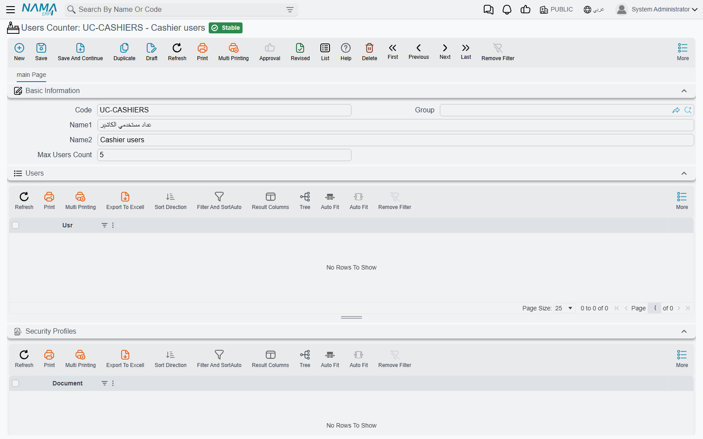
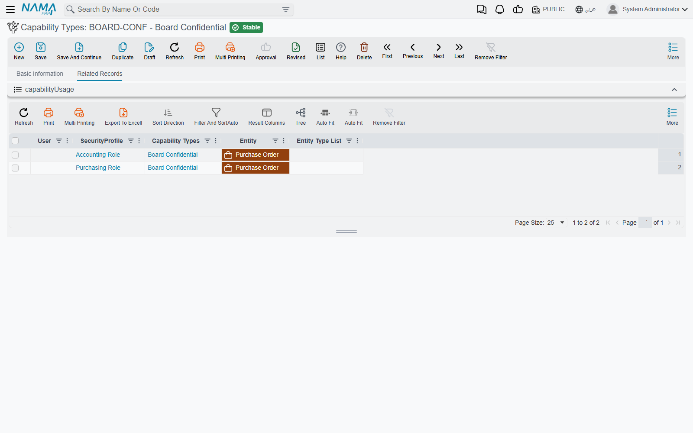
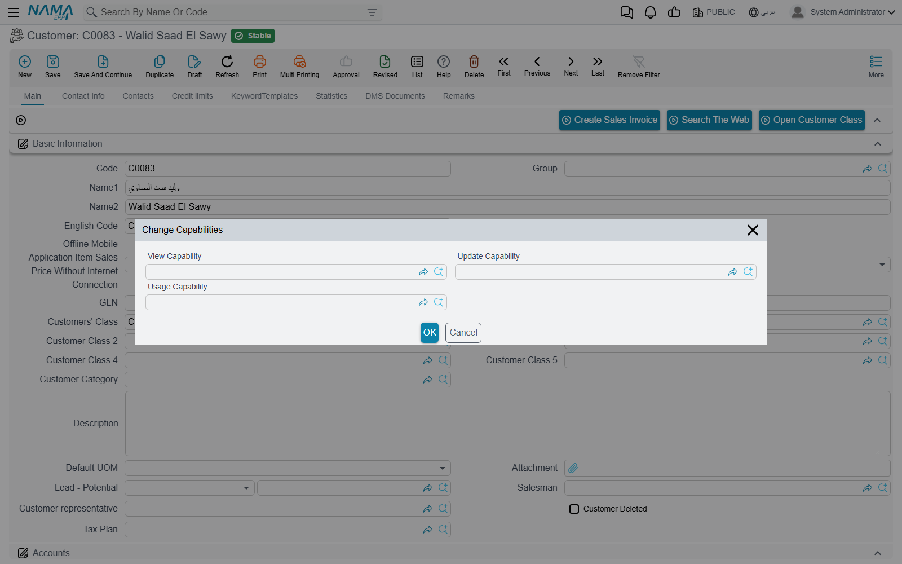

# Users Counter and Capability Types

Two small screens under **Administration → Security** do jobs that the security profile cannot do on its own. A **Users Counter** caps how many people from one group may be signed in at the same time. A **Capability Type** is a named permission that you invent yourself and then attach to profiles, users, records, reports and price lines. Neither screen has more than a couple of fields, but both are referenced from many other places. That is why a customer's question about them usually starts somewhere else: a login that is refused, or a record that one user can open and another cannot.

## Users Counter

### What it limits

Your licence already sets how many users may be signed in at once (see [Licensing](/getting-started/licensing)). A Users Counter sets a **smaller limit of your own, for one group of users**, inside that licence limit. Take a company licensed for 20 concurrent users with a branch in Alexandria. Management wants the branch to use at most 5 of those seats so that head office always has room. You create a Users Counter called *Alexandria Branch* with **Max Users Count** = 5 and link it to the branch staff. The sixth Alexandria user who tries to sign in is refused, even when only 12 people are signed in company-wide.

The screen (*Administration → Security → Users Counter*) has one field of its own, **Max Users Count**. Below it, two collapsible lists show who the counter applies to:

- **Users**: the users who name this counter directly on their own record.
- **Security Profiles**: the profiles that name it.

The **Users** list shows only direct links. A user who gets the counter through their security profile is listed under the profile, not here.

### Linking users to a counter

The counter is a field on two screens:

- the **Security Profile** screen, under **Users Counter**, which makes every user on that profile count against it;
- the **User** screen, in the user's settings, under **Users Counter**.

The user's own setting wins. A user whose own record names a counter is counted against that counter, whatever the profile says. A user who names none falls back to the profile's counter. A user with neither is counted only against the licence.

### How the count works

The check runs at the moment someone signs in from the browser:

1. The system counts the browser sessions that are currently open under the same counter.
2. If one more would exceed **Max Users Count**, the sign-in is refused with *Max Users Reached , please logout from other user*. The licence limit, and the limit of the user's level when the licence defines levels, are checked in the same step. In those two cases the message names the level: *Max Users Reached for level {x}, please logout from other user*. The message has no Arabic text, and on an Arabic screen its English ends in *…from another user*.

A few details decide what "signed in" means here:

- **Sessions are counted, not people.** A user who is signed in on two browsers occupies two places.
- **Mobile-app sign-ins are not counted and not checked.** Signing in from the Nama mobile apps neither uses a place nor is refused by a Users Counter. The licence has its own mobile-user count for that.
- **An empty or zero Max Users Count means one.** It does not mean "no limit". To lift a group's limit, remove the counter from the profile or users rather than clearing the number.
- **`admin` is never refused.** When the limit is full and someone signs in as `admin`, the previous `admin` session is logged out instead.

::: tip Not the same as Max Login Sessions
**Max Login Sessions** on the user or profile limits how many sessions *one user* may open. A Users Counter limits how many sessions *a group* may hold in total. They are independent, and both apply. See [Users and Login](/platform/security/users-and-login#Login-Control).
:::

## Capability Types

### What a capability is

The standard security lines answer fixed questions: may this role add, edit, delete or print this type? Some questions do not fit that grid. Who may see the board's contracts? Who may sell at the staff discount? Who may take stock out of a quarantined batch? A **Capability Type** (*Administration → Security → Capability Types*) is a named permission that you create for such a question. Give it a code and a name, for example `BOARD` / *Board Confidential*, and it becomes something a user either holds or does not.

The screen itself is small:

- **Code** and **Name**.
- **Entity**: an entity type that the capability is meant for. It is descriptive only. It lets you sort and filter the list of capabilities, but it does not restrict where the capability can be used.
- The **Related Records** tab: every user and security profile line that grants this capability, with the type or type list it is granted for. Before you change or retire a capability, check here to see who holds it.

### Who holds a capability

A user holds a capability when a line on the **Custom Capabilities** page of their security profile, or on their own user record, names it. Each line can be limited to one entity type or an entity type list. A user with **Full Authority** holds every capability without needing lines. Delegation counts too: a user who has been delegated someone's authority holds that person's capabilities while the delegation lasts. How to add the lines is on [Security Profile](/platform/security/security-profiles#Custom-Capabilities-Page).

### Where a capability is checked

A capability does nothing until something asks for it. These are the places in the product that do:

| Where | What holding the capability allows |
|---|---|
| **More → Change Capabilities** on any record | The record gets a **View Capability**, **Update Capability** and/or **Usage Capability**. See the next section. |
| **Report Definition** | The view capability of a report and its security equivalent decide who may run it. The shipped reports each carry a *System Reports – …* capability. See [Who may run a report](/platform/reports/reports-guide#Who-may-run-a-report). |
| Price list, offer, discount and free-item lines | A line with a **Capability** applies only for users who have that capability on a Custom Capabilities line, so you can keep a special price for selected sales staff. Here **Full Authority** alone does not count: a full-authority user without the line does not get the price. See [Pricing and offers](/modules/invoicing/pricing-and-offers-guide). |
| **Prevent Using Batch** lines | A user who holds the line's capability can still use the blocked batch. See [Prevent Using Batch](/modules/supplychain/warehouses-and-locators#Taking-a-Batch-Out-of-Circulation-Prevent-Using-Batch). |
| **Reverse Transfer Capability** on a stock transfer term | Holders may save a transfer whose source warehouse is outside their dimensions, as long as the destination warehouse is inside them. See [document-specific term settings](/modules/supplychain/document-terms/doc-term-document-specific). |

### Locking one record with a capability

This is the use that support meets most often. A user who has **Can Change Capability** on the record's type (see [Record-Level Security](/platform/security/record-level-security)) opens the record and chooses **More → Change Capabilities**. The dialog has three fields, and each one answers a different question:

- **View Capability**: who may open the record at all. Others are refused with *You do not have the capability {0} required for the record {1}*. A user who holds the record's **Update Capability** may also view it.
- **Update Capability**: who may change it, which means saving, committing and deleting. Others get *You do not have the authority {1} on entity {0}*, with the capability's name in `{1}`.
- **Usage Capability**: who may pick it in a reference field on another record. Others do not find it in the lookup. If the record is already filled in, saving is refused with *You do not have the authority to use this record {0}-{1}*. An approval definition can tick **Ignore Usage Capability When Approving**, so that approvers who lack the capability can still act on a document that uses the record.

A worked example: the board's three supplier contracts must stay hidden from the purchasing team. Create the Capability Type *Board Confidential*. On each contract, choose **Change Capabilities** and set **View Capability** to it. Then add a Custom Capabilities line for *Board Confidential* to the board members' profile. Purchasing staff keep their normal rights on every other contract, and those three are refused to them by name.

::: info SYSTEMREPORTS is reserved
The capability with the code `SYSTEMREPORTS` (*System Reports*) is created by the system, and it is what the **View System Reports** flag on a security profile grants. You cannot create a capability with that code yourself, or save one under it. Any attempt is refused with *You can not create security capability SYSTEMREPORTS*.
:::

## Messages you may see

| Message | Why | What to do |
|---|---|---|
| *Max Users Reached , please logout from other user* | The user's Users Counter is full. The message has no Arabic text; on an Arabic screen it ends *…from another user*. | Have someone in the same group log out, or raise **Max Users Count**. Remember that an empty count means one. |
| *Max Users Reached for level {x}, please logout from other user* | The licence limit for the user's level is full. When the user also has a counter, the counter may be the one that is full. | Check both the licence level and the user's Users Counter. |
| *You do not have the capability {0} required for the record {1}* — «ليس لديك صلاحيات {0} المطلوبة للسجل {1}» | The record has a **View Capability** that the user does not hold. | Add a Custom Capabilities line for `{0}`, or clear the record's View Capability through **Change Capabilities**. |
| *You do not have the authority {1} on entity {0}* — «لا توجد لديك الصلاحية {1} على النوع {0}» | When `{1}` is a capability's name, the record has an **Update Capability** that the user does not hold. | Grant that capability, or have a holder make the change. |
| *You do not have the authority to use this record {0}-{1}* — «لا توجد لديك الصلاحية لاستعمال هذا السجل {0}-{1}» | The record picked in a reference field has a **Usage Capability** that the user does not hold. | Grant the capability, or pick another record. |
| *You can not create security capability SYSTEMREPORTS* | The code `SYSTEMREPORTS` is reserved for the built-in capability. The message has no Arabic text. | Use a different code. |
