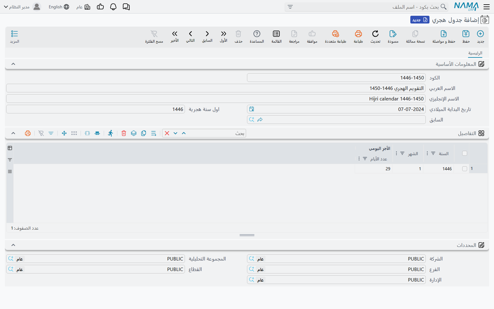

# الجدول الهجري (Hijri Table) — التقويم الهجري الذي يعتمده نما

لا يمكن حساب التقويم الهجري بمعادلة كما يُحسب الميلادي. فكون الشهر 29 يومًا أو 30 يعتمد على التقويم
الرسمي الذي تصدره كل دولة (في السعودية: تقويم أم القرى). لذلك لا يخمّن نما، بل يحوّل التواريخ اعتمادًا
على جدول تُدخله أنت: تاريخ ميلادي واحد يبدأ منه التقويم، ثم طول كل شهر هجري بعده. هذا الجدول هو
**الجدول الهجري**.

ما لم يوجد جدول هجري واحد على الأقل، لا يستطيع نما إنتاج أي تاريخ هجري، ويفشل كل ما يحتاج إليه بالرسالة
*You can not use hijri dates because hijri files are not configured*.

## ما الذي يعتمد عليه

- **التواريخ الهجرية في النصوص المطبوعة والرسائل.** يحوّل تعبير Tempo ‏`$asHijriString` التاريخ عبر هذا
  الجدول (انظر [دليل لغة Tempo](/ar/admin/tempo)). أما طريقة كتابة الناتج (ترتيب اليوم والشهر والسنة،
  والفاصل بينها) فتُضبط في صفحة [الإعدادات العامة — عام](/ar/platform/global-config/global-config-general).
- **عقود العقارات وخطط الأقساط المحسوبة بالهجري.** حين تُؤشَّر **العمل بالتاريخ الهجري** على عقد إيجار أو على
  خطة أقساط، يُحسب كل تاريخ استحقاق عبر هذا الجدول. انظر [جدول أقساط الإيجار](/ar/modules/realestate/rent/realestate-rent-schedule).
- **التزام.** كل تاريخ يُرسل إلى الوزارة يُحوَّل إلى الهجري، بما فيها تواريخ الميلاد والتعيين القديمة.
  انظر [إعداد التزام](/ar/modules/integrations/eltezam/eltezam-setup).

يجب أن يغطي الجدول **كل تاريخ ستحوّله**: أقدم تاريخ ميلاد ترسله إلى التزام، وآخر قسط في أطول عقد هجري لديك.

## الشاشة

| الحقل | ماذا تضع فيه |
|---|---|
| **تاريخ البداية الميلادي** | التاريخ الميلادي الموافق **لأول يوم من محرم** في سنة البداية. |
| **اول سنة هجرية** | السنة الهجرية التي تبدأ في ذلك التاريخ. |
| **السابق** | فارغ في الجدول الأول. لا تملأه إلا في جدول يُكمل جدولًا آخر (انظر أدناه). |
| جدول **التفاصيل**: **السنة**، **الشهر**، **عدد الأيام** | سطر لكل شهر هجري بالترتيب، وفيه عدد أيام ذلك الشهر في التقويم الرسمي. |

لا يدخل في التحويل إلا عمود **عدد الأيام** وتاريخ البداية. يعدّ نما للأمام من **تاريخ البداية الميلادي**
شهرًا بعد شهر مضيفًا أيام كل سطر. يُفحص عمودا **السنة** و**الشهر** للتأكد من عدم تخطي شهر أو تكراره، لكن
التحويل لا يقرؤهما. لذلك يجب أن يكون السطر الأول هو الشهر 1 من **اول سنة هجرية**، وأن تُذكر كل الشهور بعده.

عند إضافة سطر يملأ الجدول السنة والشهر التاليين تلقائيًا، فلا تكتب إلا عدد الأيام.

## مثال

لنفترض أنك تحتاج التواريخ من بداية عام 1446هـ فصاعدًا. وافق الأول من محرم 1446 يوم 7 يوليو 2024.

1. افتح **جدول هجري** وأعطه كودًا مثل `1446-1450`.
2. **تاريخ البداية الميلادي** = 07/07/2024، و**اول سنة هجرية** = 1446، و**السابق** فارغ.
3. في **التفاصيل** أدخل السطر الأول: السنة 1446، الشهر 1، وعدد أيام محرم 1446 من التقويم الرسمي. أضف سطرًا
   فيمتلئ بالسنة 1446 والشهر 2، واكتب أيام صفر. واصل حتى الشهر 12، ثم إلى 1447 الشهر 1، وهكذا إلى أبعد
   ما تحتاج.
4. احفظ. من الآن يتحوّل 7 يوليو 2024 إلى 1 محرم 1446، ويُعدّ كل تاريخ بعده عبر أطوال الشهور التي أدخلتها.

يسري التعديل فورًا ولا يحتاج إلى إعادة تشغيل.

## تمديد التقويم لاحقًا

لا يلزمك إعادة كتابة الجدول حين ينتهي مداه. أنشئ جدولًا هجريًا ثانيًا واجعل **السابق** فيه هو الجدول الأول.
يجب أن يُكمل سطره الأول مباشرة بعد آخر سطر في الجدول الأول؛ فإن انتهى `1446-1450` عند الشهر 12 من 1450،
يبدأ الجدول الجديد من الشهر 1 من 1451. ولا يحتاج الجدول المُكمِّل إلى تاريخ بداية أو سنة بداية خاصين به،
فهو يبدأ من حيث انتهى سابقه. يمكنك ربط أي عدد من الجداول، بشرط:

- ألّا يكون **السابق** فارغًا إلا في جدول **واحد** (بداية السلسلة)،
- وألّا يذكر جدولان الجدول نفسه بوصفه **السابق**.

أما للرجوع **إلى الخلف** في الزمن (وتواريخ الميلاد القديمة في التزام هي السبب المعتاد)، فلا يمكنك وضع جدول
قبل الجدول الأول. بدلًا من ذلك عدّل الجدول الأول: أرجع **تاريخ البداية الميلادي** و**اول سنة هجرية** إلى
محرم الجديد الذي تريد البدء منه، وأضف الشهور الأقدم في أعلى جدوله.

## رسائل قد تظهر لك

| الرسالة | السبب | ما العمل |
|---|---|---|
| *You can not use hijri dates because hijri files are not configured* | لا يوجد أي جدول هجري. | أنشئ جدولًا يغطي التواريخ التي تحتاجها. |
| *This date exceeds the provided hijri range:* متبوعة بالتاريخ، مثل *This date exceeds the provided hijri range: 15/3/2031* | التاريخ يقع بعد آخر شهر في السلسلة. | أضف جدولًا مُكمِّلًا، أو أسطرًا إضافية إلى الجدول الأخير. |
| *The provided date is before configured hijri calendar* | حُوِّل تاريخ هجري يقع خارج الجدول (قبل بدايته أو بعد آخر شهوره) إلى الميلادي. | مدّد الجدول إلى الخلف أو إلى الأمام كما هو موضح أعلاه. |
| *There is already a table without previous year: {0}* | حفظت جدولًا ثانيًا و**السابق** فيه فارغ. | اجعل **السابق** هو الجدول الذي يُكمله هذا الجدول. |
| *The relationship between {0} and {1} is not correct* | السطر الأول في الجدول المُكمِّل لا يأتي مباشرة بعد آخر سطر في جدوله السابق. | ابدأ الجدول الجديد بالشهر الذي يلي آخر شهر في جدوله السابق. |
| *Theis table apeared as previous moe than one: {0}* | جدولان يذكران الجدول نفسه بوصفه **السابق**. | وجّه أحدهما إلى الجدول الصحيح. |
| *The year must be {0}* / *The month must be {0}* | سطر يتخطى شهرًا أو يكرره. | صحّح السطر إلى السنة أو الشهر المذكور في الرسالة. |
| «رقم شهر غير صحيح {0}» | رقم شهر خارج المدى من 1 إلى 12. | صحّح الشهر. |
| «عدد أيام غير صحيح {0}» | عدد أيام لا يصلح طولًا لشهر. | أدخل 29 أو 30 كما في التقويم الرسمي. |

باستثناء الرسالتين الأخيرتين، لا يوجد لهذه الرسائل نص عربي، فتظهر بالإنجليزية في الشاشات العربية أيضًا.
