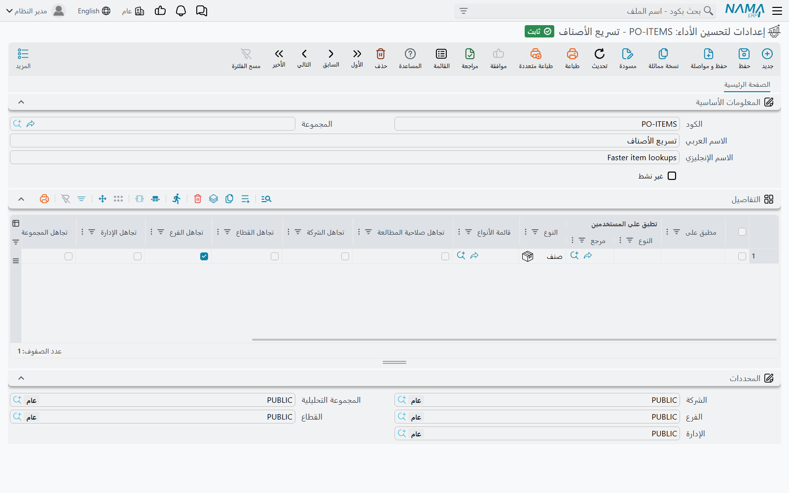

# إعدادات لتحسين الأداء (Performance Optimizer)

في كل مرة يفتح فيها المستخدم شاشة عرض، أو يكتب في مربع بحث، أو يختار سجلاً في حقل مرجع، يضيف نظام نما إلى الاستعلام صلاحيات هذا المستخدم دون أن يشعر: «الشركات المسموح له بها فقط»، و«الفروع المسموح له بها فقط»، و«السجلات التي يملك صلاحية المطالعة الخاصة بها فقط». وفي قاعدة بيانات كبيرة، ومع شاشات تُفتح مئات المرات في اليوم، تأخذ هذه الشروط الإضافية جزءاً حقيقياً من وقت الانتظار. وفي بعض أنواع السجلات لا تحمي هذه الشروط شيئاً أصلاً: فالأصناف تستعملها كل الفروع، وتصفيتها حسب الفرع لا تكلّف إلا وقتاً.

شاشة **إعدادات لتحسين الأداء** هي المكان الذي تطلب فيه من النظام إسقاط شروط صلاحيات بعينها عن أنواع سجلات بعينها، للجميع أو لمستخدمين محددين. وهي مقايضة مقصودة: تصبح الشاشات أسرع لأنها تتحقق من أشياء أقل. وأي شرط توقفه هنا يتوقف التحقق منه فعلاً، فاستعملها فقط مع أنواع السجلات التي لا يحمي فيها ذلك الشرط شيئاً.

## مثال عملي

موزّع لديه 40 فرعاً، وكل مندوب مبيعات مقيّد بفرعه. ملف الأصناف مشترك بين كل الفروع، لكن كلما كتب المندوب في حقل الصنف في الفاتورة ظل البحث يصفّي الأصناف حسب الفرع، وصار البحث عن الصنف أبطأ ما في شاشة الفاتورة.

ينشئ مدير النظام سجلاً واحداً من إعدادات لتحسين الأداء:

1. في الرأس، اترك **غير نشط** دون علامة.
2. في جدول **التفاصيل** أضف سطراً **النوع** فيه = صنف، وضع علامة على **تجاهل الفرع**.
3. اترك **تطبق على المستخدمين** فارغاً ليسري السطر على الجميع.
4. احفظ.

ومن أول بحث بعد الحفظ، لا تحمل قوائم الأصناف ولا البحث عنها شرط الفرع. يسري التغيير بمجرد حفظ السجل، فلا يحتاج أحد إلى إعادة الدخول ولا يحتاج الخادم إلى إعادة تشغيل. ولا يتأثر العملاء ولا الفواتير ولا أي نوع آخر.

## الشاشة

يحمل الرأس الكود والاسمين المعتادين، ومعهما **غير نشط**. والسجل غير النشط يُتجاهل تماماً، وهذه أسهل طريقة لإيقاف تحسين ما مؤقتاً وأنت تختبر هل هو سبب مشكلة ما.

كل العمل في جدول **التفاصيل**. كل سطر يحدد: *أي السجلات*، و*لمن*، و*ماذا يُتجاهل*.

### أي السجلات

املأ **إحدى** الطريقتين:

| العمود | وظيفته |
|---|---|
| **مطبق على** | نطاق عام: **كل الشاشات** أو **الملفات** أو **المستندات**. |
| **النوع** و/أو **قائمة الأنواع** | نوع سجلات واحد، و/أو [قائمة أنواع](/ar/platform/automation-and-rules/entity-type-lists) محفوظة تضم عدة أنواع. ويجوز ملء الاثنين في السطر نفسه. |

السطر الذي فيه **مطبق على** لا يجوز أن يحمل معه نوعاً أو قائمة أنواع، والسطر الخالي من الثلاثة يُرفض لأن **النوع** يصبح حينئذ إلزامياً.

### لمن

يقبل **تطبق على المستخدمين** مستخدماً أو ملف صلاحيات أو مجموعة. إن تركته فارغاً سرى السطر على كل المستخدمين. وإن ملأته سرى السطر على:

- هذا المستخدم، إن اخترت مستخدماً؛
- كل مستخدم ملف صلاحياته هو الملف الذي اخترته؛
- كل مستخدم **المجموعة** في سجله هي المجموعة التي اخترتها.

استعمل هذا الحقل حين لا يعاني من بطء الشاشات إلا بعض المستخدمين، كموظفي الإدارة العامة الذين يرون كل الفروع على أي حال، أو حين لا يصح إسقاط الشرط إلا لبعضهم.

### ماذا يُتجاهل

| العمود | أثره |
|---|---|
| **تجاهل الشركة**، **تجاهل القطاع**، **تجاهل الفرع**، **تجاهل الإدارة**، **تجاهل المجموعة التحليلة** | تتوقف شاشات العرض والبحث واختيار السجل في حقول المرجع عن التصفية بهذا المحدد في السجلات المختارة، فيرى المستخدم سجلات كل الشركات أو الفروع وهكذا. |
| **تجاهل صلاحية المطالعة** | تتوقف شاشات العرض والبحث واختيار السجل عن إخفاء السجلات الموسومة بصلاحية مطالعة لا يملكها المستخدم. راجع [الصلاحيات على مستوى السجلات](/ar/platform/security/record-level-security). |
| **تطبيق التجاهل على مطالعة السجلات** | يُتجاهل المحدد كذلك حين **يفتح** المستخدم سجلاً بعينه. وبدون هذه العلامة تعرض القائمة السجل، لكن فتحه يظل خاضعاً للتحقق من محددات المستخدم. |
| **تطبيق التجاهل على استعمال السجلات** | يُتجاهل المحدد كذلك حين **يُستعمل** أحد السجلات المختارة داخل سجل آخر، كصنف من فرع آخر يُختار في فاتورة. وبدون هذه العلامة يبقى التحقق من اتساق المحددات عند الحفظ سارياً. |

يجب أن يحمل كل سطر علامة على واحد على الأقل من خيارات «تجاهل …» الستة. أما خيارا «تطبيق التجاهل على …» فلا يفعلان شيئاً سوى توسيع تجاهل المحددات، ولا علاقة لهما بـ **تجاهل صلاحية المطالعة**، الذي لا يؤثر إلا في شاشات العرض والبحث واختيار السجل.

ولا يُصفّى بالمحدد أصلاً إلا إذا كان مشاركاً في التحكم بالوصول: فالشركة مشاركة دائماً، والمحددات الأربعة الأخرى لا تشارك إلا إذا كان **منع الوصول عند عدم الاتساق** مفعلاً لها في [الإعدادات العامة ← المحددات](/ar/platform/global-config/global-config-dimensions). فوضع علامة على **تجاهل القطاع** والقطاعات غير مستعملة في الصلاحيات لا يغيّر شيئاً.

## كيف تجتمع الأسطر

- تُحتسب أسطر كل سجلات إعدادات تحسين الأداء النشطة، فيمكنك أن تفصل السجلات حسب الغرض (مثلاً «الملفات المشتركة» و«مستخدمو الإدارة العامة»).
- في نوع سجلات ما، يسري التجاهل إذا كانت علامته موجودة في سطر لهذا النوع نفسه، **أو** في سطر لنطاقه العام (الملفات أو المستندات)، **أو** في سطر لكل الشاشات. تُفحص أولاً الأسطر التي ليس فيها **تطبق على المستخدمين**، ثم الأسطر التي تسري على المستخدم الحالي.
- لا يستطيع أي سطر أن يعيد تشغيل تحقق أوقفه سطر آخر. فالسطر ليس إلا قائمة بما يُتجاهل.

::: warning هذا مفتاح صلاحيات، لا مفتاح سرعة فقط
وضع علامة على **تجاهل الفرع** للعملاء يعني أن المستخدم المقيّد بفرع واحد صار يرى عملاء كل الفروع ويختارهم. قبل أن تضيف سطراً اسأل: هل سجلات هذا النوع مشتركة فعلاً؟ إن لم تكن كذلك فقيّد السطر بـ **تطبق على المستخدمين** أو لا تضفه. وحين يشكو عميل من أن مستخدماً «صار فجأة يرى سجلات فروع أخرى»، فافحص هذه الشاشة إلى جانب ملف صلاحيات المستخدم.
:::

## رسائل قد تظهر لك

| الرسالة | السبب | ما العمل |
|---|---|---|
| *You must at least ignore one thing, at line {0}* (لا يوجد لهذه الرسالة نص عربي، فتظهر بالإنجليزية في الشاشات العربية أيضاً) | لا يحمل السطر علامة على أي من خيارات «تجاهل …» الستة. | ضع علامة على ما يجب أن يتجاهله السطر، أو احذف السطر. |
| «لا يمكنك ملء الحقل {0}، {1} و{2} معاً، إما أن تملء {0} فقط أو {1} و{2}» | في السطر **مطبق على** ومعه نوع أو قائمة أنواع. | أبقِ **مطبق على** وحده، أو امسحه وأبقِ النوع و/أو القائمة. |
