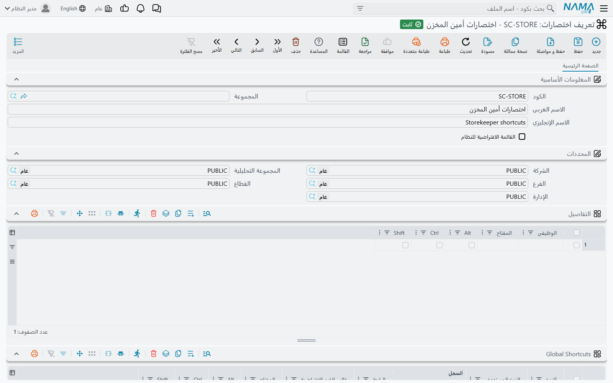
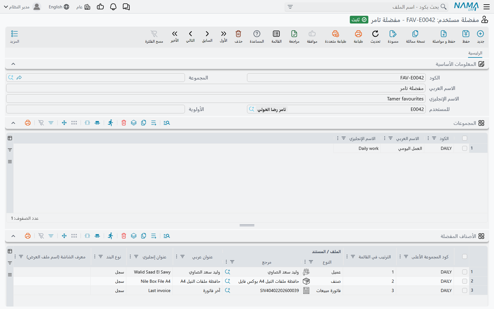

# تعريف الاختصارات ومفضلة المستخدم

في قائمة **إدارة النظام ← تخصيص شكل النظام** شاشتان تحددان ما تصل إليه يد المستخدم وعينه أولًا،
ولا تغيّر أيٌّ منهما سجلًا واحدًا. **تعريف اختصارات** (Shortcuts Definition) تحدد أي مفتاح يفعل ماذا.
و**مفضلة مستخدم** (User Favourites) تحدد ما يظهر في ركن المستخدم الخاص من القائمة. يُقرأ كلٌّ منهما
مرة واحدة عند دخول المستخدم، لذلك لا يسري أي تعديل على أيٍّ من الشاشتين إلا عند **دخوله التالي**.
وحتى ذلك الحين يبقى يعمل بما كان لديه.

أما المفاتيح نفسها، أي القائمة الجاهزة لما يفعله كل مفتاح، فموجودة في صفحة
[اختصارات لوحة المفاتيح](/ar/platform/everyday-tools/shortcuts). وهذه الصفحة تشرح السجلات التي تقف وراءها.

## تعريف اختصارات (Shortcuts Definition)

سجل تعريف الاختصارات خريطة كاملة للوحة المفاتيح، موزعة على جدولين.

جدول **التفاصيل** يربط مفتاحًا بـ*إجراء*: أحد الإجراءات المعتادة في شاشات التعديل والقوائم، مثل
الحفظ، وسجل جديد، والطباعة، ونسخة مماثلة، والتالي، وإضافة سطر. في كل سطر عمود **الوظيفي**، وثلاث
علامات (**Ctrl** و**Alt** و**Shift**)، وعمود **المفتاح**.

جدول **Global Shortcuts** (يظهر عنوانه بالإنجليزية حتى في الواجهة العربية) يربط مفتاحًا بوجهة يمكن
الوصول إليها من أي مكان في النظام. عمود **النوع** يحدد نوع الوجهة، ويحدد بالتالي الأعمدة الأخرى التي
تملؤها:

| النوع | ما تملؤه | ما يفعله المفتاح |
|---|---|---|
| **عرض بقائمة** | النوع المستهدف | يفتح قائمة تلك الشاشة |
| **سجل جديد** | النوع المستهدف، ومعه قالب القيم الافتراضية إن أردت | يفتح سجلًا فارغًا. ومع القالب يُفتح السجل وقد امتلأ منه |
| **سجل** | السجل | يفتح ذلك السجل بعينه |
| **رابط** | الرابط | يفتح عنوان الويب في تبويب جديد في المتصفح |
| **رابط داخلي** | الرابط | يفتح شاشة داخل نما ليست قائمة سجلات |
| **بحث عام** | لا شيء | يضع المؤشر في مربع البحث في الشريط العلوي |
| **بحث القائمة** | لا شيء | يفتح القائمة الجانبية ويضع المؤشر في مربع البحث فيها |

بهذه الطريقة يعطي فريق التنفيذ أمين المخزن مفتاحًا واحدًا لـ«إذن صرف جديد مملوء مسبقًا لمخزني»: سطر
من نوع **سجل جديد** لإذن الصرف، مع قالب القيم الافتراضية الخاص بالمخزن، على **Alt + Shift + I**.

### قاعدتان عند الحفظ

- **لا يتكرر أي تركيب مفاتيح مرتين.** يشمل الفحص الجدولين معًا، فلا يجوز لاختصار في جدول
  Global Shortcuts أن يستعمل مفتاحًا أعطاه جدول التفاصيل لإجراء ما. يُرفض السطر الثاني بالرسالة
  *The shortcut conflicts with line {0}*.
- **الحرف يحتاج Ctrl أو Alt.** الحرف وحده، أو Shift مع حرف، سيعمل أثناء كتابة المستخدم داخل حقل،
  لذلك يُرفض. أما مفاتيح الوظائف (F1 وما بعده) والأسهم وInsert وDelete وHome وEnd ومفاتيح الصفحات
  فمسموح بها بلا مفتاح مساعد.

### أي تعريف يحصل عليه المستخدم

عند الدخول يختار نما للمستخدم تعريف اختصارات **واحدًا** بهذا الترتيب:

1. السجل المحدد في حقل **الاختصارات الافتراضية** في سجل المستخدم نفسه.
2. وإلا فسجل عليه علامة **القائمة الافتراضية للنظام**. اسم العلامة يوحي بالقائمة، لكنها على هذه
   الشاشة تعني «الاختصارات التي يحصل عليها الجميع».
3. وإلا فأول تعريف اختصارات يجده النظام.

ملف الصلاحيات لا دور له هنا. الخطوتان 2 و3 لا تنظران إلا في السجلات التي تسمح محددات المستخدم برؤيتها،
فالتعريف المحفوظ تحت شركة ما لا يُعرض على مستخدم يعمل في شركة أخرى.

::: warning لا تعدّل السجل `default` الذي يأتي مع النظام
يأتي نما بسجل كوده `default`، وفيه المفاتيح المذكورة في صفحة
[اختصارات لوحة المفاتيح](/ar/platform/everyday-tools/shortcuts). أمرا **Regenerate UI** و**Regenerate Screens** يفرغان
هذا السجل ويبنيانه من جديد، كما يفعلان بالقائمة التي تأتي مع النظام (انظر
[الترخيص](/ar/getting-started/licensing)). وكل مفتاح غيّرته فيه يضيع. بدلًا من ذلك اعمل منه نسخة مماثلة،
وعدّل النسخة، ثم إما أن تضع عليها علامة **القائمة الافتراضية للنظام**، أو تضعها في حقل **الاختصارات
الافتراضية** للمستخدمين.
:::

السجل `default` ليس عليه علامة **القائمة الافتراضية للنظام**. فما دام هو التعريف الوحيد تجده الخطوة 3.
وبمجرد وجود تعريف ثانٍ، ضع العلامة على التعريف الذي تريده، حتى لا يُترك الاختيار للخطوة 3 أبدًا.

ويمكن أن يحمل قالب القيم الافتراضية مفتاحًا خاصًا به يُضبط في القالب نفسه. انظر
[قوالب القيم الافتراضية](/ar/platform/everyday-tools/default-values-templates).

## مفضلة مستخدم (User Favourites)

في كل قائمة يأتي بها نما بند **المفضلة ⭐**. هذا البند لا يحتوي شيئًا إلى أن تُرسم القائمة لمستخدم
بعينه. عندها يمتلئ بمجموعات وعناصر سجل مفضلة ذلك المستخدم، فيرى كل مستخدم مفضلته هو.

### كيف يُبنى السجل

أغلب المستخدمين لا يفتحون هذه الشاشة أبدًا. يُنشأ سجلهم تلقائيًا في أول مرة يستعملون فيها أحد هذه
الإجراءات:

- **إضافة إلى مفضلة المستخدم الحالي**، في قائمة «المزيد» في السجل. يثبّت السجل في المفضلة. وفي شاشة
  القائمة يثبّت الإجراء نفسه الشاشةَ ذاتها.
- **إزالة من مفضلة المستخدم الحالي**، في قائمة «المزيد» في السجل. يُخرج السجل من المفضلة.
- **إضافة السجلات المختارة الى سطور مفضلة المستخدم الحالى**، في شاشة القائمة. يثبّت كل الصفوف التي
  اخترتها دفعة واحدة. انظر [التعامل مع عدة سجلات دفعة واحدة](/ar/platform/list-views/mass-operations).

في أول مرة يُنفَّذ فيها أحد هذه الإجراءات لمستخدم ليس له سجل بعد، ينشئ نما سجلًا كوده
`<كود المستخدم>_favourites`، مثل `ahmed_favourites`، ويضع المستخدم في حقل **للمستخدم**. وتُضاف الإضافات
التالية إلى السجل نفسه.

### ما في الشاشة

يستطيع مدير النظام فتح هذا السجل، أو إنشاء سجل جديد، لترتيب مفضلة المستخدم يدويًا:

- **للمستخدم**: صاحب هذه المفضلة. لكل مستخدم سجل واحد فقط. والسجل الثاني للمستخدم نفسه يُرفض
  بالرسالة «المستخدم {0} موجود بالفعل في المفضلة {1}».
- **المجموعات**: المجلدات داخل المفضلة. في كل سطر **الكود** والاسمان العربي والإنجليزي الظاهران في
  القائمة.
- **العناصر المفضلة**: البنود نفسها.
  - **كود المجموعة الأعلى** يضع البند في مجلد. إذا تُرك فارغًا ذهب البند إلى مجلد كوده `Favourites`.
    وإذا ذكر البند كود مجموعة غير موجود في جدول المجموعات، يُضاف سطر المجموعة عند الحفظ.
  - **الترتيب في القائمة** يحدد موضع البند في المجلد. إذا تُرك فارغًا وُضع البند بعد آخر بند في ذلك
    المجلد.
  - **الملف / المستند** هو السجل، أو الشاشة، الذي يفتحه البند.
  - **نوع البند** يحدد طريقة الفتح. **سجل** يفتح ذلك السجل. **العرض بقائمة** يفتح قائمة ذلك النوع،
    مستعملًا تصميم القائمة المذكور في **معرف الشاشة (اسم ملف العرض)** إن وُجد. **إنشاء جديد** يفتح
    سجلًا فارغًا من ذلك النوع. ونوع البند الفارغ يُحفظ على أنه «سجل».

  لا يجوز أن تتكرر الوجهة نفسها في المجلد نفسه بنوع البند نفسه والتصميم نفسه. والتكرار يُرفض بالرسالة
  «الملف/المستند {0} مكرر في المجموعة {1}».

**مثال.** مشرفة مبيعات تريد ثلاثة أشياء على بعد نقرة واحدة: قائمة أوامر البيع المفتوحة، وسند قبض فارغ،
والعميل الكبير الذي تتابعه كل صباح. في سجلها سطر مجموعة واحد، `SALES` / «المبيعات» / *Sales*، وفيه
ثلاثة بنود:

1. أمر البيع، و**نوع البند** «العرض بقائمة»، واسم تصميم قائمة الأوامر المفتوحة في **معرف الشاشة (اسم
   ملف العرض)**.
2. سند القبض، بنوع «إنشاء جديد».
3. سجل العميل، بنوع «سجل».

وفي دخولها التالي يُظهر بند **المفضلة ⭐** مجلد «المبيعات» وفيه البنود الثلاثة بهذا الترتيب.

## رسائل قد تظهر لك

| الرسالة | السبب | ما العمل |
|---|---|---|
| *The shortcut conflicts with line {0}* | سطران يستعملان تركيب المفاتيح نفسه، وقد يكون السطر الآخر في أيٍّ من الجدولين. ليس لهذه الرسالة ترجمة عربية، فتظهر بالإنجليزية في الواجهة العربية أيضًا. | غيّر المفاتيح في أحد السطرين. |
| «يجب استخدام Ctrl/Alt مع الحروف الأبجدية» | مفتاح حرف ليس عليه علامة Ctrl ولا Alt. | ضع علامة Ctrl أو Alt، أو استعمل مفتاحًا غير الحروف. |
| «المستخدم {0} موجود بالفعل في المفضلة {1}» | يوجد سجل مفضلة محفوظ آخر يخص هذا المستخدم. | افتح السجل الموجود (المذكور في الرسالة) وعدّله. |
| «الكود {0} مكرر» | سطران في جدول المجموعات لهما الكود نفسه. | أعطِ كل مجموعة كودًا خاصًا بها. |
| «الملف/المستند {0} مكرر في المجموعة {1}» | الوجهة نفسها موجودة في المجلد نفسه مرتين، بنوع البند نفسه والتصميم نفسه. | احذف البند المكرر، أو غيّر نوعه أو تصميمه. |
