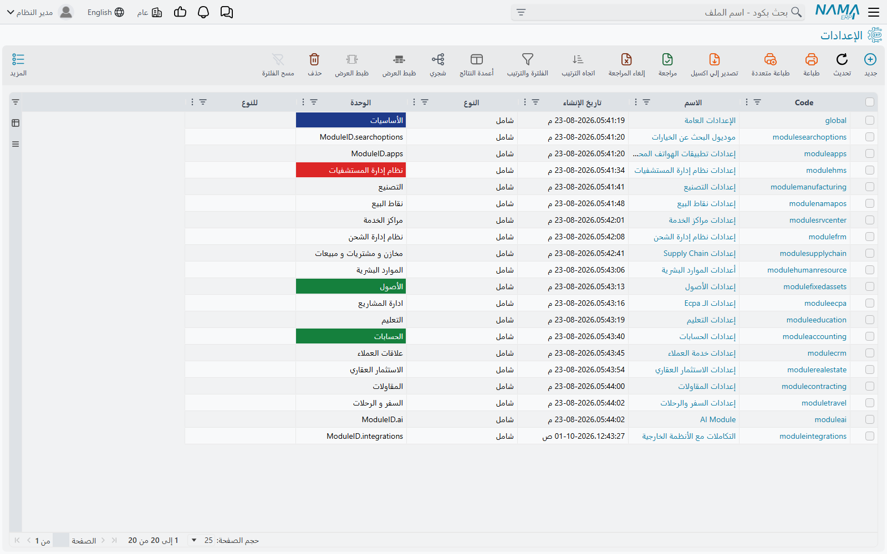
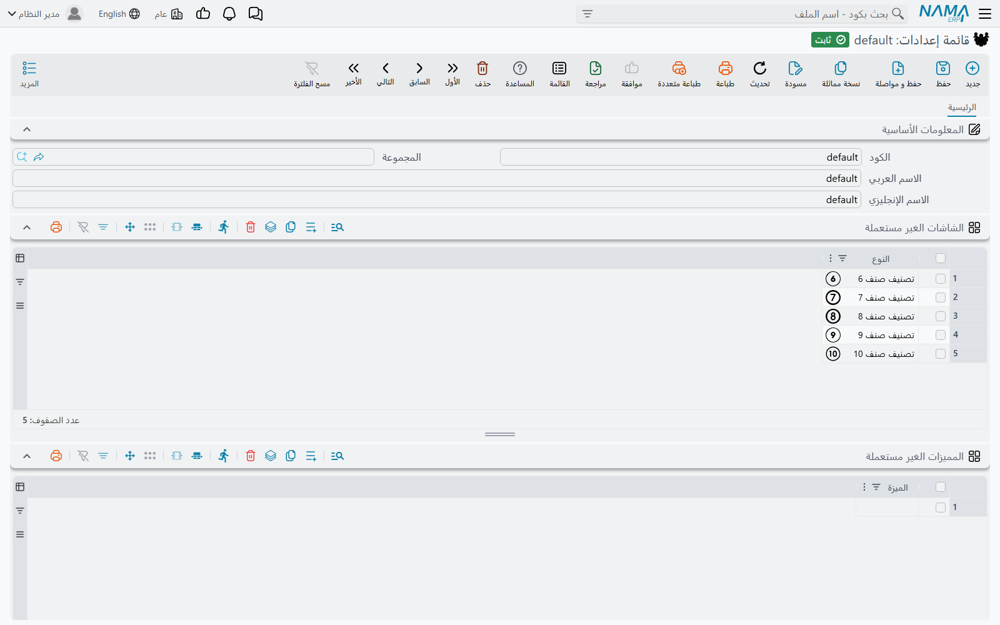
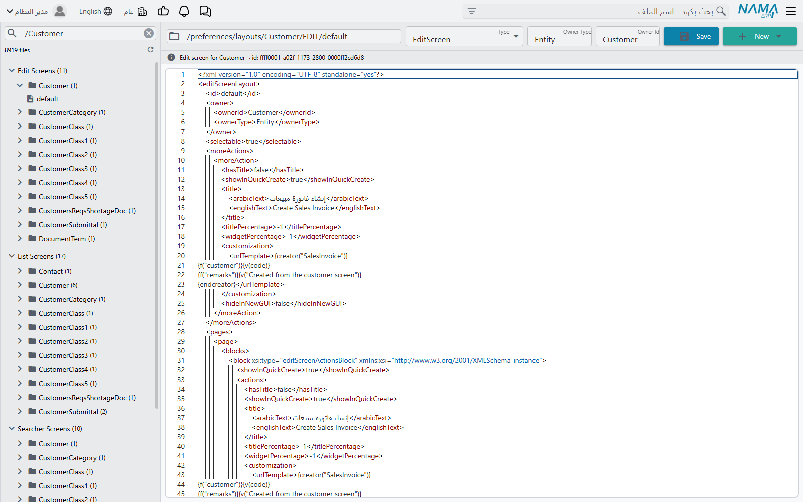

# إعدادات النظام وقائمة الإعدادات وتعديل ملف

كل شاشة إعدادات في نما — الإعدادات العامة، وإعدادات Supply Chain، وإعدادات الموارد البشرية،
وإعدادات نقاط البيع — محفوظة في سجل. ومجموعة **الإعدادات** في قائمة **إدارة النظام** هي المكان الذي
تجتمع فيه هذه السجلات جنبًا إلى جنب، ومعها السجل الوحيد الذي يربطها بشركاتك، ومحرّر خام للملفات
التي تُبنى منها الشاشات. لن تحتاج إلى شيء من هذا في العمل اليومي؛ تلجأ إليه حين يسأل العميل «أين
توجد *كل* الإعدادات؟»، أو حين تختفي شاشة أو ميزة عن شركة بأكملها، أو حين يلزم فحص تخطيط شاشة
بيدك.

تشرح هذه الصفحة ثلاثة بنود في *إدارة النظام ← الإعدادات*:

| بند القائمة | ما هو |
|---|---|
| **إعدادات النظام** (System Settings) | قائمة بكل سجلات الإعدادات في قاعدة البيانات: سجل لكل موديول مثبَّت، إضافة إلى الإعدادات العامة. |
| **قائمة إعدادات** (Configuration Group) | السجل الوحيد الذي تنتمي إليه كل سجلات الإعدادات وكل الشركات، وفيه أيضًا قائمتا الشاشات والمميزات الغير مستعملة على مستوى الشركات. |
| **تعديل ملف** (Edit File) | محرّر نصي لملفات تخطيط الشاشات المحفوظة وملفات تفضيلات كل مستخدم. |

## إعدادات النظام — سجل لكل موديول

افتح **إدارة النظام ← الإعدادات ← إعدادات النظام** فتظهر لك قائمة لا نموذج. كل سطر فيها سجل
إعدادات واحد:

- **الإعدادات العامة** (الكود `global`) — إعدادات التنصيب كله، وهي مشروحة في
  [الإعدادات العامة](/ar/platform/global-config/).
- سجل لكل موديول مثبَّت — **إعدادات الحسابات**، و**إعدادات Supply Chain**، وهكذا. الكود هو كلمة
  `module` يتبعها اسم الموديول، مثل `moduleaccounting`.

تعرض القائمة لكل سجل **النوع** و**الوحدة** و**للنوع**، ويمكنك التصفية بالثلاثة. في التنصيب العادي
يكون النوع في كل الأسطر **شامل**، لأن إعدادات كل موديول تسري على قاعدة البيانات كلها. فقاعدة بيانات
مثبَّت عليها عشرون موديولًا فيها نحو عشرين سطرًا، وهذه هي القائمة كلها. وفتح أي سطر يفتح شاشة
إعدادات ذلك الموديول — الشاشة نفسها التي تصل إليها من قائمة *الإعدادات* في الموديول نفسه — لذلك
فهذه القائمة أسرع طريق إلى إعدادات موديول حين لا تعرف أي قائمة تخفيها.

هذه السجلات ينشئها النظام لا أنت. حين يُثبَّت موديول يُنشأ سجل إعداداته عند التشغيل التالي
للسيرفر، ويبقى ما بقيت قاعدة البيانات. لذلك ترفض القائمة الإجراءين المعتادين:

- **جديد** يُرفض بالرسالة *Can not create system objects*.
- **حذف** يُرفض بالرسالة *Can not delete system objects*.

لا توجد ترجمة عربية لأيٍّ من الرسالتين، فتظهران بالإنجليزية على الشاشات العربية أيضًا.

::: info سجل واحد لكل موديول، لكل الشركات
لكل موديول سجل إعدادات واحد فقط، يسري على كل شركات قاعدة البيانات. لا يمكنك إضافة نسخة ثانية من
إعدادات Supply Chain لشركة بعينها أو لفرع بعينه. فإذا احتاجت شركتان إلى سلوك مختلف، فلا بد أن
يأتي الفرق من شيء *خاص* بكل شركة — دفتر المستند، أو توجيه المستند، أو سجل الشركة نفسه.
:::

في قائمة **المزيد** لسجل الإعدادات إجراء **Regenerate Screens** (يظهر بالإنجليزية في الواجهة العربية
أيضًا). يعيد هذا الإجراء بناء كل شاشات النظام، تمامًا كالزر الذي يحمل الاسم نفسه في
[تعديل شاشة](/ar/platform/screen-modifier/screen-modifier-overview)، ويعيد معها بناء القائمة الأصلية
التي يأتي بها النظام. استعمله بعد تغيير ينبغي أن يضيف حقولًا أو يحذفها في النظام كله، ثم اطلب من
المستخدمين إعادة تحميل صفحة المتصفح.

## قائمة إعدادات — السجل الذي يربط الإعدادات بالشركات

يفتح **إدارة النظام ← الإعدادات ← قائمة إعدادات** سجلًا واحدًا كوده `default`. ينشئه النظام أول مرة
يعمل فيها السيرفر على قاعدة بيانات جديدة، وكل سجل في قائمة إعدادات النظام ينتمي إليه.

كل **شركة** تحدد قائمة إعدادات في حقلها **قائمة الإعدادات**. الحقل إجباري، وحين تختار **الشركة الأم**
تُنسخ قائمة إعداداتها إليه تلقائيًا. ولأن `default` هي القائمة الوحيدة الموجودة، فكل الشركات تشير
إليها. عمليًا لا يوجد ما تختار بينه، لكن هذا الربط هو سبب وجود الحقل.

لا توجد أبدًا إلا قائمة واحدة:

- حفظ قائمة كودها غير `default` يُرفض بالرسالة «الكود يجب أن يكون default».
- حذف القائمة يُرفض بالرسالة *Can not delete system objects*.

### القائمتان في السجل: الشاشات الغير مستعملة والمميزات الغير مستعملة

الجزء المفيد في شاشة قائمة الإعدادات هو جدولاها:

- **الشاشات الغير مستعملة** — في كل سطر **النوع**. كل شاشة مذكورة هنا تُخفى.
- **المميزات الغير مستعملة** — في كل سطر **الميزة**. يُخفى كل حقل وعمود جدول وزر وشاشة تنتمي إلى
  الميزة.

وفي شاشة **الشركة** الجدولان نفسهما. حين يدخل المستخدم، يأخذ النظام شركة المستخدم، ويضيف قائمتي
تلك الشركة إلى القائمتين في قائمة إعداداتها، ثم يُخفي كل ما في المجموع. ولأن كل الشركات تشير إلى
القائمة نفسها `default`، فإن **سطرًا في قائمة الإعدادات يُخفي تلك الشاشة أو الميزة عن كل الشركات
دفعة واحدة**. استعمل جدولَي الشركة نفسها حين يجب أن تفقدها شركة واحدة فقط.

ما الذي يختفي بالضبط، وأي شركة تُحتسب للمستخدم، والقائمة الكاملة للمميزات التي يمكنك إيقافها، كل
ذلك في قسم «إيقاف شاشات ومميزات لشركة بعينها» من صفحة [الترخيص](/ar/getting-started/licensing).
وأهم نقطتين حين تعمل على قائمة الإعدادات نفسها:

- **القائمتان تُقرآن عند الدخول.** السطر الذي تضيفه أو تحذفه يصل إلى كل مستخدم في دخوله التالي، لا
  قبل ذلك.
- **بعض التحديثات تضع أسطرًا هنا بنفسها.** قد يضيف تحديث قاعدة البيانات ميزةً إلى المميزات الغير
  مستعملة في القائمة، كي لا يفاجأ العملاء الحاليون بحقول جديدة. وأشهر مثال ميزة **الأصناف الفرعية**
  التي تعتمد عليها شاشات السيارات في مراكز الخدمة: على قاعدة بيانات محدَّثة تبدأ وهي على هذه
  القائمة، فتبقى حقول السيارات مخفية حتى تحذف السطر (انظر
  [إعداد السيارات في مراكز الخدمة](/ar/modules/servicecenter/cars-setup/servicecenter-cars-overview)).
  فإذا بدت ميزة كاملة مفقودة بعد تحديث، فابدأ البحث هنا.

ثلاث شاشات لا يمكن إخفاؤها أبدًا: **قائمة إعدادات** و**شركة** و**إعدادات النظام**. إذا أضفت إحداها
إلى الشاشات الغير مستعملة، يُحذف السطر بصمت عند الحفظ، لأن إخفاءها كان سيمنع الجميع من الشاشات
اللازمة للتراجع عن التغيير نفسه.

كل نوع وكل ميزة لا يظهر إلا مرة واحدة في الجدول. السطر المكرر يُرفض عند الحفظ بالرسالة
*The entity type {0} at line {1} is repeated* أو *The feature {0} at line {1} is repeated*،
وكلتاهما بالإنجليزية فقط.

## تعديل ملف — الملفات التي تُبنى منها الشاشات

يفتح **إدارة النظام ← الإعدادات ← تعديل ملف** محرّرًا من جزأين. ليس شاشة سجل، بل يعمل مباشرة على
الملفات التي يحفظ فيها نما تخطيطات الشاشات وتفضيلات المستخدمين، وهو موجَّه لفريق الدعم حين يحتاج إلى
رؤية ما حفظته أدوات التخطيط أو إصلاحه بيده. عناوين المحرّر نفسه بالإنجليزية فقط.

يعرض الجزء الأيسر كل الملفات المحفوظة مقسَّمة إلى مجلدات:

| المجلد | محتواه |
|---|---|
| **Edit Screens** | تخطيطات شاشات التحرير المحفوظة، مجلد فرعي لكل شاشة. |
| **List Screens** | تخطيطات شاشات العرض المحفوظة. |
| **Searcher Screens** | تخطيطات نوافذ البحث المحفوظة. |
| **Processed Layouts** | تخطيطات أعدّها النظام من تخطيطات شاشات العرض ونوافذ البحث المحفوظة. |
| **User Preferences** | ملفات التفضيلات الشخصية لكل مستخدم، مجلد فرعي لكل مستخدم. |
| **Other** | أي ملف لا يناسب مساره المجلدات السابقة. |

اكتب في **Filter files…** لتضييق الشجرة حسب المسار، واستعمل زر التحديث لإعادة تحميلها. والنقر على
ملف يفتحه في الجهة الأخرى. فوق المحتوى ترى مسار الملف، و**Type** الخاص به (`XML`، `EditScreen`،
`ListScreen`، `SearcherScreen`، `SQL`، `CSS`، `HTML`، `PlainText` وغيرها)، و**Owner Type** و**Owner Id**،
وسطرًا يخبرك ما هو الملف — "Edit screen for Customer" مثلًا.

لتعديل ملف، عدّل المحتوى واضغط **Save**. إذا غيّرت المسار إلى مسار يستعمله ملف آخر، يسألك المحرّر
*A file with this path already exists. Do you want to replace it?* — ولا تختر **Replace** إلا إذا كنت
تريد فعلًا الكتابة فوق ذلك الملف. ويعرض زر **New** شاشة تحرير أو شاشة عرض أو نافذة بحث فارغة (ويسأل
عن نوع الشاشة المالكة، مثل `Customer`) أو ملف XML عاديًا. وإذا فتحت ملفًا آخر أو بدأت ملفًا جديدًا
والملف الحالي فيه تغييرات غير محفوظة، يسألك المحرّر قبل التخلي عنها.

::: warning هذا يعدّل التخطيط الحي، بلا تراجع
الملف الذي تحفظه هنا هو ما تُبنى منه شاشة كل مستخدم. خطأ في ملف شاشة تحرير قد يعطّل تلك الشاشة على
الجميع، والمحرّر لا يحتفظ بأي سجل للرجوع إليه. انسخ المحتوى إلى مكان آمن قبل أن تغيّره. وللتغييرات
المعتادة — إضافة حقل، أو إخفاء صفحة، أو نقل عمود — استعمل [تعديل شاشة](/ar/platform/screen-modifier/screen-modifier-overview)
بدلًا من ذلك: فهو يصمد أمام إعادة توليد الشاشات ويمكن إيقافه.
:::

## رسائل قد تظهر لك

| الرسالة | السبب | ما العمل |
|---|---|---|
| *Can not create system objects* | ضغطت **جديد** في إعدادات النظام. سجلات الإعدادات ينشئها النظام حين يُثبَّت موديول. | لا يوجد ما يُنشأ. إذا كان سجل إعدادات موديول غير موجود في القائمة، فذلك الموديول غير مثبَّت على هذا السيرفر. |
| *Can not delete system objects* | حاولت حذف سجل إعدادات أو قائمة الإعدادات. | لا يمكن حذفهما. غيّر القيم بدلًا من ذلك. |
| «الكود يجب أن يكون default» | حُفظت قائمة إعدادات بكود غير `default`، وغالبًا حين يحاول أحدهم إنشاء قائمة ثانية. | لا توجد إلا قائمة واحدة. عدّل السجل الموجود `default`. |
| *The entity type {0} at line {1} is repeated* | الشاشة نفسها مذكورة مرتين في الشاشات الغير مستعملة. | احذف السطر المكرر. |
| *The feature {0} at line {1} is repeated* | الميزة نفسها مذكورة مرتين في المميزات الغير مستعملة. | احذف السطر المكرر. |
