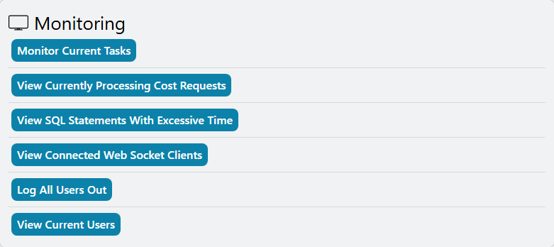
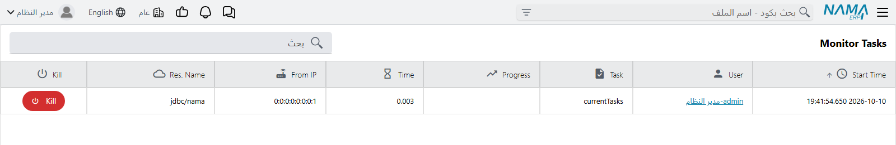

# حين يصبح النظام بطيئًا

«النظام بطيء» هي أكثر شكوى تصل إلى الدعم الفني، ونادرًا ما تكون مشكلة واحدة. ففي الغالب هي تقرير
شغّله شخص واحد فأشغل قاعدة البيانات، أو مهمة مجدولة تعمل في ساعات الدوام، أو بحث مضطر إلى قراءة جدول فيه
ملايين السطور، أو قاعدة بيانات تضخّمت بهدوء دون أن ينتبه أحد. ولكل واحدة من هذه شاشة تكشفها وإعداد يحدّ
منها. تمرّ هذه الصفحة عليها بالترتيب الذي يستحق الفحص، وتحيلك إلى الصفحة التي تشرح كل واحدة منها كاملة.

::: tip التوقف التام مشكلة أخرى
إن توقف النظام عن الاستجابة كليًا ولم يكتفِ بالبطء، فالتقط Thread Dumps أولًا، والمشكلة قائمة — راجع
[استكشاف أخطاء توقف النظام أو عدم استجابته](/ar/admin/troubleshooting/troubleshooting-system-hanging).
فإعادة التشغيل تمحو الدليل.
:::

## أولًا: ضيّق نطاق المشكلة

بضعة أسئلة للعميل توفّر كثيرًا من التخمين:

| ما يقوله العميل | من أين تبدأ |
|---|---|
| «كل شيء بطيء عند الجميع منذ الساعة العاشرة تقريبًا.» | شيء ما بدأ في العاشرة. ابدأ بقسم **ما الذي يفعله الخادم الآن**، ثم **عمل الخلفية الذي يزاحم المستخدمين**. |
| «تقرير واحد يستغرق وقتًا طويلًا، وتبطؤ التقارير الأخرى أثناء تشغيله.» | قسم **تقارير تعطّل الجميع**. |
| «مستخدم واحد فقط يشكو البطء.» | تقارير ذلك المستخدم وعملياته الجماعية — قسم **ما الذي يفعله الخادم الآن**. |
| «البحث عن عميل أو صنف يستغرق دهرًا.» | قسم **البحث بطيء**. |
| «يزداد بطئًا منذ شهور.» | قسم **قاعدة البيانات نفسها**. |
| «حفظت الفاتورة لكن القيد ظهر بعد دقائق.» | هذا ليس بطئًا في الشاشة بل في طابور الخلفية — قسم **بعد إعادة التشغيل تتأخر الآثار**. |

## ما الذي يفعله الخادم الآن

ثلاث شاشات تعرض النشاط الحي. ولا تحتفظ أي منها بتاريخ، فانظر إليها والبطء قائم.

**التقارير الجاري تشغيلها** — **الأساسي ← التقارير ← متابعة التقارير ← التقارير الجاري تشغيلها**. كل
تقرير قيد التشغيل في هذه اللحظة، ومن شغّله، ومنذ متى. والتقرير الذي يعمل منذ عشرين دقيقة في وسط يوم العمل
هو المشتبه الأول. راجع [متابعة التقارير](/ar/platform/background-processing/report-monitoring).

**Utilities ← Monitoring.** لا تُفتح صفحة **Utilities** إلا للمستخدم `admin` وللمستخدمين المفعَّل عليهم
**Allow Access to Admin Restricted Functionality**؛ اكتب *Utilities* في شريط البحث أعلى الشاشة لفتحها.
وفي مجموعة **Monitoring** فيها ما يهمّنا هنا (وتعرضه الصفحة بالإنجليزية فقط):

- **Monitor Current Tasks** — العمليات الطويلة التي ينشغل بها الخادم: الإجراءات الجماعية المطلقة من
  القوائم، والاستيراد، والتقارير، وإعادة المعالجة — ومع كل منها المستخدم الذي بدأها، ومن أي عنوان، ونسبة
  تقدّمها، والمدة التي مضت عليها. تتحدّث القائمة كل ثانية، وفي كل سطر زر **kill** لإنهاء العملية.
- **View SQL Statements With Excessive Time** — كل جملة قاعدة بيانات استغرقت أكثر من الحد، تُذكر مرة
  واحدة مع أطول زمن لها وعدد مرات استدعائها. رتّبها بالزمن لتجد أسوأ جملة منفردة، أو بالعدد لتجد الجملة
  البطيئة لأنها تُستدعى آلاف المرات. والحد هو **Warn About SQL Statements Taking more than (milliseconds)**
  في تبويب [الأداء والبحث](/ar/platform/global-config/global-config-performance) بالإعدادات العامة، ويظهر
  بالإنجليزية حتى على الشاشات العربية، وقيمته 2000 مللي ثانية إن تُرك فارغًا. والقائمة محفوظة في الذاكرة
  فتبدأ فارغة بعد كل إعادة تشغيل: دع النظام يمرّ بصباح مزدحم قبل قراءتها.
- **View Current Users** — من المتصل الآن، ومن أي عنوان، ومتى قام بآخر عمل.

**في قاعدة البيانات.** إن لم تُظهر شاشات الخادم شيئًا ثقيلًا وما زال النظام بطيئًا، فاسأل SQL Server
مباشرة: الاستعلام الوارد تحت «مراقبة الاستعلامات الجارية حاليًا» في
[عمليات قاعدة البيانات](/ar/admin/reprocessing/db-operations) يسرد الجمل الجارية الآن، الأبطأ أولًا.

## تقارير تعطّل الجميع

التقرير يقرأ، والتقرير على بيانات خمس سنوات يقرأ كثيرًا جدًا. وطوال تشغيله يزاحم كل مستخدم يحاول الحفظ.

- **أنهِه.** في كل سطر من **التقارير الجاري تشغيلها** رابط **إيقاف التقرير** يطلب من قاعدة البيانات إيقاف
  الاستعلام. ولا يبقى شيء مكتوب نصفه، لأن التقرير لا يفعل سوى القراءة.
- **امنع النقرة المزدوجة.** التقرير البطيء يبدو متوقفًا، فيشغّله المستخدم مرة أخرى، فتتنافس نسختان. والخيار
  **منع المستخدم من تشغيل نفس التقرير مرتين في نفس الوقت** يمنع ذلك، ويُفعَّل في الإعدادات العامة للجميع، أو
  على مستخدم واحد أو مجموعة صلاحيات واحدة. والمستخدم الذي يعيد المحاولة والتشغيلة الأولى ما زالت تعمل يرى
  الرسالة التالية، وهي تظهر بالإنجليزية حتى على الشاشات العربية:
  *You already run this Report wait until your request proceed*
- **حدّد كم تقريرًا يشغّله المستخدم الواحد معًا.** الحقل **اقصى عدد مرات تشغيل للتقارير** على المستخدم أو على
  مجموعة الصلاحيات يحدّ عدد التقارير التي يشغّلها شخص واحد في الوقت نفسه. وإن تجاوزه رأى:
  «لقد تجاوزت العدد المسموح به لتشغيل التقرير فى نفس الوقت من فضلك عند تشغيل التقرير لا تقوم بعمل إعادة تحميل أكثر من مرة أو أغلاقه وتشغيله مرة أخرى - يمكنك معرفة التقارير الجاري تشغيلها من الرابط أدناه»
- **ضع سقفًا لزمن الاستعلام.** الإعداد **اقصى مدة بالثواني لتنفيذ استعلامات التقارير** في الإعدادات العامة
  يتخلّى عن استعلام التقرير الذي يتجاوز الحد. وفي التبويب نفسه حدود مماثلة لشاشات القوائم ولوحات المعلومات
  وحقول SQL — راجع [الأداء والبحث](/ar/platform/global-config/global-config-performance).
- **اعرف التقارير البطيئة دائمًا.** فعّل سجل التقارير فيسجّل مدة كل تشغيلة، وبعد أسبوع تعرف أي التقارير
  تحتاج إصلاحًا بدل أن تبحث عن مستخدم تلومه — راجع
  [متابعة التقارير](/ar/platform/background-processing/report-monitoring).

## عمل الخلفية الذي يزاحم المستخدمين

المهام المجدولة ومسارات الكيان المؤجَّلة تعمل على الخادم نفسه الذي يعمل عليه المستخدمون. فالمهمة الثقيلة التي
تبدأ في العاشرة صباحًا تُبطئ الجميع من العاشرة صباحًا.

- **ما الذي يعمل الآن.** قائمة **Pending Task Schedules** (**إدارة النظام ← الإعدادات**) تعرض كل مهمة
  مجدولة مع موعد تشغيلها التالي وهل هي قيد التشغيل الآن (**Currently Running**). والمهمة التي تعمل أثناء
  فترة البطء هي المرشّحة. انقلها خارج ساعات الدوام من جدولتها هي — راجع
  [المهام المجدولة](/ar/platform/automation-and-rules/scheduled-tasks).
- **مهمة بطيئة تعطّل ما بعدها.** تعمل المهام المجدولة افتراضيًا واحدة تلو الأخرى، وكذلك مسارات الكيان
  المؤجَّلة، فتؤخّر المهمة الطويلة كل ما خلفها. وطوابير المهام تقسمها إلى مسارات متوازية — راجع
  [طوابير المهام](/ar/platform/background-processing/task-queues).
- **حفظ ينتظر مسار كيان.** مسار الكيان الذي يعمل جزءًا من الحفظ يجعل المستخدم ينتظره. وتفعيل
  **يعمل بعد حفظ المستند نهائيا و التأثير على قاعدة البيانات** على المسار ينقله إلى ما بعد الحفظ، في الخلفية —
  وصفحة طوابير المهام نفسها تشرح ما الذي يتغيّر حين تفعل ذلك.

### بعد إعادة التشغيل تتأخر الآثار

العاملون الذين يكتبون الآثار المحاسبية والمخزنية للمستند المحفوظ يتريّثون عدة دقائق بعد بدء الخادم. فتراكم
سطور **بانتظار المعالجة** في [طلبات الأعمال](/ar/platform/background-processing/business-requests) بُعيد إعادة
التشغيل أمر متوقّع ويزول من تلقاء نفسه. أما السطور التي تواصل التراكم بعد ذلك بكثير فمعناها أن العامل لا
يعمل — وهو ما تُبلغ عنه [الأخطاء الحرجة عند الدخول](/ar/admin/troubleshooting/critical-errors) بالرسالة
*The background processor is not working, please check the server*
(بالإنجليزية فقط).

## البحث بطيء

كل بحث في المراجع والقوائم يستخدم افتراضيًا **يحتوي علي**، وهو لا يستطيع الاستفادة من فهرس قاعدة البيانات:
فيقرأ الخادم كل سطر. وعلى جدول بلغ ملايين السطور يكون تحويل البحث في الكود إلى **يبدأ بـ** في الغالب أنجع
تغيير منفرد. ويُضبط للنظام كله في [الأداء والبحث](/ar/platform/global-config/global-config-performance)، أو
لحقل بحث ثقيل واحد في [حقول المراجع والبحث فيها](/ar/platform/fields-and-entities-settings/fields-settings-reference-lookups).

## قاعدة البيانات نفسها

بعض البطء سببه قاعدة بيانات تكبر بطرق لا يراقبها أحد. وبعضها مراقَب نيابةً عنك: فـ
[الأخطاء الحرجة عند الدخول](/ar/admin/troubleshooting/critical-errors) تحذّر حين

- لا تعمل قاعدة البيانات بعزل read-committed-snapshot — ومن دونه يحجب القرّاء والكتّاب بعضهم بعضًا، فيبدو
  كل شيء بطيئًا؛
- يتجاوز جدول إشعارات المستخدمين حدّه؛
- تبقى آلاف سطور قوائم أسعار المبيعات المنتهية في الملفات؛
- يكبر تاريخ أعمار الديون لمستند واحد حتى يعطّل طابور القيود؛
- يمتلئ مجلد سجلات خادم التطبيق أو قرص مراقَب.

وكل بند هناك يقول ما العمل. وفيما عدا ذلك، تحوي صفحة
[عمليات قاعدة البيانات](/ar/admin/reprocessing/db-operations) الاستعلامات التي يستخدمها الدعم للتنظيف:
معرفة أكبر الجداول حجمًا، وتنظيف سلة المحذوفات وسجل الإجراءات والإشعارات والمهام المعلقة القديمة، والاحتفاظ
بآخر بضع نسخ فقط من كل سجل. وجداول التفاصيل الكبيرة التي لا فهرس على رابطها بالمستند الأب سبب شائع لبطء فتح
المستندات؛ وصفحة
[اقتراح إنشاء Indexes لجداول التفاصيل الكبيرة](/ar/admin/reprocessing/suggest-index-creation) تكشفها.

::: danger خذ نسخة احتياطية قبل تشغيل أي من استعلامات الصيانة
هذه السكربتات تعمل على قاعدة البيانات مباشرة، وبعضها يحذف بيانات. خذ نسخة احتياطية أولًا، وشغّلها خارج
ساعات الدوام.
:::

## ما الذي ترسله إلى نما

إن لم يفسّر شيء مما سبق البطء، فأرسل إلى فريق التطوير:

1. متى بدأ البطء، وهل يصيب الجميع أم بعض المستخدمين.
2. صورة من **التقارير الجاري تشغيلها** ومن **Monitor Current Tasks** أُخذت والبطء قائم.
3. قائمة **View SQL Statements With Excessive Time** مرتّبة بالزمن.
4. سجلات التطبيق — **Utilities ← Logging ← Download All Application Logs**.
5. إن توقف النظام، فالـ Thread Dumps الموصوفة في
   [استكشاف أخطاء توقف النظام أو عدم استجابته](/ar/admin/troubleshooting/troubleshooting-system-hanging).
