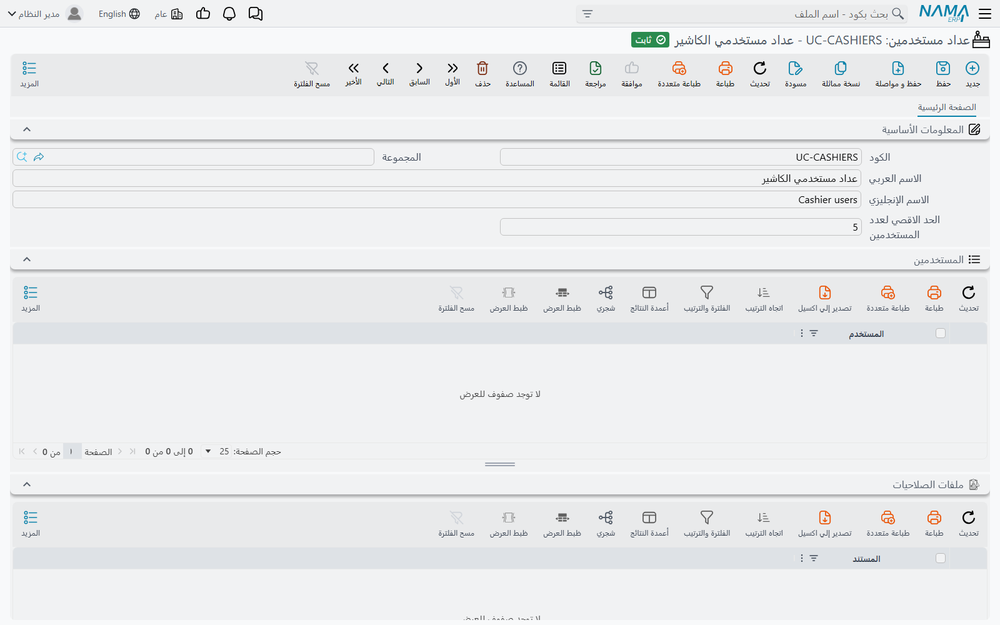
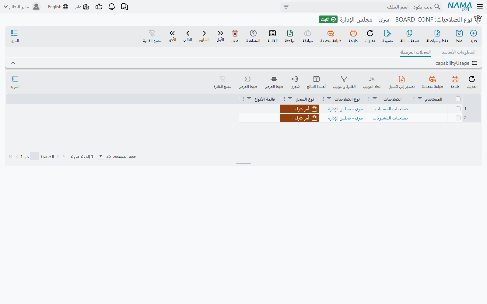
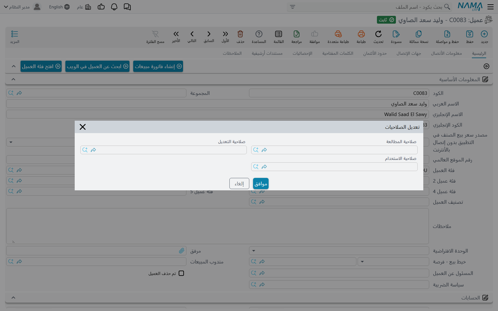

# عداد المستخدمين وأنواع الصلاحيات

تحت **إدارة النظام ← الصلاحيات** شاشتان صغيرتان تؤديان مهمتين لا يستطيع ملف الصلاحيات أداءهما وحده. **عداد مستخدمين** يحدّد كم شخصًا من مجموعة واحدة يمكن أن يكونوا داخل النظام في وقت واحد. و**نوع الصلاحيات** صلاحية مسمّاة تخترعها أنت، ثم تربطها بملفات الصلاحيات والمستخدمين والسجلات والتقارير وسطور الأسعار. كل شاشة منهما لا تحمل أكثر من حقل أو حقلين، لكنّ كلتيهما مرجع لأماكن كثيرة أخرى. ولهذا يبدأ سؤال العميل عنهما عادةً من مكان آخر: دخول رُفض، أو سجل يفتحه مستخدم ولا يفتحه زميله.

## عداد المستخدمين (Users Counter)

### ماذا يحدّد

الترخيص يحدّد أصلًا عدد المستخدمين الذين يدخلون النظام في وقت واحد (انظر [الترخيص](/ar/getting-started/licensing)). أما عداد المستخدمين فيضع **حدًا أصغر خاصًا بك، لمجموعة واحدة من المستخدمين**، داخل حد الترخيص. خذ مثلًا شركة مرخّصة لعشرين مستخدمًا متزامنًا ولها فرع في الإسكندرية. تريد الإدارة ألا يشغل الفرع أكثر من 5 من هذه المقاعد، حتى يبقى للمركز الرئيسي مكان دائمًا. تنشئ عداد مستخدمين باسم *فرع الإسكندرية*، وتضع فيه **الحد الاقصي لعدد المستخدمين** = 5، وتربطه بموظفي الفرع. حين يحاول مستخدم سادس من الإسكندرية الدخول يُرفض، حتى لو لم يكن داخل النظام في الشركة كلها إلا 12 شخصًا.

للشاشة (*إدارة النظام ← الصلاحيات ← عداد مستخدمين*) حقل واحد خاص بها: **الحد الاقصي لعدد المستخدمين**. وتحته قائمتان قابلتان للطي تبيّنان على من يسري العداد:

- **المستخدمين**: المستخدمون الذين يذكرون هذا العداد مباشرة في سجلهم.
- **ملفات الصلاحيات**: الملفات التي تذكره.

قائمة **المستخدمين** لا تعرض إلا الربط المباشر. فالمستخدم الذي يأخذ العداد من ملف صلاحياته يظهر تحت الملف لا هنا.

### ربط المستخدمين بعداد

العداد حقل في شاشتين:

- شاشة **ملف الصلاحيات**، في حقل **عداد مستخدمين**، فيُحسب كل مستخدم على هذا الملف ضمن العداد.
- شاشة **المستخدم**، في إعداداته، في حقل **عداد مستخدمين**.

إعداد المستخدم هو الغالب. المستخدم الذي يذكر سجله عدادًا يُحسب على ذلك العداد مهما كان في الملف. والمستخدم الذي لا يذكر عدادًا يرجع إلى عداد الملف. ومن لا عداد له في أيٍّ منهما لا يُحسب إلا على الترخيص.

### كيف يتم العدّ

يجري الفحص لحظة دخول المستخدم من المتصفح:

1. يعدّ النظام جلسات المتصفح المفتوحة حاليًا تحت العداد نفسه.
2. إن كانت جلسة واحدة إضافية ستتجاوز **الحد الاقصي لعدد المستخدمين**، يُرفض الدخول بالرسالة *Max Users Reached , please logout from another user*. ويُفحص في الخطوة نفسها حد الترخيص، وحد مستوى المستخدم حين يعرّف الترخيص مستويات. وفي هاتين الحالتين تذكر الرسالة المستوى: *Max Users Reached for level {x}, please logout from another user*. ليس للرسالة نص عربي، فتظهر بالإنجليزية. وعلى الشاشة الإنجليزية تنتهي بـ *…from other user*.

وهناك تفاصيل تحدّد معنى «داخل النظام» هنا:

- **الجلسات هي ما يُعدّ، لا الأشخاص.** المستخدم الداخل من متصفحين يشغل مكانين.
- **الدخول من تطبيقات الجوال لا يُعدّ ولا يُفحص.** الدخول من تطبيقات نما للجوال لا يشغل مكانًا، ولا يرفضه عداد المستخدمين. فللترخيص عدد مستقل لمستخدمي الجوال.
- **الحد الفارغ أو الصفر يعني واحدًا.** لا يعني «بلا حد». لرفع الحد عن مجموعة، أزل العداد من الملف أو من المستخدمين بدلًا من مسح الرقم.
- **`admin` لا يُرفض قط.** حين يكون الحد ممتلئًا ويدخل أحد بـ `admin`، تُغلق جلسة `admin` السابقة بدلًا من رفض الدخول.

::: tip ليس هو الحد الأقصى لجلسات المستخدم
حقل **أقصي عدد مرات تسجيل الدخول المتزامن للمستخدم الواحد** في المستخدم أو في الملف يحدّد عدد الجلسات التي يفتحها *مستخدم واحد*. أما عداد المستخدمين فيحدّد عدد الجلسات التي تشغلها *مجموعة* كاملة. الاثنان مستقلان، ويسري كلاهما. انظر [المستخدمين والدخول](/ar/platform/security/users-and-login).
:::

## أنواع الصلاحيات (Capability Types)

### ما هي الصلاحية

سطور الصلاحيات الأساسية تجيب عن أسئلة ثابتة: هل لهذا الدور أن يضيف هذا النوع، أو يعدّله، أو يحذفه، أو يطبعه؟ لكن بعض الأسئلة لا يتسع لها هذا الجدول. من يرى عقود مجلس الإدارة؟ من يبيع بخصم الموظفين؟ من يسحب مخزونًا من شحنة محجوزة؟ **نوع الصلاحيات** (*إدارة النظام ← الصلاحيات ← نوع الصلاحيات*) صلاحية مسمّاة تنشئها أنت لمثل هذا السؤال. تعطيها كودًا واسمًا، مثلًا `BOARD` / *سري لمجلس الإدارة*، فتصبح شيئًا إما أن يملكه المستخدم وإما ألا يملكه.

الشاشة نفسها صغيرة:

- **الكود** و**الاسم**.
- **نوع السجل**: نوع الكيان الذي وُضعت الصلاحية من أجله. هو حقل وصفي فقط. يتيح لك ترتيب قائمة الصلاحيات وتصفيتها، لكنه لا يقيّد أين تُستعمل الصلاحية.
- صفحة **السجلات المرتبطة**: كل سطر في مستخدم أو ملف صلاحيات يمنح هذه الصلاحية، مع النوع أو قائمة الأنواع التي يمنحها لها. قبل أن تغيّر صلاحية أو توقفها، راجع هذه الصفحة لترى من يملكها.

### من يملك الصلاحية

يملك المستخدم الصلاحية حين يذكرها سطر في **صفحة الصلاحيات المخصصة** في ملف صلاحياته، أو في سجل المستخدم نفسه. ويمكن قصر كل سطر على نوع كيان واحد أو على قائمة أنواع. والمستخدم صاحب **صلاحيات كاملة** يملك كل الصلاحيات دون حاجة إلى سطور. والتفويض يُحسب أيضًا: المستخدم المفوَّض بصلاحيات شخص آخر يملك صلاحيات ذلك الشخص ما دام التفويض قائمًا. طريقة إضافة السطور في [ملف الصلاحيات](/ar/platform/security/security-profiles).

### أين تُفحص الصلاحية

الصلاحية لا تفعل شيئًا حتى يطلبها شيء ما. وهذه الأماكن في النظام هي التي تطلبها:

| أين | ما الذي يتيحه امتلاك الصلاحية |
|---|---|
| **المزيد ← تعديل الصلاحيات** في أي سجل | يأخذ السجل **صلاحية المطالعة** و/أو **صلاحية التعديل** و/أو **صلاحية الاستخدام**. انظر القسم التالي. |
| **تعريف تقرير** | صلاحية المطالعة في التقرير ومكافئه الأمني يحدّدان من يشغّله. وكل تقرير من تقارير النظام يحمل صلاحية *System Reports – …*. انظر [دليل التقارير](/ar/platform/reports/reports-guide). |
| سطور قوائم الأسعار والعروض والخصومات والأصناف المجانية | السطر الذي فيه **الصلاحية** لا يسري إلا على من يملكها في سطر من الصلاحيات المخصصة، فتستطيع أن تقصر سعرًا خاصًا على بعض موظفي المبيعات. و**صلاحيات كاملة** وحدها لا تكفي هنا: المستخدم صاحب الصلاحيات الكاملة بلا هذا السطر لا يحصل على السعر. انظر [الأسعار والعروض](/ar/modules/invoicing/pricing-and-offers-guide). |
| سطور **منع إستخدام الشحنة** | المستخدم الذي يملك صلاحية السطر يظل قادرًا على استعمال الشحنة الممنوعة. انظر [المخازن والمواقع](/ar/modules/supplychain/warehouses-and-locators). |
| **صلاحية التحويل العكسي** في توجيه التحويل المخزني | من يملكها يستطيع حفظ تحويل مخزنه المصدر خارج محدداته، ما دام المخزن الوجهة داخلها. انظر [إعدادات التوجيه الخاصة بكل مستند](/ar/modules/supplychain/document-terms/doc-term-document-specific). |

### قفل سجل واحد بصلاحية

هذا هو الاستعمال الذي يقابله الدعم الفني أكثر من غيره. المستخدم الذي يملك **إمكانية تغير الصلاحيات** على نوع السجل (انظر [الأمان على مستوى السجل](/ar/platform/security/record-level-security)) يفتح السجل ويختار **المزيد ← تعديل الصلاحيات**. في الحوار ثلاثة حقول، وكل حقل يجيب عن سؤال مختلف:

- **صلاحية المطالعة**: من يفتح السجل أصلًا. ويُرفض غيره بالرسالة «ليس لديك صلاحيات {0} المطلوبة للسجل {1}». والمستخدم الذي يملك **صلاحية التعديل** للسجل يستطيع مطالعته أيضًا.
- **صلاحية التعديل**: من يغيّره، أي يحفظه ويعتمده ويحذفه. ويتلقى غيره الرسالة «لا توجد لديك الصلاحية {1} على النوع {0}»، وفي `{1}` اسم الصلاحية.
- **صلاحية الاستخدام**: من يختاره في حقل مرجع داخل سجل آخر. غيره لا يجده في البحث. وإن كان السجل مختارًا من قبل، يُرفض الحفظ بالرسالة «لا توجد لديك الصلاحية لاستعمال هذا السجل {0}-{1}». ويمكن تفعيل **تجاهل صلاحيات الاستخدام عند الموافقة** في تعريف الموافقة، حتى يستطيع الموافقون الذين لا يملكون الصلاحية التصرف في مستند يستعمل السجل.

مثال عملي: يجب أن تبقى ثلاثة عقود موردين خاصة بمجلس الإدارة مخفية عن فريق المشتريات. أنشئ نوع الصلاحيات *سري لمجلس الإدارة*. في كل عقد من الثلاثة اختر **تعديل الصلاحيات**، وضع فيه **صلاحية المطالعة**. ثم أضف سطرًا بهذه الصلاحية في الصلاحيات المخصصة لملف صلاحيات أعضاء المجلس. يحتفظ موظفو المشتريات بصلاحياتهم المعتادة على باقي العقود، أما هذه الثلاثة فيُرفض فتحها لهم برسالة تذكر اسم الصلاحية.

::: info الكود SYSTEMREPORTS محجوز
الصلاحية ذات الكود `SYSTEMREPORTS` (*التقارير النظامية*) ينشئها النظام، وهي ما يمنحه خيار **مطالعة التقارير النظامية** في ملف الصلاحيات. لا يمكنك أن تنشئ صلاحية بهذا الكود بنفسك، ولا أن تحفظ صلاحية به. وأي محاولة تُرفض بالرسالة *You can not create security capability SYSTEMREPORTS*.
:::

## رسائل قد تظهر لك

| الرسالة | السبب | ماذا تفعل |
|---|---|---|
| *Max Users Reached , please logout from another user* | عداد المستخدمين الخاص بالمستخدم ممتلئ. ليس للرسالة نص عربي فتظهر بالإنجليزية؛ وعلى الشاشة الإنجليزية تنتهي بـ *…from other user*. | اطلب من أحد في المجموعة نفسها الخروج، أو ارفع **الحد الاقصي لعدد المستخدمين**. وتذكّر أن الحد الفارغ يعني واحدًا. |
| *Max Users Reached for level {x}, please logout from another user* | حد الترخيص لمستوى المستخدم ممتلئ. وإن كان للمستخدم عداد أيضًا، فقد يكون العداد هو الممتلئ. | راجع مستوى الترخيص وعداد المستخدمين معًا. |
| «ليس لديك صلاحيات {0} المطلوبة للسجل {1}» | للسجل **صلاحية مطالعة** لا يملكها المستخدم. | أضف سطرًا في الصلاحيات المخصصة للصلاحية `{0}`، أو امسح صلاحية المطالعة من السجل عبر **تعديل الصلاحيات**. |
| «لا توجد لديك الصلاحية {1} على النوع {0}» | حين يكون `{1}` اسم صلاحية، فللسجل **صلاحية تعديل** لا يملكها المستخدم. | امنحه تلك الصلاحية، أو اجعل من يملكها يُجري التعديل. |
| «لا توجد لديك الصلاحية لاستعمال هذا السجل {0}-{1}» | للسجل المختار في حقل مرجع **صلاحية استخدام** لا يملكها المستخدم. | امنحه الصلاحية، أو اختر سجلًا آخر. |
| *You can not create security capability SYSTEMREPORTS* | الكود `SYSTEMREPORTS` محجوز للصلاحية المدمجة. ليس للرسالة نص عربي. | استعمل كودًا آخر. |
