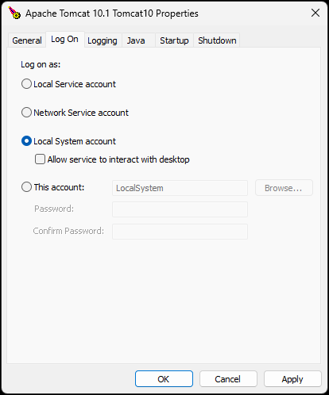

# دليل تثبيت Nama ERP

**Nama ERP** هو تطبيق ويب مبني على Java يعمل على Apache Tomcat ويستخدم Microsoft SQL Server كمحرك قاعدة بيانات افتراضي.

## متطلبات النظام

* **نظام التشغيل:** 64-bit (يُنصح باستخدام Windows Server)
* **Java JDK:** الإصدار 21 أو أحدث
  [تنزيل JDK 21](https://www.oracle.com/eg/java/technologies/downloads/#jdk21-windows)
* **Apache Tomcat:** الإصدار 10
  [تنزيل Tomcat 10](https://tomcat.apache.org/download-10.cgi)
* **محرك قاعدة البيانات:** Microsoft SQL Server 2016 أو أحدث (يُنصح بـ SQL Server 2022)
  للبيئات التجريبية، استخدم **SQL Server Developer Edition**
  [تنزيل SQL Server](https://www.microsoft.com/en-us/sql-server/sql-server-downloads)
* **SQL Server Management Studio**
  [تنزيل SQL Server Management Studio](https://learn.microsoft.com/en-us/ssms/install/install#:~:text=Download%20SSMS)
* **7-Zip** (للتعامل مع الملفات المضغوطة)
  [تنزيل 7-Zip](https://www.7-zip.org/download.html)
* **Notepad++** (لعرض السجلات أو تحرير ملفات الإعداد)
  [تنزيل Notepad++](https://notepad-plus-plus.org/downloads/)
* **مثبّت Nama ERP**
  [تنزيل المثبّت](https://namasoft.com/bin/installer/installer.zip)

## إعداد قاعدة البيانات

* فعّل **Mixed Mode Authentication** في SQL Server.
* أنشئ قاعدة بيانات (تجنب استخدام الاسم الافتراضي `namaerp` في بيئة الإنتاج).
* أنشئ مستخدم SQL (أو استخدم `sa`) ومنحه صلاحية كاملة على قاعدة البيانات.
* فعّل **TCP/IP Protocol** باستخدام **SQL Server Configuration Manager**.
* لـ **named instances**، عيّن منفذاً ثابتاً باستخدام إعدادات **IPAll**.

::: tip إذا كنت تثبّت SQL Server على قرص SSD حديث، قد تواجه مشكلة بعد التثبيت
**مثال على محتوى السجل** (السجل عادةً في `C:\Program Files\Microsoft SQL Server\MSSQL16.MSSQLSERVER\MSSQL\Log\ERRORLOG`)
```log
Error: 5179, Severity: 16, State: 1.
Cannot use file 'data file path', because it is on a volume with sector size 8192. SQL Server supports a maximum sector size of 4096 bytes. Move the file to a volume with a compatible sector size.
```
* الحل:
    1. أزل تثبيت SQL Server
    2. شغّل سكريبت PowerShell التالي:
```powershell
New-ItemProperty -Path "HKLM:\SYSTEM\CurrentControlSet\Services\stornvme\Parameters\Device" -Name   "ForcedPhysicalSectorSizeInBytes" -PropertyType MultiString        -Force -Value "* 4095"
```
    3. أعد تشغيل Windows
    3. ثبّت SQL Server مجدداً
:::

## استخدام المثبّت

يوفر **مثبّت Nama ERP** واجهة رسومية بالميزات الرئيسية التالية:

### ميزات التثبيت الأساسية
* إنشاء قاعدة البيانات ومستخدمي قاعدة البيانات
* إنشاء **مهمة النسخ الاحتياطي الكامل** في SQL Server Agent
* إنشاء **مهمة النسخ الاحتياطي التفاضلي** (تعمل كل 2-3 ساعات)
* إنشاء **سكريبت تنظيف النسخ الاحتياطية** (يحذف النسخ القديمة)
* خيار **رفع النسخ الاحتياطية إلى التخزين السحابي** (Google Drive، Dropbox، OneDrive، إلخ)
* إنشاء **شهادة SSL** تلقائياً باستخدام [Let's Encrypt](https://letsencrypt.org/)

### أقسام الواجهة
1. **معلومات الترخيص**: مفتاح الترخيص، اسم العميل، السيرفر الفرعي (يُملأ تلقائياً)
2. **إعداد قاعدة البيانات**: السيرفر، المنفذ (1433)، اسم قاعدة البيانات، بيانات الاعتماد
3. **إعداد السيرفر**: مسار Tomcat (يُكتشف تلقائياً)، عنوان السيرفر
4. **مسارات التثبيت**: رابط/مسار ملف Extras.zip، وجهة التنزيل
5. **متابعة التقدم**: الحالة الآنية، السجلات، وأشرطة التقدم

### الميزات الذكية
* **الاكتشاف التلقائي**: مسارات Tomcat الشائعة والإعدادات الموجودة
* **التحقق الآني**: ردود فعل بصرية (حدود خضراء/حمراء) لحقول الإدخال
* **حفظ الإعدادات**: حفظ واستعادة تلقائي للإعدادات عبر `installer.properties`
* **تكامل مفتاح الترخيص**: ملء تلقائي لبيانات العميل والسيرفر الفرعي

## متطلبات شهادة SSL

لتثبيت SSL باستخدام Let's Encrypt، تحتاج إلى:

1. **عنوان IP ثابت**
2. **اسم نطاق** يشير إلى عنوان IP الثابت
3. **توجيه المنافذ** للمنافذ `80` و`443` من الراوتر إلى السيرفر

::: tip
إذا لم يكن عنوان IP الثابت متاحاً، يمكنك استخدام **خدمة DNS ديناميكي** (مثل selfip، DDNS).
:::

## قواعد البيانات المدعومة

رغم أن SQL Server هو الافتراضي، قد تكون قواعد بيانات أخرى مدعومة. يرجى التواصل مع الدعم الفني لـ Nama ERP للتأكيد قبل استخدام بدائل أخرى.

---

## 📺 شرح التثبيت الكامل

شاهد الشرح الكامل للتثبيت هنا:
👉 [https://youtu.be/6UWe9GyZC20](https://youtu.be/6UWe9GyZC20)

## التحقق من تثبيت Nama ERP

يعمل Apache Tomcat افتراضياً على المنفذ `8080`. إذا لم تغيّر المنفذ أثناء الإعداد، يمكنك التحقق من صحة التثبيت بزيارة:

```
http://localhost:8080/erp/
```

إذا ظهرت صفحة تسجيل الدخول، فالتثبيت ناجح.

للسماح لمستخدمين آخرين على الشبكة المحلية (LAN) بالوصول، تأكد من فتح المنفذ `8080` في **جدار حماية Windows**:

* اذهب إلى **Windows Defender Firewall** > **Advanced Settings**
* تحت **Inbound Rules**، أنشئ قاعدة جديدة للسماح بالمرور على المنفذ `8080`

---

## ترقية Nama ERP

يمكنك ترقية Nama ERP من **صفحة utils** داخل واجهة النظام. تتوفر طرق ترقية متعددة حسب إعدادك.

### الترقية اليدوية

لترقية Nama ERP يدوياً:

1. نزّل أداة الترقية:
   [https://namasoft.com/bin/upg-wget.jar](https://namasoft.com/bin/upg-wget.jar)

2. انسخ الملف إلى **مجلد تثبيت Tomcat**

3. يمكنك تشغيل ملف JAR عبر:

    * **النقر المزدوج** عليه
      **أو**
    * باستخدام **موجه أوامر Windows**:

      #### الخطوات:

        * افتح موجه الأوامر (`cmd`)

        * انتقل إلى مجلد تثبيت Tomcat باستخدام أمر `cd`، مثلاً:

          ```cmd
          cd "C:\Program Files\Apache Software Foundation\Tomcat 10"
          ```

        * شغّل أداة الترقية:

          ```cmd
          java -jar upg-wget.jar
          ```

ستقوم هذه الأداة بتنزيل وتطبيق آخر تحديثات Nama ERP تلقائياً.

### كيفية السماح بتنزيل الإصدارات من صفحة Utils؟

لتمكين النظام من تنزيل التحديثات وتثبيتها من صفحة **utils** (أي دعم الترقية الذاتية)، يجب أن تعمل خدمة Tomcat تحت حساب **Local System Account**.

::: tip
يُعدّ هذا الإعداد عادةً تلقائياً أثناء تثبيت Nama ERP. إذا توقفت الترقية التلقائية عن العمل، اتبع هذه الخطوات لاستعادتها
:::

1. افتح **أداة إعداد خدمة Tomcat**:

    * انتقل إلى:
      `C:\Program Files\Apache Software Foundation\Tomcat 10\bin\tomcatw.exe`
    * أو ابحث في قائمة ابدأ في Windows عن: **Configure Tomcat**

2. في نافذة الإعداد، اذهب إلى تبويب **Log On**.

3. اختر خيار **Local System account**.

4. احفظ الإعداد وأعد تشغيل خدمة Tomcat.



## استكشاف الأخطاء وإصلاحها

### المشاكل الشائعة وحلولها

**التحقق قبل التثبيت**: استخدم **Perform Checks** (F5) لتشخيص المشاكل:

1. **تعارض المنافذ**: برنامج آخر يستخدم منفذ Tomcat (عادةً 8080)
2. **مشاكل قاعدة البيانات**: SQL Server لا يعمل، أو TCP/IP معطّل، أو بيانات اعتماد خاطئة
3. **مشاكل Java**: مسار Java مفقود أو مضبوط بشكل خاطئ
4. **مسارات غير صالحة**: مجلد Tomcat غير موجود أو روابط غير صحيحة

### تصحيح أوامر المثبّت

::: tip عرض مخرجات المثبّت التفصيلية
لرؤية المخرجات التفصيلية للأوامر التي تعمل داخل المثبّت (مفيد لتصحيح مشاكل التثبيت)، يمكنك تمكين طباعة مخرجات العملية بتعديل سكريبت تشغيل المثبّت.

عدّل ملف `install-nama-erp.js` واستبدل:
```javascript
Arguments = " -jar \""+oFolder.path+"\\nama-installer-0.0.1-SNAPSHOT.jar\"";
```

بـ:
```javascript
Arguments = " -Dprint-process-output=true -jar \""+oFolder.path+"\\nama-installer-0.0.1-SNAPSHOT.jar\"";
```

سيعرض هذا مخرجات جميع الأوامر التي ينفّذها المثبّت، مما يساعدك على تحديد نقطة حدوث المشكلة بالضبط.
:::

### عملية حل الأخطاء
1. **شغّل التشخيص** → **راجع السجلات** → **أصلح الأخطاء الحرجة** → **أعد التثبيت**
2. استخدم **Load From Tomcat** لاستيراد الإعدادات الموجودة
3. **Save Config** يحفظ الإعدادات بين الجلسات لأغراض استكشاف الأخطاء

## عناصر تحكم المثبّت والعمليات

### أزرار الإجراءات الرئيسية
* **Start Installation**: يبدأ التثبيت بعد التحقق (مفتاح Enter أو الزر الأخضر)
* **Perform Checks** (F5): يتحقق من Tomcat وقاعدة البيانات وJava وإعداد المنفذ
* **Save Config** (Ctrl+S): يحفظ الإعدادات في `installer.properties`
* **Load From Tomcat** (Ctrl+L): يستورد الإعداد من تثبيت موجود

### العمليات المتقدمة
* **Request Key**: طلب مفتاح ترخيص تلقائي من سيرفرات Nama مع متابعة الموافقة
* **Install SSL**: يشغّل معالج تثبيت شهادة Let's Encrypt
* **Migrate Tomcat**: ترقية من Tomcat 9 إلى Tomcat 10 مع الحفاظ على الإعداد
* **DB Scripts**: يولّد سكريبتات إعداد قاعدة البيانات

### التحقق والاكتشاف التلقائي
* **Path Detection**: يعثر تلقائياً على Tomcat في المواقع الشائعة
* **Field Validation**: ردود فعل آنية بحدود ملوّنة (أخضر=صالح، أحمر=غير صالح)
* **Configuration Import**: يحمّل الإعدادات الموجودة من `nama.properties`
* **Progress Monitoring**: تقدم التنزيل الآني وحالة التثبيت والسجلات التفصيلية
