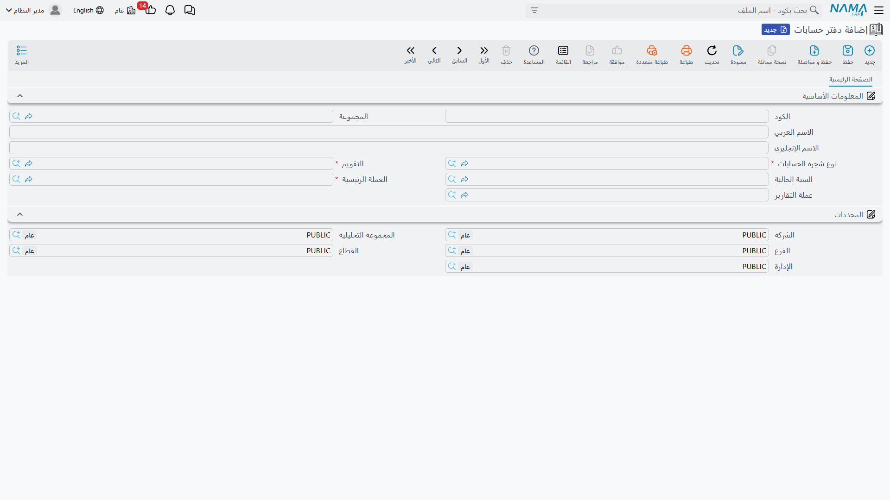
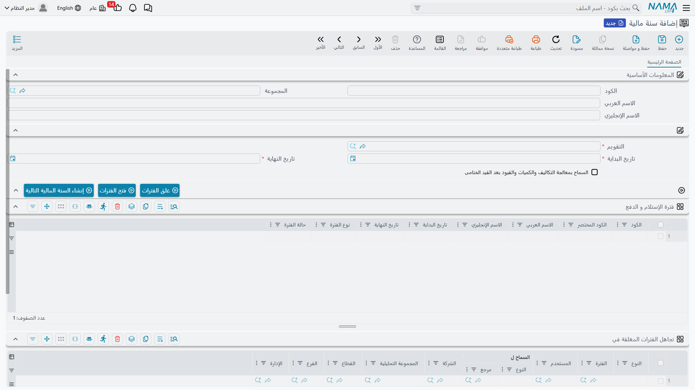

# المفاهيم الأساسية والإعداد المبدئي للحسابات

قبل أن تُسجّل أول قيد، يحتاج نظام الحسابات إلى أن «يعرف» بعض الحقائق الثابتة عن منشأتك: ما هي عملتك الرئيسية؟ على أي شجرة حسابات تعمل؟ ما هي سنتك المالية ومتى تبدأ وتنتهي؟ هذه الإجابات تُسجَّل مرّة واحدة عند تأسيس النظام في عدد صغير من الملفات الأساسية، ثم يبني عليها كل شيء بعد ذلك — كل فاتورة وكل سند وكل قيد يرجع إليها ليعرف أين وكيف يُسجِّل أثره المحاسبي.

هذه الصفحة تشرح هذه الملفات التأسيسية وكيف تترابط: **دفتر الحسابات**، و**نوع شجرة الحسابات**، و**التقويم**، و**السنة المالية وفتراتها المحاسبية**، وكيف تُربَط كل **شركة** بدفترها.

::: info الترخيص المطلوب
هذه الخصائص جزء من ترخيص المحاسبة الأساسي `accounting`. إن لم تظهر لديك قوائم الحسابات أصلًا فالأرجح أن الترخيص غير مفعّل.
:::

## الصورة الكبيرة: من أين يبدأ كل شيء؟

تخيّل أنك تؤسّس الحسابات لشركة جديدة. الترتيب المنطقي للإعداد هو:

1. **التقويم** — يحدّد كيف تُقسَّم السنة إلى فترات (شهرية غالبًا).
2. **نوع شجرة الحسابات** — تصنيف يجمع تحته الشركات التي تتشارك نفس شجرة الحسابات.
3. **دفتر الحسابات** — يربط العملة الرئيسية + نوع شجرة الحسابات + التقويم معًا، ويمثّل «الكتاب» الذي تُسجَّل فيه الأرصدة.
4. **السنة المالية وفتراتها** — تُنشأ بناءً على التقويم، وتُفتح فتراتها لاستقبال الحركات.
5. **الشركة** — تُربَط بدفتر الحسابات، فتصبح جاهزة للعمل.

لا تحتاج لإعادة هذا الإعداد كل عام؛ ما تكرّره سنويًا هو إنشاء **سنة مالية** جديدة وفتح فتراتها فقط.

## دفتر الحسابات

دفتر الحسابات هو قلب الإعداد. تجده في **الحسابات ← الإعدادات ← دفتر حسابات** (`Accounting > Settings > Ledger`)، وهو الذي يجمع القرارات المالية الكبرى في مكان واحد:

- **العملة الرئيسية** — العملة التي تُمسك بها أرصدتك وتُعدّ بها قوائمك المالية. كل حركة بأي عملة أخرى تُترجَم إلى هذه العملة عند التسجيل.
- **عملة التقارير** — عملة ثانية اختيارية تُحفظ بالتوازي مع العملة الرئيسية، مفيدة للمنشآت التي تحتاج إلى عرض نتائجها بعملة أخرى (الدولار مثلًا) إلى جانب العملة المحلية.
- **نوع شجره الحسابات** — يربط الدفتر بشجرة الحسابات التي سيعمل عليها (انظر القسم التالي).
- **التقويم** — التقويم الذي تُبنى عليه سنوات هذا الدفتر وفتراته.
- **السنة الحالية** — السنة المالية المعتمدة حاليًا للدفتر.

كما يحمل الدفتر **محدِّدات افتراضية** (الشركة، الفرع، القطاع، الإدارة، المجموعة التحليلية) تظهر في القسم السفلي من الشاشة، تُستخدم كقيم مبدئية عند العمل على هذا الدفتر.

::: warning لا تُعدَّل الحقول الجوهرية بعد الاستخدام
بمجرد أن تَربط أيّ **شركة** بهذا الدفتر، يمنع النظام تغيير **العملة الرئيسية** أو **عملة التقارير** أو **نوع شجرة الحسابات** أو **التقويم**. هذه القرارات تُحدِّد شكل كل الأرصدة المسجَّلة، فتغييرها بعد بدء التشغيل كان سيُفسد البيانات التاريخية. لذلك خطّط لها جيدًا قبل أول حركة — وإن حاولت تعديلها بعد الربط ستظهر لك رسالة منع بالحفظ.
:::

## نوع شجرة الحسابات

قد تتساءل: لماذا هناك ملف منفصل اسمه **نوع شجره الحسابات** (`Accounting > Master Files > Account ChartType`)؟ الفكرة بسيطة: في المجموعات التي تضمّ عدّة شركات، قد تتشارك بعض الشركات نفس شجرة الحسابات بينما تختلف أخرى. «نوع شجرة الحسابات» هو التصنيف الذي يجمع كل من يعمل على نفس الشجرة. فإن كانت لديك شركة واحدة فستُعرّف نوعًا واحدًا وتربط به دفترك وشجرتك، ولا داعي للقلق أكثر من ذلك.

الملف نفسه مجرّد كود واسم — أهميته في الربط لا في محتواه. تفاصيل بناء الشجرة نفسها (الحسابات والمستويات والتصنيفات) موضّحة في صفحة [شجرة الحسابات](./chart-of-accounts.md).

## التقويم

التقويم (`Basic > Master Files > Calendar`) يحدّد طريقة تقسيم الزمن المحاسبي. معظم المنشآت تستخدم تقويمًا شهريًا (اثنتا عشرة فترة)، لكن النظام يدعم تقاسيم أخرى. تُبنى السنوات المالية وفتراتها على هذا التقويم، لذا يكفي تعريفه مرّة ثم إعادة استخدامه كل عام.

## السنة المالية والفترات المحاسبية

السنة المالية (`Basic > Master Files > Fiscal Year`) هي المظلّة الزمنية التي تنتمي إليها حركاتك خلال عام، وتنقسم بداخلها إلى **فترات محاسبية** (شهور غالبًا) هي التي تُفتح وتُغلق فعليًا.

في رأس السنة المالية تحدّد **التقويم** و**تاريخ البداية** و**تاريخ النهاية**، وتظهر فتراتها في جدول **فترة الإستلام و الدفع** بأعمدة لكل فترة: الكود، الاسم، تاريخ البداية والنهاية، **نوع الفترة**، و**حالة الفترة**.

### أنواع الفترات

لكل فترة **نوع** يحدّد دورها في السنة:

| النوع | المعنى |
|---|---|
| **افتتاحية** | فترة بداية السنة التي تُحمَّل فيها الأرصدة الافتتاحية المرحَّلة من السنة السابقة. |
| **عادية** | فترات التشغيل اليومي (الشهور الاثنا عشر عادةً) التي تُسجَّل فيها معظم الحركات. |
| **تسويات** | فترة تُخصَّص لقيود التسوية في نهاية العام قبل الإقفال. |
| **اغلاق** | الفترة التي يُسجَّل فيها قيد الإقفال السنوي. |
| **فترة Purge** | فترة خاصة بعمليات تفريغ/أرشفة الحركات القديمة. |

### حالة الفترة

لكل فترة حالة واحدة من اثنتين: **مفتوح** (تقبل تسجيل الحركات) أو **مغلقة** (مرفوضة لأي حركة جديدة). إغلاق الفترات أداة رقابية أساسية: فما إن تنتهي من شهر وتعتمد أرقامه حتى تُغلقه فلا يستطيع أحد تعديل ماضيه.

### أزرار التشغيل

في أعلى جدول الفترات ثلاثة أزرار توفّر عليك العمل اليدوي:

- **إنشاء السنة المالية التالية** — يُولّد سنة العام القادم وفتراتها بناءً على نفس التقويم، دون إعادة إدخال يدوي.
- **فتح الفترات** — يفتح مجموعة من الفترات دفعة واحدة لاستقبال الحركات.
- **غلق الفترات** — يُغلق مجموعة من الفترات دفعة واحدة.

::: tip
التحكّم الدقيق في القفل لا يتوقف عند الفترة. إذا احتجت لمنع الحركة على حساب معيّن أو في نطاق تواريخ بعينه دون إغلاق الفترة كاملةً، فذلك دور مستند **منع الحركات المحاسبية**، وهو موضّح في صفحة [الإقفال والتحكم في الفترات](./year-end-and-period-control.md).
:::

أما الخيار **السماح بمعالجة التكاليف والكميات والقيود بعد القيد الختامي** فيتيح استمرار معالجة بعض الحركات حتى بعد تسجيل قيد الإقفال — يُستخدم في حالات خاصة عند الحاجة لاستكمال معالجات متأخرة في سنة جرى إقفالها.

## ربط الشركة بدفتر الحسابات

آخر خطوة في الإعداد هي ربط **الشركة** (`Basic > Dimensions > Legal Entity`) بدفتر الحسابات الذي أنشأته. بهذا الربط تكتسب الشركة عملتها الرئيسية وشجرتها وتقويمها من الدفتر، وتصبح جاهزة لاستقبال الحركات. ومن لحظة هذا الربط تحديدًا يبدأ النظام في حماية حقول الدفتر الجوهرية من التعديل كما ذُكر أعلاه.

تفاصيل أوسع عن الشركة باعتبارها أحد **المحددات** (إلى جانب الفرع والقطاع والإدارة) ستجدها في مرجع **المحددات ومراكز التكلفة والتوزيع** ضمن مرجع الدعم الفني.

## للدعم الفني

- **«لا تظهر شاشات الحسابات أصلًا»** — تحقّق من تفعيل ترخيص `accounting`.
- **«النظام يرفض حفظ حركة بتاريخ معيّن»** — الأرجح أن الفترة المحاسبية لذلك التاريخ حالتها **مغلقة**، أو لا توجد فترة تغطّي التاريخ، أو هناك مستند **منع حركات محاسبية** يحجبه. افتح السنة المالية وراجِع جدول الفترات وحالاتها.
- **«رسالة منع عند تعديل دفتر الحسابات»** — تظهر عند محاولة تغيير العملة الرئيسية/عملة التقارير/نوع الشجرة/التقويم بعد ربط الدفتر بشركة. هذه الحقول مقفلة عمدًا بعد الاستخدام.
- خيارات السنة وفتحها وإغلاقها بالجملة سيُفصَّل شرحها في مرجع **الفترات المالية والعملات**، وكتالوج خيارات الوحدة في [إعدادات الحسابات](./support/accounting-configuration.md).
