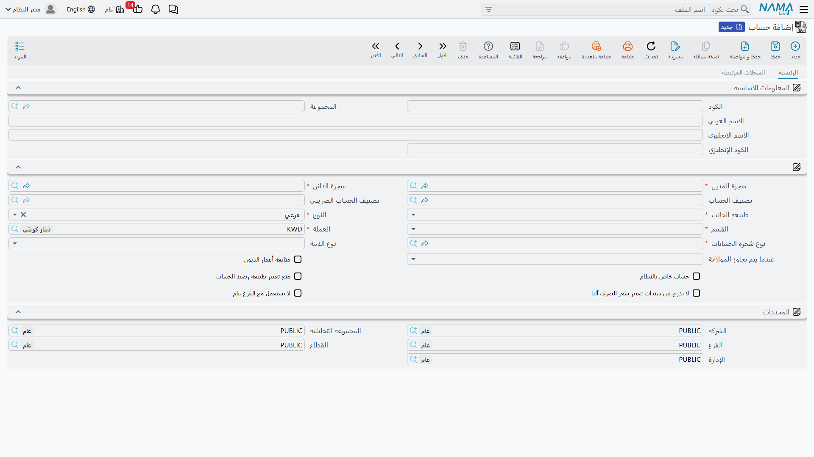

# الحسابات

إذا كانت شجرة الحسابات هي الهيكل، فإن **الحساب** هو الوحدة التي تُسجَّل عليها الأرصدة فعلًا. كل قيد محاسبي — مهما كان مصدره — ينتهي إلى تسجيل مبلغ مدين أو دائن على حساب. ولأن غالبية أخطاء الترحيل وأرصدة «الذمم» المعكوسة تعود إلى إعداد الحساب نفسه، فهذه واحدة من أهم الشاشات التي يجب أن يفهمها الدعم الفني جيدًا.

تجد الحسابات في **الحسابات ← الملفات ← حساب** (`Accounting > Master Files > Account`).

::: info الترخيص المطلوب
الحسابات جزء من ترخيص المحاسبة الأساسي `accounting`.
:::

## نوعا الحساب: فرعي أم ذمة

الحقل الأهم في الشاشة هو **النوع**، وله قيمتان تُحدِّدان سلوك الحساب بالكامل:

- **فرعي** (`Detail`) — حساب عادي يحمل رصيدًا واحدًا مجمَّعًا (كحساب «إيجارات» أو «كهرباء»). تنظر إليه فترى رصيدًا واحدًا.
- **ذمة** (`Subsidiary`) — حساب يتفرّع رصيده حسب **طرف**: عميل، مورّد، موظف، بنك، خزينة... فحساب «العملاء» من نوع ذمة لا يعطيك رقمًا واحدًا فقط، بل رصيدًا لكل عميل على حدة، مع رصيد إجمالي. هذا ما يتيح لك معرفة «كم يدين لنا العميل (أ)» دون أن تفتح حسابًا مستقلًا لكل عميل.

## ربط الحساب بشجرة الحسابات: شجرة المدين وشجرة الدائن

لاحظ أن للحساب رابطين منفصلين بالشجرة: **شجرة المدين** و**شجرة الدائن**. لماذا اثنان؟ لأن بعض الحسابات يجب أن تظهر في مكان مختلف من القوائم بحسب طبيعة رصيدها. الحساب الجاري للبنك مثلًا قد يظهر ضمن الأصول حين يكون مدينًا، وضمن الالتزامات حين يكون دائنًا (سحب على المكشوف). فتحديد فرعين مختلفين للمدين والدائن يجعل العرض في القوائم المالية صحيحًا في كلتا الحالتين. في الحالات المعتادة تُربَط الشجرتان بنفس الفرع.

إلى جوارهما تحدّد:

- **طبيعة الجانب** (`مدين`/`دائن`) — الجانب الطبيعي لرصيد الحساب.
- **القسم** — تصنيف القائمة المالية (ميزانية/قائمة دخل/أخري).
- **نوع شجره الحسابات** — نوع الشجرة الذي ينتمي إليه.
- **العملة** — عملة الحساب. حركة بأي عملة أخرى تُترجَم وفق سعر الصرف.
- **تصنيف الحساب** و**تصنيف الحساب الضريبي** — الزاويتان اللتان تُغذّيان قائمتَي الدخل والتدفقات النقدية والتقارير الضريبية (انظر [شجرة الحسابات](./chart-of-accounts.md)).

## الأنواع الفرعية للذمة (حتى خمسة)

حين يكون الحساب من نوع **ذمة**، تحدّد له **نوع الذمة** — أي نوع الطرف الذي يتفرّع الرصيد حسبه (عميل، مورّد، موظف، بنك، حساب بنكي، خزينة، أصل ثابت، صنف، مشروع... والقائمة طويلة وتشمل وحدات من كل الوحدات المرخّصة). ويمكن أن تجمع حتى **خمسة أنواع ذمة** على الحساب نفسه (نوع الذمة 2 إلى 5)، فيتفرّع رصيده على أكثر من بُعد في آنٍ واحد — مثلًا ذمة عميل × مشروع.

::: tip
خيار **السماح بحركة بدون ذمة** يتيح، عند الحاجة، تسجيل حركة على حساب الذمة دون تحديد الطرف. الأصل في حسابات الذمة أن تُلزِم بتحديد الطرف؛ لا تفعّل هذا الخيار إلا لسبب واضح.
:::

## مجموعة الخصائص الرقابية (الأعلام)

الجزء الذي يجعل هذه الشاشة محورية للدعم هو مجموعة الأعلام (Checkboxes) التي تضبط سلوك الحساب أثناء الترحيل:

- **حساب خاص بالنظام** — يميّز الحساب الذي تُولِّده المستندات تلقائيًا (لا يُستعمل يدويًا عادةً). تفعيله أو منعه على أنواع المستندات يضبطه كتالوج خيارات الوحدة.
- **منع تغيير طبيعه رصيد الحساب** — يمنع الحركة التي تقلب رصيد الحساب إلى الجانب غير الطبيعي (مثلًا جعل رصيد النقدية دائنًا). أداة وقائية ضد الأخطاء.
- **متابعة أعمار الديون** — يُفعِّل تتبّع أعمار المديونية لهذا الحساب، وهو شرط ظهور الحساب في تقارير أعمار الديون.
- **لا يدرج في سندات تغيير سعر الصرف آليا** — يستثني الحساب من إعادة تقييم العملات الأجنبية الدورية.
- **استعمال العملة المحلية للحركة** — يجعل الحساب يحتفظ بالقيمة بالعملة المحلية للحركة.
- قيود المحددات: **يجب استعماله مع القطاع/الفرع/الإدارة/المجموعة التحليلية عام فقط** أو عكسها **لا يستعمل مع ... عام**، تُلزِم أو تمنع استخدام محدِّد عام مع هذا الحساب.
- إلزام البيانات: **عدم السماح بترك المرجع/البيان فارغًا** يُجبر المستخدم على تعبئة حقول المرجع أو البيان عند التسجيل على الحساب.

## ضبط الموازنة على الحساب

إذا كنت تستخدم الموازنات المالية، يحدّد حقلا **عندما يتم تجاوز الموازنة** و**منع الحفظ إن لم توجد موازنة** كيف يتصرّف النظام عند تجاوز المصروف لموازنته:

- **سماح** — يُسجِّل الحركة ويكتفي بتجاوز صامت.
- **منع الحفظ** — يرفض الحركة المتجاوزة للموازنة.
- **طلب موافقة** — يوقف الحركة بانتظار موافقة.

## التقارير

كشوف هذا الحساب وأرصدته (كشف حساب عام/فرعي/تفصيلي، ميزان المراجعة، أعمار الديون) كلها في صفحة [كشوف الحسابات وميزان المراجعة](./reports-account-statements-and-trial-balance.md).

## للدعم الفني

معظم بلاغات «القيد لا يُرحَّل» أو «الرصيد غلط» تُحَل من هذه الشاشة:

- **«رسالة منع عند الترحيل: تغيير طبيعة الرصيد»** — الحساب مفعّل عليه **منع تغيير طبيعه رصيد الحساب** والحركة كانت ستقلب رصيده للجانب غير الطبيعي. راجِع منطق الحركة أو الإعداد.
- **«النظام يطلب تحديد ذمة/عميل ولا يُكمِل الحفظ»** — الحساب من نوع **ذمة** ولم تُحدَّد الذمة؛ إمّا تحدّدها أو (عند الضرورة فقط) تُفعِّل **السماح بحركة بدون ذمة**.
- **«النظام يطلب تعبئة المرجع/البيان إجباريًا»** — أحد أعلام **عدم السماح بترك المرجع/البيان فارغًا** مفعّل على الحساب.
- **«الحساب لا يظهر في تقرير أعمار الديون»** — علم **متابعة أعمار الديون** غير مفعّل.
- **«الحساب لا يُعاد تقييمه مع فروق العملة»** — علم **لا يدرج في سندات تغيير سعر الصرف آليا** مفعّل.
- **«حركة مرفوضة بسبب الموازنة»** — سلوك **عندما يتم تجاوز الموازنة** على الحساب = **منع الحفظ** أو **طلب موافقة**.
- آلية بناء الأرقام المدينة/الدائنة على الحساب أثناء معالجة المستندات موضّحة في [كيف تُعالَج المستندات إلى أثر محاسبي](./support/accounting-request-processing.md)، وقيود المحددات في مرجع **المحددات ومراكز التكلفة والتوزيع**.
