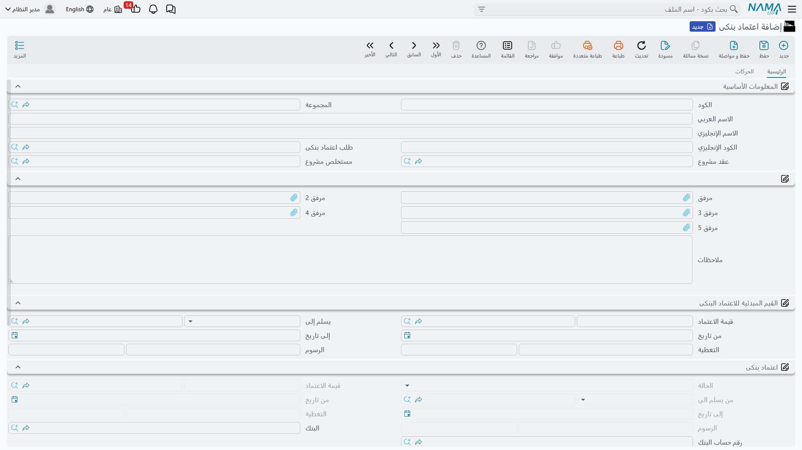
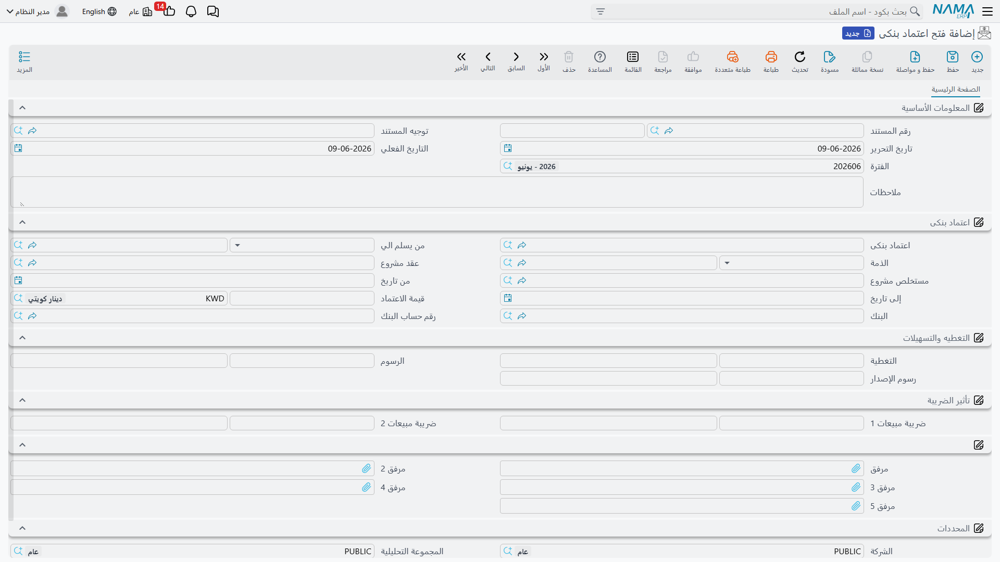

# الاعتمادات المستندية

الاعتماد المستندي (LC) أداة يستخدمها المستورد لطمأنة المورّد: يتعهّد البنك بدفع قيمة الشحنة للمورّد متى قدّم مستندات الشحن المطابقة للشروط. مثل خطاب الضمان، الاعتماد **يحجز جزءًا من حدّ تسهيلاتك** ويُحمّلك **رسومًا**، ويُتتبَّع كملفٍ رئيسي تتعاقب عليه مستندات فتح وتعديل وإنهاء، مع لقطتي **القيم المبدئية** و**القيم الحالية**. وبنيته شبيهة جدًّا ببنية [خطابات الضمان](./letters-of-guarantee.md).

::: info الترخيص المطلوب
الاعتمادات المستندية ضمن ترخيص `accounting-blc`.
:::

## دورة حياة الاعتماد

تبدأ كل الشاشات من جذر **البنوك > اعتماد بنكى**:

1. **طلب اعتماد بنكى** — توثيق طلب الاعتماد قبل فتحه (لا أثر محاسبي).
2. **اعتماد بنكى** — الملف الرئيسي بحالته المبدئية «مبدئي».
3. **فتح اعتماد بنكى** — اللحظة التي يفتح فيها البنك الاعتماد فعلًا (يُرحَّل محاسبيًا، ويحجز التسهيلات، وتتحوّل الحالة إلى «تم إصداره»).
4. **تعديل اعتماد بنكى** — تعديل القيمة أو المدة أو الرسوم (يُحدِّث القيم الحالية).
5. **إنهاء اعتماد بنكى** — إقفال الاعتماد وتحرير ما حُجز من تسهيلات.

## الملف الرئيسي للاعتماد

في شاشة **اعتماد بنكى** (`البنوك > اعتماد بنكى > اعتماد بنكى`) تُعرّف بيانات الاعتماد:

- **المعلومات الأساسية**: **البنك** و**حساب البنك**، وربط الاعتماد بـ **طلب الاعتماد** و**حدّ التسهيلات** و**عقد المشروع** (و**مستخلص عقد المشروع**) عند الحاجة، و**نوع الاعتماد**.
- **القيم المبدئية للاعتماد**: لقطة شروط الفتح — **مبلغ الاعتماد** و**العملة**، **من تاريخ / إلى تاريخ**، **التغطية** (المبلغ المغطّى نقدًا) ونسبتها، **التسهيلات** (الجزء المحجوز) ونسبتها، **رسوم الفتح** و**رسوم التعديل**.
- **القيم الحالية**: القيم السارية بعد أي تعديل، إلى جانب **الحالة**.

### حالات الاعتماد

يمرّ الاعتماد بالحالات نفسها التي يمرّ بها خطاب الضمان: **مبدئي** → **تم إصداره** → (**تم استلامه** / **توصيل كلي**) → **منتهي** / **ألغيت** / **مُسيل**.

## الفتح وحجز التسهيلات

عند تحرير **فتح اعتماد بنكى** (`البنوك > اعتماد بنكى > فتح اعتماد بنكى`) يُرحَّل الأثر المحاسبي ويُحجز جزء التسهيلات. ويغطّي توجيه الفتح جوانب: **قيمة الاعتماد مدين/دائن**، و**مدين/دائن التسهيلات**، و**مدين/دائن الرسوم** (مع **ضريبة الرسوم 1 و2**)، وجانب **التغطية**. (مصدر الحسابات في مرجع [توجيهات المستندات](./support/accounting-document-terms.md).)

::: warning التحقق من حدّ التسهيلات
عند الفتح يتحقّق النظام من ألّا يتجاوز إجمالي المحجوز **حدّ التسهيلات** المرتبط بالاعتماد، فيُمنع الفتح عند التجاوز. تفاصيل في [التسهيلات الائتمانية](./credit-facilities.md).
:::

## التعديل والإنهاء

يُستخدم **التعديل** لرفع قيمة الاعتماد أو خفضها أو تمديد مدته — فيُحدِّث القيم الحالية مع الإبقاء على القيم المبدئية للمقارنة، ويُسجّل **رسوم التعديل**. ويُقفل **الإنهاء** الاعتماد ويحرّر ما حُجز من تسهيلات.

## التقارير

| التقرير | يجيب عن |
|---|---|
| أسعار المواد الخام حسب الفواتير المبدئية للاعتماد (SYSR-LCD001) | ربط تكلفة المواد المستوردة بالفواتير المبدئية للاعتماد. |
| تحليل الاعتمادات مرتفعة التكلفة (SYSR-LCD002) | الاعتمادات الأعلى تكلفةً للمقارنة والتحليل. |

## بنكي أم استيرادي؟ — الفرق عن اعتماد سلسلة الإمداد

في نما يوجد اعتمادان مستنديان يحملان الاسم نفسه لكن لكلٍّ غرضه:

- **الاعتماد البنكي (هذه الصفحة)** أداة *خزينة ومصرفية*: يهتم بالتزامك تجاه البنك — كم يحجز من **حدّ تسهيلاتك**، و**رسوم** الفتح والتعديل، و**القيود المحاسبية**. لا يتتبّع شحنات ولا فواتير مبدئية ولا بضاعة، ولا يمسّ المخزون.
- **اعتماد سلسلة الإمداد** (`الإعتمادات > الملفات > الإعتماد المستندي`) عملية *استيراد ومشتريات*: يدير المورّد و**الشحنات** (الحاويات، وبوالص الشحن، والتخليص) و**الفواتير المبدئية**، ويجمّع مصاريف التأمين والشحن والجمارك على البضاعة للوصول إلى **التكلفة الواصلة**، ثم استلامها في المخزون.

باختصار: الاعتماد البنكي يجيب عن «ماذا يفعل هذا الاعتماد بتسهيلاتي ودفاتري؟»، واعتماد سلسلة الإمداد يجيب عن «كيف أدير هذه الشحنة الاستيرادية وتكاليفها حتى دخولها المخزن؟». وهما ميزتان مستقلتان (كيانان وترخيصان مختلفان)، لا وجهان لمستندٍ واحد.

::: info الاستيراد وإدارة الشحنات
لإدارة دورة الاستيراد الكاملة — الشحنات والفواتير المبدئية والتكاليف الإضافية والتكلفة الواصلة — راجِع [الاعتمادات المستندية في سلسلة الإمداد](../supplychain/letters-of-credit.md).
:::

## للدعم الفني

- **«تعذّر فتح الاعتماد — تجاوز الحدّ»** — المبلغ المحجوز يتجاوز حدّ التسهيلات المرتبط؛ راجِع [التسهيلات الائتمانية](./credit-facilities.md).
- **«ما الفرق بين القيم المبدئية والحالية؟»** — المبدئية لقطة شروط الفتح، والحالية تعكس آخر تعديل.
- **«من أين تأتي حسابات القيمة والتسهيلات والرسوم؟»** — من توجيه **فتح الاعتماد**؛ راجِع [توجيهات المستندات](./support/accounting-document-terms.md).
- آلية المعالجة المحاسبية في [كيف تُعالَج المستندات إلى أثر محاسبي](./support/accounting-request-processing.md).
