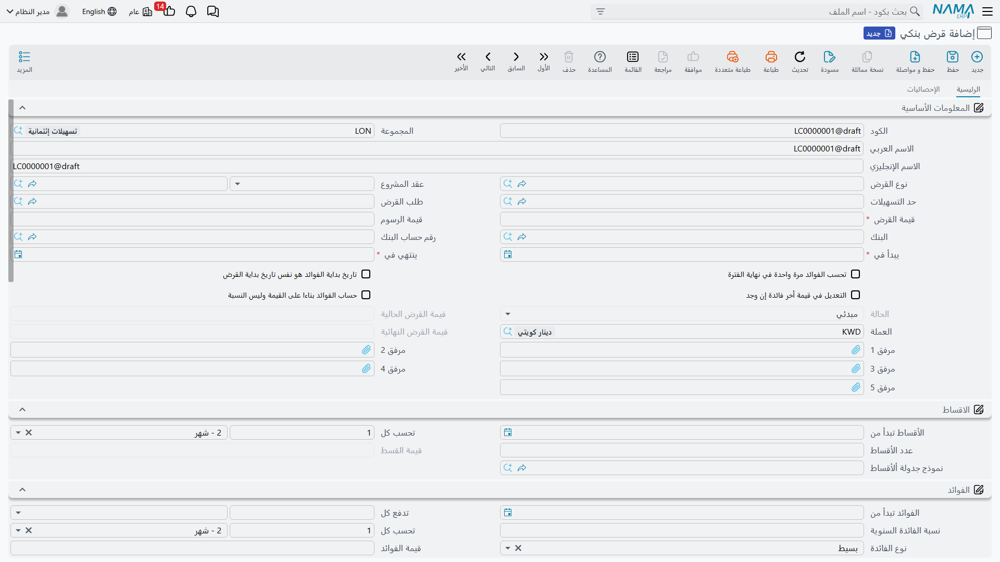
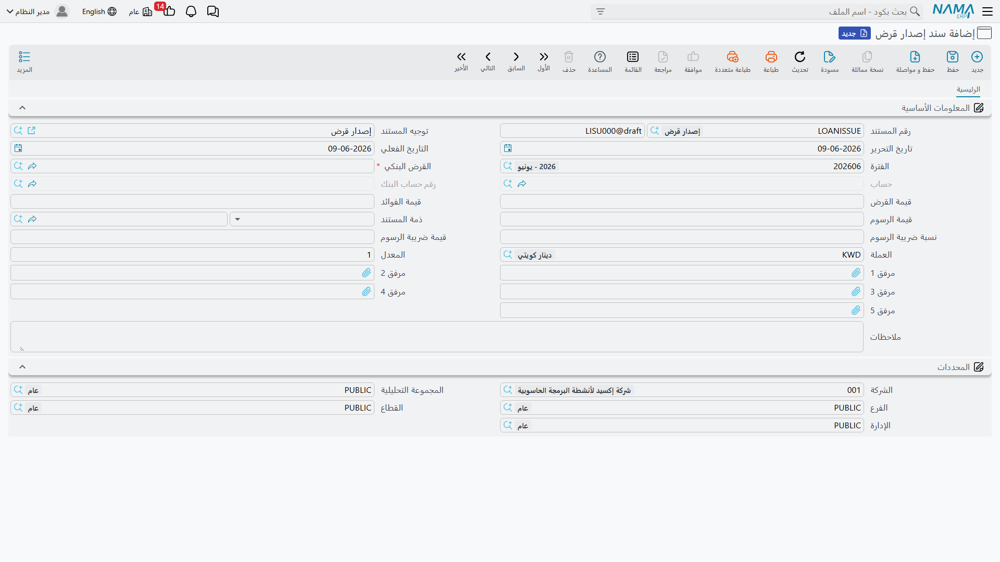
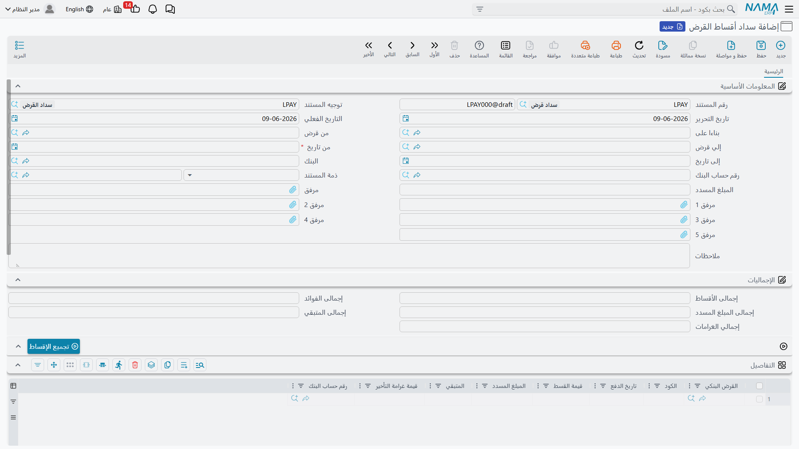

# القروض البنكية

القرض البنكي ليس مجرد مبلغ يدخل حسابك ثم تردّه؛ هو التزام يمتدّ شهورًا أو سنوات، بأصلٍ وفائدةٍ ورسومٍ وجدول أقساط، وقد يخصم من **حدّ تسهيلات** متّفق عليه مع البنك. لذلك لا تُسجّل القروض في نما كقيدٍ يدوي واحد، بل كـ **منظومة مترابطة**: مستند رئيسي يحمل شروط القرض، ثم مستندات حركة تُصدِره وتُسدِّد أقساطه وتحتسب فوائده على مدى عمره.

::: info الترخيص المطلوب
القروض البنكية ضمن ترخيص `accounting-loans` — وهو الترخيص نفسه الذي يغطّي [الودائع الثابتة](./fixed-deposits.md) و[التسهيلات الائتمانية](./credit-facilities.md).
:::

## القصّة من بدايتها

تبدأ كل الشاشات من جذر **البنوك > قروض بنكية** في شجرة القوائم. وتسير دورة حياة القرض هكذا:

1. **طلب إضافة قرض** — تمهيد اختياري لتوثيق طلب القرض قبل اعتماده.
2. **قرض بنكي** — الملف الرئيسي الذي يحمل شروط القرض كاملةً (حالته المبدئية «مبدئي»).
3. **سند إصدار قرض** — اللحظة التي يدخل فيها مبلغ القرض فعلًا (يُرحَّل محاسبيًا، وتتحوّل حالة القرض إلى «تم إصداره»).
4. **جدولة قرض بنكي** — لإعادة توزيع الأقساط عند الحاجة.
5. **سند احتساب فوائد القرض** — لاحتساب فوائد الفترة وتثبيتها.
6. **سداد أقساط القرض** — تسديد قسط (أو أكثر) بأصله وفائدته وغرامة التأخير إن وُجدت (يُرحَّل محاسبيًا).
7. **تعديل قرض** — لتعديل بيانات القرض بعد إصداره.

## نوع القرض

قبل تسجيل القروض يُنشأ **نوع القرض** (`البنوك > قروض بنكية > نوع القرض`) كملف تصنيفي يجمع القروض المتشابهة ويوحّد توجيهاتها المحاسبية. وهو أمر تنظيمي يسهّل التقارير والترحيل لاحقًا.

## الملف الرئيسي للقرض

في شاشة **قرض بنكي** (`البنوك > قروض بنكية > قرض بنكي`) تُعرّف شروط القرض في ثلاث مناطق رئيسية:

- **المعلومات الأساسية**: **قيمة القرض**، **البنك** و**رقم حساب البنك** الذي يُودَع فيه، **قيمة الرسوم**، و**نوع القرض**. ويمكن ربط القرض بـ **طلب القرض** الذي سبقه وبـ **حدّ التسهيلات** الذي يُخصم منه، وبـ **عقد المشروع** عند تمويل مشروع بعينه.
- **الأقساط**: **عدد الأقساط** و**قيمة القسط** و**الأقساط تبدأ من** (تاريخ أول قسط) و**تُحسب كل** (فترة التكرار، مثلًا كل شهر)، أو الاعتماد على **نموذج جدولة الأقساط** الجاهز.
- **الفوائد**: **نسبة الفائدة السنوية** و**نوع الفائدة** و**الفوائد تبدأ من** و**تُدفع كل**. ومن الخيارات المهمّة هنا: **تُحسب الفوائد مرة واحدة في نهاية الفترة**، و**تاريخ بداية الفوائد هو نفس تاريخ بداية القرض**، و**حساب الفوائد بناءً على القيمة وليس النسبة**، و**التعديل في قيمة آخر فائدة إن وُجد**.

**أنواع الفائدة** المتاحة:

| النوع | المعنى |
|---|---|
| بسيط (Simple) | فائدة ثابتة محسوبة على أصل القرض كاملًا طوال المدة. |
| متناقص (Decreasing) | فائدة على الرصيد المتبقّي، فتتناقص مع كل قسطٍ يُسدَّد من الأصل. |
| يدوي (Manual) | تُدخَل قيم الفوائد يدويًا في جدول الفوائد بدل احتسابها آليًا. |

كما يضبط الحقلان **عدد أيام التأخير المسموح بها** و**نسبة غرامة التأخير** كيفية احتساب غرامة القسط المتأخّر عند السداد.

### حالات القرض

يمرّ القرض بالحالات التالية، وتتحرّك تلقائيًا مع مستندات الحركة:

| الحالة | متى |
|---|---|
| مبدئي (Initial) | عند حفظ القرض قبل إصداره. |
| تم إصداره (Released) | بعد ترحيل سند إصدار القرض. |
| قيد التنفيذ (In Progress) | أثناء سداد الأقساط. |
| منتهي (Finished) | بعد سداد كامل الأقساط والفوائد. |
| ملغي (Cancelled) | عند الإلغاء. |

## إصدار القرض

ما دام القرض في حالته المبدئية فهو مجرد اتفاق على ورق. عند تحرير **سند إصدار قرض** (`البنوك > قروض بنكية > سند إصدار قرض`) يدخل المبلغ فعلًا: يُرحَّل السند محاسبيًا فيُسجَّل القرض على البنك ويُودَع في الحساب، وتتحوّل حالة القرض إلى «تم إصداره». ويغطّي توجيه الإصدار جوانب: **مدين/دائن قيمة القرض**، و**مدين/دائن قيمة الرسوم** (مع **ضريبة الرسوم**)، و**مدين/دائن قيمة الفائدة** — أي من أين تأتي حسابات كلٍّ من أصل القرض ورسومه وفوائده. (تفصيل مصدر هذه الحسابات في مرجع [توجيهات المستندات](./support/accounting-document-terms.md).)

## احتساب الفوائد والسداد

مع مرور فترات القرض يُحرَّر **سند احتساب فوائد القرض** لتثبيت فائدة الفترة المستحقّة وفق نوع الفائدة المختار.

ثم يأتي **سداد أقساط القرض** (`البنوك > قروض بنكية > سداد أقساط القرض`) ليسدّد قسطًا أو أكثر. يعرض السند مجاميع القرض (إجمالي الأقساط والفوائد والمسدَّد والمتبقّي)، ويفصل في الأسطر بين **أصل القسط** و**الفائدة المسدَّدة** و**غرامة التأخير** (تُحتسب آليًا من أيام التأخير ونسبة الغرامة). ويُرحَّل السند محاسبيًا عبر جوانب: **مدين/دائن الغرامة**، و**مدين/دائن المبلغ المسدَّد للفائدة**، إضافة إلى جانب الأصل المحصَّل.

::: tip سند إصدار الأرباح مشترك مع الودائع
**سند إصدار أرباح** (`البنوك > ودائع بنكية > سند إصدار أرباح`) يُستخدم لإثبات دفعات الفوائد/الأرباح، وهو المستند نفسه المستخدَم في [الودائع الثابتة](./fixed-deposits.md).
:::

## الجدولة والتعديل

إذا تغيّرت ظروف السداد، يُعيد **سند جدولة قرض بنكي** توزيع الأقساط المتبقّية على فتراتٍ جديدة. أما **تعديل قرض** فيُستخدم لتعديل بيانات القرض نفسه بعد إصداره ضمن ضوابط النظام.

## التقارير

| التقرير | يجيب عن |
|---|---|
| تفاصيل أقساط القرض (SYSR-LON001) | جدول أقساط القرض: المستحق والمسدَّد والمتبقّي لكل قسط وفائدته. |
| تفاصيل التسهيلات البنكية (SYSR-LON002) | استهلاك حدود التسهيلات عبر القروض والخطابات والاعتمادات (انظر [التسهيلات الائتمانية](./credit-facilities.md)). |

## للدعم الفني

- **«القرض ما زال مبدئيًا ولم يدخل المبلغ»** — لم يُحرَّر سند إصدار القرض بعد؛ الإصدار هو ما يُرحِّل المبلغ ويحرّك الحالة إلى «تم إصداره».
- **«من أين تأتي حسابات القرض والرسوم والفوائد؟»** — من توجيه **سند إصدار القرض** و**سداد الأقساط**؛ راجِع [توجيهات المستندات](./support/accounting-document-terms.md).
- **«غرامة التأخير لا تُحتسب»** — تأكّد من ضبط **عدد أيام التأخير المسموح بها** و**نسبة غرامة التأخير** على القرض.
- **«القرض لا يخصم من حدّ التسهيلات»** — تأكّد من ربط القرض بـ **حدّ التسهيلات** الصحيح؛ التفاصيل في [التسهيلات الائتمانية](./credit-facilities.md).
- آلية المعالجة المحاسبية في [كيف تُعالَج المستندات إلى أثر محاسبي](./support/accounting-request-processing.md).
