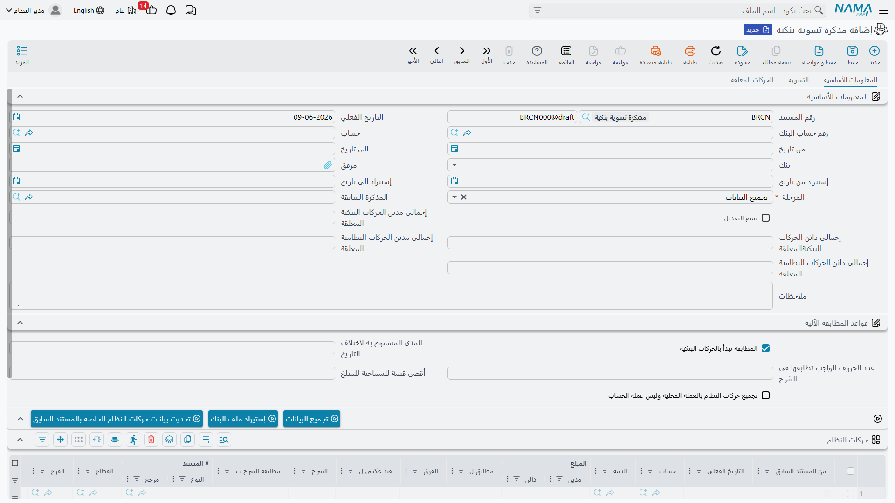

# المطابقة البنكية

رصيد البنك في دفترك نادرًا ما يطابق كشف البنك لحظةً بلحظة: شيك أودعته لم يُحصَّل بعد، رسوم خصمها البنك ولم تُسجِّلها، تحويل في الطريق. **المطابقة البنكية** (`Banks > Cheques > Bank Reconciliation`) هي العملية المنهجية التي تضع كشف البنك بجانب حركاتك وتُطابق المتطابق وتُبرِز الفروق كي تُعالَج.

::: info الترخيص المطلوب
المطابقة البنكية ضمن ترخيص البنوك `accounting-banks`.
:::

::: warning المطابقة لا تُرحِّل بنفسها
مذكرة التسوية البنكية **لا تُحدِث أثرًا محاسبيًا**؛ هي عملية مقارنة وكشف للفروق فقط. الفروق التي تكتشفها (رسوم، فوائد...) تُثبَّت بعد ذلك عبر [تسوية بنكية](./banks-and-bank-accounts.md) أو المستند المناسب. لا تخلط بين «المطابقة» (مقارنة) و«التسوية» (قيد).
:::

## مسار الثلاث خطوات

تسير المذكرة عبر **خطوة المطابقة** في ثلاث مراحل:

1. **تجميع البيانات** — تحدّد **الحساب البنكي** ونطاق التواريخ، فيجمع النظام حركاتك (أسطر النظام) ويُستورَد كشف البنك (أسطر البنك/الذمة).
2. **التسوية** — تُطابِق أسطر كشف البنك مع أسطر حركاتك (يدويًا أو بقواعد مطابقة على المرجع/البيان)، ضمن **سماحية القيمة** و**سماحية فرق التاريخ** المسموح بهما. يعرض النظام **إجمالي النظام** و**إجمالي الذمة** و**الأسطر غير المتطابقة** على الجانبين و**إجمالي الفرق**.
3. **منتهي** — تُقفَل المذكرة بعد اكتمال المطابقة.

كل مذكرة ترتبط بـ **المذكرة السابقة** فتُكمِّل من حيث انتهت وتقفل ماضيها، فلا تُعاد مطابقة فترة مغلقة.

## الفرق عن التسوية مع الذمة

نفس فكرة المطابقة تنطبق على العملاء والموردين عبر **تسوية مع ذمة** (`Accounting > Reconciliations > Subsidiary Reconciliation`): تطابق رصيد الطرف في دفترك مع كشفه الخارجي بنفس مسار الخطوات الثلاث، وتُسلسل المذكرات تاريخيًا. الفرق فقط في طبيعة الطرف: حساب بنكي هنا، عميل/مورّد هناك.

## التقارير

نتائج المطابقة وكشوف البنك ذات الصلة في تقارير البنوك (`SYSR-BNK*`) المذكورة في [الشيكات والأوراق المالية](./cheques-financial-papers.md).

## للدعم الفني

- **«المطابقة لم تُحرِّك رصيد البنك»** — هذا صحيح؛ المطابقة لا تُرحِّل. أثبِت الفروق بتسوية بنكية.
- **«أسطر كثيرة لا تتطابق رغم تطابقها فعليًا»** — راجِع **سماحية القيمة** و**سماحية فرق التاريخ** وقواعد المطابقة على المرجع/البيان.
- **«لا أستطيع تعديل مذكرة قديمة»** — لأنها مرتبطة بمذكرة لاحقة تقفلها؛ هذا متوقّع للحفاظ على تسلسل المطابقة.
