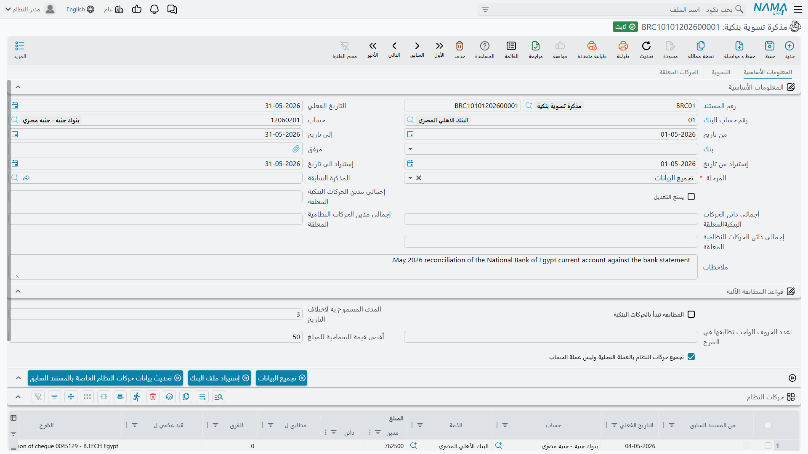

# المطابقة البنكية

رصيد البنك في دفترك نادرًا ما يطابق كشف البنك لحظةً بلحظة: شيك أودعته لم يُحصَّل بعد، رسوم خصمها البنك ولم تُسجِّلها، تحويل في الطريق. **المطابقة البنكية** (`Banks > Cheques > Bank Reconciliation`) هي العملية المنهجية التي تضع كشف البنك بجانب حركاتك وتُطابق المتطابق وتُبرِز الفروق كي تُعالَج.

::: info الترخيص المطلوب
المطابقة البنكية ضمن ترخيص البنوك `accounting-banks`.
:::

::: warning المطابقة لا تُرحِّل بنفسها
مذكرة التسوية البنكية **لا تُحدِث أثرًا محاسبيًا**؛ هي عملية مقارنة وكشف للفروق فقط. الفروق التي تكتشفها (رسوم، فوائد...) تُثبَّت بعد ذلك عبر [تسوية بنكية](./banks-and-bank-accounts.md) أو المستند المناسب. لا تخلط بين «المطابقة» (مقارنة) و«التسوية» (قيد).
:::

## مسار الثلاث خطوات

تسير المذكرة عبر **خطوة المطابقة** في ثلاث مراحل:

1. **تجميع البيانات** — تحدّد **الحساب البنكي** ونطاق التواريخ، فيجمع النظام حركاتك (أسطر النظام) ويُستورَد كشف البنك (أسطر البنك/الذمة).
2. **التسوية** — تُطابِق أسطر كشف البنك مع أسطر حركاتك (يدويًا أو بقواعد مطابقة على المرجع/البيان)، ضمن **سماحية القيمة** و**سماحية فرق التاريخ** المسموح بهما. يعرض النظام **إجمالي النظام** و**إجمالي الذمة** و**الأسطر غير المتطابقة** على الجانبين و**إجمالي الفرق**.
3. **منتهي** — تُقفَل المذكرة بعد اكتمال المطابقة.

كل مذكرة ترتبط بـ **المذكرة السابقة** فتُكمِّل من حيث انتهت وتقفل ماضيها، فلا تُعاد مطابقة فترة مغلقة.

## تحويل سطر غير مطابق إلى قيد

معظم الأسطر غير المطابقة حركات للبنك نفسه — مصروف أو فائدة دائنة أو رسم تحويل — لم يُثبتها أحد في دفترك بعد. ولست مضطرًا لمغادرة الشاشة كي تثبتها.

وأنت على خطوة **المطابقة**، اختر السطر في جدول الأسطر غير المطابقة واضغط **إنشاء سند قيد**. يُفتح سند قيد جديد في نافذة منبثقة يحمل ذلك السطر بالفعل: تاريخه الفعلي، والسنة والفترة المالية المحسوبتان منه، وسطر قيد واحد يحمل حساب السطر، والحساب البنكي ذمةً له، ومبلغه المدين أو الدائن.

تكمل الطرف الآخر من القيد ثم تحفظه. وهذا هو ما يثبت الفرق فعلًا — فالمطابقة نفسها لا تُرحِّل شيئًا، والسند الذي أنشأته للتو سند قيد عادي له حياته الخاصة. أعد تجميع البيانات بعد ذلك فتجد الحركة المثبتة حديثًا حاضرة للمطابقة.

::: tip الزر يعمل في أثناء المطابقة فقط
يحتاج أن تكون المذكرة على خطوة **المطابقة** وأن يكون هناك سطر مختار. أما على خطوة تجميع البيانات أو الانتهاء فسيخبرك بذلك ولن يفتح شيئًا.
:::

## الأزرار التي تحرّك الخطوات الثلاث

كل خطوة من خطوات المسار زرٌّ، والسبب في أن التسوية «لا تفعل شيئًا» هو غالبًا أن المستند في خطوة غير الخطوة التي يعمل فيها الزر المضغوط.

**في خطوة تجميع البيانات:**

- **تجميع البيانات** (Collect Data) — الزر الذي يقف خلف الخطوة الأولى. بعد ضبط **الحساب البنكي** و**الحساب** الدفتري وتاريخَي المدى، يجلب جانبك أنت إلى جدول **حركات النظام**، مكمِّلًا من حيث انتهت التسوية السابقة.
- **إستيراد ملف البنك** (Import Bank Lines) — يحمّل كشف البنك نفسه من ملف. أرفق الملف واملأ **اسم البنك** أولًا؛ فبدونهما يرفض الزر وينبّهك إلى الناقص. و**إستيراد سطور الذمة** (Import Subsidiary Lines) يفعل الشيء نفسه للجدول الآخر.
- **تحديث بيانات حركات النظام الخاصة بالمستند السابق** (Update System lines of previous document) — يحدّث حركات النظام المرحّلة من التسوية السابقة، فتظهر بأرقامها الحالية الحركاتُ التي تغيّرت بعد إقفالها. ولا يعمل إلا في هذه الخطوة.

**في خطوة التسوية:**

- **مطابقة آلية** (Automatic Match) — يشغّل محرّك المطابقة على الجدولين من تلقاء نفسه، محترمًا **سماحية القيمة** و**سماحية فرق التاريخ** و**تسلسل مطابقة الشرح**، ومطابقًا من الجهة التي يشير إليها خيار **المطابقة من سطور الذمة**. وهو ما يصفّي معظم السطور.
- **مطابقة يدوية** (Manual Match) — المحرّك نفسه، لكنه يطابق ما هيّأته أنت فقط بدل البحث الحر. استعمله للسطور التي تركتها المطابقة الآلية.
- **مطابقة** (Macth) — يطبّق الاقترانات التي كتبتها في جداول غير المطابق: املأ في السطر عمود **مطابق مع** (أو **عكس لـ**)، ثم اضغطه، فتُطابق تلك السطور وتخرج من قوائم غير المطابق. وعنوان الزر يظهر على الشاشة بهذه الصيغة تمامًا.
- **إنشاء سند قيد** (Create Journal Entry) — يسجّل سطرًا غير مطابق كقيد، وقد شُرح بالتفصيل في فقرة «تحويل سطر غير مطابق إلى قيد» أعلاه.

**في أي وقت:**

- **حساب الإجماليات** (Calculate Totals) — يعيد احتساب إجمالي النظام وإجمالي الذمة وإجماليَّي غير المطابق على الجانبين وإجمالي الفرق من الجداول بوضعها الحالي. اضغطه بعد كل جولة مطابقة لترى أين وصلت.

وتحتاج **المطابقة الآلية** و**اليدوية** و**مطابقة** جميعًا خطوة **التسوية**؛ ففي خطوتَي تجميع البيانات أو الانتهاء تنبّهك ولا تفعل شيئًا.

## الفرق عن التسوية مع الذمة

نفس فكرة المطابقة تنطبق على العملاء والموردين عبر **تسوية مع ذمة** (`Accounting > Reconciliations > Subsidiary Reconciliation`): تطابق رصيد الطرف في دفترك مع كشفه الخارجي بنفس مسار الخطوات الثلاث، وتُسلسل المذكرات تاريخيًا. الفرق فقط في طبيعة الطرف: حساب بنكي هنا، عميل/مورّد هناك.

## التقارير

نتائج المطابقة وكشوف البنك ذات الصلة في تقارير البنوك (`SYSR-BNK*`) المذكورة في [الشيكات والأوراق المالية](./cheques-financial-papers.md).

## للدعم الفني

- **«المطابقة لم تُحرِّك رصيد البنك»** — هذا صحيح؛ المطابقة لا تُرحِّل. أثبِت الفروق بنفسك: **إنشاء سند قيد** من السطر غير المطابق أسرع طريق، أو استخدم تسوية بنكية.
- **«أسطر كثيرة لا تتطابق رغم تطابقها فعليًا»** — راجِع **سماحية القيمة** و**سماحية فرق التاريخ** وقواعد المطابقة على المرجع/البيان.
- **«لا أستطيع تعديل مذكرة قديمة»** — لأنها مرتبطة بمذكرة لاحقة تقفلها؛ هذا متوقّع للحفاظ على تسلسل المطابقة.
