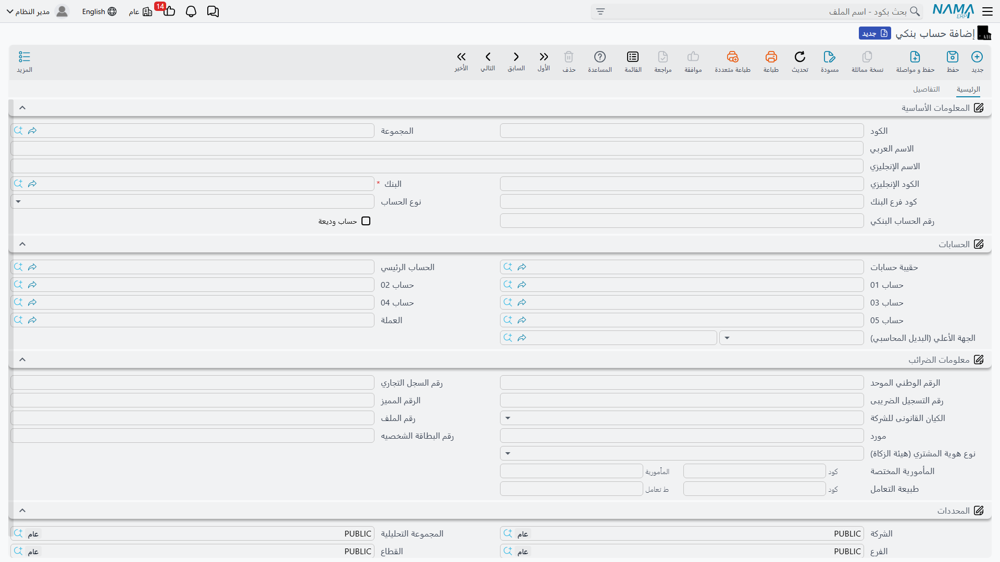

# البنوك والحسابات البنكية والتحويلات

تبدأ إدارة الجانب البنكي بتعريف **البنوك** التي تتعامل معها، ثم **الحسابات البنكية** المفتوحة لديها. وبعد التعريف تأتي الحركة اليومية: **التحويلات البنكية** بين الحسابات، و**التسويات البنكية** لمعالجة الفروق التي يُحدثها البنك من طرفه (رسوم، عوائد، اقتطاعات).

::: info الترخيص المطلوب
هذه الخصائص ضمن ترخيص البنوك `accounting-banks`.
:::

## البنك

ملف **البنك** (`Banks > Master Files > Bank`) يعرّف المؤسسة المصرفية، ويدعم **التدرّج الهرمي** (بنك أب وفروع) عبر حقل المجموعة الأعلى. يحمل بيانات الاتصال، ويمكن ربطه بـ **حسابات الذمم** الخاصة به، وخيار **التجميع اليومي** لمن يحتاج تجميع حركاته يوميًا.

## الحساب البنكي

**الحساب البنكي** (`Banks > Master Files > Bank Account`) هو الحساب الفعلي المفتوح لدى البنك. أهم ما فيه — والذي يجعل القيود تُصيب الحساب الصحيح في دفتر الأستاذ — هو **ربط الحسابات** (block «الحسابات»):

- **البنك** الذي يتبع له (إلزامي)، و**نوع الحساب**، و**كود فرع البنك**، و**رقم الحساب البنكي** و**الـ IBAN**.
- في كتلة **الحسابات**: **الحساب الرئيسي** و**حساب 01** حتى **حساب 05** و**العملة** و**حقيبة الحسابات** — هذا التعيين هو ما يُترجم حركات هذا الحساب البنكي إلى الجانب المدين/الدائن الصحيح في الحسابات.
- خيار **حساب وديعة** يميّز الحسابات المرتبطة بالودائع.
- كتلة **معلومات الضرائب** تحمل بيانات التسجيل الضريبي وهوية هيئة الزكاة عند الحاجة.

## التحويل البنكي

**التحويل البنكي** (`Banks > Master Files > Bank Transfer`) ينقل قيمة من حساب بنكي/ذمة إلى آخر، ويُرحَّل إلى الحسابات كمستند يشبه سند الصرف/القبض (يأخذ حساباته من توجيهه). يحمل أسطر تفصيلية، ومطابقة على **فواتير**، وأسطر **طرق دفع**، و**توزيع تكلفة**. استخدمه للتحويل بين حسابيك البنكيين، أو من البنك إلى طرف، مع توثيق الرسوم.

## التسوية البنكية

أحيانًا يُحدِث البنك حركةً من طرفه لا تقابلها مستند لديك: رسوم خدمة، فائدة دائنة، اقتطاع. **التسوية البنكية** (`Banks > Master Files > Bank Adjustment`) هي الأداة المباشرة لإثبات هذه الفروق: تختار **الحساب البنكي** و**المبلغ** و**النوع** (**مدين** أو **دائن**)، فيُسجَّل القيد مباشرةً. وعلى عكس بقية المستندات، **لا تحتاج التسوية البنكية إلى توجيه** — فهي قيد مباشر للجانب البنكي.

::: tip
لا تخلط بين **التسوية البنكية** و**المطابقة البنكية**: الأولى تُسجِّل حركة فرق فعلية في حساباتك، والثانية ([صفحة المطابقة البنكية](./bank-reconciliation.md)) عملية مقارنة لا تُرحِّل بذاتها، بل تكشف الفروق التي تُعالَج عبر تسوية بنكية.
:::

## التقارير والنماذج

- تقارير البنوك (`SYSR-BNK*`: كشف الأوراق التجارية، الشيكات تحت التحصيل، الشيكات حسب الحالة، دفاتر الأوراق المالية) موضّحة مع [الشيكات والأوراق المالية](./cheques-financial-papers.md).
- النماذج المطبوعة: التحويل البنكي `SYSF-BNK001`، التسوية البنكية `SYSF-BNK002`.

## للدعم الفني

- **«حركة الحساب البنكي تُصيب حسابًا خطأ في الأستاذ»** — راجِع كتلة **الحسابات** في الحساب البنكي (الحساب الرئيسي/01–05)؛ منها يأتي التوجيه المحاسبي.
- **«كيف أُثبت رسوم البنك/الفائدة؟»** — عبر **تسوية بنكية** بالنوع المناسب (مدين للرسوم، دائن للفائدة).
- **«التسوية البنكية تطلب توجيهًا»** — لا تحتاج إلى توجيه؛ إن ظهرت مشكلة فهي في إعداد الحساب لا التوجيه.
- آلية المعالجة وإعادة معالجة مستند متعثّر في [كيف تُعالَج المستندات إلى أثر محاسبي](./support/accounting-request-processing.md).
