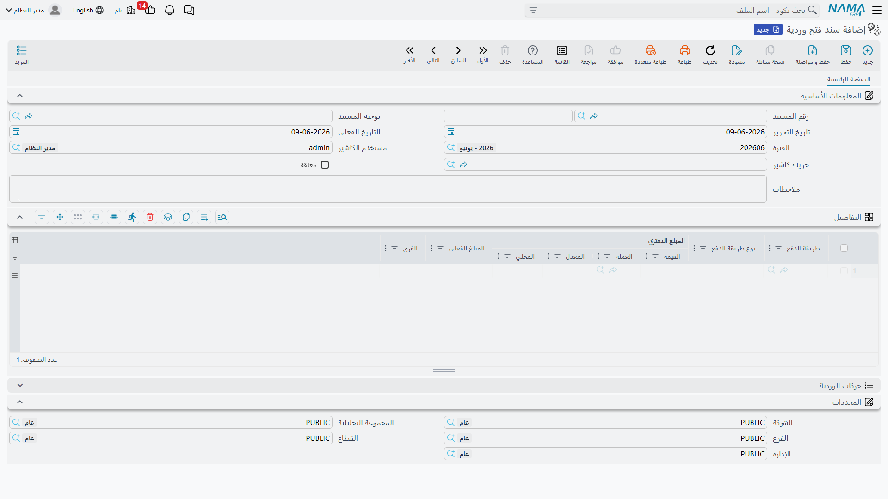
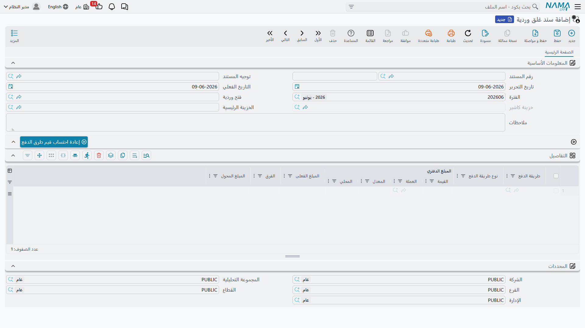

# ورديات الكاشير (درج النقدية)

سندات القبض والصرف العامة ([انظر صفحتها](./receipts-and-payments.md)) مرنة لكنها مفصّلة أكثر مما يحتاجه موظف كاشير يستقبل عشرات الدفعات السريعة في اليوم. لذلك توفّر نما **منظومة كاشير** مبسّطة مبنية على فكرة **الوردية**: يفتح الكاشير ورديته في بداية المناوبة، يسجّل خلالها سندات قبض وصرف بسيطة بمبلغ واحد، ثم يغلق ورديته فيُطابَق النقد ويُرحَّل الفرق.

::: info الترخيص المطلوب
الكاشير ضمن ترخيص `accounting-cashier`. أما **سند القبض الإلكتروني** للتحصيل الميداني فضمن ترخيص `accounting-electronic-receipt`.
:::

## دورة حياة الوردية

### 1) سند فتح وردية

في **سند فتح وردية** (`Accounting > Cashiers > Open Shift`) يبدأ الكاشير مناوبته: يُحدَّد **مستخدم الكاشير** و**خزينة الكاشير** التي سيعمل عليها، وتُحمَّل في الأسطر **الأرصدة الافتتاحية** المرحّلة من إغلاق الوردية السابقة (نقد متبقٍّ، طرق دفع...).

::: warning وردية واحدة مفتوحة لكل مستخدم
لا يمكن للكاشير فتح وردية جديدة وله وردية مفتوحة بالفعل؛ يجب إغلاق الحالية أولًا.
:::

### 2) سندات القبض والصرف خلال الوردية

أثناء الوردية يسجّل الكاشير **سند قبض كاشير** و**سند صرف كاشير** (`Accounting > Cashiers > Cashier Receipt Voucher`). هذه سندات **مبسّطة**: مبلغ واحد وطرف، بلا جداول تفاصيل كالسند العام، وتُربَط تلقائيًا بالوردية المفتوحة وبخزينة الكاشير — فالكاشير لا ينشغل باختيار الحسابات، بل يسجّل المبلغ فحسب.

### 3) سند غلق وردية

في نهاية المناوبة يُحرَّر **سند غلق وردية** (`Accounting > Cashiers > Close Shift`): يُطابِق فيه النظام **رصيد النظام** (مجموع حركات الوردية) مع **المبلغ المعدود** فعليًا في الدرج، ويُرحِّل النتيجة عبر خزينة رئيسية (**الخزينة الرئيسية**). الأثر المحاسبي للإغلاق يغطّي حالتين: **فرق** الوردية (زيادة/عجز) عبر جانبَي **الفرق مدين/دائن**، و**المبلغ المحوَّل** إلى الخزينة الرئيسية عبر جانبَي **المحول مدين/دائن**.

## سند القبض الإلكتروني

للتحصيل خارج المكتب (مندوب ميداني بهاتف)، يوفّر **سند القبض الإلكتروني** (`Accounting > Mobile Apps - Accounting > Electronic Receipt Voucher`) نسخة موجّهة للجوال: يحمل **معرّف الجهاز** و**الموظف** المحصِّل و**الطرف** و**المبلغ**، ويميّز **نقدًا** أو **شيكًا** (برقم الشيك واسم البنك)، ويلتقط **توقيع العميل** و**توقيع الموظف**، ويطابق على **فواتير** الطرف. هو وسيلة تحصيل ميداني تُكمِّل منظومة الكاشير.

## للدعم الفني

- **«لا أستطيع فتح وردية»** — للكاشير وردية مفتوحة بالفعل؛ أغلقها أولًا بسند غلق وردية.
- **«سند قبض الكاشير لا يقبل تحديد حساب»** — هذا مقصود؛ السند المبسّط يأخذ حساباته من الوردية والتوجيه، لا يدويًا.
- **«فرق عند الإغلاق»** — الفرق بين المعدود والنظام يُرحَّل عبر جانبَي **الفرق مدين/دائن** في توجيه سند غلق الوردية.
- **«من أين تأتي حسابات الفرق/التحويل؟»** — من توجيه **سند غلق وردية** (راجِع مرجع [توجيهات المستندات](./support/accounting-document-terms.md)).
- آلية المعالجة في [كيف تُعالَج المستندات إلى أثر محاسبي](./support/accounting-request-processing.md).
