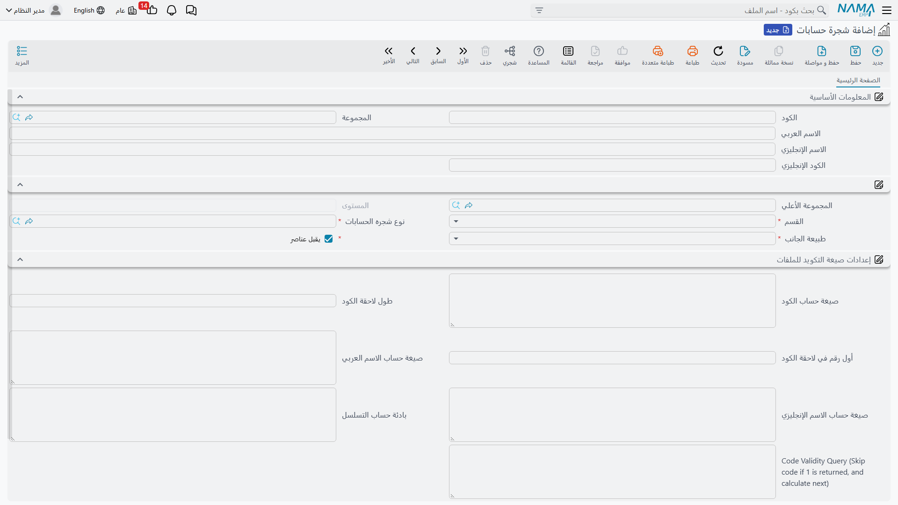
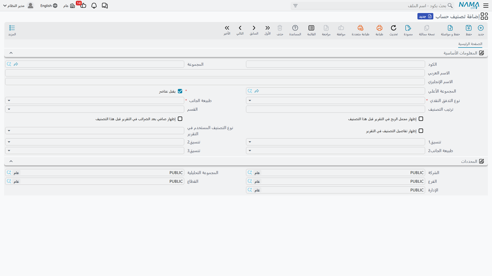

# شجرة الحسابات

شجرة الحسابات هي العمود الفقري لنظامك المحاسبي: هيكل هرمي يُصنِّف كل ما تملكه وتدين به وتكسبه وتنفقه في مجموعات منطقية متفرّعة. في أعلى الشجرة مجموعات كبيرة (الأصول، الالتزامات، حقوق الملكية، الإيرادات، المصروفات)، وتحتها مجموعات أدقّ، وصولًا إلى **الحسابات الطرفية** التي تُسجَّل عليها الأرصدة فعليًا.

هذه الصفحة تشرح كيف تُبنى الشجرة في **شجرة حسابات** (`Accounting > Master Files > Accounts Chart`)، وكيف تُكمِّلها ملفّات التصنيف التي تُغذّي التقارير المالية: **تصنيف الحساب** و**تصنيف الحساب الضريبي**.

::: info الترخيص المطلوب
شجرة الحسابات والتصنيفات جزء من ترخيص المحاسبة الأساسي `accounting`.
:::

## بنية الشجرة الهرمية

كل عقدة في الشجرة لها **مجموعة أعلى** تربطها بأبيها، وبذلك تتكوّن الشجرة. والتمييز الجوهري بين نوعين من العُقَد:

- **عقدة تجميعية** — تحمل علامة **يقبل عناصر** (`Accepts Elements`)، أي أن تحتها فروعًا أخرى. هذه العُقد لا تُسجَّل عليها حركات مباشرة، بل تُجمَّع فيها أرصدة ما تحتها.
- **عقدة طرفية (ورقة)** — لا تقبل عناصر تحتها، وهي المستوى الذي تُربَط به الحسابات الفعلية وتُسجَّل عليه الأرصدة.

في رأس الشاشة تُدخل **الكود** و**الاسم العربي** و**الاسم الإنجليزي**، و**الكود الإنجليزي** اختياريًا. وفي القسم التالي تُحدِّد موضع العقدة وطبيعتها:

- **المجموعة الأعلى** — العقدة الأب التي تتفرّع منها هذه العقدة (تُترك فارغة لعُقد الجذر).
- **نوع شجره الحسابات** — يربط العقدة بنوع الشجرة الذي عرّفته في الإعداد المبدئي (انظر [المفاهيم الأساسية والإعداد](./accounting-concepts-and-setup.md)).
- **القسم** (`Class`) — تصنيف القائمة المالية التي تنتمي إليها العقدة: **ميزانية** أو **قائمة دخل** أو **أخري**. هذا ما يقرّر أين يظهر الحساب في القوائم المالية.
- **طبيعة الجانب** (`Natural Side`) — الجانب الطبيعي للعقدة: **مدين** أو **دائن**. الأصول والمصروفات طبيعتها مدينة، والالتزامات وحقوق الملكية والإيرادات طبيعتها دائنة. هذه القيمة تُحدِّد كيف يُقرأ الرصيد (موجب أم سالب) في التقارير.

::: tip لماذا «طبيعة الجانب» مهمة؟
الرصيد المدين في حساب طبيعته مدينة (كالنقدية) يعني رصيدًا موجبًا طبيعيًا. أما رصيد مدين في حساب طبيعته دائنة (كالمورّدين) فهو إشارة إلى وضع غير معتاد. النظام يستخدم طبيعة الجانب ليعرض الأرصدة بإشاراتها الصحيحة في كشوف الحسابات وموازين المراجعة.
:::

## التكويد التلقائي للحسابات

بدل ترقيم الحسابات يدويًا، يتيح قسم **إعدادات صيغة التكويد للملفات** على العقدة التجميعية أن يَحسب النظام كود الحساب الجديد آليًا وفق صيغة: بادئة تسلسل، وطول للاحقة الرقمية، وأول رقم تبدأ منه. يمكنك كذلك توليد الاسم العربي/الإنجليزي بصيغة محسوبة، وضبط استعلام للتحقق من صلاحية الكود. الفائدة أن كل حساب جديد تحت تلك المجموعة يأخذ كودًا متّسقًا مع إخوته دون عناء.

## تصنيف الحساب

شجرة الحسابات تنظّم الحسابات محاسبيًا، لكن التقارير المالية (خصوصًا **قائمة التدفقات النقدية** و**قائمة الدخل**) تحتاج إلى زاوية تصنيف إضافية. هذا دور **تصنيف الحساب** (`Accounting > Master Files > Account Category`): شجرة تصنيف موازية تربط كل حساب بدوره في هذه القوائم.

أهم حقوله:

- **نوع التدفق النقدي** (`Cash Flow Type`) — يحدّد موضع الحساب في قائمة التدفقات النقدية، وقيمه: **أنشطة تشغيل**، **أنشطة استثمارية**، **أنشطة تمويلية**، **حساب نقدية**، **ربح - خسارة**، **تسويات**، أو **غير معني** لما لا يدخل في القائمة.
- **نوع المعادلة** (`Equation Type`) — يحدّد موضع الحساب في قائمة الدخل: **الايرادات**، **تكلفة الايرادات**، **المصروفات**، **الايرادات الأخرى**، **الضرائب**، أو **غير معني**.
- **القسم** و**طبيعة الجانب** — كما في شجرة الحسابات.
- خيارات العرض في التقرير (**إظهار إجمالي الدخل**، **إظهار الضرائب**، **إظهار تفاصيل التصنيف**) تتحكّم في مستوى التفصيل الذي يظهر به التصنيف عند طباعة القوائم.

## تصنيف الحساب الضريبي

**تصنيف الحساب الضريبي** (`Accounting > Master Files > Account Tax Category`) يشبه تصنيف الحساب لكنه مخصّص للأبعاد الضريبية، ويُستخدم لتجميع الحسابات بحسب معاملتها الضريبية في الإقرارات والتقارير الضريبية. هو الآخر شجرة هرمية تحمل **نوع التدفق النقدي** و**القسم** و**طبيعة الجانب**.

## التقارير

تقرير **شجرة الحسابات** (`SYSR-ACC001`) يطبع الشجرة كاملةً بمستوياتها، وتجده مع بقية تقارير الحسابات الأساسية في صفحة [كشوف الحسابات وميزان المراجعة](./reports-account-statements-and-trial-balance.md).

## للدعم الفني

- **«لا أستطيع التسجيل على حساب معيّن»** — تأكّد أن العقدة **طرفية** (لا تحمل علامة «يقبل عناصر»)؛ العُقد التجميعية لا تُسجَّل عليها حركات.
- **«الرصيد يظهر بإشارة عكسية في الكشف»** — راجِع **طبيعة الجانب** للحساب؛ خطأ في تحديدها يقلب إشارة الرصيد في التقارير.
- **«حساب لا يظهر في قائمة الدخل/التدفقات النقدية»** — تحقّق من **نوع المعادلة** و**نوع التدفق النقدي** في تصنيف الحساب؛ القيمة **غير معني** تُخرِج الحساب من القائمة.
- بناء الحسابات الطرفية نفسها (العملة، الأنواع الفرعية، خصائص الترحيل والمحددات) موضّح في صفحة [الحسابات](./accounts.md).
