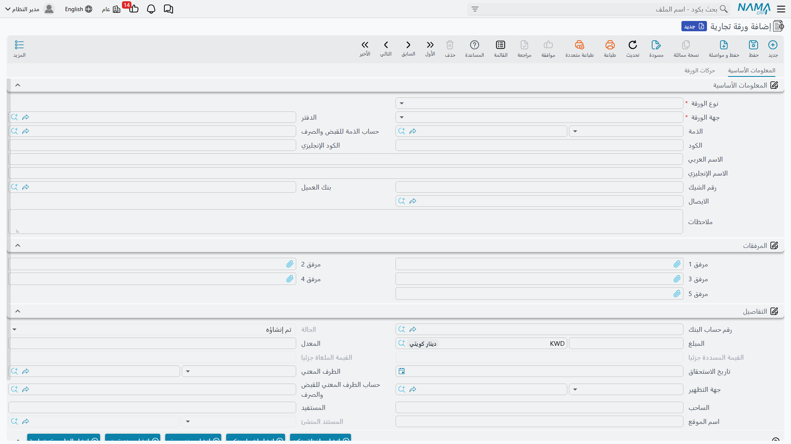
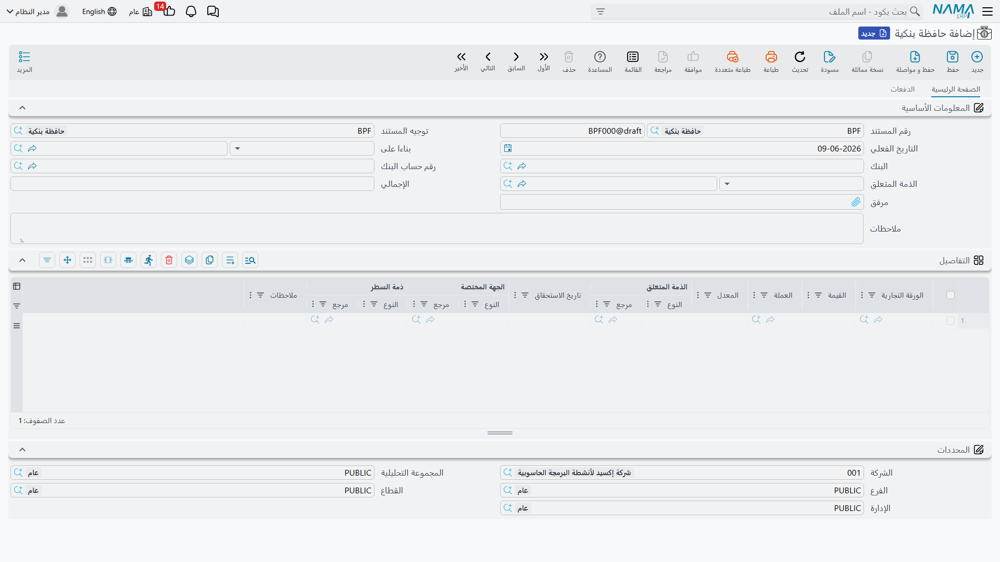

# الشيكات والأوراق المالية (دورة الحياة)

الشيك ليس مجرّد مبلغ؛ هو ورقة لها رحلة: تُستلَم، تُودَع في البنك، تُحصَّل أو تُرتجَع، وقد تُظهَّر لطرف آخر أو تُخصَم قبل موعدها. تتبّع كل ذلك يدويًا كابوس، لذلك تعامل نما كل شيك أو كمبيالة كـ **ورقة تجارية** لها **حالة** تنتقل عبر دورة حياة واضحة، وتُحرّكها مجموعة من المستندات المتخصّصة.

::: info الترخيص المطلوب
الأوراق التجارية ضمن ترخيص البنوك `accounting-banks`.
:::

## الورقة التجارية وحالتها

**الورقة التجارية** (`Banks > Master Files > Commercial Paper`) تمثّل الشيك أو الكمبيالة. أهم حقولها: **اتجاه الورقة** (**واردة** من عميل أو **صادرة** لمورّد)، و**نوع الورقة** (**شيك** أو **كمبيالة**)، و**القيمة** و**تاريخ الاستحقاق** و**رقم الشيك** و**البنك** و**المستفيد/المُصدِر**، و**دفتر الأوراق التجارية** الذي تتبع له، و**الحالة**.

نادرًا ما تُنشأ الورقة بمفردها؛ غالبًا تُولَّد من **سند قبض** (للواردة) أو **سند صرف** (للصادرة)، ثم تتحرّك حالتها بالمستندات أدناه. والحالات الممكنة:

| الحالة | المعنى |
|---|---|
| **تم إنشاؤه** | أُنشئت الورقة ولم تُستلَم بعد. |
| **مستلم** | استُلمت الورقة الواردة وأصبحت في عهدتك. |
| **تم إصداره** | أُصدرت الورقة الصادرة لطرف خارجي. |
| **بحافظة بنكية** | أُودِعت في حافظة البنك للتحصيل. |
| **بحافظة بنكية مؤجلة** | أُودِعت إيداعًا مؤجّلًا (قبل موعد الاستحقاق). |
| **اجيو** | خُصِمت لدى البنك قبل موعدها (تحصيل معجّل بخصم). |
| **مظهر** | ظُهِّرت (حُوِّلت) لطرف آخر. |
| **تم تحصيله** | حُصِّلت قيمتها فعليًا. |
| **رفض مؤقت / رفض نهائي** | ارتدّت مؤقتًا (قابلة لإعادة المحاولة) أو نهائيًا. |
| **مسدد جزئيا / ملغاة جزئيا** | سُدِّد/أُلغي جزء من قيمتها. |
| **ملغي** | أُلغيت الورقة. |

## دفتر الأوراق التجارية

**دفتر الأوراق التجارية** (`Banks > Settings > Commercial Paper Book`) ينظّم ترقيم الأوراق وعهدتها — كدفتر الشيكات الورقي تمامًا — فتعرف أي أوراق في أي دفتر ومع من.

## المستندات التي تُحرّك الدورة

- **افتتاح ورقة تجارية** (`Banks > Cheques > Openning Commercial Paper`) — لإدخال الأوراق القائمة عند بدء التشغيل برصيدها وحالتها الحالية.
- **الحافظة البنكية** (`Banks > Cheques > Bank Portfolio`) — إيداع الأوراق الواردة في البنك للتحصيل (تنتقل الحالة إلى «بحافظة بنكية»). وهناك **الحافظة البنكية المؤجلة** و**ارتجاع الحافظة المؤجلة** للإيداع قبل الاستحقاق والتراجع عنه.
- **الإشعار البنكي** (`Banks > Cheques > Bank Notice`) — إشعار البنك بنتيجة الورقة: **تحصيل** (تنتقل إلى «تم تحصيله») أو **ارتداد** (إلى «رفض مؤقت/نهائي»).
- **الأجيو** (`Banks > Cheques > Agio`) و**ارتجاع الأجيو** — خصم الورقة لدى البنك قبل موعدها مقابل عمولة، والتراجع عن ذلك.
- **إلغاء ورقة تجارية** — لإلغاء ورقة.
- **السداد الجزئي للورقة** — لتسجيل سداد جزء من قيمة الورقة.
- **تحويل ورقة تجارية** — لنقل/تظهير الورقة.
- **طلب استلام ورقة** — لطلب استلام ورقة قبل إثباتها.

::: tip دورة حياة مبسّطة لشيك وارد
استلام (سند قبض) ← مستلم ← إيداع (حافظة بنكية) ← بحافظة بنكية ← إشعار بنكي بالتحصيل ← تم تحصيله. وإن ارتدّ: إشعار بنكي بالارتداد ← رفض مؤقت/نهائي.
:::

كل مستند من هذه يُحرِّك حالة الورقة ويُسجِّل أثره المحاسبي المناسب (نقل القيمة بين حساب «شيكات تحت التحصيل» وحساب البنك مثلًا)، ومصدر هذه الحسابات هو توجيه كل مستند.

## الطباعة على نماذج البنوك

طباعة الشيك نفسه تستخدم **قوالب خاصة بكل بنك** (الأهلي المتحد، العربي الأفريقي، عوده، التجاري الدولي CIB، الخليج، أبوظبي الوطني، الأهلي المصري، QNB...) ضمن نماذج الشيكات `SYSF-BNK-CHQ-*`، كي يخرج الشيك مطابقًا لتنسيق كل بنك.

## التقارير والنماذج

- التقارير: كشف الأوراق التجارية `SYSR-BNK001`، الشيكات تحت التحصيل `SYSR-BNK002`، الشيكات حسب الحالة `SYSR-BNK003`، دفاتر الأوراق المالية `SYSR-BNK004` (انظر [كشوف الحسابات وميزان المراجعة](./reports-account-statements-and-trial-balance.md)).
- النماذج: الحافظة البنكية `SYSF-BNK003`، الإشعار البنكي `SYSF-BNK004`، تحويل ورقة `SYSF-BNK005`, إلغاء ورقة `SYSF-BNK006`، الأجيو `SYSF-BNK007`، ارتجاع الأجيو `SYSF-BNK008`، افتتاح ورقة `SYSF-BNK009`، طلب استلام ورقة `SYSF-ACC013`.

## للدعم الفني

- **«حالة الورقة لا تتقدّم»** — كل انتقال يحتاج مستنده: الإيداع بالحافظة، التحصيل/الارتداد بالإشعار البنكي. تحقّق من أن المستند المناسب صدر وعُولج.
- **«الشيك المرتدّ لا يعود لرصيد العميل»** — يجب إصدار **إشعار بنكي** بالارتداد لينقل الحالة ويعكس الأثر.
- **«حساب شيكات تحت التحصيل/البنك خطأ في القيد»** — مصدره توجيه المستند المعني (الحافظة/الإشعار/الأجيو)؛ راجِع مرجع [توجيهات المستندات](./support/accounting-document-terms.md).
- **«الشيك لا يُطبَع بتنسيق بنكي صحيح»** — تأكّد من اختيار قالب الشيك الخاص بالبنك المناسب.
- آلية المعالجة وإعادة معالجة مستند متعثّر في [كيف تُعالَج المستندات إلى أثر محاسبي](./support/accounting-request-processing.md).
