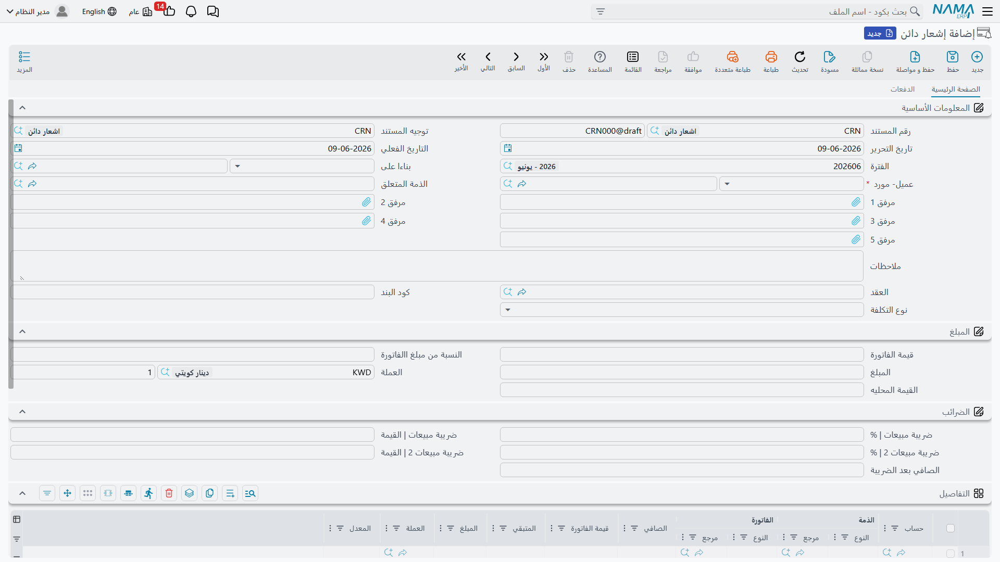

# إشعارات الدائن والمدين

أحيانًا تحتاج إلى تعديل رصيد عميل أو مورّد دون أن يكون هناك قبض أو صرف نقدي: خصم تسوية لعميل، أو مردود مبيعات، أو رسوم إضافية على مورّد. هذا دور **إشعار الدائن** و**إشعار المدين** — مستندان متقابلان يُحرّكان رصيد الطرف في اتجاهين متعاكسين.

::: info الترخيص المطلوب
إشعارا الدائن والمدين ضمن ترخيص المحاسبة الأساسي `accounting`.
:::

## الفكرة: تعديل رصيد طرف في اتجاهين

- **إشعار دائن** (`Accounting > Documents > CreditNote`) — يجعل حساب الطرف **دائنًا**: يُخفِّض ما على العميل تجاهنا (مردود/خصم لصالحه)، أو يزيد ما لنا تجاه المورّد.
- **إشعار مدين** (`Accounting > Documents > DebitNote`) — يجعل حساب الطرف **مدينًا**: يزيد ما على العميل (رسم/تكلفة إضافية)، أو يُخفِّض ما لنا تجاه المورّد.

الشاشتان متطابقتان في البنية ويختلفان في اتجاه الأثر فقط، لذا يكفي أن نشرح إحداهما.

## تشريح الإشعار

في الرأس تحدّد **توجيه المستند** و**التاريخ الفعلي** (الذي يحدّد **الفترة**)، و**عميل- مورد** (الطرف المعني)، و**الذمة المتعلقة** و**العقد** و**نوع التكلفة** عند الحاجة.

في كتلة **المبلغ** تُدخل **المبلغ** و**العملة** (وتظهر **القيمة المحلية** المقابلة)، ويمكن أن تُحسب القيمة كـ **نسبة من مبلغ الفاتورة** المرتبطة.

كتلة **الضرائب** تحمل **ضريبة المبيعات** (نسبة وقيمة) وضريبة ثانية إن لزم، و**الصافي بعد الضريبة**. ولأن الإشعار مستند ضريبي رسمي، فهو مدمج مع منظومة **الفاتورة الإلكترونية (ZATCA)**: يحمل المستند حقول هيئة الزكاة والضريبة (معرّفات الإرسال وحالة الاعتماد) التي تتابع تقديمه للهيئة.

في تبويب **التفاصيل** تُطابق قيمة الإشعار على **فواتير** بعينها (يظهر لكل سطر **قيمة الفاتورة** و**الصافي** و**المتبقي**)، فيُخصَم أثر الإشعار من رصيد الفاتورة مباشرة. كما يوفّر المستند جدول **أقساط** وتبويب **الدفعات**.

## الأثر المحاسبي

يأتي الجانب المقابل لحساب الطرف — وكذلك جانبا الضريبة — من **توجيه المستند** (راجِع مرجع [توجيهات المستندات](./support/accounting-document-terms.md)). إشعار الدائن يجعل الطرف دائنًا والجانب المقابل (إيراد/مردود/خصم) مدينًا، وإشعار المدين يعكسهما.

## التقارير والنماذج

- حركات الطرف الناتجة عن الإشعارات تظهر في كشف حسابه ضمن [كشوف الحسابات وميزان المراجعة](./reports-account-statements-and-trial-balance.md).
- النماذج المطبوعة: إشعار المدين `SYSF-ACC004`، إشعار الدائن `SYSF-ACC005`.

## للدعم الفني

- **«الإشعار لم يُخفِّض/يزِد رصيد الفاتورة»** — تأكّد من مطابقته على الفاتورة في تبويب **التفاصيل**، لا مجرّد إدخال المبلغ في الرأس.
- **«الاتجاه معكوس»** — تأكّد أنك تستخدم النوع الصحيح: **دائن** لتخفيض مديونية العميل، **مدين** لزيادتها.
- **«الإشعار لم يُرسَل للهيئة / حالته معلّقة»** — راجِع حقول هيئة الزكاة والضريبة وحالة الاعتماد؛ تكامل الفاتورة الإلكترونية موضوع مستقل عن المحاسبة.
- **«حساب الإيراد/المردود أو الضريبة خطأ»** — مصدرها **توجيه المستند**.
- آلية المعالجة وإعادة معالجة مستند متعثّر في [كيف تُعالَج المستندات إلى أثر محاسبي](./support/accounting-request-processing.md).
