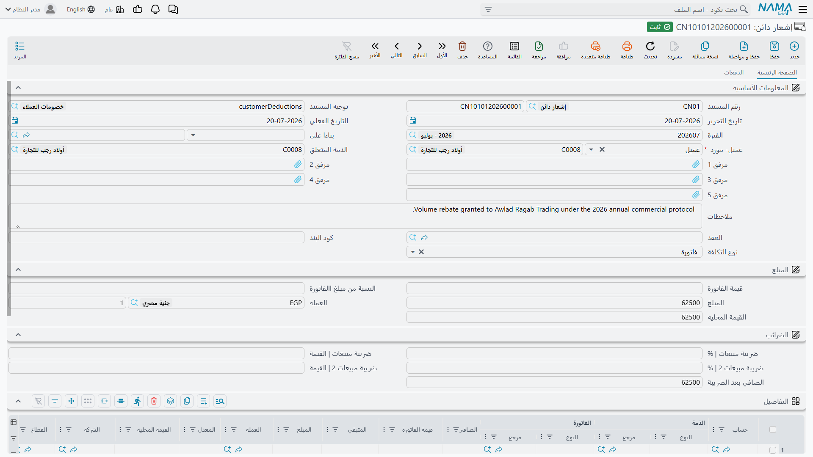

# إشعارات الدائن والمدين

أحيانًا تحتاج إلى تعديل رصيد عميل أو مورّد دون أن يكون هناك قبض أو صرف نقدي: خصم تسوية لعميل، أو مردود مبيعات، أو رسوم إضافية على مورّد. هذا دور **إشعار الدائن** و**إشعار المدين** — مستندان متقابلان يُحرّكان رصيد الطرف في اتجاهين متعاكسين.

::: info الترخيص المطلوب
إشعارا الدائن والمدين ضمن ترخيص المحاسبة الأساسي `accounting`.
:::

## الفكرة: تعديل رصيد طرف في اتجاهين

- **إشعار دائن** (`Accounting > Documents > CreditNote`) — يجعل حساب الطرف **دائنًا**: يُخفِّض ما على العميل تجاهنا (مردود/خصم لصالحه)، أو يزيد ما لنا تجاه المورّد.
- **إشعار مدين** (`Accounting > Documents > DebitNote`) — يجعل حساب الطرف **مدينًا**: يزيد ما على العميل (رسم/تكلفة إضافية)، أو يُخفِّض ما لنا تجاه المورّد.

الشاشتان متطابقتان في البنية ويختلفان في اتجاه الأثر فقط، لذا يكفي أن نشرح إحداهما.

## تشريح الإشعار

في الرأس تحدّد **توجيه المستند** و**التاريخ الفعلي** (الذي يحدّد **الفترة**)، و**عميل- مورد** (الطرف المعني)، و**الذمة المتعلقة** و**العقد** و**نوع التكلفة** عند الحاجة.

في كتلة **المبلغ** تُدخل **المبلغ** و**العملة** (وتظهر **القيمة المحلية** المقابلة)، ويمكن أن تُحسب القيمة كـ **نسبة من مبلغ الفاتورة** المرتبطة.

كتلة **الضرائب** تحمل **ضريبة المبيعات** (نسبة وقيمة) وضريبة ثانية إن لزم، و**الصافي بعد الضريبة**. ولأن الإشعار مستند ضريبي رسمي، فهو مدمج مع منظومة **الفاتورة الإلكترونية (ZATCA)**: يحمل المستند حقول هيئة الزكاة والضريبة (معرّفات الإرسال وحالة الاعتماد) التي تتابع تقديمه للهيئة.

في تبويب **التفاصيل** تُطابق قيمة الإشعار على **فواتير** بعينها (يظهر لكل سطر **قيمة الفاتورة** و**الصافي** و**المتبقي**)، فيُخصَم أثر الإشعار من رصيد الفاتورة مباشرة. كما يوفّر المستند جدول **أقساط** وتبويب **الدفعات**.

## سداد الفاتورة التي بُني عليها الإشعار

الإشعار المُحرَّر **بناءً على** فاتورة يمكنه أن يفعل أكثر من تحريك رصيد الطرف: يمكن أن يُحتسَب **سند دفع** على تلك الفاتورة فيُخفِّض المتبقي منها، تمامًا كما يفعل سند القبض أو الصرف. تُفعِّل ذلك من **توجيه** الإشعار، في مجموعة **دفع الفاتورة** (Invoice Payment Options)، عبر الخيار **إضافة الإشعارات الدائنة و المدينة الي سندات دفع الفاتورة**.

يبقى السؤال: بأي قيمة تُسدَّد الفاتورة؟ افتراضيًا يأخذ النظام **المبلغ** المُدخَل في الإشعار — أي القيمة *قبل* الضريبة. وهذا هو المطلوب حين تُعالَج ضريبة الإشعار على حدة، لكنه ليس المطلوب حين يكون الإشعار مستندًا ضريبيًا كاملًا: فالعميل الذي يستلم إشعار دائن بـ 1,000 وعليه 150 ضريبة مبيعات يتوقّع أن يُخصَم 1,150 من الفاتورة لا 1,000.

لهذه الحالة فعِّل الخيار **احتساب القيمة شاملة الضريبة كسند دفع للفاتورة** (Calculate Value Including Tax As Invoice Payment) في المجموعة نفسها، فيُسدِّد الإشعار الفاتورة بـ **الصافي بعد الضريبة** بدلًا من المبلغ، فيتحرّك المتبقي من الفاتورة — وكذلك سطر أعمار الديون الناتج عن الإشعار عليها — بالقيمة الشاملة للضريبة. ويسري الخيار على الفاتورة التي بُني عليها الإشعار في الرأس، أمّا الفواتير التي تُطابقها سطرًا سطرًا في تبويب **التفاصيل** فتبقى بقيم سطورها كما أُدخلت. وإن تركت الخيار مُطفأً فالسلوك كما هو دون تغيير.

::: tip تفعيله آمن مع الإشعارات غير الخاضعة للضريبة
إذا لم يكن للإشعار صافٍ بعد الضريبة (لا توجد ضريبة أصلًا) يُستخدَم المبلغ على أي حال، فلا يغيّر الخيار شيئًا في تلك الإشعارات. وإذا عدّلت لاحقًا مبلغ إشعار محفوظ أو ضرائبه، يُعاد سداد الفاتورة بالقيمة المصحّحة — تُسحَب القيمة القديمة وتُطبَّق الجديدة — فلا حاجة لإلغاء الإشعار وإعادة إدخاله.
:::

## الأثر المحاسبي

يأتي الجانب المقابل لحساب الطرف — وكذلك جانبا الضريبة — من **توجيه المستند** (راجِع مرجع [توجيهات المستندات](./support/accounting-document-terms.md)). إشعار الدائن يجعل الطرف دائنًا والجانب المقابل (إيراد/مردود/خصم) مدينًا، وإشعار المدين يعكسهما.

## الإجراءات في هذه الشاشة

يحمل الإشعاران الأزرار الثلاثة نفسها — فالشاشتان متطابقتان، وما يُقال عن إحداهما يسري على الأخرى.

- **تجميع سندات** (Collect Vouchers) — يملأ تبويب **التفاصيل** بفواتير الطرف المفتوحة بدل أن تبحث عنها بنفسك. يسألك عن **من تاريخ** و**إلى تاريخ** وهل **يتجاهل المبلغ في الرأس**، ثم يوزّع قيمة الإشعار على المستندات التي يجدها بدءًا من الأقدم. فإن تركت خيار تجاهل المبلغ مغلقًا توقّف عند استنفاد قيمة الإشعار؛ وإن فعّلته جلب كل ما في المدى لتطابقه يدويًا.
- **تجميع الدفعات من بناءاً علي** (collect Installments By From Doc) — حين يُحرَّر الإشعار **بناءً على** مستند آخر، يجلب هذا الزر قسط ذلك المستند إلى جدول أقساط الإشعار بقيمة الإشعار، فيقع السداد على القسط الصحيح بدل أن يظل معلّقًا على المستند ككلّ.
- **عرض الفواتير المرتبطة بسند الدفع أو الصرف** (Invoices System Entry Related To Payment/Receipt Documents) — يفتح الفواتير التي طُوبق عليها الإشعار. استعمله حين يسأل أحدهم عن الفاتورة التي خفّضها الإشعار الدائن فعلًا.

## التقارير والنماذج

- حركات الطرف الناتجة عن الإشعارات تظهر في كشف حسابه ضمن [كشوف الحسابات وميزان المراجعة](./reports-account-statements-and-trial-balance.md).
- النماذج المطبوعة: إشعار المدين `SYSF-ACC004`، إشعار الدائن `SYSF-ACC005`.

## للدعم الفني

- **«الإشعار لم يُخفِّض/يزِد رصيد الفاتورة»** — تأكّد من مطابقته على الفاتورة في تبويب **التفاصيل**، لا مجرّد إدخال المبلغ في الرأس.
- **«المتبقي من الفاتورة انخفض بأقل من إجمالي الإشعار»** — الإشعار يُسدِّد الفاتورة بـ **المبلغ** (قبل الضريبة) ما لم يُفعَّل خيار **احتساب القيمة شاملة الضريبة كسند دفع للفاتورة** في مجموعة **دفع الفاتورة** بالتوجيه.
- **«الاتجاه معكوس»** — تأكّد أنك تستخدم النوع الصحيح: **دائن** لتخفيض مديونية العميل، **مدين** لزيادتها.
- **«الإشعار لم يُرسَل للهيئة / حالته معلّقة»** — راجِع حقول هيئة الزكاة والضريبة وحالة الاعتماد؛ تكامل الفاتورة الإلكترونية موضوع مستقل عن المحاسبة.
- **«حساب الإيراد/المردود أو الضريبة خطأ»** — مصدرها **توجيه المستند**.
- آلية المعالجة وإعادة معالجة مستند متعثّر في [كيف تُعالَج المستندات إلى أثر محاسبي](./support/accounting-request-processing.md).
