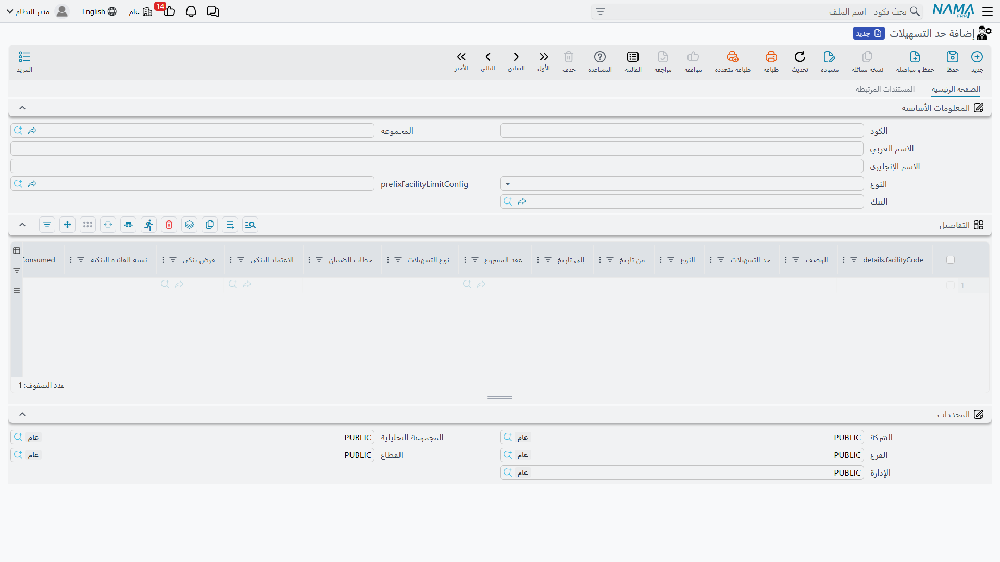
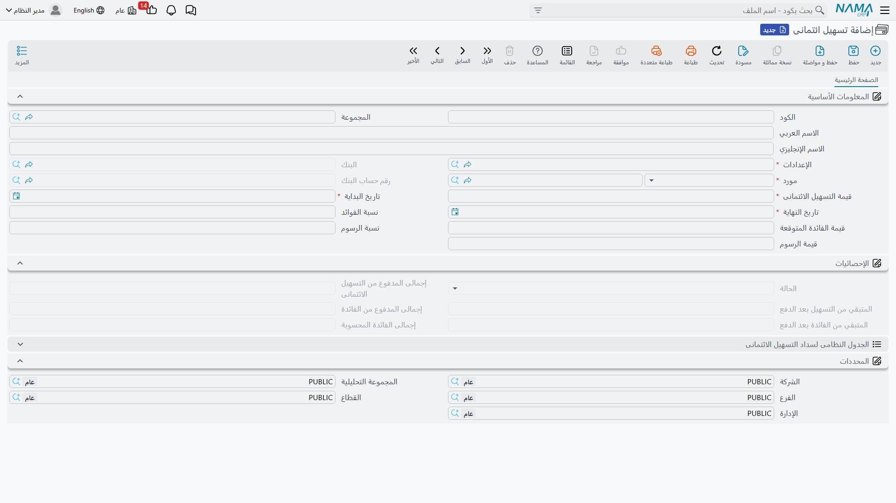
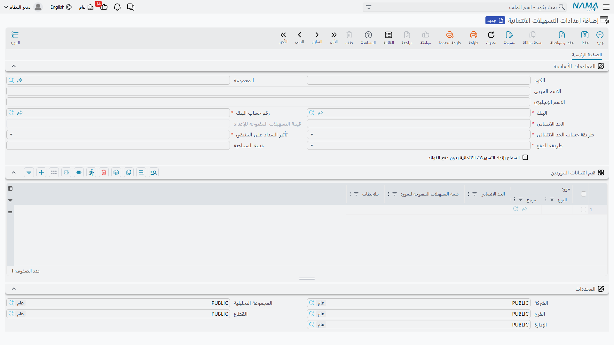

# التسهيلات الائتمانية وحدود التسهيلات

تتقاطع في هذه الصفحة فكرتان مرتبطتان لكنهما متمايزتان:

- **حدّ التسهيلات** هو **السقف** الذي يمنحك إياه البنك ويتقاسمه عددٌ من الأدوات — قرض هنا، خطاب ضمان هناك، اعتماد مستندي — فكلٌّ منها يحجز جزءًا من السقف، ويتتبّع النظام **المستهلَك والمتبقّي** منه.
- **التسهيل الائتماني** أداة قائمة بذاتها: اتفاق سحبٍ متجدّد مع البنك له قيمته وفائدته ورسومه، يُصدَر ويُسدَّد ويُنهى بمستنداته الخاصة.

::: info الترخيص المطلوب
التسهيلات الائتمانية ضمن ترخيص `accounting-loans` — وهو الترخيص نفسه الذي يغطّي [القروض البنكية](./bank-loans.md) و[الودائع الثابتة](./fixed-deposits.md).
:::

## حدّ التسهيلات: السقف المشترك

في شاشة **حد التسهيلات** (`Banks > Credit Facilities > Facility Limit`) يُعرّف السقف الممنوح من **بنك** معيّن، وتُضبط تفاصيله عبر **إعدادات حد التسهيلات** (`Banks > Credit Facilities > Facility Limit Config`).

ما إن يُربط القرض أو خطاب الضمان أو الاعتماد بحدّ تسهيلات حتى يخصم منه عند الإصدار/الفتح؛ ويمنع النظام أي إصدارٍ يدفع المستهلَك فوق السقف. ولأن الأدوات الثلاث تشترك في السقف نفسه، يعطيك تقرير **تفاصيل التسهيلات البنكية** (SYSR-LON002) صورة موحّدة عن المحجوز عبرها جميعًا.

## التسهيل الائتماني: من الإعداد إلى الإنهاء

التسهيل الائتماني أداة سحبٍ متجدّد، وتسير دورته هكذا:

1. **إعدادات التسهيلات الائتمانية** — القالب المشترك: طريقة احتساب الفائدة، وقاعدة توزيع السداد بين الأصل والفائدة، والحسابات.
2. **تسهيل ائتمانى** — الملف الرئيسي بحالته «لم تبدأ».
3. **إصدار تسهيل ائتمانى** — يفعّل التسهيل (يُرحَّل محاسبيًا، وتتحوّل الحالة إلى «قيد التنفيذ»).
4. **مستند سداد تسهيل ائتمانى** — سداد دفعة تُوزَّع بين الأصل والفائدة وفق الإعدادات (يُرحَّل محاسبيًا).
5. **مستند انهاء تسهيل ائتمانى** — إنهاء التسهيل (الحالة «منتهى»).

### الملف الرئيسي للتسهيل

في شاشة **تسهيل ائتمانى** (`Banks > Credit Facilities > Credit Facility`) تُعرّف الشروط: **الإعدادات** المرتبطة، و**المورّد** و**البنك** و**حساب البنك**، و**قيمة التسهيل**، و**نسبة الفائدة** و**الفائدة المتوقّعة**، و**نسبة/قيمة الرسوم**، و**تاريخ البداية / النهاية**. ويعرض الملف مجاميع متابعةٍ حيّة: **إجمالي الفائدة المحتسبة**، و**إجمالي مدفوعات التسهيل**، و**إجمالي مدفوعات الفائدة**، و**المتبقّي من التسهيل/الفائدة بعد السداد**.

**حالات التسهيل:** لم تبدأ (Not Started) → قيد التنفيذ (In Progress) → منتهى (Terminated).

### الإعدادات

تجمع **إعدادات التسهيلات الائتمانية** القواعد المشتركة بين التسهيلات المتشابهة: طريقة احتساب الفائدة (ويضبط خيار **عدد أيام السنة لاحتساب فائدة التسهيل الائتماني** أساس الاحتساب، الافتراضي 365 — انظر [إعدادات الحسابات](./support/accounting-configuration.md)) وقاعدة توزيع كل دفعة بين الأصل والفائدة.

### الإصدار والسداد والإنهاء

يُفعّل **إصدار التسهيل** الأداةَ ويُرحّل أثرها (جانبا **مدين/دائن**). ثم يوزّع كل **مستند سداد** دفعتَه بين الأصل والفائدة وفق الإعدادات، ويُرحَّل عبر جوانب: **مدين/دائن القيمة المسددة من التسهيل**، و**مدين/دائن القيمة المسددة من الفائدة**، و**مدين/دائن القيمة المدفوعة**. وأخيرًا يُقفل **مستند الإنهاء** التسهيل. (مصدر الحسابات في مرجع [توجيهات المستندات](./support/accounting-document-terms.md).)

## التقارير

| التقرير | يجيب عن |
|---|---|
| تفاصيل التسهيلات البنكية (SYSR-LON002) | المحجوز والمتبقّي من حدود التسهيلات عبر القروض والخطابات والاعتمادات والتسهيلات. |

## للدعم الفني

- **«ما الفرق بين حدّ التسهيلات والتسهيل الائتماني؟»** — حدّ التسهيلات سقفٌ تتقاسمه أدوات عدّة، والتسهيل الائتماني أداة سحبٍ مستقلّة لها مستنداتها.
- **«إصدار قرض/خطاب/اعتماد رُفض بسبب الحدّ»** — المستهلَك يتجاوز سقف حدّ التسهيلات المرتبط؛ راجِع تقرير تفاصيل التسهيلات البنكية.
- **«احتساب فائدة التسهيل يبدو خاطئًا»** — تحقّق من **عدد أيام السنة** في [إعدادات الحسابات](./support/accounting-configuration.md) ومن قاعدة التوزيع في إعدادات التسهيل.
- **«من أين تأتي حسابات السداد؟»** — من توجيه **مستند سداد التسهيل**؛ راجِع [توجيهات المستندات](./support/accounting-document-terms.md).
- آلية المعالجة المحاسبية في [كيف تُعالَج المستندات إلى أثر محاسبي](./support/accounting-request-processing.md).
