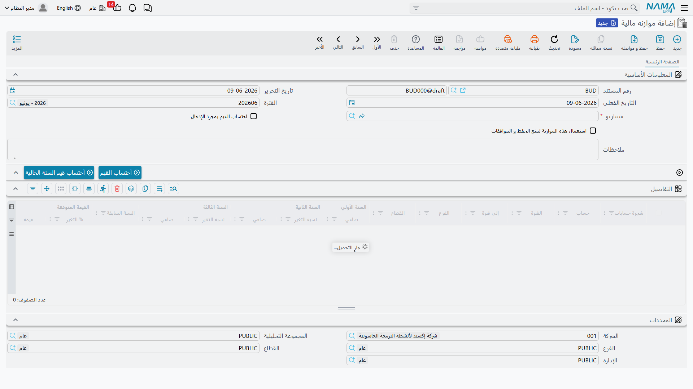

# الموازنات المالية

الموازنة خطّةٌ لها أنياب: تقرّر سلفًا كم يجوز لكلّ حسابٍ أن يُنفق (أو ينبغي أن يكسب) خلال فترة، ثم — إن شئت — يُلزِم النظامُ مستنداتِك بهذه الخطّة، فيحذّر أو حتى يمنع الإنفاق الذي يتجاوزها. تتيح لك **الموازنات المالية** في نما وضع هذه الأهداف لكلّ حساب، ولكلّ فترة، ولكلّ محدِّد، ثم التحقّق من النشاط الفعلي مقابلها.

::: info الترخيص المطلوب
الموازنات المالية ضمن ترخيص `accounting-budget`، وتقع تحت جذر قائمة **الموازنات**.
:::

## بناء الموازنة

**الموازنة المالية** (`BUDGETS > Budgets > Financial Budget`) هي مستند الخطّة. يستهدف كلُّ سطرٍ في **التفاصيل** **حسابًا** واحدًا (ضمن **شجرة حسابات** مختارة) ويحمل **قيمةً مخطَّطة للسنة** — ولأنّ إعداد الموازنات كثيرًا ما يكون متعدّد السنوات، يحمل السطر حتى **ستّ سنوات** من القيم جنبًا إلى جنب، مع **نسب تغيير** اختيارية تُنمّي كلّ سنةٍ من سابقتها تلقائيًا. ويمكن ملء التقسيم الدائن/المدين لكلّ سنةٍ مباشرةً أو حسابه نيابةً عنك.

ويُحدَّد نطاق كلّ سطرٍ بـ**المحدِّدات** التي تهمّك — الشركة، القطاع، الفرع، الإدارة، مجموعة التحليل، الذمة، بل وحتى السجلّ — وبـ**سنة/فترة مالية** (مدى فترات من/إلى). فجملة «إدارة التسويق، فرع الرياض، هذا العام: 500,000» سطرُ موازنةٍ واحدٌ دقيق.

ويمكنك الاحتفاظ بعدّة موازناتٍ كـ**سيناريوهات** (`BUDGETS > Master Files > Budget Scenario`) — خطّةٌ متفائلة وأخرى متحفّظة — ووسم الموازنة بالسيناريو الذي تنتمي إليه.

## تحويل الموازنة إلى أداة تحكّم

لا تقيّد الموازنةُ الإنفاقَ إلّا إذا أمرتها بذلك. المفتاح هو **«استخدام هذه الموازنة في التحقّق»** — يُضبَط على الموازنة (وعلى مستوى السطر، مع نافذة تواريخ **تحقّق من/إلى** اختيارية). وبمجرّد وسم موازنةٍ للتحقّق، يفحص النظامُ المستنداتِ التي تمسّ حساباتها مقابل القيمة المخطَّطة.

**ماذا يعني «التجاوز»** يُضبَط مركزيًا في **إعدادات التأكّد من عدم تجاوز الموازنات** في وحدة المحاسبة (راجِع كتالوج [إعدادات الحسابات](./support/accounting-configuration.md)). مفتاحان يقرّران ما يحدث حين يدفع مستندٌ حسابًا فوق موازنته:

- **منع الحفظ عند تجاوز الموازنات** — يُمنَع المستند صراحةً.
- **تفعيل الموافقة عند تجاوز الموازنات** — بدلًا من المنع (أو قبله)، يُوجَّه المستند المتجاوِز إلى **موافقة**، فيتيحه مستخدمٌ مخوَّل.

وإن لم يكن أيٌّ منهما مفعّلًا، فالموازنة إعلاميةٌ فقط — تُتابَع وتظهر في التقارير، لكنّ شيئًا لا يوقف الإنفاق.

### مطابقة سطر الموازنة الصحيح

عند التحقّق، يحتاج النظامُ أن يعرف *أيّ* سطر موازنةٍ يقابل المستند. تتضمّن **إعدادات التأكّد من عدم تجاوز الموازنات** مجموعةً من مفاتيح **«اعتبار…»** — اعتبار القطاع، الفرع، الإدارة، المجموعة التحليلية، الذمة، السجلّ، المراجع 1–3، والفترة المالية — تحدّد مدى دقّة مطابقة الفعلي بسطور الموازنة. فعّل المحدِّدات التي تُعِدّ موازنتك بها، واترك ما لا تستعمله، كي لا تكون المطابقة أضيق من أن تجد سطرها.

## للدعم الفني

- **«موازنتي لا توقف شيئًا»** — لا بدّ من توافر ثلاثة أمور: أن تكون الموازنة موسومةً بـ**الاستخدام في التحقّق**، وأن يكون أحدُ مفتاحَي **منع الحفظ** / **تفعيل الموافقة** مفعّلًا في إعدادات التأكّد من عدم تجاوز الموازنات. وإلّا فالموازنة إعلاميةٌ فقط.
- **«مُنِع مستندٌ / أُرسِل لموافقةٍ على غير المتوقَّع»** — لأنّه مسّ حسابًا له موازنة تحقّقٍ وكان سيتجاوزها؛ تحقّق من قيمة الموازنة ومن مبلغ المستند ومحدِّداته.
- **«النظام لا يجد سطر الموازنة المطابق»** — راجِع مفاتيح **«اعتبار…»** في إعدادات التأكّد؛ فإن كنت تُعِدّ موازنتك بالفرع و«اعتبار الفرع» مُطفأ (أو العكس) فلن يطابق الفعلي السطر.
- **«أريد مقارنة الخطط»** — احتفظ بكلّ خطّةٍ كـ**سيناريو موازنة** مستقلّ ووسِم موازنتها به.
