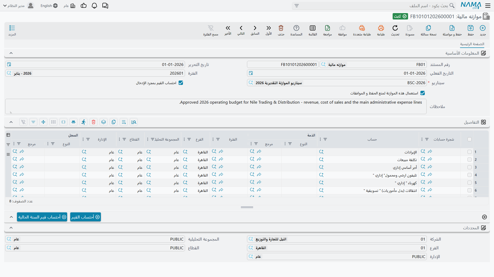

# الموازنات المالية

الموازنة خطّةٌ لها أنياب: تقرّر سلفًا كم يجوز لكلّ حسابٍ أن يُنفق (أو ينبغي أن يكسب) خلال فترة، ثم — إن شئت — يُلزِم النظامُ مستنداتِك بهذه الخطّة، فيحذّر أو حتى يمنع الإنفاق الذي يتجاوزها. تتيح لك **الموازنات المالية** في نما وضع هذه الأهداف لكلّ حساب، ولكلّ فترة، ولكلّ محدِّد، ثم التحقّق من النشاط الفعلي مقابلها.

::: info الترخيص المطلوب
الموازنات المالية ضمن ترخيص `accounting-budget`، وتقع تحت جذر قائمة **الموازنات**.
:::

## بناء الموازنة

**الموازنة المالية** (`BUDGETS > Budgets > Financial Budget`) هي مستند الخطّة. يستهدف كلُّ سطرٍ في **التفاصيل** **حسابًا** واحدًا (ضمن **شجرة حسابات** مختارة) ويحمل **قيمةً مخطَّطة للسنة** — ولأنّ إعداد الموازنات كثيرًا ما يكون متعدّد السنوات، يحمل السطر حتى **ستّ سنوات** من القيم جنبًا إلى جنب، مع **نسب تغيير** اختيارية تُنمّي كلّ سنةٍ من سابقتها تلقائيًا. ويمكن ملء التقسيم الدائن/المدين لكلّ سنةٍ مباشرةً أو حسابه نيابةً عنك.

ويُحدَّد نطاق كلّ سطرٍ بـ**المحدِّدات** التي تهمّك — الشركة، القطاع، الفرع، الإدارة، مجموعة التحليل، الذمة، بل وحتى السجلّ — وبـ**سنة/فترة مالية** (مدى فترات من/إلى). فجملة «إدارة التسويق، فرع الرياض، هذا العام: 500,000» سطرُ موازنةٍ واحدٌ دقيق.

ويمكنك الاحتفاظ بعدّة موازناتٍ كـ**سيناريوهات** (`BUDGETS > Master Files > Budget Scenario`) — خطّةٌ متفائلة وأخرى متحفّظة — ووسم الموازنة بالسيناريو الذي تنتمي إليه.

## تحويل الموازنة إلى أداة تحكّم

لا تقيّد الموازنةُ الإنفاقَ إلّا إذا أمرتها بذلك. المفتاح هو **«استخدام هذه الموازنة في التحقّق»** — يُضبَط على الموازنة (وعلى مستوى السطر، مع نافذة تواريخ **تحقّق من/إلى** اختيارية). وبمجرّد وسم موازنةٍ للتحقّق، يفحص النظامُ المستنداتِ التي تمسّ حساباتها مقابل القيمة المخطَّطة.

**ما يحدث عند التجاوز يُقرَّر لكلّ حساب على حدة**، بحقل **عندما يتم تجاوز الموازانة** في الحساب (راجِع «ضبط الموازنة على الحساب» في صفحة [الحسابات](./accounts.md)):

- **منع الحفظ** — يُمنَع المستند صراحةً.
- **طلب موافقة** — يُوجَّه المستند المتجاوِز إلى **موافقة**، فيتيحه مستخدمٌ مخوَّل.

ومفتاحان في إعدادات الحسابات (راجِع كتالوج [إعدادات الحسابات](./support/accounting-configuration.md)) يفتحان هذين الخيارين: لا يُحفَظ حسابٌ على **منع الحفظ** (ولا مع **منع الحفظ اذا لم توجد موازنة للحساب**) حتى يُفعَّل **تفعيل منع الحفظ عند تجاوز الموازات**، ولا على **طلب موافقة** حتى يُفعَّل **تفعيل الموافقة عند تجازو الموازنات**. والحساب المتروك على **سماح** لا يُوقَف أبدًا — موازنته إعلاميةٌ فقط، تُتابَع وتظهر في التقارير.

ولا يُفحَص إلا ما يزيد الحساب على **طبيعته** — مدينٌ على حسابٍ مدين، ودائنٌ على حسابٍ دائن — ومقابل سطور موازنةٍ محفوظة لا مسوّدات، ومعلَّمٌ عليها **استعمال هذه الموازنة لمنع الحفظ و الموافقات**. وإن لم يطابق المستندَ سطرٌ كهذا فإجمالي الموازنة صفر ويمرّ المستند، إلا إذا كان **منع الحفظ اذا لم توجد موازنة للحساب** معلَّمًا على الحساب.

### مطابقة سطر الموازنة الصحيح

عند التحقّق، يحتاج النظامُ أن يعرف *أيّ* سطر موازنةٍ يقابل المستند. تتضمّن **إعدادات التأكّد من عدم تجاوز الموازنات** مجموعةً من مفاتيح **«اعتبار…»** — اعتبار القطاع، الفرع، الإدارة، المجموعة التحليلية، الذمة، السجلّ، المراجع 1–3، والفترة المالية — تحدّد مدى دقّة مطابقة الفعلي بسطور الموازنة. فعّل المحدِّدات التي تُعِدّ موازنتك بها، واترك ما لا تستعمله، كي لا تكون المطابقة أضيق من أن تجد سطرها.

## الإجراءات في هذه الشاشة

نادرًا ما تُكتب سطور الموازنة رقمًا رقمًا — فزرّان يملآن الأرقام نيابةً عنك متى حدّدت السطورُ حساباتها ومحدداتها:

- **أحتساب القيم** (Calculate Values) — يملأ القيم المخطَّطة عبر أعمدة سنوات الموازنة انطلاقًا من السيناريو ومدى الفترات المالية وحسابِ كل سطر ومحدداته، مطبِّقًا **نسب التغيير** في السطر لتنمية كل سنة على سابقتها. وهذا ما يحوّل «هذه هي الحسابات التي أوازن عليها» إلى خطة متعدّدة السنوات فعلًا.
- **أحتساب قيم السنة الحالية** (Calculate Current Year Values) — النسخة الأضيق: يحسب قيم السنة الحالية فقط ويترك السنوات التالية كما هي. استعمله حين تكون سنوات ما بعدُ متّفقًا عليها وأنت تعيد ضبط هذه السنة وحدها.

ويعمل الزرّان على جدول **التفاصيل**، فأضف سطورك وحدّد محدداتها أولًا ثم اضغط.

## للدعم الفني

- **«موازنتي لا توقف شيئًا»** — لا بدّ من توافر ثلاثة أمور: أن يكون سطر الموازنة محفوظًا ومعلَّمًا عليه **استعمال هذه الموازنة لمنع الحفظ و الموافقات**، وأن يكون حقل **عندما يتم تجاوز الموازانة** في الحساب **منع الحفظ** أو **طلب موافقة**، وأن يحرّك المستندُ الحسابَ على طبيعته. وإلّا فالموازنة إعلاميةٌ فقط.
- **«مُنِع مستندٌ / أُرسِل لموافقةٍ على غير المتوقَّع»** — لأنّه مسّ حسابًا له موازنة تحقّقٍ وكان سيتجاوزها؛ تحقّق من قيمة الموازنة ومن مبلغ المستند ومحدِّداته.
- **«النظام لا يجد سطر الموازنة المطابق»** — راجِع مفاتيح **«اعتبار…»** في إعدادات التأكّد؛ فإن كنت تُعِدّ موازنتك بالفرع و«اعتبار الفرع» مُطفأ (أو العكس) فلن يطابق الفعلي السطر.
- **«أريد مقارنة الخطط»** — احتفظ بكلّ خطّةٍ كـ**سيناريو موازنة** مستقلّ ووسِم موازنتها به.

## رسائل قد تظهر لك

الرسائل التي يقابلها المستند حين يتجاوز موازنةً — «موازنة الحساب {0} قيمتها {1} و هذا السند سيتعدي الموازنة حيث أنه سيجعل الرصيد {2}» ورسائل تعريف الموافقة — مذكورة مع الإعداد الذي يقف وراء كلٍّ منها تحت «ضبط الموازنة على الحساب» في صفحة [الحسابات](./accounts.md). أمّا الرسائل أدناه فتأتي من إعداد الموازنات نفسه.

| الرسالة | السبب | ماذا تفعل |
|---|---|---|
| «لم يتم عمل موازنة للحساب {0}» | على الحساب علامة **منع الحفظ اذا لم توجد موازنة للحساب**، ولا يطابق حسابَ المستند ومحدّداته وفترته أيُّ سطر موازنةٍ محفوظ معلَّمٍ عليه **استعمال هذه الموازنة لمنع الحفظ و الموافقات**. | أضِف سطر موازنةٍ لهذا الحساب وهذه المحدّدات، أو راجِع مفاتيح **«اعتبار…»**: كلّ محدّدٍ تُفعّله يجب أن يتطابق تمامًا، والفارغ لا يطابق إلا فارغًا، فمع تفعيل **اعتبار الإدارة** لا يُعثَر على سطرٍ بلا إدارة لمستندٍ يحمل إدارة. |
| «يتوجب عليك تفعيل الأوبشن {0} في إعدادات الحسابات لتتمكن من تفعيل منع الحفظ عند تخطي الموازنات» | يُحفَظ الحساب و**عندما يتم تجاوز الموازانة** = **منع الحفظ** بينما **تفعيل منع الحفظ عند تجاوز الموازات** مطفأ. | فعِّل الخيار في إعدادات الحسابات، ثم احفظ الحساب من جديد. |
| *You must enable the option {0} in accounting configuration to be able to use prevent saving if no budget was found* | الأمر نفسه لعلامة **منع الحفظ اذا لم توجد موازنة للحساب** — ويفتحها الخيار نفسه. | كما سبق. لا ترجمة عربية لهذه الرسالة، فتظهر بالإنجليزية على الشاشات العربية. |
| «يتوجب عليك تفعيل الأوبشن {0} في إعدادات الحسابات لتتمكن من تفعيل طلب الموافقة عند تخطي الموازنات» | يُحفَظ الحساب على **طلب موافقة** بينما **تفعيل الموافقة عند تجازو الموازنات** مطفأ. | فعِّل الخيار، ثم احفظ الحساب من جديد. |
| «لا يمكنك تفعيل الريبليكشن و طلب الموافقة عند تخطي الموازنات في نفس الوقت» | النظام يعمل بالـReplication، و**طلب موافقة** على الحساب غير مسموح معه. | استعمل **منع الحفظ** على هذا الحساب بدلًا منه. |
