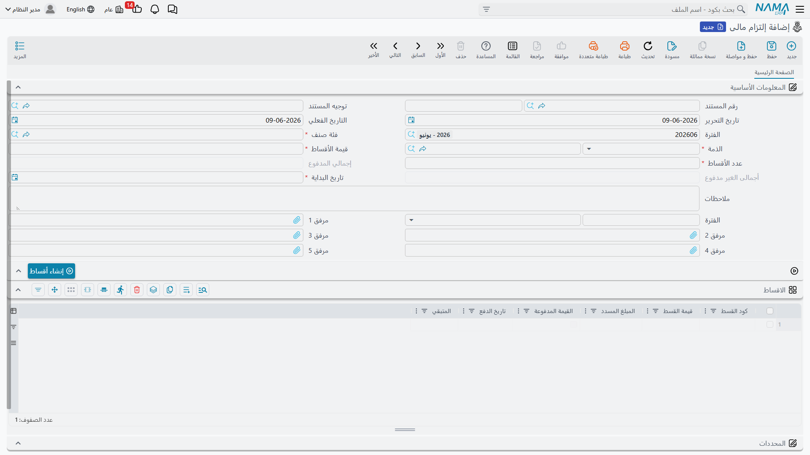
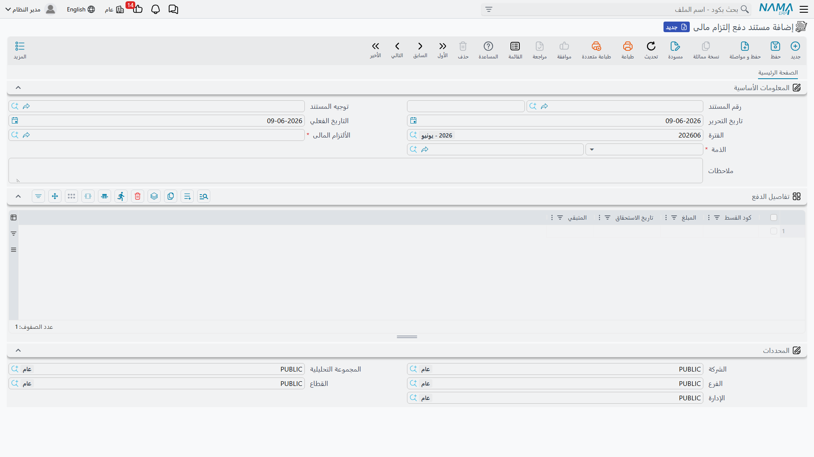

# الالتزامات المالية

تحمل الشركة التزاماتٍ دوريةً كثيرة ليست فواتير بعد لكنّها حقيقيةٌ تمامًا: إيجارٌ سنوي يُدفع أقساطًا ربع سنوية، وثيقة تأمين، اتفاقية تمويلٍ بجدول سدادٍ ثابت. منظومة **الالتزامات المالية** هي المكان الذي تسجّل فيه هذه الالتزامات، وتضع جدول أقساطها، وتتابع المدفوع منها مقابل المستحقّ — طبقةُ تنظيمٍ ومتابعةٍ تقف إلى جوار سنداتك المعتادة.

::: info الترخيص المطلوب
الالتزامات المالية ضمن ترخيص `accounting-financial-commitments-regulation`.
:::

::: tip طبقة متابعة، لا مستند ترحيل
لا يُرحِّل الالتزام ولا مستند دفعه إلى دفتر الأستاذ **بذاتهما**. إنّهما يتابعان الالتزام وسداده مقابل الجدول؛ أمّا حركة المال الفعلية فتُسجَّل بسنداتك المعتادة (القبض/الصرف). فاعتبر هذه المنظومة المُخطِّط والرقيب على تلك الالتزامات، لا بديلًا عن السندات التي تحرّك النقدية.
:::

## المكوّنات

جميع الشاشات تحت جذر **الحسابات > إدارة الإلتزام المالى**:

1. **فئة إلتزام مالى** — ملفٌ رئيسي لتصنيف الالتزامات (إيجار، تأمين، تمويل…)، كي تجمعها وتُعِدّ تقاريرها.
2. **إلتزام مالى** — الالتزام نفسه: قيمته الإجمالية، و**فئته**، و**تاريخ بداية**، و**دورية** سدادٍ (كلّ *n* أشهر/…)، وما ينتج عنها من **جدول أقساط**.
3. **مستند دفع إلتزام مالى** — يسجّل دفعةً مقابل قسطٍ بعينه، فيحدّث المدفوع/المتبقّي لذلك القسط.
4. **مستند إعادة جدولة إلتزام مالى** — يغيّر الجدول لاحقًا (إضافة أقساط أو تعديلها أو حذفها)، مع حفظ صورةٍ قبل/بعد للتغيير.

## إعداد الالتزام

في **الإلتزام المالى** (`Accounting > Financial Commitment Management > Financial Commitment`) تُدخِل **فئة** الالتزام، و**تاريخ بدايته**، و**عدد الأقساط** و**قيمة الأقساط**، و**دورية** التكرار (قيمة + وحدة، مثلًا كلّ شهر واحد). ومن هذه تُبنى شبكة **الأقساط** — سطرٌ لكلّ قسطٍ يحمل **كود القسط** و**قيمته** و**تاريخ سداده** و**المبلغ المدفوع** و**المتبقّي** المتجدّدين وعلامة **مسدَّد**. ويحتفظ الرأس بإجمالي **المدفوع** وإجمالي **غير المدفوع** المتجدّدين كي ترى موضع الالتزام في لمحة.

## سداد قسط

يشير **مستند دفع الإلتزام المالى** (`Accounting > Financial Commitment Management > Financial Commitment Payment Document`) إلى **التزامٍ مالي** ويسجّل دفعةً مقابله. وعند اعتماده يحدّث **المبلغ المدفوع** و**المتبقّي** للقسط المقابل، ويحوّل القسط إلى **مسدَّد** متى سُوِّي بالكامل — فتبقى مجاميع الالتزام معبّرةً عن الواقع.

## إعادة الجدولة

تتغيّر الخطط — يؤجَّل قسطٌ، أو يُعاد التفاوض على المبالغ. يتيح لك **مستند إعادة جدولة الإلتزام المالى** (`Accounting > Financial Commitment Management > Financial Commitment Reschedule`) إضافة سطور أقساطٍ أو تعديلها أو حذفها على التزامٍ قائم. ويحتفظ بشبكتين — **التفاصيل** (الجدول الجديد) و**التفاصيل قبل التعديل** (الجدول كما كان) — كي يكون التغيير قابلًا للمراجعة.

## للدعم الفني

- **«الالتزام لم يُنشئ قيدًا»** — هذا متوقَّع؛ الالتزامات ومستندات دفعها لا تُرحَّل إلى دفتر الأستاذ. سجِّل حركة النقدية الفعلية بسند قبضٍ/صرفٍ معتاد.
- **«المدفوع/المتبقّي يبدو خاطئًا»** — تُحرّكهما **مستندات الدفع** المرتبطة بالالتزام؛ تحقّق من اعتماد كلّ دفعةٍ ومن إشارتها إلى القسط الصحيح.
- **«أحتاج تغيير الجدول»** — استخدم مستند **إعادة جدولة** بدل تعديل الالتزام الأصلي؛ فهو يحفظ تاريخ قبل/بعد.
- **«قسطٌ ما زال يظهر غير مسدَّد بعد دفعه»** — تأكّد من أنّ مستند الدفع غطّى قيمة القسط كاملةً؛ فالدفعات الجزئية تُبقي **متبقّيًا** حتى يُستكمَل.
