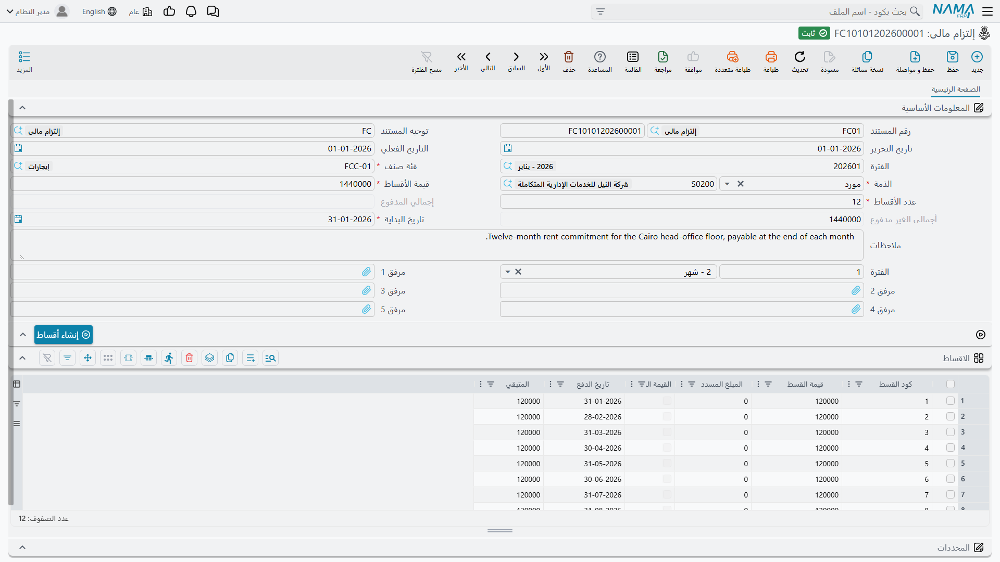
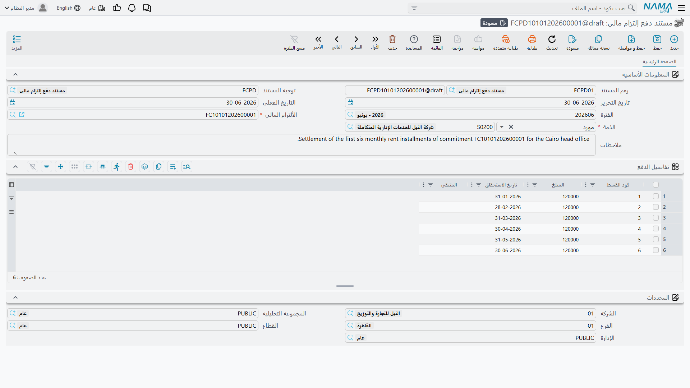

# الالتزامات المالية

تحمل الشركة التزاماتٍ دوريةً كثيرة ليست فواتير بعد لكنّها حقيقيةٌ تمامًا: إيجارٌ سنوي يُدفع أقساطًا ربع سنوية، وثيقة تأمين، اتفاقية تمويلٍ بجدول سدادٍ ثابت. منظومة **الالتزامات المالية** هي المكان الذي تسجّل فيه هذه الالتزامات، وتضع جدول أقساطها، وتتابع المدفوع منها مقابل المستحقّ — طبقةُ تنظيمٍ ومتابعةٍ تقف إلى جوار سنداتك المعتادة.

::: info الترخيص المطلوب
الالتزامات المالية ضمن ترخيص `accounting-financial-commitments-regulation`.
:::

::: tip طبقة متابعة، لا مستند ترحيل
لا يُرحِّل الالتزام ولا مستند دفعه إلى دفتر الأستاذ **بذاتهما**. إنّهما يتابعان الالتزام وسداده مقابل الجدول؛ أمّا حركة المال الفعلية فتُسجَّل بسنداتك المعتادة (القبض/الصرف). فاعتبر هذه المنظومة المُخطِّط والرقيب على تلك الالتزامات، لا بديلًا عن السندات التي تحرّك النقدية.
:::

## المكوّنات

جميع الشاشات تحت جذر **الحسابات > إدارة الإلتزام المالى**:

1. **فئة إلتزام مالى** — ملفٌ رئيسي لتصنيف الالتزامات (إيجار، تأمين، تمويل…)، كي تجمعها وتُعِدّ تقاريرها.
2. **إلتزام مالى** — الالتزام نفسه: قيمته الإجمالية، و**فئته**، و**تاريخ بداية**، و**دورية** سدادٍ (كلّ *n* أشهر/…)، وما ينتج عنها من **جدول أقساط**.
3. **مستند دفع إلتزام مالى** — يسجّل دفعةً مقابل قسطٍ بعينه، فيحدّث المدفوع/المتبقّي لذلك القسط.
4. **مستند إعادة جدولة إلتزام مالى** — يغيّر الجدول لاحقًا (إضافة أقساط أو تعديلها أو حذفها)، مع حفظ صورةٍ قبل/بعد للتغيير.

## إعداد الالتزام

في **الإلتزام المالى** (`Accounting > Financial Commitment Management > Financial Commitment`) تُدخِل **فئة** الالتزام، و**تاريخ بدايته**، و**عدد الأقساط** و**قيمة الأقساط**، و**دورية** التكرار (قيمة + وحدة، مثلًا كلّ شهر واحد). ومن هذه تُبنى شبكة **الأقساط** — سطرٌ لكلّ قسطٍ يحمل **كود القسط** و**قيمته** و**تاريخ سداده** و**المبلغ المدفوع** و**المتبقّي** المتجدّدين وعلامة **مسدَّد**. ويحتفظ الرأس بإجمالي **المدفوع** وإجمالي **غير المدفوع** المتجدّدين كي ترى موضع الالتزام في لمحة.

## سداد قسط

يشير **مستند دفع الإلتزام المالى** (`Accounting > Financial Commitment Management > Financial Commitment Payment Document`) إلى **التزامٍ مالي** ويسجّل دفعةً مقابله. وعند اعتماده يحدّث **المبلغ المدفوع** و**المتبقّي** للقسط المقابل، ويحوّل القسط إلى **مسدَّد** متى سُوِّي بالكامل — فتبقى مجاميع الالتزام معبّرةً عن الواقع.

## الإجراءات في هذه الشاشة

جدول الأقساط يُولَّد ولا يُكتب:

- **إنشاء أقساط** (Create Installments) — يبني جدول **الأقساط** من **قيمة الأقساط** و**عدد الأقساط** و**تاريخ البداية** و**الدورية**، فيقسّم القيمة بالتساوي ويقدّم تاريخ السداد فترةً واحدة في كل مرة. والحقول الأربعة مطلوبة؛ فإن تركت أحدها فارغًا أخبرك الزر بأيّها. كما يمتنع عن العمل إذا كان أي قسط قائم **مسدَّدًا** أو يحمل مبلغًا مدفوعًا — لأن إعادة التوليد ستمحو تاريخ سدادٍ فعلي — فأعد جدولة هذه الحالات بمستند **إعادة جدولة الإلتزام المالى** بدلًا من ذلك.
- **إنشاء أقساط السندات المختارة** (Create Installments For Selected Documents) — التوليد نفسه، لكن من **شاشة قائمة الالتزامات** على كل التزام اخترته. وبهذا تضع جداول الأقساط لدفعة من الالتزامات استُوردت أو أُدخلت بدونها.

## إعادة الجدولة

تتغيّر الخطط — يؤجَّل قسطٌ، أو يُعاد التفاوض على المبالغ. يتيح لك **مستند إعادة جدولة الإلتزام المالى** (`Accounting > Financial Commitment Management > Financial Commitment Reschedule`) إضافة سطور أقساطٍ أو تعديلها أو حذفها على التزامٍ قائم. ويحتفظ بشبكتين — **التفاصيل** (الجدول الجديد) و**التفاصيل قبل التعديل** (الجدول كما كان) — كي يكون التغيير قابلًا للمراجعة.

## للدعم الفني

- **«الالتزام لم يُنشئ قيدًا»** — هذا متوقَّع؛ الالتزامات ومستندات دفعها لا تُرحَّل إلى دفتر الأستاذ. سجِّل حركة النقدية الفعلية بسند قبضٍ/صرفٍ معتاد.
- **«المدفوع/المتبقّي يبدو خاطئًا»** — تُحرّكهما **مستندات الدفع** المرتبطة بالالتزام؛ تحقّق من اعتماد كلّ دفعةٍ ومن إشارتها إلى القسط الصحيح.
- **«أحتاج تغيير الجدول»** — استخدم مستند **إعادة جدولة** بدل تعديل الالتزام الأصلي؛ فهو يحفظ تاريخ قبل/بعد.
- **«قسطٌ ما زال يظهر غير مسدَّد بعد دفعه»** — تأكّد من أنّ مستند الدفع غطّى قيمة القسط كاملةً؛ فالدفعات الجزئية تُبقي **متبقّيًا** حتى يُستكمَل.

## رسائل قد تظهر لك

| الرسالة | لماذا | ما تفعله |
|---|---|---|
| «عدد الإقساط يجب أن يكون {0}» | حقل **عدد الأقساط** في الرأس لا يساوي عدد سطور جدول **الأقساط**؛ والرقم المعروض هو عدد السطور الموجود فعلًا. | صحّح العدد، أو اضغط **إنشاء الأقساط** من جديد ليُبنى الجدول والعدد معًا. |
| «مجموع قيم الأقساط {0} يجب ان يساوى {1} فى رأس المستند» | مجموع قيم سطور الأقساط لا يساوي **قيمة الأقساط** في رأس المستند. | عدّل قيمة أحد السطور أو الرقم في الرأس. و**إنشاء الأقساط** يقسّم القيمة بالتساوي فيتوازن المجموع دائمًا. |
| «لا يمكن حذف القسط المدفوع الذى كوده {0}» | يوجد مستند دفع مسجَّل على كود القسط هذا، وقد حُذف سطره من الجدول. | أعِد السطر. فالجدول الذي سُدِّد منه شيء يُغيَّر بمستند **إعادة جدولة التزام مالي**، لا بتعديل الالتزام. |
| «يجب ان تكون قيمة الدفع اكبر من الصفر» | أحد سطور **مستند دفع التزام مالي** قيمة الدفع فيه فارغة أو سالبة. | أدخِل مبلغًا موجبًا في السطر، أو احذف السطر. |
| «لا يوجد قسط بكود {0} فى {1}» | كود القسط المكتوب في سطر الدفع أو إعادة الجدولة غير موجود في الالتزام الذي يشير إليه المستند. | اختر الكود من جدول **الأقساط** في الالتزام؛ فالكود ليس نصًّا حرًّا. |
| «لا يمكن تكرار كود القسط {0}» | سطران في مستند الدفع نفسه يسدّدان كود القسط نفسه. | اجمعهما في سطر واحد بإجمالي المبلغ. |
| «لا يمكن تغيير الالتزام المالى {0} الى {1} فى المستند {2}» | مستند **إعادة جدولة التزام مالي** محفوظ يُعاد توجيهه إلى التزام آخر. | احذف مستند إعادة الجدولة وأنشئ غيره على الالتزام الآخر. |
| «لا يمكن تعديل المستند {0} فى تاريخ {1} لوجود مستند اعادة جدولة التزام مالى {2}» | توجد إعادة جدولة أحدث للالتزام نفسه؛ ولا يقبل التعديل إلا أحدثُ مستند إعادة جدولة. | عدّل المستند الأحدث أو احذفه أولًا، ثم عُد إلى هذا. |
| «القسط الذى كوده {0} مدفوع مسبقاً ولا يمكن تعديله او حذفه» | سطر إعادة الجدولة يستهدف قسطًا علمُ **مسدَّد** مرفوع عليه. | احذف السطر؛ فلا تُعاد جدولة إلا الأقساط غير المسدَّدة. وإن كان لا بدّ من تحريك القسط فاعكس مستند الدفع أولًا. |
| «لا يمكن ان يكون القسط {0} أقل من المبلغ المدفوع {1}» | إعادة الجدولة ستُنزل قيمة القسط إلى ما دون المبلغ المسدَّد منه فعلًا. | ارفع القيمة الجديدة إلى المبلغ المسدَّد على الأقل، أو أنقِص الدفعة أولًا. |
| «تاريخ الإستحقاق {0} للقسط المضاف يجب ان يكون بعد تاريخ الدفع {1} للقسط {2}» | سطر **إضافة** يُدخل قسطًا جديدًا بعد قسط قائم لكنه يعطيه تاريخ دفعٍ أسبق أو مساويًا له. | أخِّر تاريخ دفع القسط الجديد إلى ما بعد تاريخ القسط الذي أُضيف بعده. |
| «تاريخ الدفع {0} للقسط {1} لا يمكن ان يكون قبل تاريخ الدفع {2} للقسط {3}» | التاريخ المُدخل يُخرج القسط عن ترتيبه بالنسبة لقسط لاحق في الجدول. | حافِظ على تصاعد تواريخ الدفع في الجدول؛ وإن كانت الخطة كلها تتأخر فأزِح الأقساط اللاحقة كذلك. |
| «لا يمكن حذف المستند الحالى لأنه تم إنشاء المستند {0} بعده» | أنت تحذف إعادة جدولة بُنيت عليها إعادةُ جدولة أحدث للالتزام نفسه. | ابدأ بحذف الأحدث ثم تراجع إلى الأقدم. |
| «لا يمكن ازالة الذمة {0} حيث انه مستخدم فى {1}» | حُذف سطر ذمة من **فئة الالتزام المالي** ولا يزال التزامٌ معتمد يستخدم الفئة مع تلك الذمة. | أعِد السطر، أو انقل الالتزامات المذكورة إلى فئة أخرى أولًا. |
| «الذمة {0} مكرر» | جدول الذمم في الفئة يذكر الذمة نفسها مرتين. | احذف السطر المكرر. |
| «لا يمكن حذف الملف لأنه مستخدم فى {0}» | أنت تحذف **فئة التزام مالي** يُصنَّف تحتها التزامٌ معتمد. | أعِد تصنيف الالتزامات المذكورة أو احذفها أولًا، ثم احذف الفئة. |
