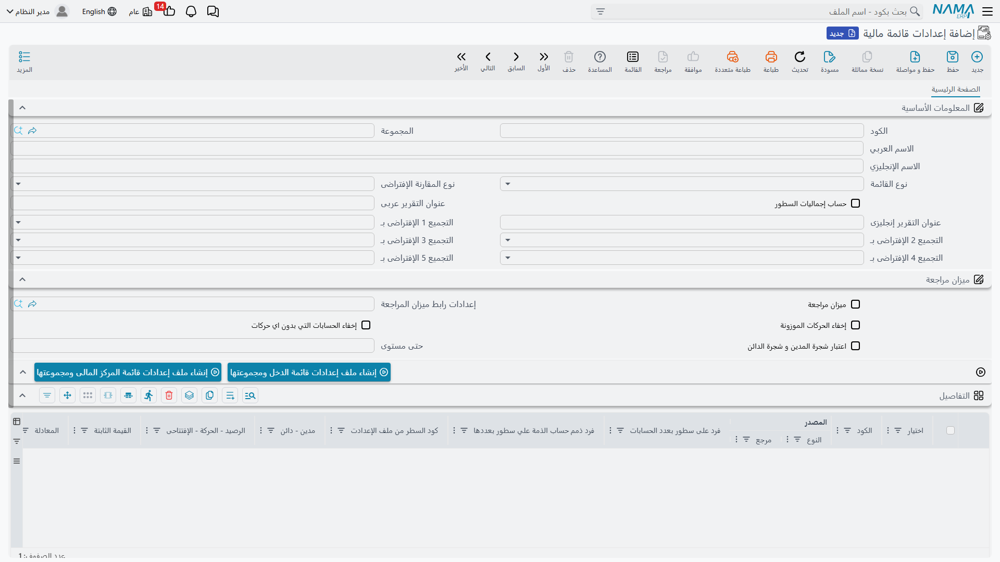
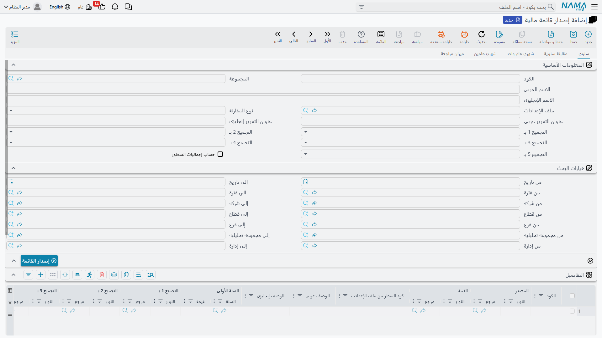
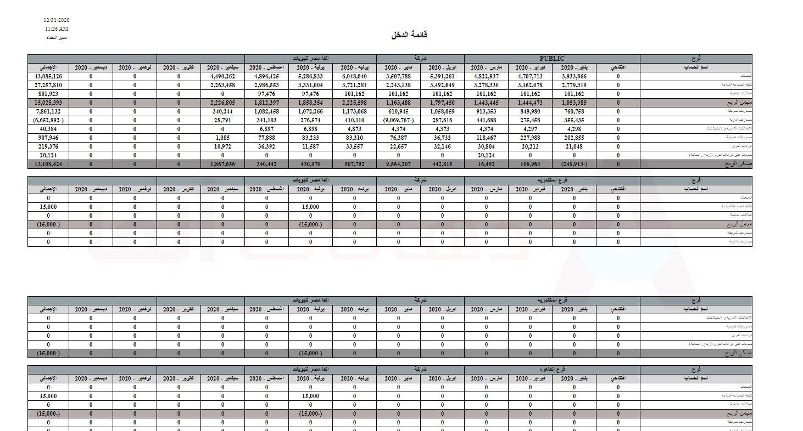

# القوائم المالية

تحتاج كلُّ شركةٍ إلى قائمة دخلٍ وميزانية، لكنْ ما من شركتين تريدان عرضهما بالطريقة نفسها تمامًا — تجميعات سطورٍ مختلفة، ومجاميع فرعيةٌ مختلفة، وأعمدة مقارنةٍ مختلفة. وبدل تثبيت تقريرٍ جامد، يمنحك نما **محرّك قوائم ماليةٍ قابلًا للتهيئة**: تصف شكل القائمة مرّةً واحدة، ثم *تُصدِرها* لأيّ فترةٍ لتحصل على الأرقام. فقائمة الدخل والميزانية والتدفّقات النقدية التي تطبعها كلُّها مخرجاتٌ لهذا المحرّك الواحد.

::: info الترخيص المطلوب
محرّك القوائم المالية جزءٌ من ترخيص `accounting` الأساسي. وشاشاته تحت **الحسابات > القوائم المالية**.
:::

## مكوّنات البناء

تصمّم القائمة من أربع شاشات، انطلاقًا من القطع الصغيرة وصولًا إلى التقرير النهائي:

1. **مجموعة حساب** (`Accounting > Financial Statement > FS Account Group`) — حزمةٌ مسمّاة من الحسابات، كي يقول سطرُ القائمة «إيرادات التشغيل» فيسحب مجموعةً كاملةً بدل سرد الحسابات واحدًا واحدًا.
2. **معادلة** (`Accounting > Financial Statement > FS Equation`) — صيغةٌ قابلة لإعادة الاستخدام. تستخدم السطورُ المعادلاتِ لحساب قيمتها: رصيدًا، أو حركة مدين/دائن، أو رقمًا افتتاحيًا، أو إجماليًا مجمّعًا من سطورٍ أخرى.
3. **إعدادات قائمة مالية** (`Accounting > Financial Statement > FS Settings File`) — **القالب**: مجموعة السطور المرتّبة التي *هي* بنية القائمة، إضافةً إلى كيفية تجميعها ومقارنتها وعرضها.
4. **إصدار قائمة مالية** (`Accounting > Financial Statement > Issuing Financial Statement File`) — **اللقطة المحسوبة**: تُشغِّل ملف إعداداتٍ لفترةٍ فيلتقط الأرقام الفعلية، جاهزةً للطباعة وللمقارنة مع إصداراتٍ لاحقة.

## تصميم القائمة (ملف الإعدادات)

في **إعدادات القائمة المالية** تتشكّل القائمة. يحمل الملفُّ **عنوان تقريرٍ** بالعربية والإنجليزية، وشبكةً من **السطور** — كلُّ سطرٍ صفٌّ في القائمة النهائية:

- **مستوى** يحدّد موضع الصفّ في التسلسل (عناوين، سطور فرعية، مجاميع)، و**وصفٌ** عربي/إنجليزي،
- **معادلة** تُنتِج قيمة الصفّ — وثمّة خاناتُ معادلاتٍ منفصلة لـ**الرصيد/الحركة**، و**المدين-الدائن**، و**الافتتاحي**، و**المجاميع**، كي يتصرّف السطر الواحد تصرّفًا صحيحًا سواءٌ كان سطرًا عاديًا أم مجموعًا فرعيًا،
- أو بدلًا من ذلك **قيمة ثابتة**، أو إشارةٌ إلى قيمة سطرٍ آخر بـ**كود السطر المصدر**،
- **حدود محدِّداتٍ** على مستوى السطر — «قصر السطور على الفرع / القطاع / الإدارة / المجموعة التحليلية / الذمة / المرجع…» — كي يُقصَر سطرٌ على فرعٍ أو مركز تكلفةٍ واحد،
- وعلاماتٌ مثل **غير ظاهر في التقارير** (سطر عملٍ يُستخدَم في الحساب فقط) و**تفريد في سطور / تفريد الذمم في سطور** (تفجير مجموعةٍ أو ذممها إلى صفوفٍ مفردة).

وعند الرأس تختار أيضًا كيف تتصرّف القائمة كلُّها:

- **نوع المقارنة** — **عام واحد**، أو **عامين**، أو **مجموعة فترات متتابعة** (سلسلة فتراتٍ متتالية، أي أعمدةٌ شهرًا بشهر)، أو **مجموعتي فترات من عامين** (الأشهر نفسها عبر عامين)،
- حتى خمسة **محاور تجميع** (**التجميع حسب** الشركة، الفرع، الإدارة، القطاع، المجموعة التحليلية، المراجع، السجلّ، أو الذمة) — كي تتفرّع القائمة نفسها حسب المحدِّد،
- وخيارات العرض: **إنشاء سطور المجاميع**، و**إخفاء الأرصدة الصفرية**، و**إخفاء الحركات المتوازنة**، و**العرض حتى مستوى** (طيّ التفاصيل بعد عمقٍ معيّن)، و**اعتبار شجرتَي المدين والدائن**.

## إصدار القائمة

ملفُّ الإعدادات تصميمٌ فحسب؛ أمّا الأرقام فتأتي من **إصدار**. تُشغِّل **شاشة إصدار القائمة المالية** ملفَّ إعداداتٍ لفترةٍ مختارة وتخزّن النتيجة المحسوبة كإصدارٍ محفوظ. وهذه اللقطة هي ما تطبعه تقارير الإصدارات — ولأنّ كلّ إصدارٍ محفوظ، يمكنك مقارنة إصدار هذا الشهر بالسابق، أو هذا العام بالماضي.

## التقارير

تخرج القوائم المطبوعة كلُّها من هذا المحرّك، تحت قائمة التقارير (`Acc-FNS`، الأكواد `SYSR-FNS*`):

- **قائمة الدخل** — حسب الحسابات (`SYSR-FNS001`)، وشهريًا (`SYSR-FNS002`)، ومجمّعةً حسب المحدِّد (`SYSR-FNS009`).
- **الميزانية** — حسب الحسابات (`SYSR-FNS003`)، وشهريًا (`SYSR-FNS004`)، وبالأرصدة، وحسب فئة الحساب.
- **قائمة التدفّقات النقدية.**
- **قوائم مبنيّة على الإصدار** تُطبَع من إصدارٍ محفوظ: قائمة دخلٍ شهرية لعامٍ/عامين (`SYSR-FNS010`/`SYSR-FNS011`)، وقائمة دخلٍ سنوية لعامٍ/عامين (`SYSR-FNS012`/`SYSR-FNS013`)، وميزانية سنوية لعامٍ/عامين (`SYSR-FNS014`/`SYSR-FNS015`)، إضافةً إلى ميزان مراجعةٍ للقائمة المالية.

## للدعم الفني

- **«سطرٌ يُظهِر رقمًا خاطئًا»** — تحقّق من **معادلة** السطر (رصيد أم مدين-دائن أم افتتاحي أم مجاميع) ومن أيّ **حدود محدِّداتٍ** عليه؛ فالسطر المقصور على فرعٍ واحدٍ يجمع ذلك الفرع فقط.
- **«مجموعٌ فرعي لا يطابق»** — تستخدم سطورُ المجاميع **معادلة المجاميع** وتشير إلى سطورٍ أخرى بـ**كود السطر المصدر**؛ راجِع تلك الإشارات و**مستويات** السطور.
- **«أعمدة المقارنة مفقودة/خاطئة»** — هذا هو **نوع المقارنة** (عام واحد / عامين / مجموعة فترات / مجموعتي فترات) في ملف الإعدادات.
- **«الأرقام قديمة»** — تطبع تقاريرُ الإصدار **إصدارًا** محفوظًا؛ أعِد إصدار ملف الإعدادات للفترة كي تُحدِّث اللقطة.
- **«صفوفٌ صفرية/فارغة تزحم القائمة»** — فعّل **إخفاء الأرصدة الصفرية** (و**العرض حتى مستوى** لطيّ التفاصيل العميقة).
