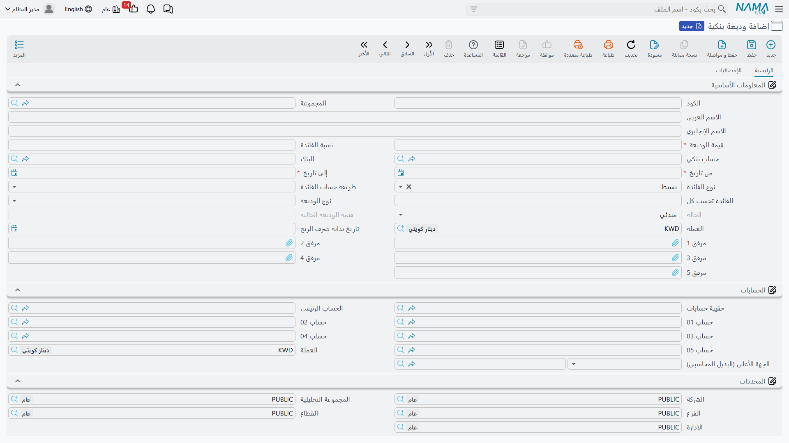
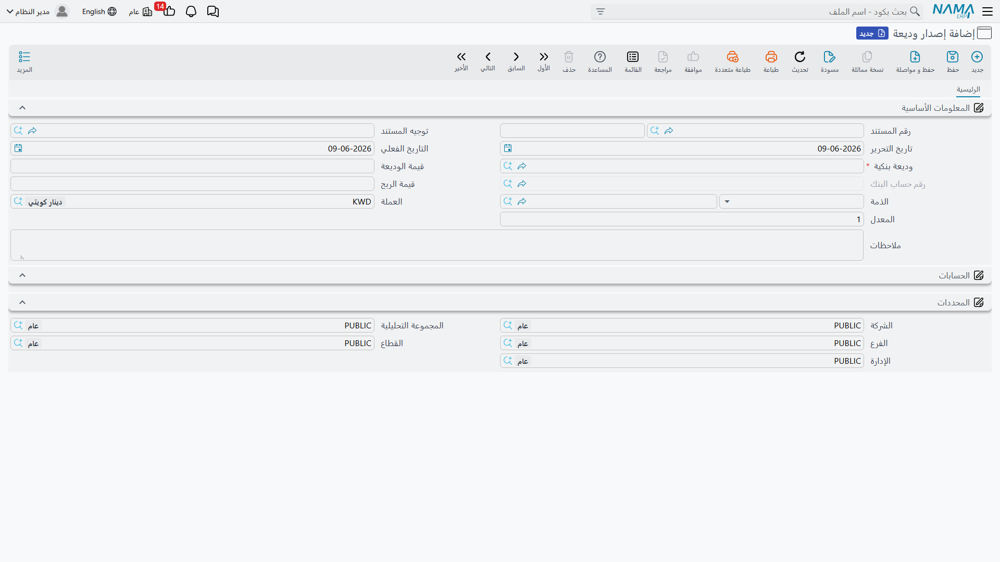

# الودائع الثابتة

الوديعة الثابتة هي صورة القرض معكوسةً: بدل أن تقترض من البنك، تودِع لديه مبلغًا لمدّة محدّدة مقابل فائدة. وتتبعها نما بالمنطق نفسه الذي تتبع به [القروض البنكية](./bank-loans.md): ملفٌ رئيسي يحمل شروط الوديعة، ثم سند إصدار يُرحّلها، ثم سندات إصدار أرباح دورية تثبّت الفوائد.

::: info الترخيص المطلوب
الودائع الثابتة ضمن ترخيص `accounting-loans` — وهو الترخيص نفسه الذي يغطّي [القروض البنكية](./bank-loans.md) و[التسهيلات الائتمانية](./credit-facilities.md).
:::

## دورة حياة الوديعة

تبدأ كل الشاشات من جذر **البنوك > ودائع بنكية**:

1. **وديعة بنكية** — الملف الرئيسي بحالته المبدئية «مبدئي».
2. **إصدار وديعة** — اللحظة التي يخرج فيها المبلغ إلى الوديعة فعلًا (يُرحَّل محاسبيًا، وتتحوّل الحالة إلى «تم إصدارها»).
3. **سند إصدار أرباح** — تثبيت دفعات الفوائد الدورية (المستند نفسه المستخدَم في القروض).
4. **سند تعديل وديعة** — تعديل بيانات الوديعة بعد إصدارها.

## الملف الرئيسي للوديعة

في شاشة **وديعة بنكية** (`Banks > Fixed Deposits > Fixed Deposit`) تُعرّف الشروط: **البنك** و**حساب البنك**، و**نوع الوديعة**، و**قيمة الوديعة**، و**من تاريخ / إلى تاريخ**، و**تُحسب كل** (فترة احتساب الفائدة)، و**نسبة الفائدة** و**نوع الفائدة** و**طريقة احتساب الفائدة** و**تاريخ بدء دفع الفوائد**.

**نوع الفائدة:** بسيط (Simple) أو مركّب (Compound). و**طريقة احتساب الفائدة** تحدّد دورية الاحتساب: سنوي (Yearly) أو شهري (Monthly) أو يومي (Daily).

**حالات الوديعة:** مبدئي (Initial) → تم إصدارها (Released) → قيد التنفيذ (In Progress) → منتهي (Finished) / ملغي (Cancelled).

## الإصدار ودفع الأرباح

عند تحرير **إصدار وديعة** (`Banks > Fixed Deposits > Fixed Deposit Issue`) يخرج المبلغ من حسابك إلى الوديعة لدى البنك، ويُرحَّل الأثر المحاسبي عبر جانبَي **مدين/دائن قيمة الفائدة** إلى جانب أصل المبلغ، وتتحوّل حالة الوديعة إلى «تم إصدارها».

ثم تُثبَّت الفوائد المستحقّة دوريًا عبر **سند إصدار أرباح** (`Banks > Fixed Deposits > Interest Payment Document`) — وهو المستند المشترك مع القروض. (مصدر حسابات الإصدار والأرباح في مرجع [توجيهات المستندات](./support/accounting-document-terms.md).)

## التعديل

يُستخدم **سند تعديل وديعة** لتعديل بيانات الوديعة بعد إصدارها ضمن ضوابط النظام.

## النماذج المطبوعة

| النموذج | المستند |
|---|---|
| الوديعة البنكية (SYSF-BNK010) | مطبوعة بيانات الوديعة. |
| إصدار الوديعة (SYSF-BNK011) | مطبوعة سند إصدار الوديعة. |

## للدعم الفني

- **«الوديعة ما زالت مبدئية»** — لم يُحرَّر سند إصدار الوديعة بعد؛ الإصدار هو ما يُخرج المبلغ ويحرّك الحالة.
- **«الفوائد لا تُحتسب كما أتوقّع»** — تحقّق من **نوع الفائدة** (بسيط/مركّب) و**طريقة احتساب الفائدة** (سنوي/شهري/يومي) على الوديعة.
- **«سند إصدار الأرباح نفسه يظهر في القروض»** — هذا صحيح؛ المستند مشترك بين الودائع و[القروض](./bank-loans.md).
- **«من أين تأتي حسابات الفائدة؟»** — من توجيه **إصدار الوديعة** و**سند إصدار الأرباح**؛ راجِع [توجيهات المستندات](./support/accounting-document-terms.md).
- آلية المعالجة المحاسبية في [كيف تُعالَج المستندات إلى أثر محاسبي](./support/accounting-request-processing.md).
