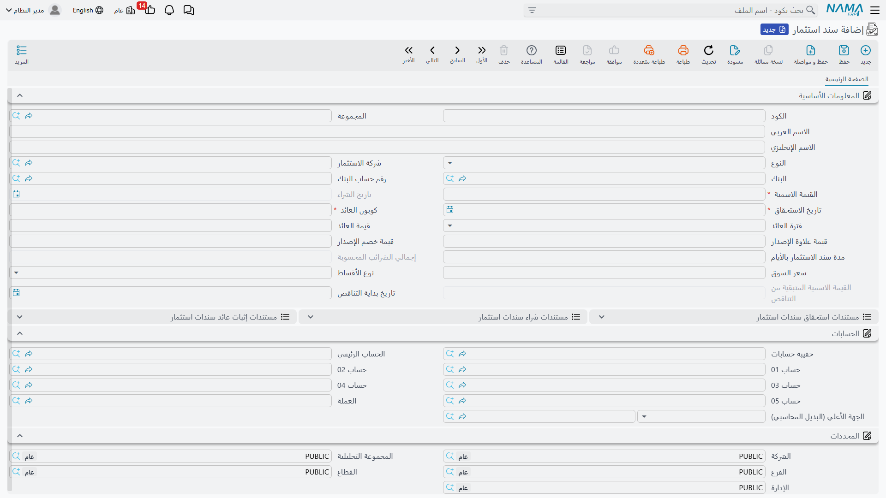
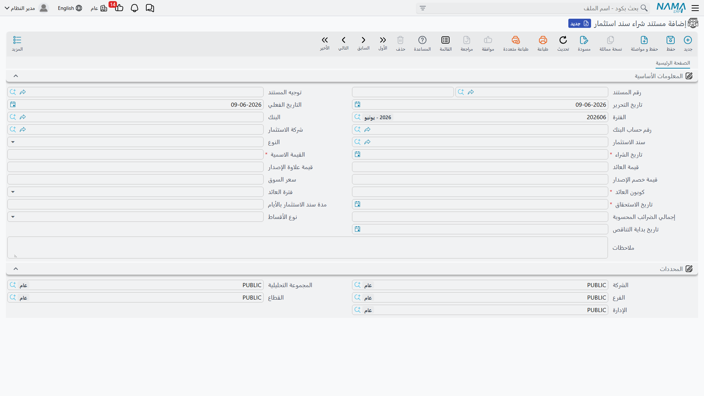
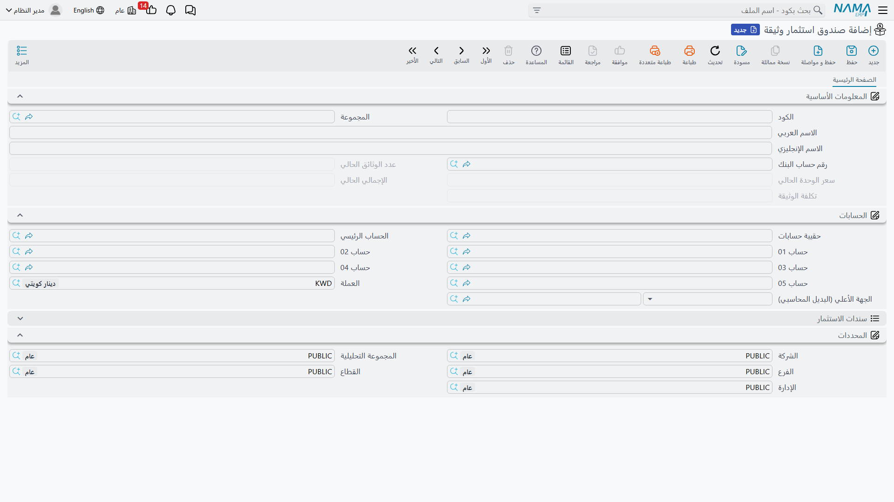

# مستندات الاستثمار وشهادات الصناديق

إلى جانب منظومة المحافظ التي تتبع *الأصول* الاستثمارية، لدى نما عالمٌ استثماريٌّ ثانٍ للأدوات **الورقية** التي تشتريها الشركة وتحتفظ بها: السندات وشهادات الصناديق. وهذه تتصرّف تصرّفًا مختلفًا تمامًا عن الحصّة في رأس المال، فلها مستنداتها الخاصّة. تغطّي هذه الصفحة كليهما — وهما نفساهما ينقسمان إلى نوعين، وهذا أوّل ما ينبغي ضبطه.

::: info الترخيص المطلوب
مستندات الاستثمار ضمن ترخيص `accounting-investment-documents` — وهو الترخيص نفسه الذي يغطّي **[أذون الخزانة](./treasury-bills.md)**. والشاشات تحت **البنوك > سندات الاستثمار** (و**البنوك > استثمارات الوثائق** للصناديق).
:::

## نوعان من الأدوات — ولماذا وُجِد كلاهما

يلبّي النوعان حاجتين مختلفتين، فلا تخلط بينهما:

- **سند استثمار** — أداةٌ **شبيهة بالسند**. تُقرِض مالًا مقابل ورقةٍ لها **قيمة اسمية** وتدفع **عائدًا** دوريًا (كوبون). وقد تكون **سند خزانة** أو **سند شركة**، وقد يكون ردُّ أصلها **ثابتًا** (تعود القيمة الاسمية كاملةً عند الاستحقاق) أو **متناقصًا** (تُسدَّد القيمة الاسمية تدريجيًا على عمر السند). والعائد كوبونٌ معلوم — أنت هنا مُقرِض.
- **صندوق استثمار وثيقة** — شهادة صندوقٍ **مبنيّة على الوحدات**. تشتري **عددًا من الوحدات** بـ**سعر وحدة**، فتساوي حصّتُك الوحداتِ × السعر الحالي. ولا كوبون ثابت؛ فمكسبك أو خسارتك هو حركة سعر الوحدة — أنت هنا حاملُ وحدات.

باختصار: السندات لعائدٍ ثابتٍ على هيئة كوبون؛ والصناديق لحيازةٍ يقودها السعر. أمّا **أذون الخزانة** (أداةٌ ثالثةٌ خصمية قصيرة الأجل) فلها [صفحتها الخاصّة](./treasury-bills.md).

## سندات الاستثمار (السندات)

يصف الملفُّ الرئيسي **سند استثمار** (`Banks > Investment Documents > Investment Document`) السندَ: **نوعه** (سند خزانة / سند شركة)، و**قيمته الاسمية**، ونسبة **الكوبون** و**فترة العائد**، ونوع الأقساط **ثابت / متناقص** (مع **تاريخ بدء التناقص** وتتبّع **القيمة الاسمية المتبقية للمتناقص**)، و**خصم الإصدار / علاوة الإصدار**، و**سعر السوق**، و**شركة الاستثمار**. وتتبع **حالته** المسارَ المألوف **مبدئي ← جاري ← مغلقة**.

ويُبعَث السند بسلسلةٍ من المستندات:

1. **مستند شراء سند استثمار** (`Banks > Investment Documents > Investment Doc Purchase Document`) — الشراء، وهو المستند الذي **يُرحِّل**. يحمل أثرُه جانبَي **القيمة الاسمية** مدين/دائن، إضافةً إلى جانبَي **خصم الإصدار** و**علاوة الإصدار** — فالسند نادرًا ما يُشترى بقيمته الاسمية تمامًا.

   

2. **إثبات العائد** (و**إثبات عائد مجمع** لعدّةٍ دفعةً واحدة) — تثبيت الكوبون الدوري.
3. **المطالبة** — تحصيل قيمة السند عند الاستحقاق.

## صناديق استثمار الوثائق (شهادات الوحدات)

يتتبّع الملفُّ الرئيسي **صندوق استثمار وثيقة** (`Banks > Investment Document > Investment Document Fund`) حيازةً مبنيّةً على الوحدات، تُقيَّم بالوحدات × سعر الوحدة.

وله مستنداته الثلاثة: **شراء** (شراء وحدات)، و**بيع** (بيع وحدات)، و**تحديث سعر** (إعادة تقييم الحيازة مع حركة سعر الوحدة). ولأنّ قيمة الصندوق تتبع السوق، فمستند تحديث السعر هو ما يبقي قيمته محدَّثةً بين الشراء والبيع.

## توزيع الأرباح

حين تدرّ الاستثماراتُ ربحًا يُوزَّع على الشركاء، يسجّله ويوزّعه **مستند توزيع أرباح** (`Accounting > Documents > Profits Distribution Doc`). ونموذجه المطبوع `SYSF-ACC023`.

## للدعم الفني

- **«أيّهما أُنشئ — سندًا أم صندوقًا؟»** — سندٌ له قيمة اسمية وكوبون ← **سند استثمار**؛ حيازةٌ تُقاس بالوحدات بسعر وحدة ← **صندوق استثمار وثيقة**.
- **«لا توجد شاشة لإنشاء السند يدويًا»** — الملف الرئيسي للسند يُعَدّ، لكنّ محاسبته تبدأ بـ**مستند الشراء**؛ ثم يأتي العائد عبر **إثبات العائد**.
- **«قيمة الصندوق قديمة»** — تُعاد تقييمات الصناديق بمستند **تحديث سعر**؛ وبدونه تُظهِر الحيازةُ آخر سعرٍ معروف.
- **«القيمة الاسمية لسندٍ متناقص لا تنخفض»** — تحقّق من **تاريخ بدء التناقص** ونوع الأقساط؛ و**القيمة الاسمية المتبقية للمتناقص** تتبّع ما تبقّى.
- **«من أين تأتي حسابات القيمة الاسمية / الخصم / العلاوة؟»** — من توجيه **شراء سند الاستثمار**؛ راجِع [توجيهات المستندات](./support/accounting-document-terms.md).
