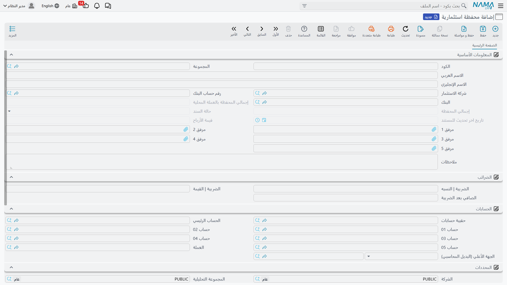
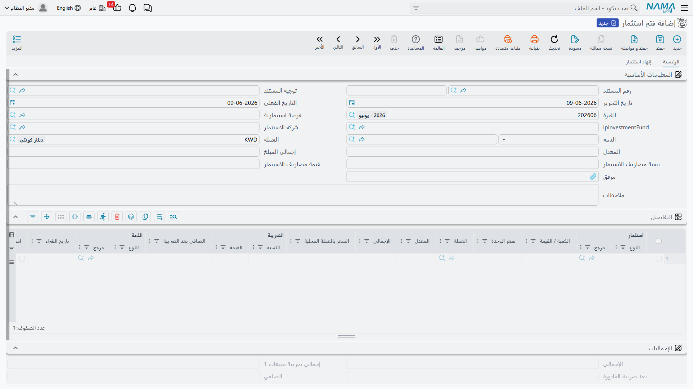

# المحافظ الاستثمارية

حين تضخّ الشركةُ مالًا في مشاريع — حصّةً في عملٍ آخر، أو مشروعًا، أو صندوقًا مُدارًا — تحتاج إلى تتبّع كلّ استثمارٍ كأصلٍ قائمٍ بذاته: كم من رأس المال دخل، وكم يساوي الآن، وكم درّ من ربح، ومتى صُفِّي. ومنظومة **المحافظ الاستثمارية** مبنيّةٌ لهذا تحديدًا: تتبع الأصل الاستثماري من فرصةٍ أولى، مرورًا بضخّ رأس المال، وصولًا إلى توزيع الأرباح ثم إقفاله.

::: info الترخيص المطلوب
المحافظ الاستثمارية ضمن ترخيص `accounting-investment`. ومعظم الشاشات تحت **الحسابات > محافظ استثمارية**.
:::

::: tip منظومتا استثمارٍ متجاورتان
لدى نما منظومتا استثمارٍ *متوازيتان*. تغطّي هذه الصفحة **المحافظ الاستثمارية** — تتبّع *الأصول* الاستثمارية (حصص، مشاريع، صناديق) عبر حياتها. أمّا الأخرى، **[مستندات الاستثمار وشهادات الصناديق](./investment-documents.md)**، فتغطّي الأدوات الشبيهة بالسندات وشهادات الصناديق المبنيّة على الوحدات. تحلّان مشكلتين مختلفتين؛ فاختر ما يطابق ما تملكه.
:::

## الملفات الرئيسية

قبل تسجيل النشاط تُعِدّ الأطراف والأصل:

- **محفظة استثمارية** (`Accounting > Investment Portfolios > Investment Portfolio`) — الأصل الاستثماري نفسه. تحمل **شركة الاستثمار**، و**البنك / الحساب البنكي** المموِّل، و**إجمالي المحفظة** المتجدّد (بعملة المستند والعملة المحلية)، و**مبلغ الربح**، وأيّ **ضريبة**. وتتحرّك **حالتها** **مبدئي ← جاري ← مغلقة** بحسب ما تفعله مستندات دورة الحياة بها.
- **مستثمر** (`Accounting > Investment Portfolios > Investor`) — طرفٌ يستثمر.
- **مشروع استثماري** (`Accounting > Investment Portfolios > Investment Project`) — مشروعٌ يُخصَّص له رأس مال.

وثمّة كذلك ملفاتُ بناءٍ — **الأسهم** و**الحصص** و**الودائع النقدية** و**الصناديق الاستثمارية** و**أنواع الصناديق** — تصف تركيبة ما هو مملوك.

## دورة الحياة

تقود حياةَ المحفظة سلسلةٌ من المستندات:

1. **فرصة استثمارية** (`Banks > Investment Documents > Investment Opportunity`) — مرحلة التخطيط: استثمارٌ مرشَّح يُدرَس قبل أن يتحرّك أيُّ مال.
2. **فتح استثمار** (`Accounting > Investment Portfolios > Investment Start`) — يضخّ رأس المال. هذا هو المستند الذي **يُرحِّل**: ينقل المحفظة إلى **جاري** ويسجّل الاستثمار. ويجري أثره عبر جانبَي **مدين/دائن** (الأصل الاستثماري مقابل البنك/النقدية المموِّل)، وجانبَي **مصروفات الاستثمار** لأيّ تكاليف اقتناء، وجانبَي **الضريبة**.

   

3. **تحديث الاستثمار** (`Accounting > Investment Portfolios > Investment update`) و**زيادة رأس مال الاستثمار** (`… > Investment Capital Increase`) — إعادة تقييم الاستثمار أو ضخّ رأس مالٍ إضافي أثناء جريانه.
4. **توزيع أرباح الاستثمار** (`Accounting > Investment Portfolios > Investment Profit Distribution`) — يقيّد الربح الذي يدرّه الاستثمار ويوزّعه.
5. **إنهاء استثمار** (`Accounting > Investment Portfolios > Investment End`) — يصفّي الاستثمار ويضع المحفظة في حالة **مغلقة**.

وإلى جوار هذه، يحرّك **تخصيص استثمار** و**رد تخصيص استثمار** (`… > Investment Allocation` / `Refund Investment Allocation`) رأسَ المال إلى **المشاريع الاستثمارية** ومنها، وتخطّط **موازنة المشاريع الاستثمارية** (`… > Investment Budget`) أرقام تلك المشاريع.

## التقارير

تلخّص **ميزانية المشاريع الاستثمارية** (`SYSR-IVS001`) موقفَ المشاريع الاستثمارية.

## للدعم الفني

- **«المحفظة عالقةٌ على مبدئي»** — لا تتحرّك إلى **جاري** إلّا باعتماد مستند **فتح استثمار** عليها؛ راجِع ذلك المستند.
- **«لا أستطيع إقفال الاستثمار»** — يتمّ الإقفال بمستند **إنهاء استثمار**، لا بتعديل المحفظة.
- **«الربح لا يظهر»** — يقيّد الربحَ مستندُ **توزيع أرباح الاستثمار**؛ و**مبلغ الربح** في المحفظة يعكس تلك المستندات.
- **«أيّ منظومة استثمارٍ أستخدم؟»** — المحافظ (هنا) تتبع *الأصول* الاستثمارية عبر حياتها؛ أمّا السندات وشهادات الصناديق فاستخدم لها [مستندات الاستثمار](./investment-documents.md).
- **«من أين تأتي حسابات الاستثمار / المصروف / الضريبة؟»** — من توجيه **فتح الاستثمار**؛ راجِع [توجيهات المستندات](./support/accounting-document-terms.md).
