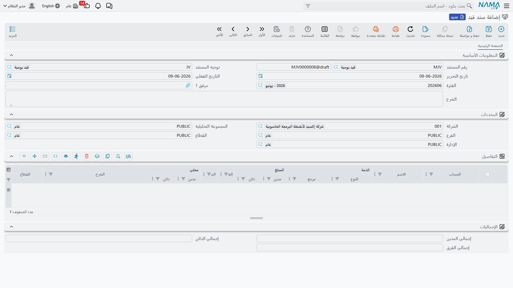

# سندات القيد والتسويات

معظم القيود في نما تُولَّد تلقائيًا من مستندات أخرى (فاتورة، صرف مخزني، راتب...)، لكن يبقى هناك حاجة دائمة لتسجيل قيود **يدوية**: تسوية، مصروف نثري، رصيد افتتاحي، إقفال حساب وسيط. هذه وظيفة **سند القيد**. وإلى جواره مستندات قيد متخصّصة تتولّى حالات بعينها: **سند قيد فرق عملة**، و**سند تغيير سعر الصرف**، و**جاري تحويل الشركات**.

::: info الترخيص المطلوب
سند القيد وفرق العملة وتحويل الشركات ضمن ترخيص المحاسبة الأساسي `accounting`. أما **سند تغيير سعر الصرف** فهو خاصية ضمن ترخيص البنوك `accounting-banks`.
:::

## سند القيد

سند القيد (`Accounting > Documents > Journal Entry`) هو المستند المتوازن الذي تُدخل فيه أسطر المدين والدائن بنفسك، بشرط أن يتساوى مجموع المدين مع مجموع الدائن قبل أن يقبله النظام.

### رأس المستند

في الرأس تحدّد:

- **توجيه المستند** — التوجيه (`توجيه`) الذي يحكم سلوك القيد ومن أين تأتي حساباته الخاصة (كحساب الفرق). تفاصيل التوجيهات في مرجع [توجيهات المستندات](./support/accounting-document-terms.md).
- **رقم المستند** و**تاريخ التحرير** — الرقم التسلسلي وتاريخ إنشاء المستند.
- **التاريخ الفعلي** — التاريخ المحاسبي الذي يُسجَّل به الأثر (وهو ما يحدّد الفترة)، وقد يختلف عن تاريخ التحرير.
- **الفترة** — الفترة المحاسبية التي يقع فيها التاريخ الفعلي؛ يحدّدها النظام تلقائيًا، وإن كانت مغلقة يُرفض الحفظ.
- **الشرح** و**المحددات** (الشركة، الفرع، القطاع، الإدارة، المجموعة التحليلية) على مستوى المستند.

### أسطر التفاصيل

في جدول **التفاصيل** يُدخل كل سطر:

- **الحساب** و**الذمة** (الطرف، إن كان الحساب من نوع ذمة).
- **المبلغ مدين** أو **المبلغ دائن** — قيمة السطر على جانبه، بعملة السطر، مع عرض القيمة **المحلية** المقابلة بعد الترجمة بسعر الصرف.
- **المرجع** و**الشرح** ومحدّدات السطر (القطاع/الفرع/الإدارة) لمن يحتاج تفصيلًا أدقّ من رأس المستند.
- حقول الضريبة (نسبة وقيمة ضريبة 1 و2) تظهر حين تُفعَّل خصائص الضريبة، وتربط القيد اليدوي بأثره الضريبي.

### الموازنة وحساب الفرق

أسفل الشاشة تعرض **الإجماليات**: **إجمالي المدين** و**إجمالي الدائن** و**إجمالي الفرق**. ما دام إجمالي الفرق غير صفر فالقيد غير متوازن ولن يُحفظ. يتيح التوجيه تحديد **حساب فرق** يمتصّ فروق التقريب الصغيرة آليًا حتى يتوازن القيد، فلا تضطر لضبط القروش يدويًا.

### توزيع التكلفة

جدول **توزيع التكلفة** يتيح توزيع قيمة القيد على مراكز/أبعاد التكلفة بشكل مستقل عن أسطر المدين والدائن، لأغراض التحليل الإداري.

## سند قيد فرق عملة

**سند قيد فرق العملة** (`Accounting > Documents > Currency Diff Journal`) قيدٌ متخصّص لإثبات الفروق الناتجة عن تذبذب أسعار الصرف على الأرصدة بالعملات الأجنبية. غالبًا ما يُولَّد تلقائيًا كنتيجة لـ **سند تغيير سعر الصرف** (انظر أدناه)، لكنه يبقى مستندًا مستقلًا يمكن مراجعته وطباعته.

## سند تغيير سعر الصرف

حين تتغيّر أسعار العملات، تحتاج أرصدتك بالعملات الأجنبية إلى **إعادة تقييم** وفق السعر الجديد. **سند تغيير سعر الصرف** (`Accounting > Documents > Exchange Rate Update`) يقوم بذلك دفعةً واحدة: تحدّد فيه **الحساب** (أو نطاق الحسابات) و**العملة** و**سعر الصرف** الجديد و**الحساب الوسيط** الذي تُسجَّل عليه فروق إعادة التقييم، فيحسب النظام الفرق لكل رصيد ويُولِّد قيود فروق العملة المقابلة.

::: warning
الحسابات المفعّل عليها **لا يدرج في سندات تغيير سعر الصرف آليا** (انظر [الحسابات](./accounts.md)) تُستثنى من إعادة التقييم. هذه خاصية ضمن ترخيص البنوك `accounting-banks`.
:::

## جاري تحويل الشركات

عند تحويل قيمة بين شركتين داخل نفس المجموعة، **جاري تحويل الشركات** (`Accounting > Documents > Inter Company Transfer`) يُسجِّل الطرفين في خطوة واحدة: يُولِّد **سند قيد** في الشركة الأولى وآخر مقابلًا في الشركة الثانية، فيظل حسابا «الجاري بين الشركات» متطابقَين دون إدخال مزدوج يدوي.

## التقارير والنماذج

- كشوف القيود والحركات اليومية (`SYSR-ACC` لكشوف القيود) موضّحة في صفحة [كشوف الحسابات وميزان المراجعة](./reports-account-statements-and-trial-balance.md).
- النموذج المطبوع لسند القيد هو `SYSF-ACC001`، ولسند فرق العملة `SYSF-ACC008`، ولجاري تحويل الشركات `SYSF-ACC007`.

## للدعم الفني

- **«القيد لا يُحفظ — غير متوازن»** — راجِع **إجمالي الفرق**؛ يجب أن يكون صفرًا. إن كان فرقًا ضئيلًا ففعّل/راجِع **حساب الفرق** في التوجيه.
- **«رفض الحفظ بسبب الفترة»** — التاريخ الفعلي يقع في فترة **مغلقة** أو لا تغطّيه فترة؛ راجِع [الإقفال والتحكم في الفترات](./year-end-and-period-control.md).
- **«حقول الضريبة لا تظهر في القيد»** — خصائص الضريبة غير مفعّلة في كتالوج [إعدادات الحسابات](./support/accounting-configuration.md).
- **«من أين يأتي حساب الفرق / حسابات التوجيه؟»** — من **توجيه المستند**؛ التفاصيل في مرجع [توجيهات المستندات](./support/accounting-document-terms.md).
- آلية تحوّل المستند إلى أثر محاسبي وكيفية إعادة معالجة قيد متعثّر في [كيف تُعالَج المستندات إلى أثر محاسبي](./support/accounting-request-processing.md).
