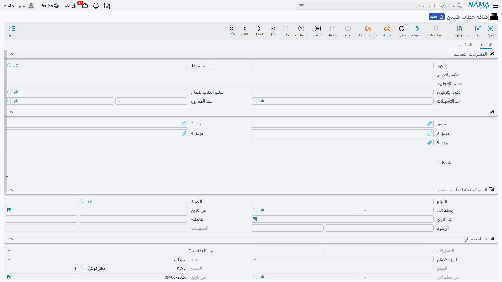
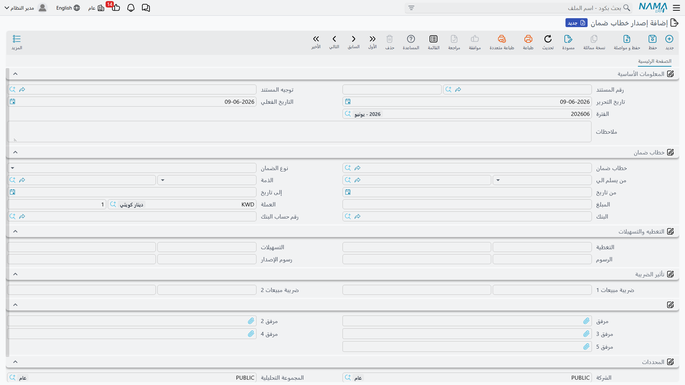

# خطابات الضمان

خطاب الضمان تعهّد يصدره البنك نيابةً عنك لصالح طرفٍ ثالث (جهة حكومية، مالك مشروع...) يضمن وفاءك بالتزامٍ ما — كضمان دخول مناقصة أو حُسن تنفيذ عقد. لا يخرج منه نقدٌ فعلي عند الإصدار، لكنه **يجمّد جزءًا من حدّ تسهيلاتك** لدى البنك ويُحمّلك **رسومًا**. لذلك يتتبّع نما خطاب الضمان كملفٍ رئيسي تتعاقب عليه مستندات حركة تُصدِره وتستلمه وتسلّمه وتعدّله وتنهيه، مع لقطتين دائمًا: **القيم المبدئية** عند الإصدار و**القيم الحالية** بعد التعديلات.

::: info الترخيص المطلوب
خطابات الضمان ضمن ترخيص `accounting-lgt`.
:::

## دورة حياة الخطاب

تبدأ كل الشاشات من جذر **البنوك > خطابات الضمان**:

1. **طلب خطاب ضمان** — توثيق طلب الخطاب قبل إصداره (لا أثر محاسبي).
2. **خطاب ضمان** — الملف الرئيسي بحالته المبدئية «مبدئي».
3. **إصدار خطاب ضمان** — اللحظة التي يصدر فيها البنك الخطاب فعلًا (يُرحَّل محاسبيًا، وتتحوّل الحالة إلى «تم إصداره»).
4. **استلام / تسليم خطاب ضمان** — تتبّع تداول نسخة الخطاب الورقية مع الجهة المستفيدة.
5. **تعديل خطاب ضمان** — تمديد المدة أو تغيير القيمة أو الرسوم (يُحدِّث القيم الحالية ويُسجّل رسوم التعديل).
6. **إنهاء خطاب ضمان** — إقفال الخطاب عند انتهائه أو إلغائه.

ويُستخدم **مستند افتتاحي خطاب ضمان** لإدخال أرصدة الخطابات القائمة عند بدء العمل على النظام.

## الملف الرئيسي للخطاب

في شاشة **خطاب ضمان** (`البنوك > خطابات الضمان > خطاب ضمان`) تُعرّف بيانات الخطاب:

- **المعلومات الأساسية**: ربط الخطاب بـ **طلب خطاب الضمان** الذي سبقه، وبـ **حدّ التسهيلات** الذي يُحجز منه، وبـ **عقد المشروع** عند الحاجة.
- **القيم المبدئية لخطاب الضمان**: لقطة شروط الإصدار — **المبلغ** و**العملة**، **مَن يُسلَّم إليه** الخطاب، **من تاريخ / إلى تاريخ**، **التغطية** (المبلغ المغطّى نقدًا)، **التسهيلات** (الجزء المحجوز من حدّ التسهيلات)، و**الرسوم**.
- **خطاب ضمان (القيم الحالية)**: **نوع الخطاب** و**نوع الضمان** و**الحالة**، إضافةً إلى القيم السارية بعد أي تعديل (المبلغ، التغطية، التسهيلات، رسوم التعديل).

**نوع الضمان** يصنّف غرض الخطاب: **ضمان ابتدائي** (دخول مناقصة)، **ضمان نهائي** (حُسن تنفيذ)، **ضمان دفعة مقدمة**، **ضمان جمركي**، أو أنواع أخرى.

### حالات الخطاب

| الحالة | متى |
|---|---|
| مبدئي (Initial) | عند الحفظ قبل الإصدار. |
| تم إصداره (Issued) | بعد ترحيل سند الإصدار. |
| تم استلامه (Received) / توصيل كلي (Totally Delivered) | بعد تتبّع تداول نسخة الخطاب. |
| منتهي (Finished) | بعد الإنهاء العادي. |
| ألغيت (Canceled) | عند الإلغاء. |
| مُسيل (Liquidated) | عند تسييل الخطاب (مطالبة المستفيد بقيمته). |

## الإصدار وحجز التسهيلات

عند تحرير **إصدار خطاب ضمان** (`البنوك > خطابات الضمان > إصدار خطاب ضمان`) يُرحَّل الأثر المحاسبي ويُحجز جزء التسهيلات. ويغطّي توجيه الإصدار جوانب متعدّدة: **قيمة الخطاب مدين/دائن**، و**مدين/دائن التسهيلات** (الجزء المحجوز من حدّ التسهيلات)، و**مدين/دائن الرسوم** (مع **ضريبة الرسوم 1 و2**)، وجانب **التغطية**. (مصدر هذه الحسابات مشروح في مرجع [توجيهات المستندات](./support/accounting-document-terms.md).)

::: warning التحقق من حدّ التسهيلات
عند الإصدار يتحقّق النظام من ألّا يتجاوز إجمالي المحجوز **حدّ التسهيلات** المرتبط بالخطاب. إن تجاوزه مُنع الإصدار. تفاصيل حدود التسهيلات في [التسهيلات الائتمانية](./credit-facilities.md).
:::

## الاستلام والتسليم والتعديل والإنهاء

تتبع مستندات **الاستلام** و**التسليم** تداول نسخة الخطاب الورقية. ويُستخدم **التعديل** لتمديد مدة الخطاب أو تغيير قيمته أو رسومه — فيُحدِّث القيم الحالية مع الإبقاء على القيم المبدئية كمرجع، ويُسجّل **رسوم التعديل**. وأخيرًا يُقفل **الإنهاء** الخطاب ويحرّر ما حُجز من تسهيلات.

## التقارير

| التقرير | يجيب عن |
|---|---|
| حركة خطابات الضمان (SYSR-LGT001) | حركة كل خطاب: الإصدار والتعديلات والإنهاء وأرصدة التغطية والتسهيلات. |

## للدعم الفني

- **«تعذّر إصدار الخطاب — تجاوز الحدّ»** — المبلغ المحجوز يتجاوز حدّ التسهيلات المرتبط؛ راجِع [التسهيلات الائتمانية](./credit-facilities.md).
- **«ما الفرق بين القيم المبدئية والحالية؟»** — المبدئية لقطة شروط الإصدار، والحالية تعكس آخر تعديل؛ كلاهما يبقى على الخطاب للمقارنة.
- **«من أين تأتي حسابات القيمة والتسهيلات والرسوم؟»** — من توجيه **إصدار خطاب الضمان**؛ راجِع [توجيهات المستندات](./support/accounting-document-terms.md).
- آلية المعالجة المحاسبية في [كيف تُعالَج المستندات إلى أثر محاسبي](./support/accounting-request-processing.md).
