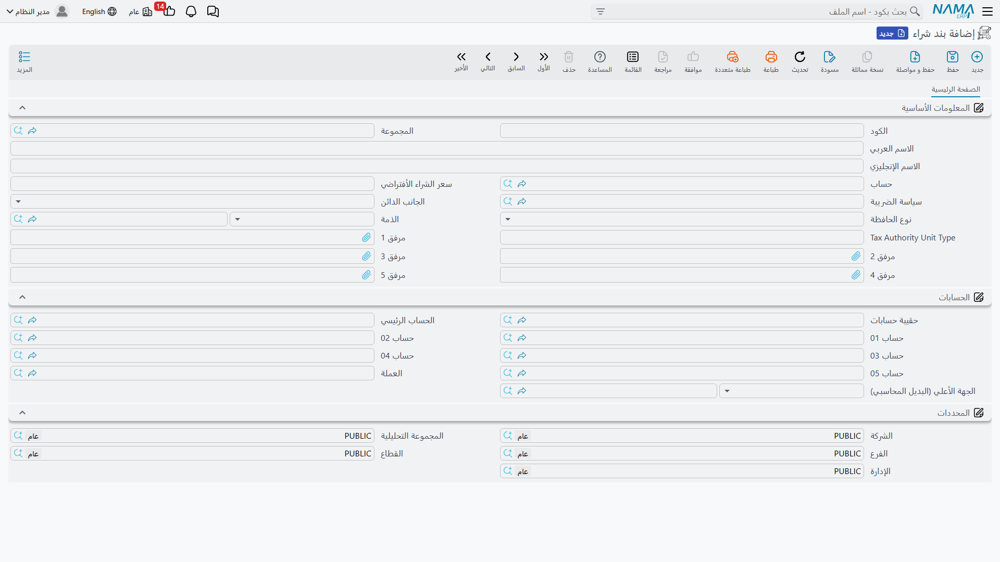
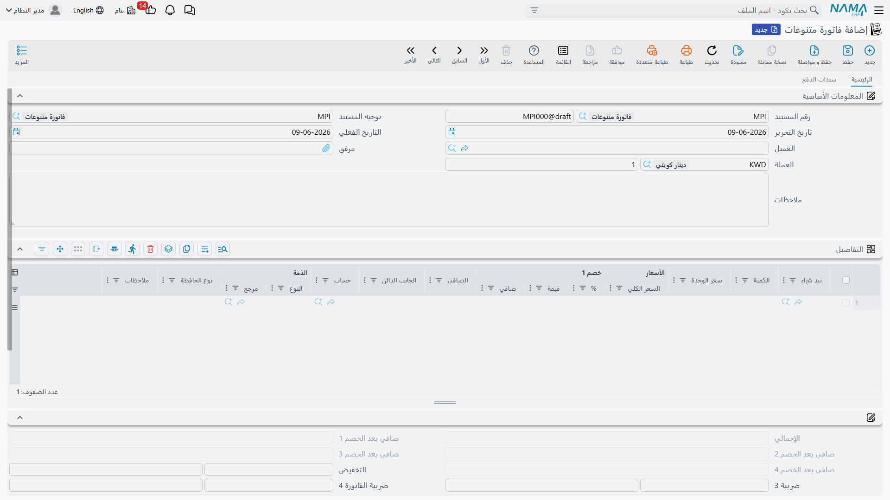
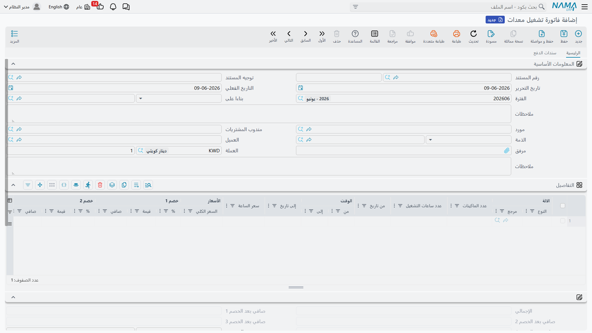

# المشتريات المتنوعة وتشغيل المعدات

ليست كلُّ مشترياتٍ تمرّ عبر وحدة المخازن. فشراء خدمة، أو دفع مصروفٍ عابر، أو استئجار معدّات — كلُّها لا تضيف مخزونًا، فمعالجتها كمشترياتٍ مخزنية إفراطٌ لا داعي له. تقع مستندات **المشتريات المتنوعة** داخل وحدة المحاسبة، وتتيح لك تشغيل دورة شراءٍ خفيفةٍ للأصناف غير المخزنية، تنتهي بفاتورةٍ تُرحَّل مباشرةً إلى حساب مصروف.

::: info الترخيص المطلوب
المشتريات المتنوعة جزءٌ من ترخيص `accounting` الأساسي. ومستنداتها تحت **الحسابات > المستندات**.
:::

## الدورة: طلب ← أمر ← فاتورة

يحاكي المسارُ دورةَ شراءٍ معتادة، دون المخزن:

1. **طلب شراء متنوعات** (`Accounting > Documents > Misc Purchase Request`) — يطلب أحدهم شراء خدمةٍ أو صنفٍ غير مخزني.
2. **أمر شراء متنوعات** (`Accounting > Documents > Misc purchase Order`) — الأمر الموجَّه إلى المورد. وكنظيره المخزني، لا يمسّ الأمرُ دفترَ الأستاذ؛ فهو التزامٌ لا مصروفٌ بعد.
3. **فاتورة متنوعات** (`Accounting > Documents > Miscellaneous Invoice`) — فاتورة المورد. **هذا هو المستند الذي يُرحِّل**: يجعل المصروف مدينًا والمورد دائنًا.

و**بند الشراء** (`Accounting > Master Files > Purchase Element`) هو الملفُّ الرئيسي خلف ذلك كلِّه — يصف شيئًا قابلًا للشراء (خدمةً، فئة مصروف) ويحمل حسابه الافتراضي، فيكتفي سطرُ الفاتورة باختيار البند ليتبعه الحساب.

## الفاتورة

في **فاتورة المتنوعات** يحمل كلُّ سطرٍ في **التفاصيل** **بند الشراء** و**الحساب** الذي يُصرَف عليه، و**المورد** (مع رقمَي السجل التجاري والتسجيل الضريبي للفوترة الإلكترونية)، و**الكمية** و**سعر الوحدة**، وسلّمًا كاملًا من **الخصومات** و**الضرائب** (ضريبة مبيعات 1 و2، إضافةً إلى ضرائب الإضافة/الخصم)، و**محدِّدات** السطر. وللفاتورة كذلك قسم **سطور السداد** / **الدفعات المجدولة** كي تسدّدها — نقدًا، أو بطريقة سداد، أو بسنداتٍ خارجية — وشبكة **بنود الشراء**.

### كيف تُرحَّل

عند اعتماد الفاتورة، يجري أثرها عبر جوانب التوجيه: تُجعَل حسابات السطور **مدينةً** بقيمة السلع/الخدمات، ويُجعَل **المورد** (أو **النقدي**) **دائنًا**، وتحمل جوانبُ **الضريبة** و**الخصم** و**مصاريف الخدمة** مبالغها. ولأنّها مستندٌ ضريبي، فهي متكاملةٌ مع **الفوترة الإلكترونية (هيئة الزكاة والضريبة)** عبر حقول تسجيل المورد. أمّا الحساب الذي يستقرّ عليه كلُّ جانبٍ فيأتي من توجيه الفاتورة — راجِع مرجع [توجيهات المستندات](./support/accounting-document-terms.md).

النموذج المطبوع: يُطبَع **أمر** الشراء المتنوع بالكود `SYSF-ACC015`، و**فاتورة** الشراء المتنوع بالكود `SYSF-ACC006`.

## فاتورة تشغيل المعدات

من الصور القريبة **فاتورة تشغيل المعدات** (`Accounting > Documents > Machine Rent Invoice`) — لفوترة تشغيل المعدّات أو استئجارها. تعمل كفاتورة المتنوعات (سطور، مورد، ضريبة، ترحيلٌ إلى حساب مصروف) لكنّها مهيَّأة لتكاليف تشغيل المعدّات.

## للدعم الفني

- **«الأمر أنشأ قيدًا»** — لا ينبغي ذلك؛ الفاتورة وحدها هي التي تُرحِّل. الطلب والأمر خطوتان سابقتان للمحاسبة.
- **«استُخدِم حساب مصروفٍ خاطئ»** — تحقّق من الحساب الافتراضي لـ**بند الشراء** في السطر ومن تجاوز **حساب** السطر له.
- **«لم تُرسَل الفاتورة إلى الهيئة»** — راجِع حقلَي السجل التجاري والتسجيل الضريبي للمورد؛ الفوترة الإلكترونية موضوعٌ منفصل عن الأثر المحاسبي.
- **«من أين تأتي حسابات المورد / الضريبة / الخصم؟»** — من توجيه **فاتورة المتنوعات**؛ راجِع [توجيهات المستندات](./support/accounting-document-terms.md).
- معالجة فاتورةٍ متعثّرة وإعادة معالجتها في [كيف تُعالَج المستندات إلى أثر محاسبي](./support/accounting-request-processing.md).
