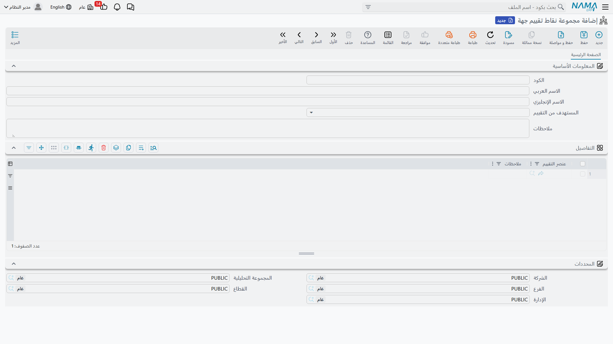
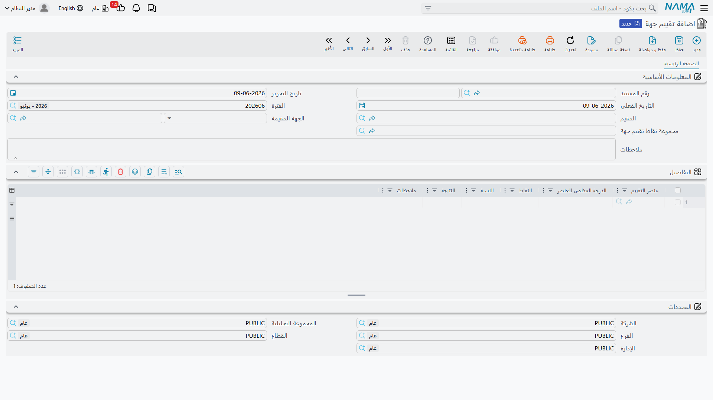

# تقييم الجهات

تخبرك الأرقامُ بما طلبه موردٌ أو ما دفعه عميل، لكنّها لا تقول هل التعامل معه *جيّد*: هل سلّم المورد في الموعد؟ هل البنك سريع الاستجابة؟ هل العميل موثوق؟ **تقييم الجهات** طريقةٌ منظَّمة لتقييم الجهات التي تتعامل معها — عملاء وموردين وبنوكًا — وفق معايير تحدّدها أنت، وحفظ هذا الحكم في السجلّ إلى جوار الصورة المالية.

::: info الترخيص المطلوب
تقييم الجهات جزءٌ من ترخيص `accounting` الأساسي. وشاشاته تحت **الحسابات > تقييم جهات**. وهو أداةٌ وصفية — **بلا أثرٍ محاسبي**.
:::

## تعريف معنى «الجيّد»

تبني بطاقةَ التقييم من ملفّين رئيسيّين:

1. **عنصر تقييم جهة** (`Accounting > Party Evaluations > Party Evaluation Element`) — معيارٌ واحد تقيّم عليه: «الالتزام بمواعيد التسليم»، «الجودة»، «سرعة الاستجابة»، «تنافسية السعر».
2. **مجموعة نقاط تقييم جهة** (`Accounting > Party Evaluations > Party Evaluation Elements Group`) — حزمةٌ من العناصر تشكّل بطاقة تقييمٍ كاملة، يُمنَح كلُّ عنصرٍ فيها **وزنًا أقصى**. والأوزان هي ما يجعل الدرجة ذات معنى: فقد يساوي الالتزام بالمواعيد 40 نقطة، والسعر 30، وهكذا.

## تقييم جهة

**تقييم الجهة** (`Accounting > Party Evaluations > Party Evaluation`) هو التقييم الفعلي. يذكر رأسُه **الجهة المُقيَّمة**، و**المُقيِّم** الذي يضع الدرجات، و**مجموعة العناصر** المستخدَمة كبطاقة تقييم. ثم تسرد شبكةُ **التفاصيل** كلَّ معيارٍ مع **وزنه الأقصى**، و**النقاط** الممنوحة، و**النسبة** الناتجة، و**نتيجةٍ** نصّية حرّة، و**ملاحظات** — فيكون التقييم رقمًا وسردًا معًا.

ولأنّ التقييمات تحمل الجهة وتاريخًا، يمكنك الاحتفاظ بتاريخٍ لكلّ جهةٍ ومراقبة اتجاه درجة موردٍ أو عميلٍ عبر الزمن.

## للدعم الفني

- **«لا يوجد قيد»** — صحيح؛ تقييم الجهات وصفيٌّ بحت ولا يمسّ دفتر الأستاذ أبدًا.
- **«النسبة تبدو خاطئة»** — هي **النقاط** الممنوحة مقابل **الوزن الأقصى** للعنصر من المجموعة؛ تحقّق منهما.
- **«قائمة المعايير فارغة»** — يسحب التقييمُ سطورَه من **مجموعة العناصر** المختارة؛ تأكّد من أنّ المجموعة عرّفت عناصرها بأوزانها.
- **«أريد مقارنة جهةٍ عبر الزمن»** — كلُّ تقييمٍ مؤرَّخٌ ومرتبطٌ بالجهة، فاسردها حسب الجهة لترى الاتجاه.
