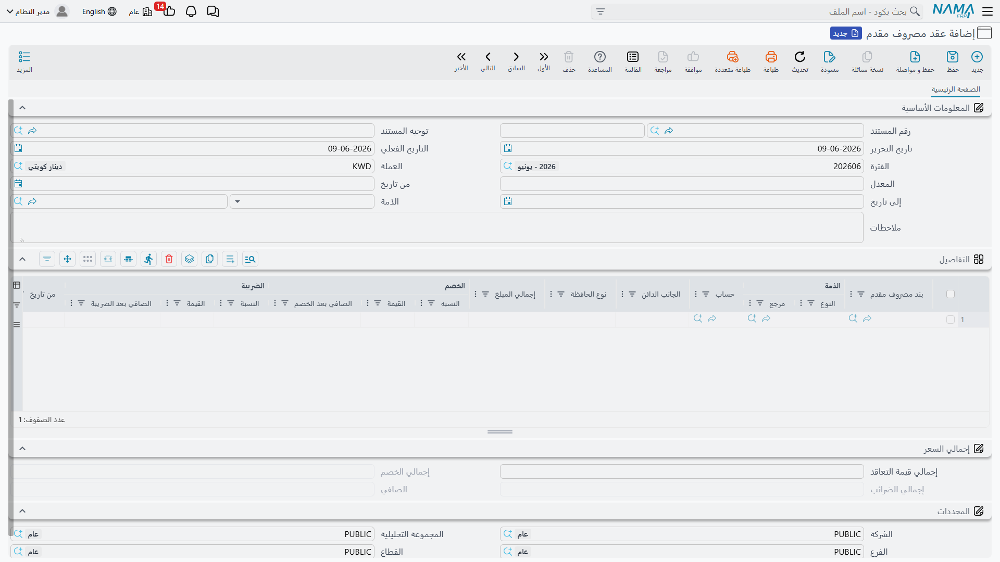
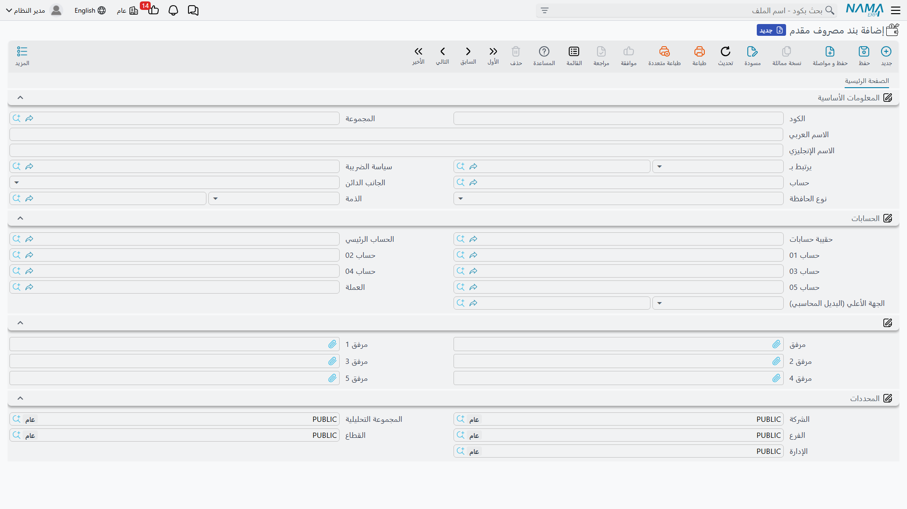

# المصروفات المقدمة

بعض المصروفات تُدفع مرّةً واحدة لكنّها تخصّ شهورًا عديدة: إيجار سنوي يُدفع مقدّمًا، قسط تأمين سنوي، عقد صيانة. وتحميل المبلغ كاملًا كمصروفٍ في شهر الدفع يشوّه نتائج ذلك الشهر ويُظهِر الشهور التالية أرخص ممّا هي عليه. تحلّ منظومة **المصروفات المقدّمة** هذه المشكلة: تُسجّل الدفعة كاملةً كأصل، ثم تعترف بها كمصروفٍ **شهرًا بشهر** على مدى الفترة التي تغطّيها — تلقائيًا.

::: info الترخيص المطلوب
المصروفات المقدّمة ضمن ترخيص `accounting-prepaid-expenses`.
:::

## المكوّنات الثلاثة

تتكوّن المنظومة من ثلاث شاشات، جميعها تحت جذر **الحسابات > عقود المصروفات المقدمة**:

1. **بند مصروف مقدم** — ملفٌ رئيسي يصف *نوع* المصروف المقدّم (إيجار، تأمين، عقد خدمة) ويحمل حساباته الافتراضية وخطّته الضريبية. تُعِدّه مرّةً واحدة وتعيد استخدامه.
2. **عقد مصروف مقدم** — المستند الذي يسجّل دفعةً مقدّمة فعلية: أيّ بند، والمبلغ الإجمالي، والفترة التي يغطّيها. ومنه يولّد النظام قيود الاستحقاق الشهرية.
3. **قيد استحقاق مصروف مقدم** — قيد الاعتراف الشهري. يُولَّد قيدٌ واحد لكلّ شهرٍ من فترة العقد، وكلٌّ منها ينقل حصّة ذلك الشهر من الأصل المقدّم إلى المصروف.

## إعداد البند

**بند المصروف المقدم** (`Accounting > Prepaid Expense Contracts > Prepaid Expense Item`) هو القالب القابل لإعادة الاستخدام. تضبط عليه **الحساب** الذي يستقرّ فيه المصروف في النهاية، و**جانب الدائن** (مصدر القيد الدائن المقابل — انظر أدناه)، و**خطّة ضريبية** إن كان المصروف خاضعًا للضريبة. ولأن البند يحمل هذه القيم الافتراضية، لا يحتاج العقد الذي يستخدمه سوى المبلغ والتواريخ.

## تسجيل العقد

في **عقد المصروف المقدم** (`Accounting > Prepaid Expense Contracts > Prepaid Expense Contract`) يحمل الرأس **توجيه المستند** و**تاريخ القيمة** (الذي يحدّد **الفترة**)، و**العملة**، و**تاريخَي العقد** (من/إلى). ثم يصف كلُّ سطرٍ في **التفاصيل** مصروفًا مقدّمًا واحدًا:

- **بند المصروف المقدم** و**الحساب** الذي يُرحَّل إليه،
- **تاريخا** السطر (من/إلى) و**عدد الأشهر** — المدى الذي يُعترَف عليه،
- المبلغ، معبَّرًا عنه بإحدى طريقتين: **مبلغ شهري** ثابت × عدد الأشهر، أو **تكلفة اليوم** × **عدد الأيام** (فالعقد الذي لا يبدأ في أول الشهر يُوزَّع بالتناسب مع الأيام الفعلية)،
- **خصم** و**ضريبة** اختياريان (نسبة أو قيمة)، فينتج **القيمة بعد الخصم** و**القيمة بعد الضريبة** و**إجمالي مبلغ** السطر،
- **جانب الدائن** و — عند الحاجة — **ذمة** و**نوع حسابها الفرعي**،
- والمجموعة الكاملة من **المحدِّدات** (الشركة، القطاع، الفرع، الإدارة، مجموعة التحليل).

### من أين يأتي الجانب الدائن

يحدّد **جانب الدائن** في السطر من أين يأخذ النظام القيد الدائن المقابل عند ترحيل العقد — فأنت لست مقيّدًا بحسابٍ ثابتٍ واحد. والخيارات هي: **حساب محدد**، أو **ذمة محددة**، أو **ذمة المستخدم الحالي**، أو **حساب المورد**، أو **الحساب البنكي**، أو حسابات شركات **التخليص/التأمين/الشحن** (مفيدة للمصروفات المقدّمة المرتبطة بالاستيراد)، أو الحساب المأخوذ **من بند الشراء** نفسه.

## كيف يُرحَّل: العقد ثم الاستحقاق الشهري

تُرحِّل منظومة المصروفات المقدّمة على مرحلتين، وهذا هو جوهر الفكرة:

- **عند اعتماد العقد**، يُسجَّل المبلغ المقدّم كأصل — يجري أثره عبر جانبَي **مدين/دائن** (إضافةً إلى جانبَي **الخصم** و**الضريبة** عند وجودهما) لإجماليات السطور.
- **ثم يعترف كلُّ قيد استحقاق شهري** بحصّة ذلك الشهر: ينقل حصّة الشهر من الأصل المقدّم إلى حساب المصروف. فاثنا عشر شهرًا من عقدٍ سنوي تنتج عنها اثنا عشر قيد استحقاق، يحمل كلٌّ منها جزءًا من اثني عشر (أو حصّته الموزّعة بالأيام).

أمّا مصدر حساب كلّ جانبٍ فعليًا فيحكمه توجيه كلٍّ منهما — راجِع مرجع [توجيهات المستندات](./support/accounting-document-terms.md). (يُعالَج كلٌّ من العقد والقيد الشهري في الخلفية كأيّ مستندٍ آخر — انظر [كيف تُعالَج المستندات إلى أثر محاسبي](./support/accounting-request-processing.md).)

## للدعم الفني

- **«المبلغ كاملًا حُمِّل على شهرٍ واحد كمصروف»** — ليس هذا هو السلوك الصحيح؛ العقد يقيّد أصلًا، و**قيود الاستحقاق الشهرية** تعترف بالمصروف على مدى الزمن. تحقّق من أنّ العقد ولّد قيوده الشهرية وأنّها عُولِجت.
- **«لم تُولَّد القيود الشهرية»** — راجِع **تاريخَي** السطر (من/إلى) و**عدد الأشهر**؛ فعدد القيود الشهرية يتبع هذا المدى.
- **«الشهر الأول أو الأخير الجزئي يبدو خاطئًا»** — استخدم طريقة **تكلفة اليوم × عدد الأيام** بدل المبلغ الشهري الثابت كي تُوزَّع الشهور الجزئية بالأيام الفعلية.
- **«جرى تسجيل القيد الدائن في حسابٍ خاطئ»** — تحقّق من **جانب الدائن** في السطر (حساب محدد، مورد، بنك، ذمة...) ومن القيم الافتراضية للبند.
- **«من أين تأتي حسابات الأصل/المصروف؟»** — من توجيهَي **عقد المصروف المقدم** و**قيد استحقاق المصروف المقدم**؛ راجِع [توجيهات المستندات](./support/accounting-document-terms.md).
