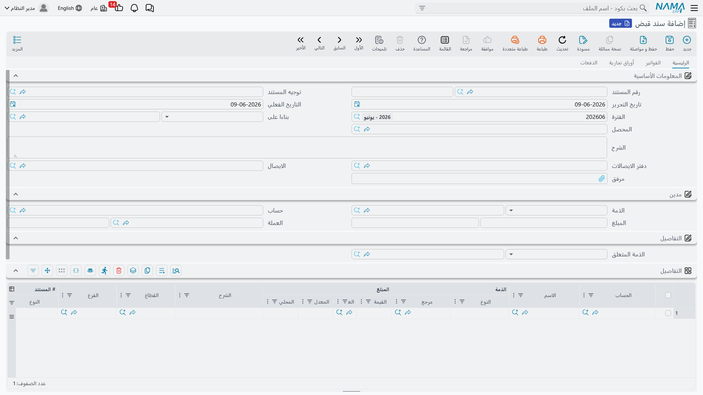
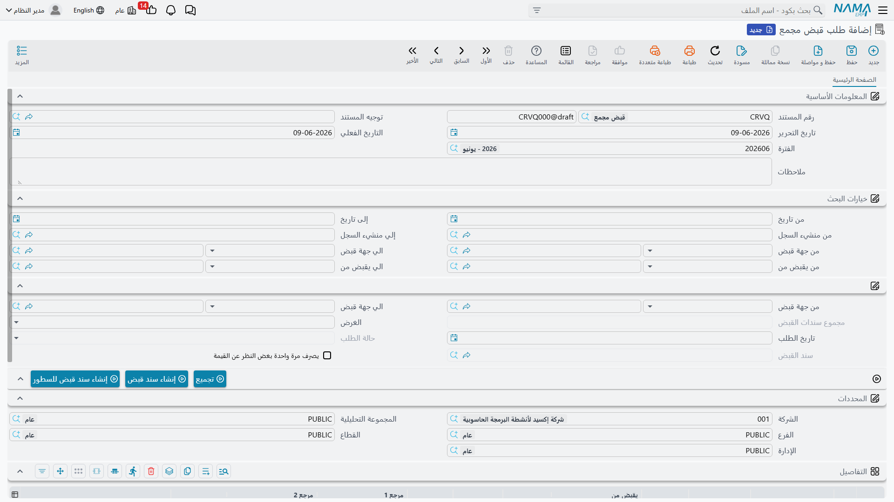

# سندات القبض والصرف

كل نقود تدخل خزينتك أو بنكك أو تخرج منهما تمرّ عبر هذه العائلة من المستندات. وهي مصمّمة على هيئة **سلسلة من ثلاث مراحل** تفصل بين «من يطلب الصرف» و«من يأذن به» و«من ينفّذه فعلًا» — وهي بنية رقابية مهمّة في المنشآت التي تفصل الصلاحيات.

::: info الترخيص المطلوب
سندات وأوامر وطلبات القبض والصرف ضمن ترخيص المحاسبة الأساسي `accounting`.
:::

## السلسلة: طلب ← أمر ← سند

- **طلب قبض / طلب صرف** (`Accounting > Documents > Receipt Request`) — مطالبة بتحصيل مبلغ أو دفعه. هو مستند تنظيمي **لا يُحدِث أثرًا محاسبيًا**؛ مجرّد توثيق للحاجة.
- **أمر قبض / أمر صرف** (`Accounting > Documents > Receipt Order`) — الإذن بتنفيذ القبض أو الصرف. يحمل **حالة الأمر** التي تتتبّع تقدّمه حتى يتحوّل إلى سند.
- **سند قبض / سند صرف** (`Accounting > Documents > Receipt Voucher`) — هو لحظة الحقيقة: تحرّك النقد فعلًا، وهنا يُسجَّل **الأثر المحاسبي** في دفتر الأستاذ.

ليست كل منشأة بحاجة للسلسلة كاملةً؛ كثيرون يبدأون مباشرةً من **السند**. لكن من يحتاج فصل «الطلب» عن «الاعتماد» عن «الصرف» يجد البنية جاهزة.

## تشريح سند القبض

في الرأس تحدّد **توجيه المستند** و**تاريخ التحرير** و**التاريخ الفعلي** (الذي يحدّد **الفترة**)، و**المحصِّل** و**دفتر الايصالات** ورقم **الايصال**، و**بناءا على** إن كان السند مولَّدًا من مستند سابق.

في كتلة **مدين** تحدّد الطرف الذي يخصّه المبلغ: **الذمة** (نوع الطرف وقيمته: عميل/مورّد/موظف...) و**الحساب** و**المبلغ** و**العملة**. والسند منظَّم في تبويبات:

- **التفاصيل** — أسطر إضافية لتوزيع المبلغ على أكثر من حساب/ذمة.
- **الفواتير** — مطابقة المبلغ المقبوض على فواتير محدّدة لإقفالها أو تخفيض رصيدها.
- **أوراق تجارية** — ربط القبض بشيك/ورقة مالية (انظر [الشيكات والأوراق المالية](./cheques-financial-papers.md)).
- **الدفعات** — أسطر طرق الدفع (نقد، تحويل، بطاقة...).

كما يوفّر السند **أقساطًا** و**توزيع تكلفة** على مراكز التكلفة.

## الأثر المحاسبي

سند **القبض** يجعل جانب النقدية/البنك **مدينًا** (دخل المال) ويجعل حساب الطرف **دائنًا** (انخفض ما له علينا أو زاد ما لنا عليه بحسب الحالة). سند **الصرف** يعكس ذلك تمامًا. مصدر كل حساب من هذه الحسابات — وكذلك جانبا الضريبة وحساب الرسوم — يأتي من **توجيه المستند**؛ التفاصيل في مرجع [توجيهات المستندات](./support/accounting-document-terms.md).

## الطلبات المجمّعة

حين تتراكم طلبات قبض/صرف كثيرة تخصّ نفس الجهة وتريد تنفيذها دفعةً واحدة، يجمعها **طلب القبض المجمّع** / **طلب الصرف المجمّع** (`Accounting > Documents > Consolidate Receipt Voucher Request`): يضمّ عدّة طلبات في مستند واحد يُولِّد منه سندًا جامعًا، بدل إصدار سند لكل طلب على حدة.

## التقارير والنماذج

- كشوف سندات القبض والصرف والطلبات والقيود (`SYSR-ACC015` إلى `ACC019` و`ACC046`–`ACC047`) موضّحة في [كشوف الحسابات وميزان المراجعة](./reports-account-statements-and-trial-balance.md).
- النماذج المطبوعة: سند القبض `SYSF-ACC002`، سند الصرف `SYSF-ACC003`، أمر القبض `SYSF-ACC010`، أمر الصرف `SYSF-ACC022`، طلب القبض `SYSF-ACC014`، طلب الصرف `SYSF-ACC021`، طلب الصرف المجمّع `SYSF-ACC017`.

## للدعم الفني

- **«الطلب/الأمر لا يظهر له أثر في الحسابات»** — هذا متوقّع؛ الطلب لا يُرحَّل، والأثر المحاسبي يُسجَّل عند **السند**.
- **«المبلغ المقبوض لم يُقفِل الفاتورة»** — تحقّق من تبويب **الفواتير** وأن السطر مطابَق على الفاتورة الصحيحة.
- **«حساب النقدية/الطرف الخطأ في القيد»** — مصدر الحسابات هو **توجيه المستند**؛ راجِع توجيه سند القبض/الصرف في مرجع [توجيهات المستندات](./support/accounting-document-terms.md).
- **«حقول الضريبة/الرسوم لا تظهر»** — مفاتيحها في كتالوج [إعدادات الحسابات](./support/accounting-configuration.md).
- آلية تحوّل السند إلى أثر وإعادة معالجة سند متعثّر في [كيف تُعالَج المستندات إلى أثر محاسبي](./support/accounting-request-processing.md).
