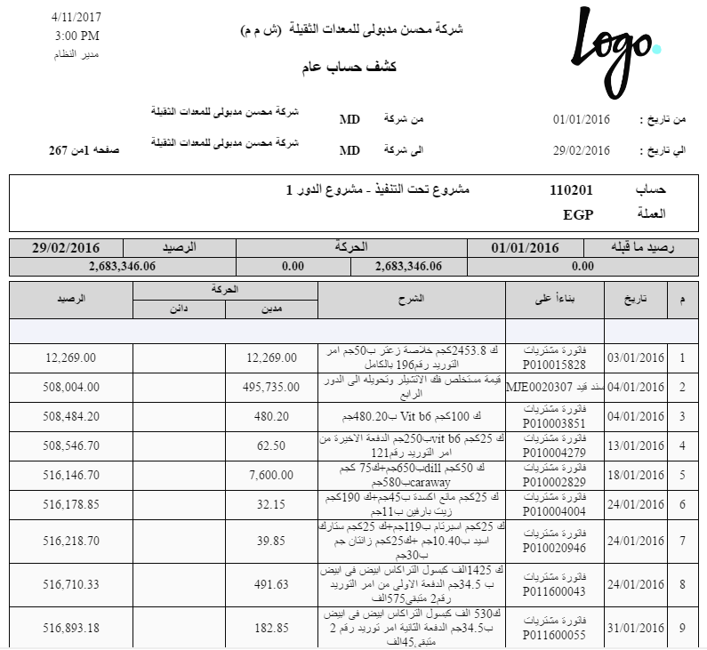
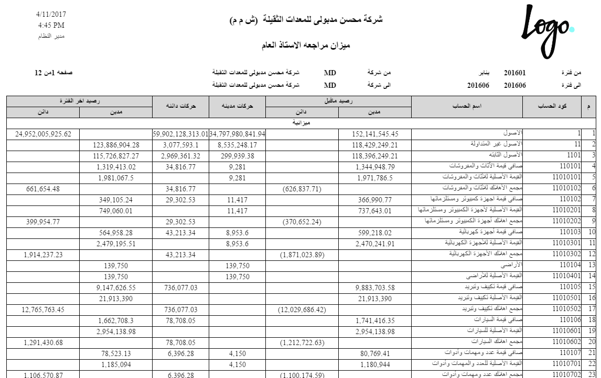

# كشوف الحسابات وميزان المراجعة والتحليل

بعد أن تُسجَّل الحركات، تأتي لحظة السؤال: ما رصيد هذا الحساب؟ ماذا تحرّك على ذمة هذا العميل؟ هل ميزاني متوازن؟ تجيب عن ذلك عائلة **تقارير الحسابات** (`SYSR-ACC*`)، وهي تقارير نظام جاهزة تُستدعى من قائمة التقارير. هذه الصفحة دليلها: ماذا يجيب كل تقرير وأهمّ محدّداته.

::: info الترخيص المطلوب
هذه التقارير ضمن ترخيص المحاسبة الأساسي `accounting`.
:::

::: tip القوائم المالية لها صفحتها
القوائم المالية الرسمية (الميزانية وقائمة الدخل والتدفقات النقدية، `SYSR-FNS*`) ليست هنا — فهي ناتج **منظومة القوائم المالية** وتُوثَّق مع محرّكها. هذه الصفحة مخصّصة لكشوف الأستاذ وموازين المراجعة والتحليل التي لا ترتبط بنوع مستند بعينه.
:::

## شجرة الحسابات

تقرير **شجرة الحسابات** (`SYSR-ACC001`) يطبع الشجرة كاملةً بمستوياتها وتصنيفاتها — مرجع سريع لبنية حساباتك (انظر [شجرة الحسابات](./chart-of-accounts.md)).

## كشوف الحسابات

كشف الحساب يعرض حركات حساب خلال فترة مع **الرصيد الجاري** (محليًا وبالعملة الأجنبية عند اللزوم). تختلف الصيغ بحسب مستوى التفصيل والزاوية:

- **كشف حساب عام** (`SYSR-ACC002`, `ACC029`) ومتغيّراته: بالعملة (`ACC030`)، بالتفصيل (`ACC035`)، بالجانب الثاني (`ACC037`)، بسعر الصرف (`ACC038`)، بإمكانية المراجعة (`ACC039`)، بالصلاحيات (`ACC040`).
- **كشف حساب فرعي (ذمة)** (`SYSR-ACC003`, `ACC031`) و**بالعملة** (`ACC032`) — لعرض حركة طرف بعينه.
- **كشف حساب تفصيلي** (`SYSR-ACC004`, `ACC033`)، **بالمجموعة التحليلية** (`ACC021`)، **بالعملة** (`ACC034`).

أهمّ المحدّدات في هذه الكشوف: نطاق التاريخ/الفترة، الحساب أو الذمة، العملة، والمحددات (الفرع/القطاع/الإدارة). يُحسب الرصيد الجاري بترتيب الحركات زمنيًا.

## موازين المراجعة

ميزان المراجعة يلخّص أرصدة الحسابات (مدين/دائن) للتحقق من توازن الدفاتر:

- **ميزان مراجعة عام** (`SYSR-ACC005`)، وبإجمالي الرصيد (`ACC026`)، وبتاريخ (`ACC036`)، وبتضمين الذمم (`ACC044`).
- **ميزان مراجعة فرعي** (`SYSR-ACC006`)، وبإجمالي الرصيد (`ACC027`)، وبتاريخ (`ACC042`).
- **ميزان مراجعة لحساب** (`SYSR-ACC007`) لحساب محدّد.

## تحليل الحسابات

- **تحليل الحسابات شهريًا** (`SYSR-ACC012`) — توزيع أرصدة الحسابات على شهور السنة.
- **تحليل الحسابات حسب الفرع** (`SYSR-ACC013`) و**حسب الفرع والقطاع** (`SYSR-ACC028`).

## أعمار الديون

تكشف هذه التقارير مدى تقادم المديونيات (تعتمد على علم **متابعة أعمار الديون** على الحساب — انظر [الحسابات](./accounts.md)):

- **أعمار الديون** (`SYSR-ACC024`)، وتفاصيل مستنداتها (`ACC025`)، و**حسب الفاتورة** (`ACC045`)، و**كل أسطر الدين اليدوية** (`ACC041`).

## كشوف السندات والقيود

كشوف مخصّصة لمستندات القبض والصرف والقيود (مرتبطة كذلك من صفحتَي [سندات القبض والصرف](./receipts-and-payments.md) و[سندات القيد](./journal-entries.md)):

- كشف **طلبات سندات القبض** (`SYSR-ACC015`)، **سندات القبض** (`ACC016`, `ACC046`).
- كشف **طلبات سندات الصرف** (`SYSR-ACC017`)، **سندات الصرف** (`ACC018`, `ACC047`).
- كشف **سندات القيد** (`SYSR-ACC019`).

## تحليل رد الضريبة

**تحليل رد الضريبة** (`SYSR-ACC014`) لأغراض المطالبة الضريبية واستردادها.

## نموذج حركة الأستاذ

**نموذج حركة الأستاذ** (`SYSR-ACC048`) يطبع الحركة المحاسبية المفردة بتفاصيلها.

## استعلامات على الشاشة

إلى جانب التقارير المطبوعة، توجد **استعلامات حيّة** على الشاشة لا تحتاج طباعة: قائمة **حركات الأستاذ** وشاشات أرصدة الحسابات والمحددات. تستعرضها مباشرةً على الشاشة لمتابعة لحظية للأرصدة.

## للدعم الفني

- **«رصيد التقرير لا يطابق المتوقّع»** — تحقّق من نطاق التاريخ والفترة والمحددات المختارة؛ معظم الفروق سببها فلتر غير مقصود.
- **«حساب لا يظهر في أعمار الديون»** — علم **متابعة أعمار الديون** غير مفعّل على الحساب.
- **«الرصيد بالعملة الأجنبية غير ظاهر»** — استخدم صيغة الكشف **بالعملة** المناسبة (`ACC030`/`ACC032`/`ACC034`).
