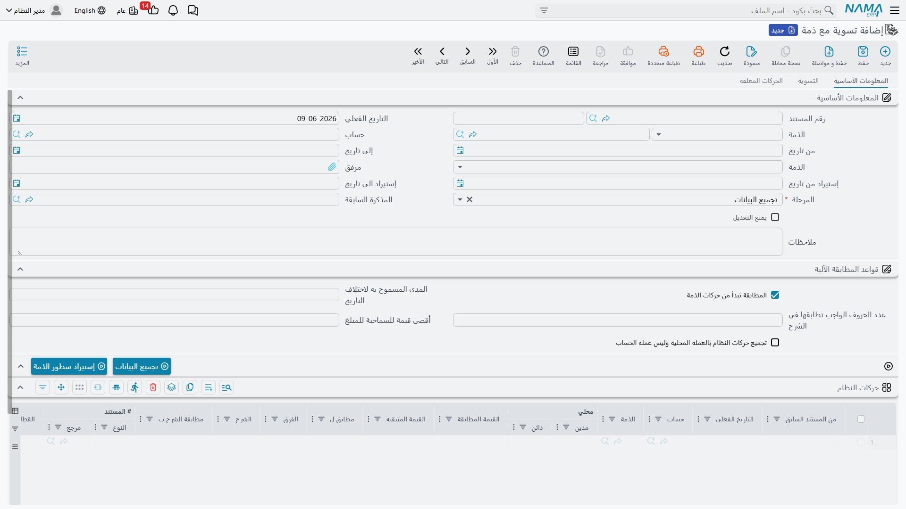

# التسوية مع الذمم

يحتفظ العميل أو المورد دائمًا تقريبًا بسجلِّه الخاصّ لتعاملاتكما — ونادرًا ما يتطابق مع سجلّك إلى آخر قرش: فاتورةٌ لم يقيّدها، أو سدادٌ في الطريق، أو إشعارٌ سجّله طرفٌ دون الآخر. **التسوية مع الذمة** هي الطريقة المنهجية لوضع دفاترك لجهةٍ ما بجوار كشفها الخارجي، ومطابقة ما يتطابق، وإبراز الفروق. وهي التوأم الخاصّ بالعملاء والموردين لـ[المطابقة البنكية](./bank-reconciliation.md)، بالمسار نفسه.

::: info الترخيص المطلوب
التسوية مع الذمة جزءٌ من ترخيص `accounting` الأساسي. وشاشتها تحت **الحسابات > التسويات**.
:::

::: warning التسوية لا تُرحِّل بذاتها
لا يُنتِج مستندُ التسوية مع الذمة **أيَّ أثرٍ محاسبي**؛ فهو عملية مقارنةٍ وكشفِ فروقٍ فقط. وأيُّ فروقٍ حقيقيةٍ يُبرِزها تُصحَّح لاحقًا بالمستند المناسب (إشعار دائن/مدين، سند…). فـ«التسوية» مقارنةٌ لا قيد.
:::

## مسار الخطوات الثلاث

يمرّ المستند بـ**خطوة تسويةٍ** على ثلاث مراحل — تمامًا كالمطابقة البنكية:

1. **تجميع البيانات** — تحدّد **الحساب** و**الذمة** (العميل/المورد) و**مدى تواريخ استيراد**، فيجمع النظامُ حركاتك (**حركات النظام**) وكشفَ الجهة (**حركات الذمة**).
2. **التسوية** — تطابق حركات الذمة مع حركات نظامك، ضمن **سماحية القيمة** و**سماحية فرق التاريخ** المسموحتين، بقيادة **تسلسل مطابقة البيان** اختياريًا أو بالمطابقة من جانب الذمة. وما لا يتطابق يقع في شبكتَي **حركات النظام المعلقة** و**حركات الذمة المعلقة**، حيث تتّضح الفروق الحقيقية.
3. **منتهي** — يُغلق المستند متى اكتملت المطابقة.

ويرتبط كلُّ مستندٍ بـ**التسوية السابقة** للجهة نفسها، فيكمل من حيث انتهت السابقة ويُغلِق الفترة خلفه — فالفترة المسوّاة لا تُعاد تسويتها.

## للدعم الفني

- **«التسوية لم تغيّر رصيد الجهة»** — صحيح؛ فهي لا تُرحِّل. سجِّل أيَّ فرقٍ حقيقي بالمستند المناسب (إشعار/سند) لاحقًا.
- **«سطورٌ تتطابق بوضوحٍ لا تتطابق»** — راجِع **سماحية القيمة** و**سماحية فرق التاريخ** و**تسلسل مطابقة البيان**.
- **«لا أستطيع تعديل تسويةٍ قديمة»** — لأنّها مرتبطةٌ بمستندٍ لاحقٍ يُقفِلها حفاظًا على تسلسل التسوية؛ وهذا متوقَّع.
- **«أيُّ جانبٍ هو أيّ؟»** — **حركات النظام** هي دفاترك؛ و**حركات الذمة** هي كشف الجهة الخارجي.
