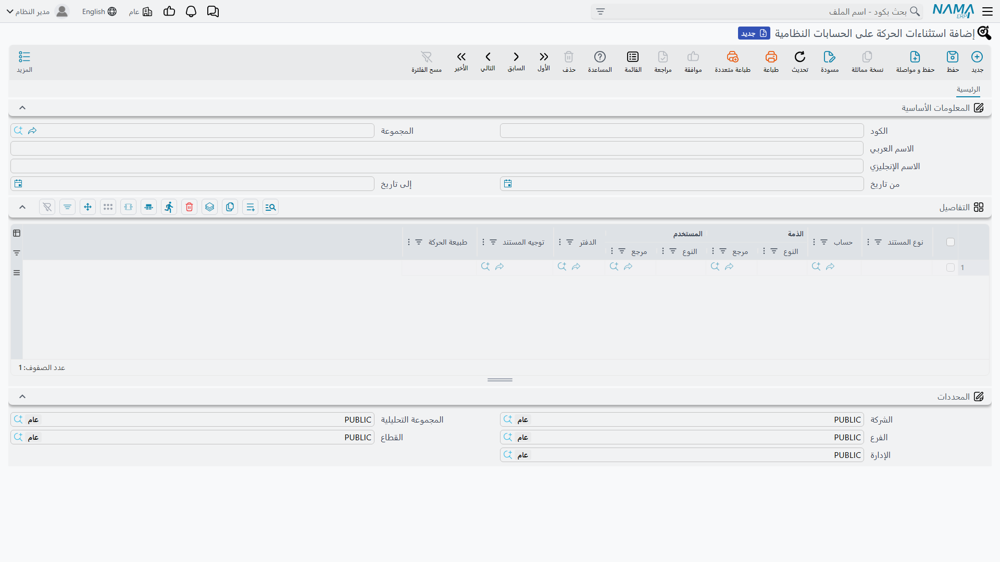

# الحسابات النظامية واستثناءات الحركة عليها

بعض الحسابات في دفتر الأستاذ ليست مُعدَّة لأن تُحرَّك يدويًا. حساب مراقبة المخزون، وحساب الأرباح المُحتجزة، وحساب الضريبة المستحقة الذي يُولِّده محرك الضرائب — كل هذه تحمل أرصدة يبنيها النظام نفسه من المستندات التي يعالجها. وفي اللحظة التي يسجّل فيها مستخدم سند قيد يدويًا على أحدها، يتوقف الحساب عن مطابقة دفتر الأستاذ المساعد الذي يملكه، ولا ينتبه أحد إلى ذلك حتى يأتي إقفال شهر لا يتوازن.

جواب نما عن هذا هو علم **حساب خاص بالنظام** على الحساب. فعِّله فيصير الحساب محظورًا على المستندات المحاسبية اليدوية بينما يستمر النظام في استخدامه بحرّية. لكن القفل الشامل نادرًا ما يكون ما تريده المنشأة فعلًا: فالمحاسب الذي يُقفل السنة يحتاج حقًا إلى تحريك حساب مراقبة المخزون، ورئيس الحسابات يحتاج حقًا إلى تصحيح رصيد واحد خاطئ في يوم واحد. ولهذا وُجدت شاشة **استثناءات الحركة على الحسابات النظامية** — فهي تفتح في القفل ثقبًا دقيقًا ومؤرَّخًا وقابلًا للمراجعة بدلًا من أن تضطرك إلى إلغاء القفل كلّه.

::: info الترخيص المطلوب
كلٌّ من علم **حساب خاص بالنظام** وشاشة الاستثناءات جزء من ترخيص المحاسبة الأساسي `accounting`.
:::

## ما الذي يمنعه علم «حساب خاص بالنظام» فعليًا

العلم موجود على الحساب نفسه (**الحسابات ← الملفات ← حساب**) ضمن مجموعة الأعلام الرقابية، باسم **حساب خاص بالنظام**.

حين يكون مفعّلًا، يُرفَض حفظ أي من هذه المستندات إن ورد الحساب في أحد أسطرها، برسالة *«الحساب … يستخدم فقط بواسطة النظام»* مع الإشارة إلى السطر المخالف:

- **سند القيد** (وقيود التسويات)
- **سند القبض**
- **سند الصرف**
- **التحويل البنكي**
- **جارى تحويل شركات** (التحويل بين الشركات)

وما عدا ذلك لا يتأثر. فاتورة المبيعات وإذن الصرف المخزني ومستند الإهلاك ومستندات الرواتب تُسجِّل أثرها على الحساب كالمعتاد — فالعلم يضبط ما **يكتبه المستخدم** لا ما يُولِّده النظام. كما يُستثنى من الفحص مستندان يُولَّدان داخليًا: **القيد الختامي** في نهاية السنة، وقيد التجميع الناتج عن تنقية البيانات؛ فكلاهما يُعيد تصوير أرصدة أنشأها النظام نفسه، ورفضهما يعني رفض إعادة تصوير التاريخ.

## ثلاثة طرق لفتح حساب نظامي

قبل أن يرفض الفحص السطر، يبحث عن ثلاثة مخارج بهذا الترتيب. وأول مخرج ينطبق هو الذي يحسم الأمر، لذا من المفيد أن تعرف أيّها كان فاعلًا حين يقول لك المستخدم «صار يسمح لي الآن».

### ١. خيار الوحدة — فتح لنوع مستند كامل

في إعدادات الوحدة المحاسبية خيار لكل نوع مستند: **السماح باستخدام الحسابات النظامية لسند القبض / سند الصرف / التحويل البنكي / سند القيد**. تفعيل أحدها يوقف الفحص تمامًا لذلك النوع — لكل المستخدمين، ولكل الحسابات، وفي كل التواريخ. وهو أعمّ أداة متاحة، والأصل أن يظل معطّلًا؛ انظر [إعدادات الحسابات](./support/accounting-configuration.md).

### ٢. السماح بتحريك الحساب النظامي في الفترات الافتتاحية والتسويات

بجوار علم **حساب خاص بالنظام** على الحساب يوجد علم **السماح بتحريك الحساب النظامي في الفترات الافتتاحية والتسويات**. بتفعيله يصير الحساب قابلًا للاستخدام يدويًا في أي فترة نوعها **ليس** «عادية» — أي في الفترات **الافتتاحية** و**التسويات** و**الإغلاق** وفترات التنقية. وقد وُجد لهذه الحالة بالذات: إدخال الأرصدة الافتتاحية وعمل تسويات نهاية السنة على حسابات يملكها النظام، دون أن تبقى مفتوحة طوال السنة. أما في الفترات العادية فيبقى القفل ساريًا. ونوع الفترة يُضبَط على التقويم المالي — انظر [الإقفال السنوي وضبط الفترات](./year-end-and-period-control.md).

### ٣. ملف الاستثناءات — فتح حساب واحد لغرض واحد

حين لا يناسبك أيّ من الطريقين الشاملين، تُنشئ سجل **استثناءات الحركة على الحسابات النظامية**. يحدّد السجل الحساب، ونافذة التواريخ التي يسري فيها، ثم — بالضيق الذي تريده — نوع المستند والذمة والمستخدم والدفتر وتوجيه المستند وجانب القيد الذي يسري عليه.

## شاشة الاستثناءات

تجدها في **الحسابات ← الملفات ← استثناءات الحركة على الحسابات النظامية**. وهي ملف رئيسي لا مستند: لها كود واسم ونافذة سريان، وتصير سارية فور حفظها.

### الرأس

| الحقل | ما الذي يفعله |
|---|---|
| **الكود** و**الاسم العربي/الإنجليزي** و**المجموعة** | بيانات هوية الملف الرئيسي المعتادة. سمِّ السجل باسم يقول **لماذا** وُجد («تصحيحات مراقبة المخزون في نهاية السنة»)، فهذا الاسم هو كل ما سيجده المراجع لاحقًا. |
| **من تاريخ** / **إلى تاريخ** | نافذة سريان الاستثناء، وتُقارَن بـ**التاريخ الفعلي** للمستند. يجوز ترك أيٍّ منهما فارغًا لنافذة مفتوحة: **من تاريخ** وحده يعني «من ذلك اليوم فصاعدًا»، و**إلى تاريخ** وحده يعني «حتى ذلك اليوم»، وتركهما معًا فارغين يعني «دائمًا». |

::: warning المقارنة تتم بالتاريخ الفعلي
تُطابَق النافذة مع **التاريخ الفعلي** للمستند لا مع تاريخ إدخاله. والمستند الذي لا تاريخ فعلي له لا يطابق أي استثناء إطلاقًا.
:::

أما مجموعة **المحددات** (الشركة، الفرع، القطاع، الإدارة، المجموعة التحليلية) فهي المجموعة القياسية في الملفات الرئيسية، لكن انتبه إلى أنها **لا تُضيِّق الاستثناء**. فالمحرك يقرأ كل سجلات الاستثناءات المحفوظة بصرف النظر عن المحددات، ولا يطابق إلا على ما في جدول التفاصيل. فإن أردت قصر الاستثناء على دفاتر شركة بعينها، عبِّر عن ذلك بعمود **الدفتر** أو **توجيه المستند**، لا بالشركة في الرأس.

### جدول التفاصيل

كل سطر إذنٌ قائم بذاته. ويُسمَح لسطر المستند بالمرور إذا طابقه **سطر واحد على الأقل** — ولا يطابقه السطر إلا إذا طابقت **كل** الأعمدة التي عبّأتها. و**العمود الفارغ يعني «أي قيمة»**، فكلما قلّت الأعمدة التي تعبّئها اتّسع الثقب الذي فتحته.

| العمود | أثره حين يُعبَّأ | أثره حين يُترك فارغًا |
|---|---|---|
| **نوع المستند** | يسري الاستثناء على ذلك النوع فقط: سند قيد أو سند قبض أو سند صرف أو تحويل بنكي. | أيٌّ منها (وبهذا أيضًا تغطّي «جارى تحويل شركات»، فهو مفحوص لكنه غير معروض في القائمة). |
| **حساب** | الحساب الذي يُفتَح. **هذا العمود إلزامي** — فالاستثناء دائمًا عن حساب بعينه. | — |
| **الذمة** | الأسطر التي تحمل ذلك الطرف بعينه فقط (عميل، مورّد، موظف، حساب بنكي، أصل ثابت، قسم أصناف، مورد تشغيلي، شريك، مخزن). | أي ذمة، بما فيها الأسطر بلا ذمة. |
| **المستخدم** | ذلك المستخدم فقط. ويمكنك بدلًا منه اختيار **ملف صلاحيات**، فيُغطَّى كل مستخدم يحمل ذلك الملف — وهذه هي الطريقة العملية لقول «رؤساء الحسابات». | أي مستخدم. |
| **الدفتر** | المستندات المسجَّلة في ذلك الدفتر فقط. | أي دفتر. |
| **توجيه المستند** | المستندات التي تستعمل ذلك التوجيه فقط. | أي توجيه. |
| **طبيعة الحركة** | **مدين** يسمح بالحساب في الجانب المدين فقط، و**دائن** في الجانب الدائن فقط، و**مدين ودائن** يسمح بالجانبين. | الجانبان معًا. |

::: tip الذمة والمستخدم يُختاران على خطوتين
العمودان كلاهما حقل مرجع مفتوح، فيظهر كل منهما في خانتين: تختار أولًا **نوع الكيان** (عميل، مورّد، مخزن… / مستخدم، ملف صلاحيات)، ثم تنتقي السجل نفسه في الخانة المجاورة. وتحديد النوع وحده لا يضيّق شيئًا — فالمطابقة تتم على السجل المختار.
:::

::: tip الدفتر والتوجيه يتبعان نوع المستند
اختر **نوع المستند** في السطر أولًا. عندئذ لا يعرض عليك بحثا **الدفتر** و**توجيه المستند** إلا الدفاتر والتوجيهات التابعة لذلك النوع، فتسلم من ربط دفتر سند قبض باستثناء على سند قيد.
:::

### كيف تُقرأ طبيعة الحركة

في **سند القيد** يُقرأ الجانب من السطر نفسه: السطر الذي فيه مبلغ مدين جانبه مدين، والذي فيه مبلغ دائن جانبه دائن. أما السطر الذي لا مبلغ فيه أصلًا فلا جانب له، ولن يطابقه استثناء طبيعته **مدين** أو **دائن** فقط؛ مثل هذا السطر يحتاج **مدين ودائن** (أو عمودًا فارغًا).

وفي **سند القبض وسند الصرف والتحويل البنكي** لا يُقرأ الجانب من السطر، بل من طبيعة المستند نفسه: أسطر تفاصيل سند الصرف في الجانب المدين، وأسطر تفاصيل سند القبض في الجانب الدائن. ولذلك فاستثناء طبيعته **مدين** لا يطابق سند قبض أبدًا، مهما بدت أسطره.

## مثال تطبيقي

يحتاج فريق المالية إلى تصحيح رصيد واحد خاطئ على حساب **مراقبة المخزون**، وهو حساب نظامي. والمطلوب أن يقدر على ذلك رئيس الحسابات وحده، ومن خلال دفتر القيود اليدوية المخصص للتصحيحات، وفي شهر مارس فقط، وفي الجانب الدائن فقط.

سجل استثناء واحد يفي بهذا كله:

- سمِّه *«تصحيح مراقبة المخزون — مارس»*.
- **من تاريخ** ٠١-٠٣ و**إلى تاريخ** ٣١-٠٣.
- سطر تفاصيل واحد: **نوع المستند** = سند قيد، **حساب** = مراقبة المخزون، **المستخدم** = ملف صلاحيات رئيس الحسابات، **الدفتر** = دفتر قيود التصحيحات، **طبيعة الحركة** = دائن.

فيبقى الرفض قائمًا على أي مستخدم آخر، أو أي دفتر آخر، أو أي شهر آخر، أو أي حركة مدينة على الحساب. وحين يأتي أبريل ينغلق الثقب من تلقاء نفسه دون أن يتذكّر أحد إلغاء تفعيل شيء — وهذا هو جوهر تفضيل هذه الشاشة على خيار الوحدة.

## للدعم الفني

- **«الحساب … يستخدم فقط بواسطة النظام» عند حفظ سند قيد أو سند قبض/صرف** — الحساب مفعّل عليه **حساب خاص بالنظام**. حدِّد أي المخارج الثلاثة يناسب قبل أن تغيّر شيئًا: سجل الاستثناء هو الجواب الصحيح في الغالب الأعم، وخيار الوحدة هو الجواب الصحيح في أندر النادر.
- **«كان يرفضها والآن صار يقبلها»** — راجع بهذا الترتيب: خيار الوحدة لنوع المستند، ثم علم **السماح بتحريك الحساب النظامي في الفترات الافتتاحية والتسويات** مع نوع الفترة، ثم قائمة الاستثناءات. والاستثناء الذي فُتحت نافذته للتوّ هو السبب المعتاد.
- **«أنشأت الاستثناء ومع ذلك يرفض القيد»** — راجِع الأعمدة عمودًا عمودًا. أشهر الأسباب: وقوع **التاريخ الفعلي** للمستند خارج النافذة، و**طبيعة حركة** تناقض جانب القيد (خصوصًا **مدين** على سند قبض)، و**دفتر** أو **توجيه** تابع لنوع مستند آخر، وعمود **المستخدم** فيه مستخدم بعينه بينما كان المقصود ملف صلاحيات.
- **«الاستثناء يعمل على الشركة الخطأ»** — محددات الرأس لا تُصفّي شيئًا. أضِف عمود **الدفتر** أو **توجيه المستند** في سطر التفاصيل بدلًا من ذلك.
- **«أريد الحساب مفتوحًا أثناء إدخال الأرصدة الافتتاحية فقط»** — هذا هو علم **السماح بتحريك الحساب النظامي في الفترات الافتتاحية والتسويات** على الحساب، لا سجل استثناء.
- **جدول الاستثناءات يرفض السطر بلا حساب** — عمود **حساب** إلزامي؛ فلا وجود لاستثناء «على كل الحسابات» بحكم التصميم.
