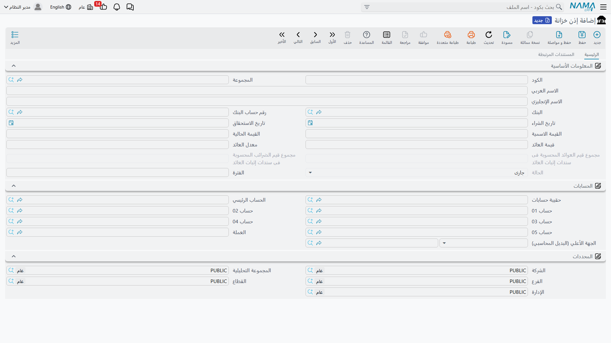
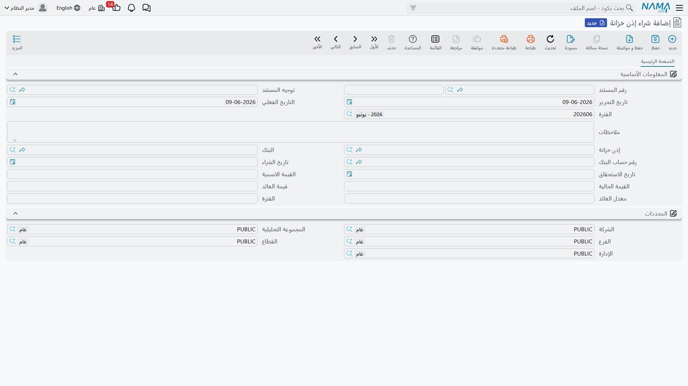

# أذون الخزانة

إذن الخزانة أداةُ استثمارٍ قصيرة الأجل تصدرها الدولة: تشتريه بأقلّ من قيمته الاسمية، وعند حلول أجله تقبض قيمته كاملة، فيكون الفرق هو عائدك. وعلى عكس بقية مستندات البنوك التي تبدأ بملفٍ رئيسي تنشئه بنفسك، يُنشَأ **إذن الخزانة تلقائيًا عند شرائه**: مستند الشراء هو نقطة البداية، ثم تتعاقب عليه مستندات إثبات العائد حتى البيع المبكر أو الإقفال عند الاستحقاق.

::: info الترخيص المطلوب
أذون الخزانة ضمن ترخيص `accounting-investment-documents` — وهو الترخيص نفسه الذي يغطّي [مستندات الاستثمار](./investment-documents.md).
:::

## دورة حياة الإذن

تبدأ كل الشاشات من جذر **البنوك > إذن خزانة**:

1. **شراء إذن خزانة** — نقطة البداية: يُنشِئ الإذن تلقائيًا بحالة «جارٍ» ويُرحّل قيمته محاسبيًا.
2. **إثبات عائد إذن الخزانة** — تثبيت العائد المستحقّ دوريًا (موزّعًا بالتناسب مع الزمن المنقضي)، مع الضريبة عليه إن وُجدت.
3. **إثبات عائد أذون خزانة مجمع** — النسخة المجمّعة لإثبات عائد عدّة أذون دفعةً واحدة.
4. ثم أحد مسارين متبادلين:
   - **بيع إذن خزانة** — بيع مبكّر قبل الأجل.
   - **إقفال إذن خزانة** — تحصيل القيمة عند حلول الأجل.

عند البيع أو الإقفال تتحوّل حالة الإذن إلى «مغلقة».

::: warning البيع والإقفال متبادلان
الإذن الواحد يُغلق إمّا بالبيع المبكّر وإمّا بالإقفال عند الاستحقاق — لا بالاثنين معًا.
:::

## ملف الإذن

في شاشة **إذن خزانة** (`Banks > Treasury Bill > Treasury Bill`) — التي يملؤها الشراء — تظهر بيانات الإذن: **البنك** و**حساب البنك**، و**القيمة الاسمية** و**القيمة الحالية**، و**نسبة العائد** و**قيمة العائد**، و**تاريخ الشراء** و**تاريخ الاستحقاق** و**المدة**، إضافةً إلى مجاميع المتابعة: **إجمالي قيم العوائد المثبتة** و**إجمالي الضرائب** في مستندات الإثبات.

**حالات الإذن:** جارٍ (Running) → مغلقة (Closed).

## الشراء وإثبات العائد

عند تحرير **شراء إذن خزانة** (`Banks > Treasury Bill > Treasury Bill Purchase Document`) يُنشَأ الإذن ويُرحَّل أثره عبر جانبَي **مدين/دائن القيمة الحالية**.

ثم يُثبَّت العائد المستحقّ دوريًا عبر **إثبات عائد إذن الخزانة** (محسوبًا بالتناسب مع الفترة المنقضية، مع الضريبة)، أو دفعةً واحدة لعدّة أذون عبر **إثبات عائد أذون خزانة مجمع**. (مصدر الحسابات في مرجع [توجيهات المستندات](./support/accounting-document-terms.md).)

## البيع أو الإقفال

عند نهاية المطاف يُغلق الإذن بأحد مستندين: **بيع إذن خزانة** عند البيع المبكّر قبل الأجل، أو **إقفال إذن خزانة** عند تحصيل قيمته الاسمية في تاريخ الاستحقاق. وفي الحالتين تصبح الحالة «مغلقة».

## للدعم الفني

- **«لا أجد شاشة لإنشاء إذن خزانة جديد»** — الإذن لا يُنشأ يدويًا؛ يُنشئه **مستند الشراء** تلقائيًا.
- **«حاولت بيع إذن سبق إقفاله»** — البيع والإقفال متبادلان؛ الإذن المغلق لا يقبل الآخر.
- **«العائد المثبَّت أقلّ من المتوقّع»** — العائد يُوزَّع بالتناسب مع الفترة المنقضية حتى تاريخ الإثبات، لا كاملًا دفعةً واحدة.
- **«من أين تأتي حسابات الشراء والعائد؟»** — من توجيه **شراء إذن الخزانة** و**إثبات العائد**؛ راجِع [توجيهات المستندات](./support/accounting-document-terms.md).
- آلية المعالجة المحاسبية في [كيف تُعالَج المستندات إلى أثر محاسبي](./support/accounting-request-processing.md).
