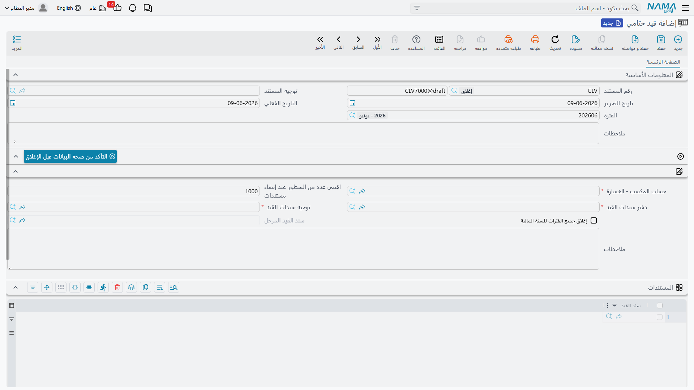
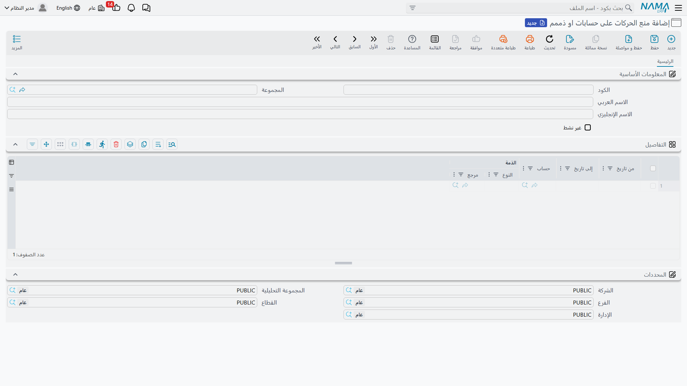

# الإقفال السنوي والتحكم في الفترات

في نهاية كل سنة مالية تأتي لحظة الإقفال: ترحيل أرباح/خسائر السنة إلى حقوق الملكية، وإقفال حسابات النتيجة استعدادًا لسنة جديدة. وعلى مدار السنة تحتاج أدوات للتحكّم فيمن يُسجِّل وأين ومتى. هذه الصفحة تجمع هذه الأدوات: **القيد الختامي**، و**التحكم في حالة السنة والفترات**، و**منع الحركات المحاسبية**، و**سند مراجعة الحسابات**، و**تفريغ الحركات**.

::: info الترخيص المطلوب
هذه الأدوات ضمن ترخيص المحاسبة الأساسي `accounting`.
:::

## القيد الختامي

**القيد الختامي** (`Accounting > Documents > Closing Entry`) هو المستند الذي يُغلق السنة. فكرته: يقرأ أرصدة حسابات **قائمة الدخل** (الإيرادات والمصروفات)، ويُولِّد **سند قيد** موازنًا ينقل صافي الربح أو الخسارة إلى **حساب المكسب - الخسارة** الذي تحدّده، فتُصفَّر حسابات النتيجة وتبقى الميزانية وحدها مرحَّلة للسنة التالية.

أهم حقوله:

- **حساب المكسب - الخسارة** — الحساب الذي يستقبل صافي نتيجة العام (إلزامي).
- **توجيه سندات القيد** و**دفتر سندات القيد** — التوجيه والدفتر اللذان يُسجَّل بهما القيد المُولَّد.
- **اقصي عدد من السطور عند إنشاء مستندات** — يقسّم القيد المُولَّد إلى عدّة مستندات إن تجاوز هذا الحدّ (مفيد للحسابات الكثيرة).
- **إغلاق جميع الفترات للسنة المالية** — يُغلق كل فترات السنة تلقائيًا بعد الإقفال.
- زر **التأكد من صحة البيانات قبل الإغلاق** — يفحص جاهزية البيانات قبل تنفيذ الإقفال.

::: warning قبل الإقفال
- يجب أن تكون الفترة التي يقع فيها القيد الختامي من نوع **تسويات** أو **اغلاق** (انظر [المفاهيم الأساسية والإعداد](./accounting-concepts-and-setup.md)).
- يحجب النظام الإقفال إن كانت هناك حركات لم تكتمل معالجتها (وهو سلوك يضبطه أحد خيارات الوحدة)؛ عالِج الحركات المتعثّرة أولًا كما في [كيف تُعالَج المستندات إلى أثر محاسبي](./support/accounting-request-processing.md).
:::

## التحكم في حالة السنة والفترات

فتح الفترات وإغلاقها بالجملة يتمّ من شاشة **السنة المالية** عبر أزرار **فتح الفترات** و**غلق الفترات** و**إنشاء السنة المالية التالية** (موضّحة في [المفاهيم الأساسية والإعداد](./accounting-concepts-and-setup.md)). الفترة **المغلقة** ترفض أي حركة جديدة بتاريخها، وهي خط الدفاع الأول في ضبط الإقفال الدوري: تُغلق الشهر بعد اعتماد أرقامه فيتجمّد ماضيه.

## منع الحركات المحاسبية

أحيانًا تحتاج قفلًا **أدقّ** من إغلاق فترة كاملة: منع الحركة على حساب بعينه، أو على ذمة طرف محدّد، أو ضمن نطاق تواريخ. هذا دور **منع الحركات على حسابات أو ذمم** (`Accounting > Master Files > Prevent Transactions On Accounts Or Subsidiaries`).

في أسطر المستند تحدّد لكل قيد: **الحساب**، و**الذمة** (اختياريًا)، و**من تاريخ** و**إلى تاريخ**. أي محاولة تسجيل تقع ضمن هذه القيود تُرفض. وعلم **غير نشط** يتيح تعطيل القاعدة مؤقتًا دون حذفها.

## سند مراجعة الحسابات

**سند مراجعة الحسابات** (`Accounting > Documents > Ledger Revise Document`) أداة للمراجعة الداخلية: يحدّد فيه **المراجع** و**المحاسب** ونطاق التواريخ (**من/إلى**)، ويسجّل في أسطره ملاحظات المراجعة على الحركات في تلك الفترة. هو سجلّ رقابي لا يُحدِث أثرًا محاسبيًا، بل يوثّق أن الحسابات روجعت ومن راجعها.

## تفريغ الحركات (Purge)

مع تراكم سنوات من الحركات قد تحتاج إلى **تفريغ/أرشفة** القديم منها لتخفيف قاعدة البيانات. مستند **Purge Journal** (`Administration > Purge Documents > Purge Journal`) يتولّى ذلك. وهو عملية إدارية حسّاسة تُنفَّذ على فترات من نوع **فترة Purge**، ويُفضَّل تنفيذها بإشراف فنّي وبعد أخذ نسخة احتياطية.

## النماذج المطبوعة

- القيد الختامي: `SYSF-ACC020`.
- سند مراجعة الحسابات: `SYSF-ACC016`.
- منع الحركات المحاسبية: `SYSF-ACC018`.

## للدعم الفني

- **«الإقفال لا يكتمل / يرفض التنفيذ»** — استخدم زر **التأكد من صحة البيانات قبل الإغلاق**؛ غالبًا السبب حركات لم تُعالَج بعدُ، أو فترة القيد ليست من نوع تسويات/اغلاق.
- **«حركة مرفوضة رغم أن الفترة مفتوحة»** — تحقّق من وجود مستند **منع حركات محاسبية** نشط يغطّي الحساب/الذمة/التاريخ.
- **«أريد إيقاف منع مؤقتًا دون حذفه»** — فعّل علم **غير نشط** على مستند المنع.
- **«أين تُضبط مهلة الإقفال مع وجود حركات غير مكتملة؟»** — في كتالوج [إعدادات الحسابات](./support/accounting-configuration.md).
- تفاصيل دورة الفترات والعملات في مرجع **الفترات المالية والعملات**.
