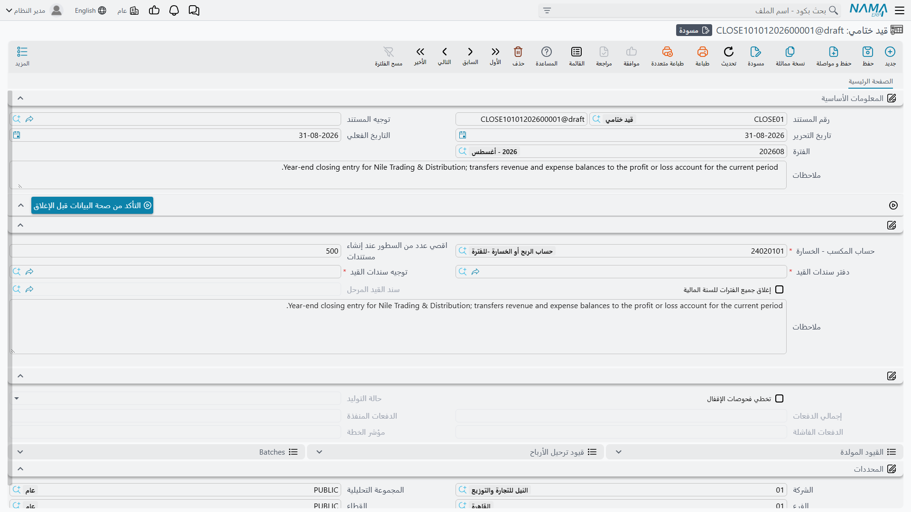
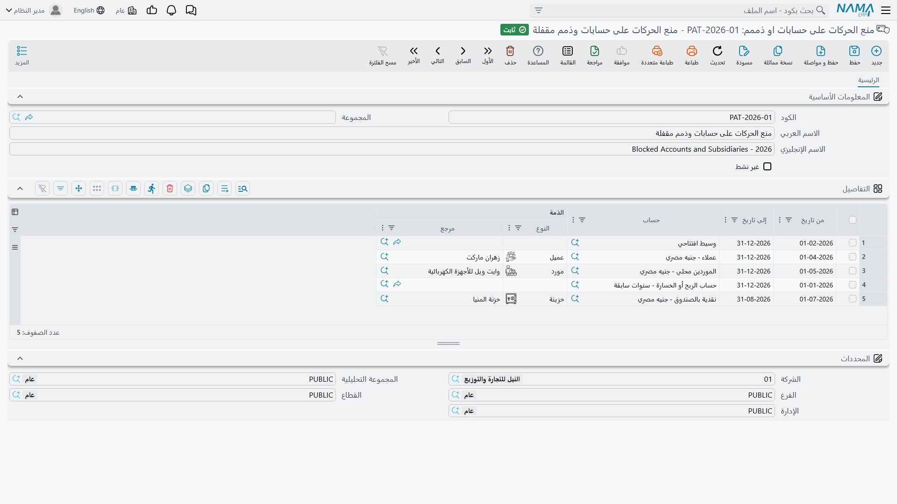

# الإقفال السنوي والتحكم في الفترات

في نهاية كل سنة مالية تأتي لحظة الإقفال: ترحيل أرباح/خسائر السنة إلى حقوق الملكية، وإقفال حسابات النتيجة استعدادًا لسنة جديدة. وعلى مدار السنة تحتاج أدوات للتحكّم فيمن يُسجِّل وأين ومتى. هذه الصفحة تجمع هذه الأدوات: **القيد الختامي**، و**التحكم في حالة السنة والفترات**، و**منع الحركات المحاسبية**، و**سند مراجعة الحسابات**، و**تفريغ الحركات**.

::: info الترخيص المطلوب
هذه الأدوات ضمن ترخيص المحاسبة الأساسي `accounting`.
:::

## القيد الختامي

**القيد الختامي** (`Accounting > Documents > Closing Entry`) هو المستند الذي يُغلق السنة. فكرته: يقرأ أرصدة حسابات **قائمة الدخل** (الإيرادات والمصروفات)، ويُولِّد **سند قيد** موازنًا ينقل صافي الربح أو الخسارة إلى **حساب المكسب - الخسارة** الذي تحدّده، فتُصفَّر حسابات النتيجة وتبقى الميزانية وحدها مرحَّلة للسنة التالية.

أهم حقوله:

- **حساب المكسب - الخسارة** — الحساب الذي يستقبل صافي نتيجة العام (إلزامي).
- **توجيه سندات القيد** و**دفتر سندات القيد** — التوجيه والدفتر اللذان يُسجَّل بهما القيد المُولَّد.
- **اقصي عدد من السطور عند إنشاء مستندات** — يقسّم القيد المُولَّد إلى عدّة مستندات إن تجاوز هذا الحدّ (مفيد للحسابات الكثيرة).
- **إغلاق جميع الفترات للسنة المالية** — يُغلق كل فترات السنة تلقائيًا بعد الإقفال.
- زر **التأكد من صحة البيانات قبل الإغلاق** — فحص الجاهزية الذي تشغّله قبل تنفيذ الإقفال. يسألك عن **فترة بداية** اختيارية: اتركها فارغة ليفحص فترة القيد الختامي نفسها، أو سمِّ فترةً أسبق ليغطّي مدى كاملًا. ويجب ألّا تبدأ تلك الفترة بعد فترة القيد الختامي، وأن تنتمي إلى التقويم نفسه — فإن أعطيته فترةً تخالف أيًّا من الشرطين نبّهك بدل أن ينفّذ. ويجب أن يكون القيد الختامي محفوظًا قبل أن يعمل الزر.

::: warning قبل الإقفال
- يجب أن تكون الفترة التي يقع فيها القيد الختامي من نوع **تسويات** أو **اغلاق** (انظر [المفاهيم الأساسية والإعداد](./accounting-concepts-and-setup.md)).
- يحجب النظام الإقفال إن كانت هناك حركات لم تكتمل معالجتها (وهو سلوك يضبطه أحد خيارات الوحدة)؛ عالِج الحركات المتعثّرة أولًا كما في [كيف تُعالَج المستندات إلى أثر محاسبي](./support/accounting-request-processing.md).
:::

### تصحيح قيد ختامي أو إعادة الإقفال

الإقفال ليس بابًا في اتجاه واحد، والطريق للرجوع ليس ملاحقة سندات القيد التي وَلَّدها أبدًا: القيد الختامي هو مالكها، فمهما أردت فعله فأنت تفعله بالقيد الختامي نفسه.

- **احفظه من جديد.** هذا هو تصحيح حقول القيد الختامي نفسه. فحفظ قيد ختامي معتمد يعيد الإقفال كاملًا من الأرصدة كما هي في تلك اللحظة: تُعاد فحوص ما قبل الإقفال، وتُحذف سندات القيد التي ولّدها التشغيل السابق، وتُولَّد مجموعة جديدة مكانها. **حساب المكسب - الخسارة** خطأ، أو **دفتر سندات القيد** خطأ، أو **اقصي عدد من السطور عند إنشاء مستندات** خطأ — غيّر الحقل واحفظ، فيُعاد بناء السندات. أما ما لن يفعله فهو التقاط التسويات، لأنك لا تستطيع إدخالها أصلًا والقيد الختامي قائم؛ انظر ما يلي.
- **احذفه** فتذهب معه السندات التي ولّدها — سندات الإقفال وسندات ترحيل الأرباح معًا — ويختفي القيد الختامي نفسه من قاعدة البيانات. وهذا ما تفعله حين يجب التراجع عن الإقفال: إما لأنه ما كان ينبغي أن يوجد أصلًا، وإما لأن السنة يجب أن تُفتح للتصحيحات.
- **ألغِه** بـ[مستند إلغاء مستند](/ar/platform/document-cancel-document.md) فتُحذف السندات المولّدة تمامًا كما في الحذف، لكن القيد الختامي يبقى في النظام بحالة **ملغي**، محتفظًا برقمه وبمكانه في القائمة. وهو يرفع قفل التواريخ كما يرفعه الحذف، ويترك أثرًا يوثّق أن الإقفال جرى — في مقابل مستند ملغي لم يعد يمكن حذفه.

::: tip الحذف مرفوض ما دام التوليد جاريًا
الإقفال الكبير يعمل على دفعات في الخلفية، والمستند يرفض الحذف حتى تنتهي: *«Closing entry generation is still in progress, please wait until it completes before deleting this document»* (والتعديل أثناء عمل الدفعات مرفوض بالصيغة نفسها منتهيةً بـ "before editing this document"). انتظر حتى ينتهي التوليد ثم احذف. وهذه الرسالة لا نصّ عربي لها في المنتج، فتظهر بالإنجليزية على الشاشات العربية أيضًا.
:::

#### التسويات التي تأتي بعد الإقفال

القيد الختامي المعتمد لا يُقفل فترته وحدها — بل يرسم خطًّا يمتد على الشركة كلها عند **تاريخ الاستحقاق** الخاص به. فمنذ تلك اللحظة يُرفض حفظ **أي** مستند مؤرخ في ذلك التاريخ أو قبله، في كل الوحدات لا في الحسابات وحدها:

> لا يمكن تعديل المستند {0} بتاريخ {1} لانه يوجد قيد ختامى بتاريخ {2}

وتحريك تاريخ مستند عبر هذا الخط مرفوض للسبب نفسه، وله رسالته الخاصة — فلا تستطيع أن تأخذ مستندًا مؤرخًا قبل القيد الختامي وتدفعه إلى ما بعده:

> لا يمكن تعديل التاريخ الفعلى للمستند {0} من تاريخ {1} الى تاريخ {2} لانه يوجد قيد ختامى بتاريخ {3}

ولهذا فإن «سجّل التسوية ثم أعد تشغيل الإقفال» ليس ترتيبًا يسمح به النظام. الترتيب الصحيح هو:

1. **احذف القيد الختامي** (أو ألغِه)، فيُرفع الخط.
2. **أدخل التسويات** بعد أن تحرّرت تواريخها.
3. **أنشئ القيد الختامي من جديد** واعتمده، فيُقفل السنة على الأرقام المصححة.

::: danger لا تلجأ إلى الخيار الذي يرفع القفل
هناك خيار في الإعدادات العامة — **السماح بتعديل المستندات قبل تاريخ القيد الختامى** ([تبويب المستندات](/ar/platform/global-config/global-config-documents.md)) — يُعطّل هذا الفحص، وهناك علم على السنة المالية — **السماح بمعالجة التكاليف والكميات والقيود بعد القيد الختامى** — يجعل طلبات الأعمال المؤرخة قبل الإقفال تستمر في المعالجة. وكلاهما موجود لحالات الإنقاذ، ولا مكان لأيٍّ منهما في عمل نهاية السنة المعتاد: فمع تفعيلهما يستطيع مستند أن يغيّر فترةً أُقفلت وروجعت وصدرت عنها تقارير، ويبقى القيد الختامي نفسه يصف أرصدةً لم تعد موجودة. احذف الإقفال، وصحّح في سنة مفتوحة، ثم أقفل من جديد.
:::

::: info الرسالة نفسها دون قيد ختامي ظاهر
يرسم الخطَّ آخرُ **قيد ختامي معتمد** أو آخرُ **Freeze Processing Document** معتمد لتلك الشركة، أيهما أحدث. فإن ذكرت الرسالة تاريخًا لا يجد له أحد تفسيرًا، فابحث عن مستند تجميد كما تبحث عن قيد ختامي.
:::

::: warning حذف القيد الختامي لا يُعيد فتح الفترات
إن كان **إغلاق جميع الفترات للسنة المالية** مفعّلًا، فقد جعل الإقفال كل فترات السنة الأخرى **مغلقة**، وحذف القيد الختامي لا يتراجع عن ذلك. فقد تُرفض الخطوة الثانية أعلاه رغم كل شيء — هذه المرة لأن الفترة نفسها مغلقة، وهي رسالة أخرى غير رسالة القيد الختامي. أعد فتح الفترة التي تحتاجها من زر **فتح الفترات** في شاشة **السنة المالية** قبل إدخال التسويات، ثم أغلقها من جديد بعد الانتهاء إن أردت إحكامها.
:::

## التحكم في حالة السنة والفترات

فتح الفترات وإغلاقها بالجملة يتمّ من شاشة **السنة المالية** عبر أزرار **فتح الفترات** و**غلق الفترات** و**إنشاء السنة المالية التالية** (موضّحة في [المفاهيم الأساسية والإعداد](./accounting-concepts-and-setup.md)). الفترة **المغلقة** ترفض أي حركة جديدة بتاريخها، وهي خط الدفاع الأول في ضبط الإقفال الدوري: تُغلق الشهر بعد اعتماد أرقامه فيتجمّد ماضيه.

## منع الحركات المحاسبية

أحيانًا تحتاج قفلًا **أدقّ** من إغلاق فترة كاملة: منع الحركة على حساب بعينه، أو على ذمة طرف محدّد، أو ضمن نطاق تواريخ. هذا دور **منع الحركات على حسابات أو ذمم** (`Accounting > Master Files > Prevent Transactions On Accounts Or Subsidiaries`).

في أسطر المستند تحدّد لكل قيد: **الحساب**، و**الذمة** (اختياريًا)، و**من تاريخ** و**إلى تاريخ**. أي محاولة تسجيل تقع ضمن هذه القيود تُرفض. وعلم **غير نشط** يتيح تعطيل القاعدة مؤقتًا دون حذفها.

## سند مراجعة الحسابات

**سند مراجعة الحسابات** (`Accounting > Documents > Ledger Revise Document`) أداة للمراجعة الداخلية: يحدّد فيه **المراجع** و**المحاسب** ونطاق التواريخ (**من/إلى**)، ويسجّل في أسطره ملاحظات المراجعة على الحركات في تلك الفترة. هو سجلّ رقابي لا يُحدِث أثرًا محاسبيًا، بل يوثّق أن الحسابات روجعت ومن راجعها.

## تفريغ الحركات (Purge)

مع تراكم سنوات من الحركات قد تحتاج إلى **تفريغ/أرشفة** القديم منها لتخفيف قاعدة البيانات. مستند **Purge Journal** (`Administration > Purge Documents > Purge Journal`) يتولّى ذلك. وهو عملية إدارية حسّاسة تُنفَّذ على فترات من نوع **فترة Purge**، ويُفضَّل تنفيذها بإشراف فنّي وبعد أخذ نسخة احتياطية.

## النماذج المطبوعة

- القيد الختامي: `SYSF-ACC020`.
- سند مراجعة الحسابات: `SYSF-ACC016`.
- منع الحركات المحاسبية: `SYSF-ACC018`.

## للدعم الفني

- **«الإقفال لا يكتمل / يرفض التنفيذ»** — استخدم زر **التأكد من صحة البيانات قبل الإغلاق**؛ غالبًا السبب حركات لم تُعالَج بعدُ، أو فترة القيد ليست من نوع تسويات/اغلاق.
- **«القيد الختامي أُنشئ خطأً — هل نحذفه ونبدأ من جديد؟»** — لا. صحّح الحقول الخطأ واحفظه من جديد، فتُحذف السندات السابقة وتُولَّد من جديد. ولا تحذفه أو تلغِه إلا إذا كان الإقفال نفسه لا ينبغي أن يوجد؛ انظر قسم «تصحيح قيد ختامي أو إعادة الإقفال» أعلاه.
- **«وصلت تسويات بعد إقفال السنة»** — لا تستطيع إدخالها والقيد الختامي قائم؛ فكل مستند مؤرخ في تاريخ استحقاقه أو قبله مرفوض. احذف القيد الختامي، وأعد فتح الفترة إن كان **إغلاق جميع الفترات للسنة المالية** قد أغلقها، وأدخل التسويات، ثم أنشئ القيد الختامي من جديد. ولا تفعّل **السماح بتعديل المستندات قبل تاريخ القيد الختامى** للالتفاف على ذلك.
- **«لا يمكن تعديل المستند {0} بتاريخ {1} لانه يوجد قيد ختامى بتاريخ {2}»** — هذا هو القفل نفسه، وهو يسري على كل الوحدات لا على الحسابات وحدها. وإن لم يفسّر التاريخَ أي قيد ختامي، فابحث عن **Freeze Processing Document** معتمد؛ فهو يرسم الخط نفسه.
- **«القيد الختامي لا يُحذف»** — إما أن التوليد ما زال جاريًا (فالإقفال الكبير يعمل على دفعات، فانتظر حتى ينتهي)، وإما أنه أُلغي من قبل، والمستند الملغي لا يمكن حذفه.
- **«حركة مرفوضة رغم أن الفترة مفتوحة»** — تحقّق من وجود مستند **منع حركات محاسبية** نشط يغطّي الحساب/الذمة/التاريخ.
- **«أريد إيقاف منع مؤقتًا دون حذفه»** — فعّل علم **غير نشط** على مستند المنع.
- **«أين تُضبط مهلة الإقفال مع وجود حركات غير مكتملة؟»** — في كتالوج [إعدادات الحسابات](./support/accounting-configuration.md).
- تفاصيل دورة الفترات والعملات في مرجع **الفترات المالية والعملات**.

## رسائل قد تظهر لك

| الرسالة | لماذا | ما تفعله |
|---|---|---|
| «يوجد طلبات نظامية فشلت معالجتها او لم تعالج بعد. يرجي اصلاح هذه الطلبات اولا (يمكنك معرفتها من خلال شاشة bizRequestView(» | وجد **القيد الختامي** طلبات قيود محاسبية لهذه الشركة ليست في حالة **تمت المعالجة**. والإقفال فوقها يُقفل أرصدة خاطئة. | افتح قائمة **الطلبات النظامية**، وصفِّ على الحالات الفاشلة/غير المعالجة، وأصلِح السبب وأعِد المعالجة، ثم احفظ القيد الختامي من جديد. |
| «يوجد قيد محاسبي للمستند {0} - {1} له طلب حذف او تم إنشاؤة لستند تم إلغاؤة فيما بعد» | قيد محاسبي داخل السنة المُقفَلة يتبع مستندًا أُلغي لاحقًا، أو له طلب حذف معلّق. | صفِّ طلبات الحذف المعلّقة وقيود المستندات الملغاة المتخلّفة قبل الإقفال؛ ونوع المستند وكوده في الرسالة. |
| «يوجد قيد كميات للمستند {0} - {1} له طلب حذف او تم إنشاؤة لستند تم إلغاؤة فيما بعد» | الحالة نفسها على جانب الكميات: قيد كميات في الفترة يتبع مستندًا ملغى أو له طلب حذف منتظر. | والعلاج نفسه — اعالِج طلب الحذف أو المستند الملغى أولًا. |
| «تم تغيير عملة الحساب {0}. تحتاج إلى إعادة إنشاء التأثيرات المحاسبية (أو إعادة حفظ) المستند {1}» | غُيّرت عملة حساب بعد أن كُتبت عليه قيود، فلم تعد المبالغ المحلية والأجنبية المحفوظة متوافقة. | أعِد معالجة (أو أعِد حفظ) المستند المذكور ليُبنى أثره بعملة الحساب الحالية، ثم أقفِل. |
| «رصيد الحساب {0} بالعملة الأجنبية هو {1} والرصيد المحلي هو {2} ، تحتاج إلى إنشاء مستند تغيير سعر صرف لهذا الحساب.» | حسابٌ بعملة أجنبية له رصيد أجنبي ورصيد محلي لا يتوافقان على أي سعر صرف واحد. | أصدِر مستند **تغيير سعر الصرف** لذلك الحساب، ثم أعِد تشغيل القيد الختامي. |
| «الحساب {0} العملة الاجنبية {1} - {2} والعملة المحلية {3} - {4}. الرجاء استخدام مستند {5} لحل مشكلة الحساب» | الصورة الأقوى من المشكلة نفسها: جانب العملة الأجنبية وجانب العملة المحلية على جانبين متضادين — أحدهما مدين والآخر دائن — ولا يوفّق بينهما سعر صرف. | استخدم نوع المستند الذي تسمّيه الرسالة (**تغيير سعر الصرف**) على ذلك الحساب قبل الإقفال. |
| «الحساب {0} لديه نوع ذمة غير صحيح» | توجد قيود على حساب نوع الذمة فيها لا يطابق الأنواع المسموح بها على الحساب — غالبًا حساب فرعي يحمل ذمة، أو نوع ذمة حُذف من الحساب بعد كتابة القيود. | أعِد نوع الذمة على الحساب أو صحّح القيود قبل الإقفال. |
| «لا توجد سنة مالية معرفة للتاريخ الفعلي {0} لسند القيد، والشركة {1}» | يُرحّل القيد الختامي الأرباح المدوَّرة في اليوم التالي لنهاية الفترة، ولا توجد فترة مالية لذلك التاريخ في هذه الشركة. | أنشئ السنة المالية التالية (وفتراتها) للشركة، ثم شغّل القيد الختامي. |
| «يجب علي الأقل إدخال الحساب او الذمة» | سطر في تفاصيل **منع الحركات المحاسبية** لا يذكر حسابًا ولا ذمة، فيصبح مانعًا لكل شيء. | املأ عمود **الحساب** أو عمود **الذمة** أو كليهما في ذلك السطر. |
| «الحساب {0} حساب فرعي لايمكن ان يكون له ذمة» | سطر منع يقرن حسابًا **فرعيًّا** بذمة؛ ولا تقبل الذمةَ إلا الحسابات من نوع «ذمة». | احذف الذمة من السطر، أو وجّه السطر إلى حساب الذمة الذي قصدته. |
