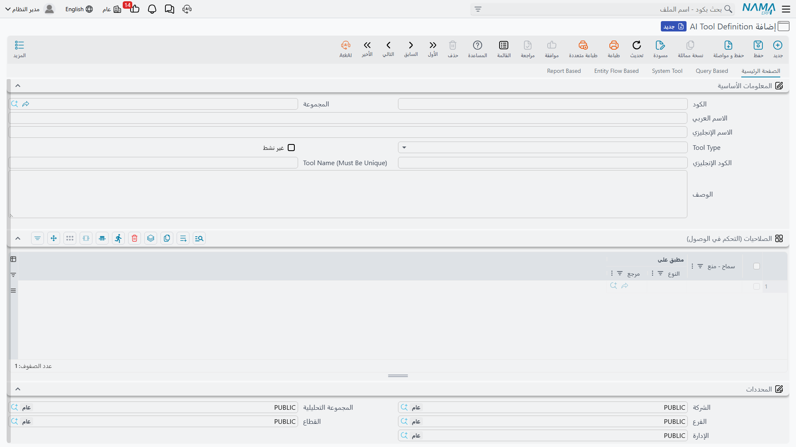
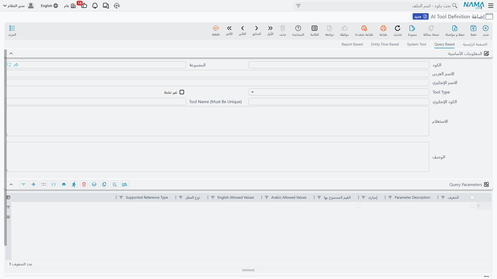
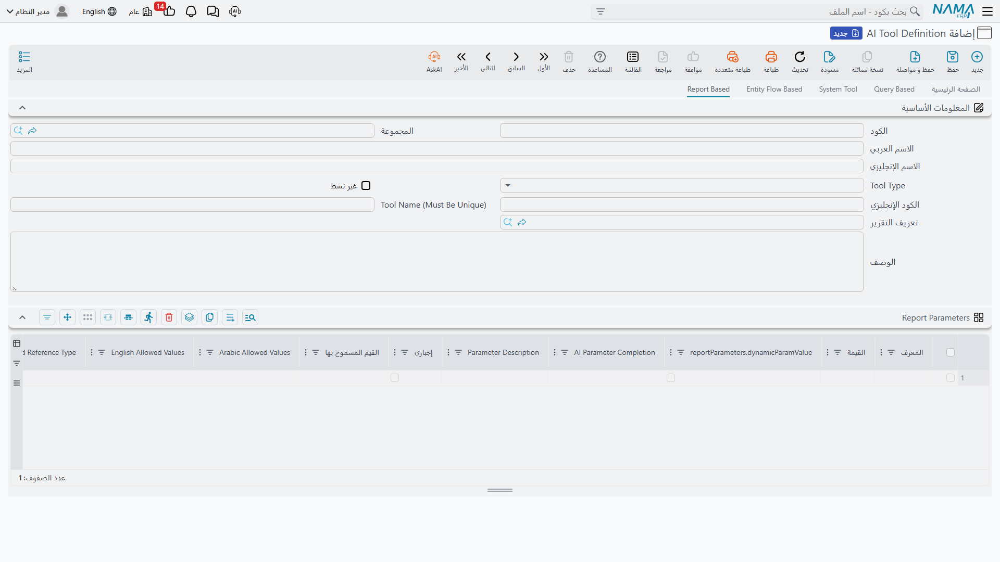
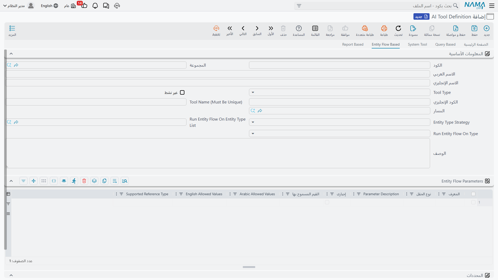
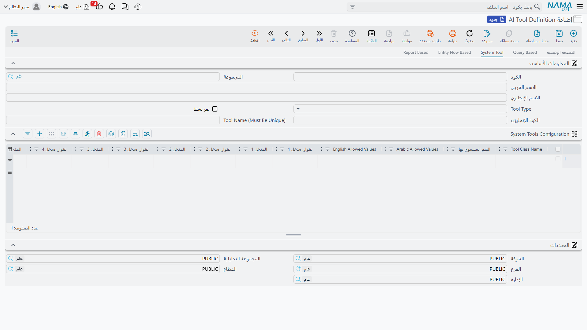

# تعريفات أدوات الذكاء الاصطناعي (AI Tool Definitions)

عندما يتحدث مساعد ذكاء اصطناعي مع نظام نما ERP — سواء كان المساعد المدمج داخل النظام أو عميلًا خارجيًا متصلًا عبر [خادم MCP](./ai-mcp-server.md) — فهو لا يستطيع فعل أي شيء من تلقاء نفسه. كل قدرة يملكها المساعد هي **أداة (Tool)** عرّفها مدير النظام مسبقًا: استعلام يجيب عن سؤال معين، تقرير يشغَّل بمدخلات، مسار كيان ينفَّذ على مستند، أو أداة نظامية جاهزة من أدوات نما.

شاشة **AI Tool Definition** في وحدة الذكاء الاصطناعي هي المكان الذي تُعرَّف فيه هذه الأدوات. كل سجل في الشاشة يصبح أداة (أو مجموعة أدوات) يستطيع النموذج اللغوي استدعاءها، مع وصف يخبره متى وكيف يستخدمها.

::: info الترخيص المطلوب
تتطلب هذه الشاشة تركيب وحدة الذكاء الاصطناعي (AI Module) وترخيصها ضمن رخصة النظام.
:::

## البيانات الأساسية

في رأس الشاشة تحدد هوية الأداة وسلوكها العام:

| الحقل | الدور |
|---|---|
| **Tool Type** | نوع الأداة: `Query Based` أو `Report Based` أو `Entity Flow Based` أو `System Tool` — وهو ما يحدد أي صفحة من صفحات الشاشة ستُستخدم |
| **Alt Code** | الاسم الذي تُعلَن به الأداة للنموذج اللغوي في الأنواع الثلاثة الأولى (استعلام/تقرير/مسار كيان) |
| **Tool Name (Must Be Unique)** | في أدوات النظام (System Tool) يُستخدم كبادئة لأسماء الأدوات المتولدة — انظر «تسمية الأدوات» أدناه |
| **Description** | وصف الأداة. هذا الحقل **هو ما يقرؤه النموذج اللغوي ليقرر متى يستدعي الأداة وكيف** — فكلما كان الوصف أدق وأوضح، كان استخدام النموذج للأداة أصوب |
| **In Active** | تعطيل الأداة دون حذفها — الأداة المعطلة لا تُعرض على النموذج إطلاقًا |

::: tip متى تظهر الأداة للمساعد؟
لا تُعرض الأداة على النموذج اللغوي إلا إذا كانت **معتمدة (Committed)** وغير معطلة. وأي تعديل أو حذف لاحق ينعكس تلقائيًا — يعاد بناء قائمة الأدوات عند أول اتصال تالٍ دون الحاجة لإعادة تشغيل.
:::

### تسمية الأدوات

- أدوات **الاستعلام والتقرير ومسار الكيان**: تُعلن الأداة باسم **Alt Code** كما هو.
- **أدوات النظام (System Tool)**: كل سطر في جدول الأدوات قد يولّد أداة أو أكثر، ويتركب اسم كل أداة من بادئة + اسم الأداة الداخلي. البادئة هي أول قيمة غير فارغة من: **Tool Name** ثم **Alt Code** ثم **الكود**، يليها شرطة سفلية. فمثلًا سجل كوده `import` يحتوي أداة `AITFindRecords` يولّد أداة اسمها `import_FindRecords`.

## الصلاحيات (التحكم في الوصول)

جدول **الصلاحيات (التحكم في الوصول)** يحدد من يستطيع تنفيذ الأداة. كل سطر يحمل:

- **Applicable For**: مستخدم، أو ملف أمان (Security Profile)، أو مجموعة مستخدمين.
- **Allow / Prevent**: سماح أو منع.

عند تنفيذ الأداة يبحث النظام عن أول سطر ينطبق على المستخدم الحالي بهذا الترتيب: سطر **المستخدم** نفسه أولًا، ثم سطر **ملف الأمان** الخاص به، ثم سطر **المجموعة**. أول سطر مطابق يحسم القرار. وإذا كان الجدول فارغًا (أو لا يوجد سطر مطابق) فالأداة متاحة للجميع.

::: warning الصلاحيات تُفحص عند التنفيذ
قائمة الأدوات المعلنة واحدة لجميع المستخدمين، لكن **التنفيذ** هو ما يخضع لفحص الصلاحية: إذا حاول مستخدم ممنوع تنفيذ أداة، تُرفض العملية برسالة واضحة. كما تظل جميع صلاحيات السجلات والمحددات (الشركة، الفرع، ...) سارية على ما تقرؤه الأداة أو تكتبه، لأن كل شيء يمر عبر بوابة الخدمات القياسية للنظام.
:::

## النوع الأول: أداة مبنية على استعلام (Query Based)

أبسط أنواع الأدوات وأكثرها استخدامًا: استعلام SQL يكتبه مدير النظام، ويستطيع النموذج اللغوي تشغيله بمدخلات يحددها هو.

في صفحة **Query Based**:

1. اكتب الاستعلام في حقل **Query**، مع الإشارة إلى كل مدخل بصيغة العنصر النائب `{paramName}` (مثل `{fromDate}` و `{toDate}`).
2. عرّف كل مدخل في جدول **Query Parameters**.
3. اكتب في **Description** متى ينبغي استخدام هذه الأداة وماذا تُرجع.

عند التنفيذ يُشغَّل الاستعلام بقيم المدخلات التي أرسلها النموذج، وتُعاد النتيجة له بصيغة JSON (أسماء الأعمدة وقيم الصفوف).

::: tip المدخلات الاختيارية والشرطية
تمرّ مدخلات الاستعلام عبر المحرك نفسه المستخدَم في SQL الخاص بخرائط الحقول (Field Maps)، لذا تتوفر صيغة [مدخلات SQL المتقدمة](../../../entity-flows/core/ai-generated-field-maps-documentation.md#Advanced-SQL-Parameter-Syntax) كاملةً — وليس مجرد العنصر النائب البسيط `{fromDate}`. وهذا مهم لأن أداة الذكاء الاصطناعي تعرض عادةً عدة فلاتر *اختيارية*، وتتيح هذه الأدوات المساعدة لاستعلام واحد أن يتعامل معها سواء أرسل النموذج قيمةً أم لا:

- `{x>=,valueDate,fromDate}` — مقارنة تتحول إلى `1 = 1` (بلا أثر) عندما لا يرسل النموذج المدخل `fromDate`، بدلًا من إحاطة كل فلتر بالشكل `({fromDate} IS NULL OR ...)`.
- `{xBetween,column,fromDate,toDate}` — نطاق قد يغيب أحد طرفيه.
- `{xIN,column,codes}` — جملة IN تتحمل القائمة الفارغة دون خطأ.
- `{!paramName}` — استبدال نصي مباشر (لأسماء الجداول أو الأعمدة الديناميكية؛ ولا يُستخدم أبدًا مع مدخلات غير موثوقة).
:::

### جدول المدخلات

كل سطر في جدول المدخلات يعرّف مدخلًا واحدًا:

| العمود | الدور |
|---|---|
| **Param Id** | معرف المدخل — يجب أن يطابق الاسم المستخدم في الاستعلام، ولا يجوز تكراره |
| **Parameter Description** | وصف المدخل الذي يقرؤه النموذج ليعرف ماذا يرسل |
| **Required** | هل المدخل إلزامي |
| **Field Type** | نوع القيمة: `Text` أو `Number` أو `Date` أو `Reference` |
| **Allowed Values** / **Allowed Values Ar** / **Allowed Values En** | قائمة القيم المسموحة (إن وجدت) مع ترجماتها — تُعرض للنموذج ضمن وصف المدخل ليلتزم بها |
| **Supported Reference Type** | عند اختيار النوع `Reference`: نوع الكيان الذي يشير إليه المدخل (مثل `Customer`) |

ملاحظات على الأنواع:

- **Date**: يرسل النموذج التاريخ بصيغة `yyyy-MM-dd HH:mm` (تُذكر له هذه الصيغة تلقائيًا في وصف المدخل).
- **Reference**: يستطيع النموذج إرسال كود السجل أو معرفه فيُبحث عنه مباشرة. وإذا أرسل نصًا حرًّا (مثل اسم عميل تقريبي) والكيان مفهرس في خدمة التضمين الدلالي (Records Embedding)، يبحث النظام بحثًا دلاليًا ويعيد أقرب السجلات — وإن تعددت النتائج طُلب من النموذج اختيار سجل محدد منها.

## النوع الثاني: أداة مبنية على تقرير (Report Based)

تحوّل أي تعريف تقرير (Report Definition) موجود في النظام إلى أداة يستطيع النموذج تشغيلها وقراءة مخرجاتها.

في صفحة **Report Based**:

1. اختر التقرير في حقل **Report Definition**.
2. عرّف مدخلات التقرير في جدول **Report Parameters** — لكل مدخل من مدخلات التقرير سطر، **Param Id** فيه يطابق معرف مدخل التقرير.
3. حدد لكل مدخل طريقة تعبئته في عمود **AI Parameter Completion**:
   - **Fill By AI**: يحدد النموذج اللغوي القيمة بنفسه بناءً على طلب المستخدم (مع وصف المدخل والقيم المسموحة كما في أدوات الاستعلام).
   - **Fill Manually**: تُثبَّت القيمة في التعريف نفسه — قيمة نصية أو مرجع أو تاريخ/وقت أو قيمة ديناميكية، بنفس أسلوب مدخلات التقارير في جدولة المهام — ولا تُعرض على النموذج أصلًا.

عند التنفيذ يُشغَّل التقرير بالمدخلات المجمعة، ويُعاد ناتجه **نصًّا** إلى النموذج ليقرأه ويبني عليه إجابته.

## النوع الثالث: أداة مبنية على مسار كيان (Entity Flow Based)

تمكّن النموذج من **تنفيذ إجراء** في النظام عبر مسار كيان معرف مسبقًا — أي أن الذكاء الاصطناعي هنا لا يقرأ فحسب بل يُحدِث أثرًا.

في صفحة **Entity Flow Based**:

1. اختر المسار في حقل **Entity Flow**.
2. حدد **Entity Type Strategy** — على أي سجل يعمل المسار:

| الاستراتيجية | المعنى |
|---|---|
| **Runs On Single Entity Type** | يعمل على نوع كيان واحد محدد في حقل **Run Entity Flow On Type** |
| **Runs On Entity Type List** | يعمل على أحد أنواع محددة في **Run Entity Flow On Entity Type List**، ويختار النموذج النوع من بينها |
| **Runs On Any Document Type** | يعمل على أي نوع مستند |
| **Runs On Any Master File Type** | يعمل على أي ملف رئيسي |
| **Runs On Any Type** | يعمل على أي نوع كيان |
| **Does Not Need A Record** | لا يحتاج سجلًا — يُنفذ المسار مباشرة |

3. عرّف أي مدخلات إضافية يحتاجها المسار في جدول **Entity Flow Parameters** (نفس أعمدة مدخلات الاستعلام).

عندما تتطلب الاستراتيجية سجلًا، يضيف النظام تلقائيًا للنموذج مدخلين: نوع الكيان المستهدف (إن لم يكن محددًا في التعريف) وكود السجل أو معرفه. عند التنفيذ يُحضَر السجل، وتوضع قيم المدخلات في خريطة السجل، ثم يُشغَّل المسار — وأي فشل في المسار يُعاد للنموذج كرسالة خطأ.

## النوع الرابع: أدوات النظام (System Tool)

أدوات جاهزة مبنية داخل نما، يضيفها مدير النظام بسطر في جدول **System Tools Configuration**: كل سطر يحمل **Tool Class Name** (اسم صنف الأداة) ومعه حتى خمسة مدخلات نصية (Parameter 1–5) تكوّن سلوك الأداة إن كانت تحتاج تهيئة، وحقول وصف وعناوين تُملأ تلقائيًا.

حقل **Tool Class Name** مزوّد بقائمة اقتراحات تعرض **كل أدوات النظام المتاحة في النظام** — تختار منها بالاسم. وقد يولّد السطر الواحد أكثر من أداة (أداة العدّ مثلًا تولّد أداتين).

### أدوات تصدير واستيراد السجلات (Add Export Tools)

أكثر مجموعة استخدامًا مع عملاء MCP الخارجيين هي **أدوات تصدير واستيراد السجلات** الست، التي تتيح قراءة بيانات النظام واستيراد سجلات جديدة بصيغة JSON. ولإضافتها جميعًا بضغطة واحدة، استخدم زر **إضافة أدوات التصدير (Add Export Tools)** أعلى الجدول — يضيف الأسطر الستة الناقصة ويملأ وصف كل أداة تلقائيًا:

| الأداة | وظيفتها |
|---|---|
| `AITResolveEntityType` | تحويل مصطلح بالعربية أو الإنجليزية إلى نوع كيان |
| `AITFindRecords` | البحث عن سجلات بنوع كيان ومعايير |
| `AITGetRecord` | قراءة سجل واحد كاملًا بصيغة JSON |
| `AITGetEnumValues` | عرض القيم المسموحة لحقل من نوع قائمة ثابتة |
| `AITGetImportSchema` | عرض مخطط الاستيراد JSON لنوع كيان |
| `AITImportRecord` | استيراد سجل أو أكثر إلى النظام |

تفاصيل هذه الأدوات الست — مدخلاتها وأمثلة استخدامها — موثقة في صفحة [خادم MCP لنظام نما ERP](./ai-mcp-server.md).

### أدوات نظام أخرى

زر **Add Export Tools** يضيف الأدوات الست أعلاه فقط، لكن النظام يحوي أدوات جاهزة أخرى تضيفها يدويًا باختيار اسم صنفها من قائمة اقتراحات **Tool Class Name**:

| الأداة | الأداة المتولدة | وظيفتها |
|---|---|---|
| `AITCountRecordsTools` | `<prefix>countEntities` و `<prefix>countEntitiesCreatedWithinDateRange` | عدّ سجلات نوع كيان — إجماليًا أو بين تاريخين |
| `AITAddDiscussionToRecord` | `<prefix>AddDiscussionToRecord` | إضافة مناقشة (تعليق) إلى أي سجل |
| `AITListDiscussionsOfARecord` | `<prefix>ListDiscussionsForARecord` | عرض مناقشات سجل معيّن |
| `AINamaERPDocsTool` | `<prefix>erpDocs` | البحث في توثيق نما ERP وإرجاع المقاطع الأقرب للسؤال |

::: info أدوات نظام خاصة بالوحدات
قد تضيف بعض الوحدات أدوات نظام خاصة بها تظهر في نفس القائمة. مثلًا توفّر وحدة الموارد البشرية أدوات لرصيد إجازات الموظف (للموظف الحالي أو لأي موظف). يتوسّع المتاح بحسب الوحدات المركّبة والمرخّصة.
:::

::: warning أداة وثائق نما ERP والبحث الدلالي
تعتمد أداة `AINamaERPDocsTool` على فهرس دلالي للتوثيق؛ فلا تعمل قبل ضبط قاعدة المتجهات في [إعداد وحدة الذكاء الاصطناعي](./ai-configuration.md#lbHth-ldlly-wthyy-ltDmyn).
:::

## أين تُستخدم هذه الأدوات؟

- **[المساعد الذكي داخل النظام](./ai-assistant.md)**: يستدعي الأدوات أثناء محادثته مع المستخدم للإجابة عن الأسئلة وتنفيذ الطلبات.
- **عملاء MCP الخارجيون**: أي عميل يدعم بروتوكول MCP — مثل Claude Desktop أو Claude Code — يستطيع الاتصال بالنظام واستخدام نفس الأدوات بنفس الصلاحيات. انظر [خادم MCP لنظام نما ERP](./ai-mcp-server.md).
