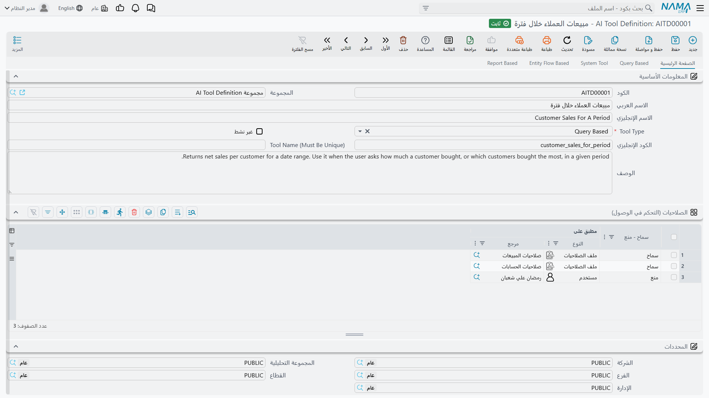
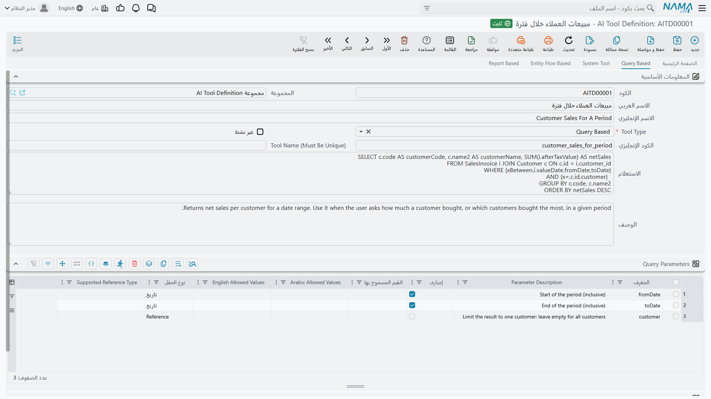
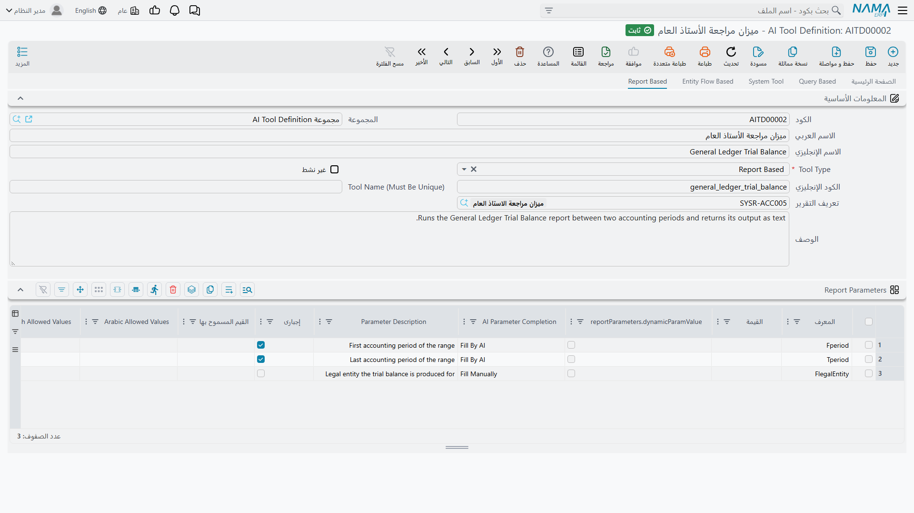
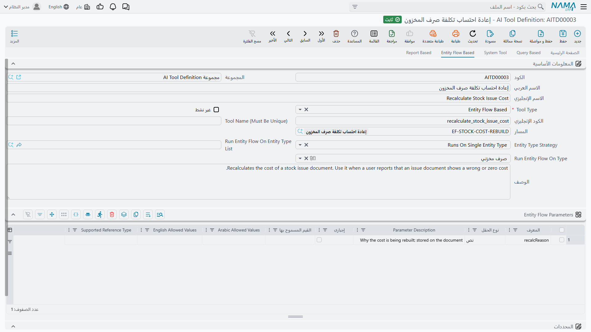
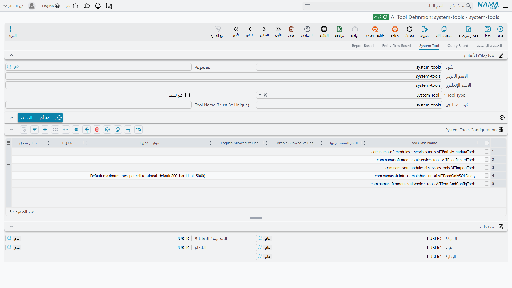

# تعريفات أدوات الذكاء الاصطناعي (AI Tool Definitions)

عندما يتحدث مساعد ذكاء اصطناعي مع نظام نما ERP — سواء كان المساعد المدمج داخل النظام أو عميلًا خارجيًا متصلًا عبر [خادم MCP](./ai-mcp-server.md) — فهو لا يستطيع فعل أي شيء من تلقاء نفسه. كل قدرة يملكها المساعد هي **أداة (Tool)** عرّفها مدير النظام مسبقًا: استعلام يجيب عن سؤال معين، تقرير يشغَّل بمدخلات، مسار كيان ينفَّذ على مستند، أو أداة نظامية جاهزة من أدوات نما.

شاشة **AI Tool Definition** في وحدة الذكاء الاصطناعي هي المكان الذي تُعرَّف فيه هذه الأدوات. كل سجل في الشاشة يصبح أداة (أو مجموعة أدوات) يستطيع النموذج اللغوي استدعاءها، مع وصف يخبره متى وكيف يستخدمها.

::: info الترخيص المطلوب
تتطلب هذه الشاشة تركيب وحدة الذكاء الاصطناعي (AI Module) وترخيصها ضمن رخصة النظام.
:::

## البيانات الأساسية

في رأس الشاشة تحدد هوية الأداة وسلوكها العام:

| الحقل | الدور |
|---|---|
| **Tool Type** | نوع الأداة: `Query Based` أو `Report Based` أو `Entity Flow Based` أو `System Tool` — وهو ما يحدد أي صفحة من صفحات الشاشة ستُستخدم |
| **Alt Code** | الاسم الذي تُعلَن به الأداة للنموذج اللغوي في الأنواع الثلاثة الأولى (استعلام/تقرير/مسار كيان) |
| **Tool Name (Must Be Unique)** | في أدوات النظام (System Tool) يُستخدم كبادئة لأسماء الأدوات المتولدة — انظر «تسمية الأدوات» أدناه |
| **Description** | وصف الأداة. هذا الحقل **هو ما يقرؤه النموذج اللغوي ليقرر متى يستدعي الأداة وكيف** — فكلما كان الوصف أدق وأوضح، كان استخدام النموذج للأداة أصوب |
| **In Active** | تعطيل الأداة دون حذفها — الأداة المعطلة لا تُعرض على النموذج إطلاقًا |

::: tip متى تظهر الأداة للمساعد؟
لا تُعرض الأداة على النموذج اللغوي إلا إذا كانت **معتمدة (Committed)** وغير معطلة. وأي تعديل أو حذف لاحق ينعكس تلقائيًا — يعاد بناء قائمة الأدوات عند أول اتصال تالٍ دون الحاجة لإعادة تشغيل.
:::

### تسمية الأدوات

- أدوات **الاستعلام والتقرير ومسار الكيان**: تُعلن الأداة باسم **Alt Code** كما هو.
- **أدوات النظام (System Tool)**: كل سطر في جدول الأدوات قد يولّد أداة أو أكثر، ويتركب اسم كل أداة من بادئة + اسم الأداة الداخلي. البادئة هي أول قيمة غير فارغة من: **Tool Name** ثم **Alt Code** ثم **الكود**، يليها شرطة سفلية. فمثلًا سجل كوده `import` يحتوي صنف `AITReadRecordTools` يولّد أداتين اسمهما `import_FindRecords` و `import_GetRecord`.

## الصلاحيات (التحكم في الوصول)

جدول **الصلاحيات (التحكم في الوصول)** يحدد من يستطيع تنفيذ الأداة. كل سطر يحمل:

- **Applicable For**: مستخدم، أو ملف أمان (Security Profile)، أو مجموعة مستخدمين.
- **Allow / Prevent**: سماح أو منع.

عند تنفيذ الأداة يبحث النظام عن أول سطر ينطبق على المستخدم الحالي بهذا الترتيب: سطر **المستخدم** نفسه أولًا، ثم سطر **ملف الأمان** الخاص به، ثم سطر **المجموعة**. أول سطر مطابق يحسم القرار. وإذا كان الجدول فارغًا (أو لا يوجد سطر مطابق) فالأداة متاحة للجميع.

::: warning الصلاحيات تُفحص عند التنفيذ
قائمة الأدوات المعلنة واحدة لجميع المستخدمين، لكن **التنفيذ** هو ما يخضع لفحص الصلاحية: إذا حاول مستخدم ممنوع تنفيذ أداة، تُرفض العملية برسالة واضحة. كما تظل جميع صلاحيات السجلات والمحددات (الشركة، الفرع، ...) سارية على ما تقرؤه الأداة أو تكتبه، لأن كل شيء يمر عبر بوابة الخدمات القياسية للنظام.
:::

## النوع الأول: أداة مبنية على استعلام (Query Based)

أبسط أنواع الأدوات وأكثرها استخدامًا: استعلام SQL يكتبه مدير النظام، ويستطيع النموذج اللغوي تشغيله بمدخلات يحددها هو.

في صفحة **Query Based**:

1. اكتب الاستعلام في حقل **Query**، مع الإشارة إلى كل مدخل بصيغة العنصر النائب `{paramName}` (مثل `{fromDate}` و `{toDate}`).
2. عرّف كل مدخل في جدول **Query Parameters**.
3. اكتب في **Description** متى ينبغي استخدام هذه الأداة وماذا تُرجع.

عند التنفيذ يُشغَّل الاستعلام بقيم المدخلات التي أرسلها النموذج، وتُعاد النتيجة له بصيغة JSON (أسماء الأعمدة وقيم الصفوف).

::: tip المدخلات الاختيارية والشرطية
تمرّ مدخلات الاستعلام عبر المحرك نفسه المستخدَم في SQL الخاص بخرائط الحقول (Field Maps)، لذا تتوفر صيغة [مدخلات SQL المتقدمة](../../../entity-flows/core/ai-generated-field-maps-documentation.md#Advanced-SQL-Parameter-Syntax) كاملةً — وليس مجرد العنصر النائب البسيط `{fromDate}`. وهذا مهم لأن أداة الذكاء الاصطناعي تعرض عادةً عدة فلاتر *اختيارية*، وتتيح هذه الأدوات المساعدة لاستعلام واحد أن يتعامل معها سواء أرسل النموذج قيمةً أم لا:

- `{x>=,valueDate,fromDate}` — مقارنة تتحول إلى `1 = 1` (بلا أثر) عندما لا يرسل النموذج المدخل `fromDate`، بدلًا من إحاطة كل فلتر بالشكل `({fromDate} IS NULL OR ...)`.
- `{xBetween,column,fromDate,toDate}` — نطاق قد يغيب أحد طرفيه.
- `{xIN,column,codes}` — جملة IN تتحمل القائمة الفارغة دون خطأ.
- `{!paramName}` — استبدال نصي مباشر (لأسماء الجداول أو الأعمدة الديناميكية؛ ولا يُستخدم أبدًا مع مدخلات غير موثوقة).
:::

### جدول المدخلات

كل سطر في جدول المدخلات يعرّف مدخلًا واحدًا:

| العمود | الدور |
|---|---|
| **Param Id** | معرف المدخل — يجب أن يطابق الاسم المستخدم في الاستعلام، ولا يجوز تكراره |
| **Parameter Description** | وصف المدخل الذي يقرؤه النموذج ليعرف ماذا يرسل |
| **Required** | هل المدخل إلزامي |
| **Field Type** | نوع القيمة: `Text` أو `Number` أو `Date` أو `Reference` |
| **Allowed Values** / **Allowed Values Ar** / **Allowed Values En** | قائمة القيم المسموحة (إن وجدت) مع ترجماتها — تُعرض للنموذج ضمن وصف المدخل ليلتزم بها |
| **Supported Reference Type** | عند اختيار النوع `Reference`: نوع الكيان الذي يشير إليه المدخل (مثل `Customer`) |

ملاحظات على الأنواع:

- **Date**: يرسل النموذج التاريخ بصيغة `yyyy-MM-dd HH:mm` (تُذكر له هذه الصيغة تلقائيًا في وصف المدخل).
- **Reference**: يستطيع النموذج إرسال كود السجل أو معرفه فيُبحث عنه مباشرة. وإذا أرسل نصًا حرًّا (مثل اسم عميل تقريبي) والكيان مفهرس في خدمة التضمين الدلالي (Records Embedding)، يبحث النظام بحثًا دلاليًا ويعيد أقرب السجلات — وإن تعددت النتائج طُلب من النموذج اختيار سجل محدد منها.

## النوع الثاني: أداة مبنية على تقرير (Report Based)

تحوّل أي تعريف تقرير (Report Definition) موجود في النظام إلى أداة يستطيع النموذج تشغيلها وقراءة مخرجاتها.

في صفحة **Report Based**:

1. اختر التقرير في حقل **Report Definition**.
2. عرّف مدخلات التقرير في جدول **Report Parameters** — لكل مدخل من مدخلات التقرير سطر، **Param Id** فيه يطابق معرف مدخل التقرير.
3. حدد لكل مدخل طريقة تعبئته في عمود **AI Parameter Completion**:
   - **Fill By AI**: يحدد النموذج اللغوي القيمة بنفسه بناءً على طلب المستخدم (مع وصف المدخل والقيم المسموحة كما في أدوات الاستعلام).
   - **Fill Manually**: تُثبَّت القيمة في التعريف نفسه — قيمة نصية أو مرجع أو تاريخ/وقت أو قيمة ديناميكية، بنفس أسلوب مدخلات التقارير في جدولة المهام — ولا تُعرض على النموذج أصلًا.

عند التنفيذ يُشغَّل التقرير بالمدخلات المجمعة، ويُعاد ناتجه **نصًّا** إلى النموذج ليقرأه ويبني عليه إجابته.

::: warning اختيار التقرير يملأ الجدول مرة واحدة — ويجمّد مسميات القائمة
اختيار تقرير في **Report Definition** يعيد بناء جدول **Report Parameters** من تصميم التقرير نفسه: سطر لكل مدخل، بنوعه، وهل هو إلزامي، وللمدخل الذي يعرض قائمة اختيار تُنقل قيمه إلى عمود **القيم المسموح بها** ومسمياتها العربية والإنجليزية إلى عمودي **Arabic Allowed Values** و **English Allowed Values**.

وهذه المسميات تُنسخ كما هي في تلك اللحظة ولا تُقرأ مرة أخرى أبدًا. وهي ما يُعرض على النموذج باعتباره القيم التي يقبلها المدخل، فإن غيّر أحدهم مسمى قيمة لاحقًا من شاشة تعديل الترجمات (Translation OverRider) ظهر المسمى الجديد في شاشة تشغيل التقرير بينما تظل الأداة تعرض على النموذج المسمى القديم، دون أي تنبيه. وينطبق الأمر نفسه على تقرير تغيّرت مدخلاته بعد بناء الأداة: الجدول لا يتبعه.

وعلاج الحالتين واحد: أعد اختيار التقرير في **Report Definition** فيُعاد بناء الجدول من جديد. ولأنه يعيد بناء *كل* الأسطر، يضيع كل ما كتبته فيه بنفسك — قيم **Fill Manually** وأوصاف المدخلات — وعليك إدخاله ثانيةً، فدوّنه قبل إعادة الاختيار.
:::

## النوع الثالث: أداة مبنية على مسار كيان (Entity Flow Based)

تمكّن النموذج من **تنفيذ إجراء** في النظام عبر مسار كيان معرف مسبقًا — أي أن الذكاء الاصطناعي هنا لا يقرأ فحسب بل يُحدِث أثرًا.

في صفحة **Entity Flow Based**:

1. اختر المسار في حقل **Entity Flow**.
2. حدد **Entity Type Strategy** — على أي سجل يعمل المسار:

| الاستراتيجية | المعنى |
|---|---|
| **Runs On Single Entity Type** | يعمل على نوع كيان واحد محدد في حقل **Run Entity Flow On Type** |
| **Runs On Entity Type List** | يعمل على أحد أنواع محددة في **Run Entity Flow On Entity Type List**، ويختار النموذج النوع من بينها |
| **Runs On Any Document Type** | يعمل على أي نوع مستند |
| **Runs On Any Master File Type** | يعمل على أي ملف رئيسي |
| **Runs On Any Type** | يعمل على أي نوع كيان |
| **Does Not Need A Record** | لا يحتاج سجلًا — يُنفذ المسار مباشرة |

3. عرّف أي مدخلات إضافية يحتاجها المسار في جدول **Entity Flow Parameters** (نفس أعمدة مدخلات الاستعلام).

عندما تتطلب الاستراتيجية سجلًا، يضيف النظام تلقائيًا للنموذج مدخلين: نوع الكيان المستهدف (إن لم يكن محددًا في التعريف) وكود السجل أو معرفه. عند التنفيذ يُحضَر السجل، وتوضع قيم المدخلات في خريطة السجل، ثم يُشغَّل المسار — وأي فشل في المسار يُعاد للنموذج كرسالة خطأ.

## النوع الرابع: أدوات النظام (System Tool)

أدوات جاهزة مبنية داخل نما، يضيفها مدير النظام بسطر في جدول **System Tools Configuration**: كل سطر يحمل **Tool Class Name** (اسم صنف الأداة) ومعه حتى خمسة مدخلات نصية (Parameter 1–5) تكوّن سلوك الأداة إن كانت تحتاج تهيئة، وحقول وصف وعناوين تُملأ تلقائيًا.

حقل **Tool Class Name** مزوّد بقائمة اقتراحات تعرض **كل أدوات النظام المتاحة في النظام** — تختار منها بالاسم.

::: warning الصنف ليس الأداة
ما تختاره في **Tool Class Name** هو *صنف*، ومعظم الأصناف تولّد أكثر من أداة: اختر `AITReadRecordTools` فينتهي الأمر بأداتين لدى النموذج، هما `<prefix>FindRecords` و `<prefix>GetRecord`. كما تعرض قائمة الاقتراحات الصنف باسمه الكامل — `com.namasoft.modules.ai.services.tools.AITReadRecordTools` — لذا حين تبحث عن أداة بعينها، ابحث عنها في عمود **الأدوات المتولدة** في الجداول أدناه وأضف الصنف الموجود في سطرها؛ أما كتابة اسم الأداة نفسها في الحقل فلا تجد شيئًا.
:::

### الأزرار أعلى الجدول

اختيار الأصناف واحدًا واحدًا من قائمة الاقتراحات بطيء، ومجموعة الأدوات نادرًا ما تنفع منقوصة — لذا تحمل الصفحة صفًا من الأزرار، يضيف كل منها مجموعة كاملة بضغطة واحدة:

| الزر | ما يضيفه | لمن |
|---|---|---|
| **إضافة أدوات التصدير (Add Export Tools)** | ٣ أصناف و٩ أدوات — فهم الكيان، والبحث في السجلات وقراءتها، واستيراد السجلات | كل من يربط عميل MCP خارجيًا لقراءة البيانات والكتابة فيها |
| **إضافة أدوات التقارير (Add Report Tools)** | صنفان و٤ أدوات — قراءة استعلام التقرير وتشغيله وتصحيحه | مديرو النظام وفرق الدعم الباحثون عن سبب رقم خاطئ في تقرير |
| **إضافة أدوات التوجيهات والإعدادات (Add Term and Config Tools)** | صنفان و٤ أدوات — قراءة التوجيهات وإدخالات الإعدادات وتعديلها | مديرو النظام الذين يهيّئون المستندات |
| **إضافة أدوات المناقشات (Add Discussion Tools)** | صنفان وأداتان — إضافة مناقشة إلى سجل، وعرض مناقشات سجل | مساعد داخل النظام يعلّق على السجلات |

يضيف الزر الأسطر الناقصة فقط ويملأ وصف كل سطر تلقائيًا، فالضغط على زرين يتراكم، والضغط على الزر نفسه مرتين لا يغيّر شيئًا. واحذف بعد ذلك أي سطر لا تريده — فهكذا يبقى التعريف للقراءة فقط.

#### أدوات تصدير واستيراد السجلات (Add Export Tools)

أكثر مجموعة استخدامًا مع عملاء MCP الخارجيين: ثلاثة أصناف تولّد تسع أدوات مجتمعةً، تتيح قراءة بيانات النظام واستيراد سجلات جديدة بصيغة JSON.

| اسم صنف الأداة | الأدوات المتولدة | وظيفتها |
|---|---|---|
| `AITEntityMetadataTools` | `<prefix>ResolveEntityType` و `<prefix>DescribeFields` و `<prefix>GetEnumValues` و `<prefix>GetEntitySchema` و `<prefix>SearchByTranslation` | كل ما يحتاجه العميل ليفهم الكيان قبل أن يستعلم عنه: تحويل مصطلح بالعربية أو الإنجليزية إلى نوع كيان، وسرد معرفات الحقول الصالحة للاستخدام كمعايير بحث، وعرض القيم المسموحة لحقول القوائم الثابتة، وإرجاع اسم الجدول والأعمدة الفعلية خلف الكيان، وتحويل مصطلح إلى أنواع كيانات وحقول وقيم قوائم دفعة واحدة |
| `AITReadRecordTools` | `<prefix>FindRecords` و `<prefix>GetRecord` | البحث عن سجلات بنوع كيان ومعايير، وقراءة سجل واحد كاملًا بصيغة JSON |
| `AITImportTools` | `<prefix>GetImportSchema` و `<prefix>ImportRecord` | عرض مخطط الاستيراد JSON لنوع كيان، واستيراد سجل أو أكثر إلى النظام |

تفاصيل هذه الأدوات — مدخلاتها وأمثلة استخدامها — موثقة في صفحة [خادم MCP لنظام نما ERP](./ai-mcp-server.md).

#### أدوات التقارير (Add Report Tools)

معظم الأسئلة عن تقرير — لماذا هذا الإجمالي خاطئ، ولماذا اختفى هذا السطر، وأي مُدخل يتحكم في هذا الفلتر — هي في حقيقتها أسئلة عن استعلامه ومدخلاته، وهذه بضع مئات من البايتات من ملف تقرير حجمه ٧٠–١٢٠ كيلوبايت. وهذان الصنفان يتيحان للمساعد أن يقرأ هذا القدر بالضبط، وأن يشغّل التقرير ليرى الأثر، وأن يصحّح الاستعلام حين يكون الاستعلام هو الخطأ.

| اسم صنف الأداة | الأدوات المتولدة | وظيفتها |
|---|---|---|
| `AITReportReadTools` | `<prefix>GetReportQuery` و `<prefix>RunReport` | إرجاع مدخلات التقرير واستعلام SQL الخاص به وباستعلام كل مجموعة بيانات فرعية وكل تقرير فرعي فيه؛ وتشغيل التقرير بمدخلات محددة وإرجاع مخرجاته |
| `AITUpdateReportTools` | `<prefix>UpdateReportQuery` و `<prefix>UpdateReportContent` | استبدال استعلام مجموعة بيانات واحدة دون المساس ببقية ملف التقرير، أو استبدال ملف التقرير كاملًا |

يُشغَّل التقرير بصلاحيات المستخدم الذي تعمل الأداة نيابةً عنه، ويُرفض أي معرّف مُدخل غير معروف بدل تجاهله. والتواريخ في هذه المدخلات تبدأ باليوم (`31-01-2026`)، بخلاف أدوات السجلات.

::: tip اقرأ الأرقام ولا تنظر إلى صورة
ترجع `RunReport` صيغة **TXT** افتراضيًا، وهي الصيغة التي يمكن مطابقة أرقامها سطرًا سطرًا مع أداة SQL للقراءة فقط. وترجع **HTML** الجدول المنسَّق. وكلتاهما تعودان داخل الإجابة نفسها مقصوصتين عند الطول المطلوب في النداء. أما الصيغ الثنائية — PDF و XLSX و DOCX و RTF و ODT و ODS و PPTX و XLS — فتُحفظ على الخادم ويُرد عليها **برابط يُستخدم مرة واحدة وتنتهي صلاحيته بعد ثلاثين دقيقة** ليفتحه إنسان: يخدم الرابط الملف مرة ثم يحذفه. واضبط `ai-file-download-base-url` في ملف `nama.properties` إن أردت أن تحمل هذه الروابط عنوان الخادم المعلن بدل مسار نسبي.
:::

::: warning لا يُحفظ التقرير إلا إذا ظل قابلًا للترجمة
تترجم `UpdateReportQuery` و `UpdateReportContent` التقرير قبل إرساله، وترفضان حفظ ما لا يُترجم — فتعود الإجابة بشكوى المترجم نفسها والتقرير المحفوظ كما هو، وبذلك يكلّف الاستعلام الخاطئ نداءً فاشلًا لا تقريرًا معطوبًا. ويُعاد كتابة الملف بواسطة JasperReports نفسه: يبقى التصميم كما هو تمامًا، لكن تعليقات XML (ومنها ترويسة Jaspersoft Studio) والتنسيق الأصلي للمسافات لا تبقى.
:::

#### أدوات التوجيهات والإعدادات (Add Term and Config Tools)

التوجيهات وإدخالات الإعدادات إعدادات لا سجلات، فلا تصل إليها أدوات السجلات أعلاه أصلًا — وهذان الصنفان هما الطريق الوحيد ليقرأها المساعد أو يغيّرها.

| اسم صنف الأداة | الأدوات المتولدة | وظيفتها |
|---|---|---|
| `AITTermAndConfigReadTools` | `<prefix>ListTermAndConfigTargets` و `<prefix>GetTermOrConfigSchema` و `<prefix>ReadTermOrConfig` | سرد التوجيهات وإدخالات الإعدادات القابلة للتهيئة، ووصف إعدادات هدف واحد منها بنفس تجميع شاشته، وقراءة القيم المضبوطة فيه فعلًا |
| `AITTermAndConfigWriteTools` | `<prefix>UpdateTermOrConfig` | تعديل إعدادات توجيه واحد أو إدخال إعدادات واحد |

#### أدوات المناقشات (Add Discussion Tools)

| اسم صنف الأداة | الأدوات المتولدة | وظيفتها |
|---|---|---|
| `AITAddDiscussionToRecord` | `<prefix>AddDiscussionToRecord` | إضافة مناقشة (تعليق) إلى أي سجل |
| `AITListDiscussionsOfARecord` | `<prefix>ListDiscussionsForARecord` | عرض مناقشات سجل معيّن |

### أدوات نظام أخرى

بقية الأدوات الجاهزة أصناف مفردة بلا مجموعة خاصة بها؛ تضيفها باختيار اسم صنفها من قائمة اقتراحات **Tool Class Name**:

| اسم صنف الأداة | الأدوات المتولدة | وظيفتها |
|---|---|---|
| `AITCountRecordsTools` | `<prefix>countEntities` و `<prefix>countEntitiesCreatedWithinDateRange` | عدّ سجلات نوع كيان — إجماليًا أو بين تاريخين |
| `AINamaERPDocsTool` | `<prefix>erpDocs` | البحث في توثيق نما ERP وإرجاع المقاطع الأقرب للسؤال |
| `AITReadOnlySQLQuery` | `<prefix>runReadOnlySqlQuery` | تنفيذ عبارة `SELECT` واحدة للقراءة فقط على قاعدة البيانات وإرجاع الصفوف — راجع التنبيه أدناه |

::: tip كيف تبني مساعدًا للقراءة فقط
فُصلت القراءة عن الكتابة في أصناف مستقلة عمدًا حتى تستطيع الاستغناء عن أصناف الكتابة: `AITTermAndConfigReadTools` وحده — بدون `AITTermAndConfigWriteTools` — يجعل المساعد يشرح كيف هُيِّئ التوجيه دون أن يملك وسيلة لتغييره، ومثله `AITReportReadTools` بدون `AITUpdateReportTools`، و`AITEntityMetadataTools` و `AITReadRecordTools` بدون `AITImportTools`. وكل زر مجموعة يضيف الشقين معًا، فاضغط الزر ثم احذف سطر الكتابة إن كان التعريف للقراءة فقط.
:::

::: info أدوات نظام خاصة بالوحدات
قد تضيف بعض الوحدات أدوات نظام خاصة بها تظهر في نفس القائمة. مثلًا توفّر وحدة الموارد البشرية أدوات لرصيد إجازات الموظف (للموظف الحالي أو لأي موظف). يتوسّع المتاح بحسب الوحدات المركّبة والمرخّصة.
:::

::: warning أداة وثائق نما ERP والبحث الدلالي
تعتمد أداة `AINamaERPDocsTool` على فهرس دلالي للتوثيق؛ فلا تعمل قبل ضبط قاعدة المتجهات في [إعداد وحدة الذكاء الاصطناعي](./ai-configuration.md#lbHth-ldlly-wthyy-ltDmyn).
:::

::: danger أداة SQL للقراءة فقط لا تتقيّد بصلاحيات السجلات
كل ما عدا ذلك في هذه الشاشة يمر عبر البوابات القياسية، فلا تُظهر الأداة للمستخدم أكثر مما تُظهره الشاشات. أما `AITReadOnlySQLQuery` فهي الاستثناء: تقرأ قاعدة البيانات مباشرة، فترى كل شركة وفرع وراتب وسعر بصرف النظر عمّا يُسمح لمستخدمها بفتحه. لا يُقبل سوى `SELECT` واحدة، وتُنفَّذ داخل معاملة يجري التراجع عنها دائمًا، فلا تستطيع تغيير شيء أبدًا — لكن اقصرها على مديري النظام عبر جدول **Security (Access Control)**. ويحدّد عمود المُدخل الأول لسطرها الحد الأقصى الافتراضي للصفوف في النداء الواحد (٢٠٠ افتراضيًا، و٥٠٠٠ كحد أعلى). وانظر [دعم أفضل باستخدام وكيل ذكاء اصطناعي](./ai-assisted-support.md) لمعرفة كيف تستخدمها فرق الدعم.
:::

::: info تُفحص العبارة بـJSqlParser 5.0 أولاً
قبل التنفيذ يتحقق **JSqlParser 5.0** من العبارة، وهو أشد صرامة من SQL Server نفسه: فأي عبارة لا يستطيع JSqlParser تحليلها تُرفض حتى لو كان الخادم ينفّذها. فعلى سبيل المثال، يرفض JSqlParser الصيغة `FOR XML PATH(''), TYPE).value(...)` و`ORDER BY` داخل استعلام فرعي `FOR XML PATH`، لذا استخدم `STRING_AGG(expr, ', ') WITHIN GROUP (ORDER BY …)` لتجميع النصوص. والأقواس المعقوفة `{…}` داخل النصوص الحرفية تُمرَّر إلى قاعدة البيانات كما هي.
:::

## أين تُستخدم هذه الأدوات؟

- **[المساعد الذكي داخل النظام](./ai-assistant.md)**: يستدعي الأدوات أثناء محادثته مع المستخدم للإجابة عن الأسئلة وتنفيذ الطلبات.
- **عملاء MCP الخارجيون**: أي عميل يدعم بروتوكول MCP — مثل Claude Desktop أو Claude Code — يستطيع الاتصال بالنظام واستخدام نفس الأدوات بنفس الصلاحيات. انظر [خادم MCP لنظام نما ERP](./ai-mcp-server.md).
