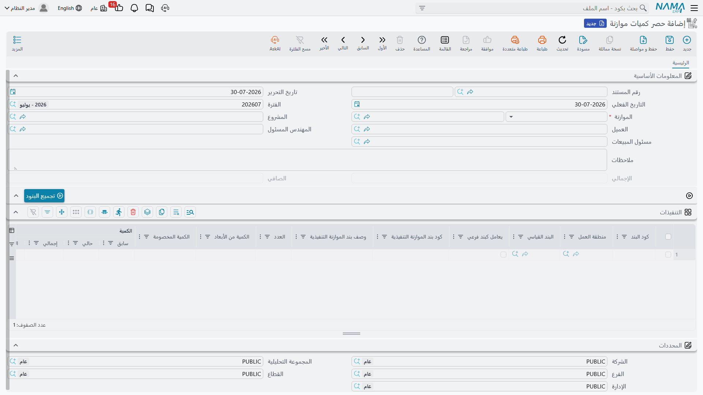

# حصر كميات الموازنة

الاسم الإنجليزي في القائمة يدفعك لتوقّع تقرير انحرافات — المخطط في مقابل الفعلي في شاشة واحدة. وهو ليس ذلك. **حصر كميات الموازنة مستند حصر كميات**، أي مستند القياس نفسه الذي يملؤه مساح الكميات في نهاية كل فترة، إلا أنه يُقاس على **موازنة** بدل أن يُقاس على عقد.

والاسم العربي يقولها بدقة: **حصر كميات موازنة**. تمشي في الموقع، وتكتب كم نُفّذ من كل بند عمل، وتحفظ، فتُطبَع الكمية المحصورة على بنود الموازنة لتُظهر الموازنة نفسها التقدّم المادي بجوار الكمية المخططة.

تجده في **المقاولات > التكاليف > حصر كميات موازنة**، ويحتاج ترخيص `contracting`.

## لماذا نحصر على موازنة أصلاً

للوحدة أصلاً مستندات حصر كميات على [عقد المشروع](/ar/modules/contracting/project-contracting/contracting-project-execution.md) وعلى عقود مقاولي الباطن، وتلك هي التي تغذّي المطالبة. أما هذا فلا يغذّي شيئاً: لا يقيّد مالاً ولا حركة مخزنية، ولا يُبنى منه مستخلص.

والذي يعطيك إياه هو تقدّم مسجَّل في هيكلك *أنت* لا في هيكل العميل. فأكواد بنود الموازنة هي تفصيلك الداخلي، وأكواد العقد هي ما اتفقت على المطالبة به، والشكلان كثيراً ما لا يتطابقان. والحصر على الموازنة يتيح لفريق الموقع أن يُبلّغ التقدّم بالأكواد التي كُتبت بها خطة التكلفة، فتجلس على سطر موازنة واحد كميتُه المخططة وكميتُه المنفَّذة وتكلفتُه الفعلية.

## كيف تملأ واحداً

للمستند صفحة واحدة.

**الترويسة.** دفتر ورقم مستند، وتاريخ التحرير والتاريخ الفعلي والفترة المالية كأي مستند، ثم:

| الحقل | ملاحظات |
|---|---|
| **الموازنة** | **إجباري** — ويقبل [موازنة تقديرية](/ar/modules/contracting/budgets/contracting-estimated-budget.md) أو [موازنة تنفيذية](/ar/modules/contracting/budgets/contracting-executive-budget.md) |
| **المشروع** | يجب أن يكون مشروع الموازنة نفسه، وإلا فشل الحفظ |
| **العميل** | يجب أن يكون عميل الموازنة نفسه، وإلا فشل الحفظ |
| **المهندس المسئول** و**مسئول المبيعات** | من قاس ومن يملك الجانب التجاري |
| **الإجمالي** و**الصافي** | محتسبان من أعمدة الأسعار في الجدول؛ للاطلاع فقط |

ولا يوجد توجيه مستند على هذا المستند ولا شيء يُضبَط له — فليس له جانب محاسبي يوجَّه.

**جدول التنفيذات.** سطر لكل بند عمل محصور. اضغط **تجميع البنود** فوق الجدول لجذب أكواد بنود الموازنة بدل كتابتها، ثم املأ القياسات.

| العمود | لماذا |
|---|---|
| **كود البند** | يجب أن يُطابق بنداً على الموازنة المختارة |
| **البند القياسي** و**يعامل كبند فرعي** و**منطقة العمل** وتصنيفات البند و**المرحلة** | موروثة من سطر الموازنة؛ والمرحلة تحدد خانة المرحلة التي تُحسب لها الكمية |
| **العدد** و**الكمية من الأبعاد** و**الكمية المخصومة** | القياس بالأبعاد المادية بدل كتابة كمية — الطول × العرض × الارتفاع × العدد، ناقص المخصوم |
| **الكمية الحالية** | **الرقم الذي تملؤه فعلاً**: كم نُفّذ من هذا البند |
| **الكمية \| متعاقد عليها** | تأتي من سطر الموازنة؛ لا تكتبها |
| **كمية المقايسة** و**الوحدة** | أرقام مرجعية من الموازنة |
| كتلة الأسعار | سعر الوحدة والسعر الكلي والخصم وضريبتا المبيعات والصافي — وهي ما ينتج إجمالي الترويسة، وللاطلاع |
| **نسبة التنفيذ** | نسبة إنجاز هذا السطر |
| **وصف البند** و**ملاحظات** | نص حرّ |

وتُغلق الصفحة بكتلة **المحددات**.

## ماذا يكتب الحصر على الموازنة

عند معالجة المستند — لا وهو ما زال مسودة أو في انتظار اعتماد — تُكتب الكمية المحصورة على **سطر الموازنة المطابق**، في عمود **الكمية | من حصر الكميات**. وإن كان السطر يسمّي مرحلة فتذهب الكمية إلى خانة الكمية المنفَّذة لتلك المرحلة. ثم تُعاد بنود الأصل إلى إجماليها من فروعها.

::: info الرقم على الموازنة مخزون لا محتسب لحظياً
*الكمية | من حصر الكميات* لقطة وضعها حصرٌ ما. وفتح الموازنة لا يُعيد احتسابه، ولا يوجد تقرير يرجع إلى مستندات الحصر ليجمعها عند الطلب. والوحدة كلها تعمل هكذا: تُكتب الأرقام عند معالجة المستند وتُقرأ من السجل بعدها. وهذا سريع، وهو أيضاً سبب أن الرقم على الموازنة حديث بقدر أحدث حصر مُعالَج فقط.
:::

## التحقق الوحيد الذي قد يوقفك

كل ما يتحقق منه المستند غير ذلك متعلق بالاتساق — ألا يكون الجدول فارغاً، وأن تكون أكواد البنود موجودة على الموازنة، وأن يتطابق المشروع والعميل مع الموازنة. وتحقق واحد سقف حقيقي على الكمية:

**نسبة السماحية.** يحمل كل بند موازنة **نسبة السماحية**، أي مقدار التجاوز المسموح به في قياس ذلك البند. ويفشل الحصر حين تتجاوز الكمية المحصورة للسطر الكمية المتعاقد عليها *و* يكون التجاوز فوق الكمية المخططة بنسبة أكبر ممّا يسمح به السطر، برسالة *«نسبة الكمية الحالية لا يمكن أن تتعدى نسبة السماحية … %»*. واترك نسبة السماحية صفراً فيُرفض أي تجاوز؛ واضبطها على 10 فتحصل على سماحية 10%.

ويمكن إيقاف التحقق كله على مستوى قاعدة البيانات بخيار الوحدة **السماح بتجاوز نسبة الكمية الحالية للنسبة المسموح بها** — راجع [إعدادات المقاولات](/ar/modules/contracting/contracting-configuration.md).

وبمعزل عن ذلك، حين يكون خيار الوحدة **منع التعديل في حصر الكميات إذا تم عليه مستخلص** مُشغَّلاً فلا يمكن تعديل حصرٍ سُحب عليه مستخلص بالفعل.

## البرج بعد ثلاثة أشهر

تخطّط الموازنة التنفيذية `CEB-EXE-001` للبرج A البند `X-1` *حفر* بـ 1,000 م³، و`X-2` *خرسانة مسلحة* بـ 60 م³، و`X-3` *مباني* بـ 2,000 م²، و`X-4` *بياض* بـ 1,000 م². وفي نهاية الشهر الثالث يُصدر مهندس الموقع الحصر `CBE-2026-003` على تلك الموازنة:

| كود البند | بند العمل | المخطط | الكمية الحالية | نسبة التنفيذ |
|---|---|---|---|---|
| `X-1` | حفر | 1,000 م³ | 1,000 | 100 |
| `X-3` | مباني | 2,000 م² | 900 | 45 |

والخرسانة حُصرت في شهر سابق والبياض لم يبدأ، فليس أيٌّ منهما على هذا الحصر. ويقرأ إجمالي الترويسة **91,400** من أعمدة الأسعار، ولن يستخدمه أحد في شيء. والمهم هو ما على الموازنة بعد ذلك: صار السطر `X-1` يُظهر *الكمية | من حصر الكميات* 1,000، والسطر `X-3` يُظهر 900.

## «الفعلي» لا يأتي من هنا

هذه هي التفرقة التي تفصل بين قراءة الموازنة قراءةً صحيحة وقراءتها خطأً.

- **الكمية | من حصر الكميات** — من هذا المستند. **تقدّم مادي.** كم من العمل قائم على الأرض.
- **الكمية الفعلية** و**التكلفة الفعلية** — **مال وخامات استُهلكت فعلاً**، يكتبها كل مستند يصرف على كود بند: صرف الخامات، ومستند السركى، ومستخلصات مقاولي الباطن، وأوامر الشراء، والفواتير المتنوعة. وهذان هما عمودا «المخطط مقابل الفعلي»، وهذا الحصر لا يساهم فيهما بشيء. والذي يساهم مذكور في [كيف تتكوّن تكلفة المشروع](/ar/modules/contracting/costs/contracting-cost-model.md).
- **الكمية | من المستخلصات** و**من حصر التكاليف** و**من المستخلصات الافتتاحية** — كميات طُولب بها أو رُحّلت بمستندات أخرى.
- **كمية البند المنفذة بمستخلصات مقاول باطن** — الكمية المعتمدة عبر [مستخلصات مقاولي الباطن](/ar/modules/contracting/contractor-contracting/contracting-contractor-extracts.md)، وتُدفع إلى بنود الموازنة حين يكون خيار الوحدة المقابل مُشغَّلاً.

فسطر موازنة *كميته من حصر الكميات* 900 و*تكلفته الفعلية* أعلى بكثير من الخطة يقول لك إن 45% من المباني قائمة وقد أكلت بالفعل أكثر من 45% من المال. وهذه المقارنة هي سبب الاحتفاظ بالموازنات من أصله — وهي مقارنة تعقدها بعينك، لأن لا شيء في الوحدة يمنع شيئاً بناءً عليها. والسقف الوحيد الذي يمكن تشغيله موصوف في [طلب شراء خامات من الموازنة التنفيذية](/ar/modules/contracting/budgets/contracting-budget-item-requests.md).
